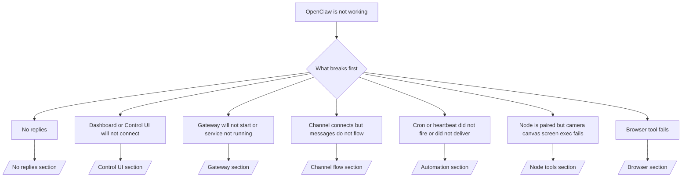

---
read_when:
    - OpenClaw funktioniert nicht und Sie benötigen den schnellsten Weg zu einer Lösung
    - Sie benötigen einen Triage-Ablauf, bevor Sie in ausführliche Runbooks eintauchen
summary: Symptomorientierter Troubleshooting-Hub für OpenClaw
title: Allgemeine Fehlerbehebung
x-i18n:
    generated_at: "2026-06-27T17:36:34Z"
    model: gpt-5.5
    postprocess_version: locale-links-v1
    provider: openai
    source_hash: ae1236c73e3a5c9237bd81d603e8dca18c595a8bcbb71f5931bfbf2389b342cd
    source_path: help/troubleshooting.md
    workflow: 16
---

Wenn Sie nur 2 Minuten haben, nutzen Sie diese Seite als Einstieg zur Triage.

## Erste 60 Sekunden

Führen Sie diese exakte Leiter in der angegebenen Reihenfolge aus:

```bash
openclaw status
openclaw status --all
openclaw gateway probe
openclaw gateway status
openclaw doctor
openclaw channels status --probe
openclaw logs --follow
```

Gute Ausgabe in einer Zeile:

- `openclaw status` → zeigt konfigurierte Channels und keine offensichtlichen Authentifizierungsfehler.
- `openclaw status --all` → vollständiger Bericht ist vorhanden und teilbar.
- `openclaw gateway probe` → erwartetes Gateway-Ziel ist erreichbar (`Reachable: yes`). `Capability: ...` gibt an, welche Authentifizierungsebene die Probe nachweisen konnte, und `Read probe: limited - missing scope: operator.read` bedeutet eingeschränkte Diagnose, keinen Verbindungsfehler.
- `openclaw gateway status` → `Runtime: running`, `Connectivity probe: ok` und eine plausible Zeile `Capability: ...`. Verwenden Sie `--require-rpc`, wenn Sie zusätzlich einen RPC-Nachweis für den Lesebereich benötigen.
- `openclaw doctor` → keine blockierenden Konfigurations- oder Dienstfehler.
- `openclaw channels status --probe` → ein erreichbares Gateway gibt Live-Transportstatus
  pro Konto plus Probe-/Audit-Ergebnisse wie `works` oder `audit ok` zurück; wenn das
  Gateway nicht erreichbar ist, fällt der Befehl auf reine Konfigurationszusammenfassungen zurück.
- `openclaw logs --follow` → kontinuierliche Aktivität, keine wiederholten fatalen Fehler.

## Assistant wirkt eingeschränkt oder Tools fehlen

Wenn der Assistant keine Dateien prüfen, Befehle ausführen, Browser-Automatisierung verwenden oder
erwartete Tools sehen kann, prüfen Sie zuerst das effektive Tool-Profil:

```bash
openclaw status
openclaw status --all
openclaw doctor
```

Häufige Ursachen:

- `tools.profile: "messaging"` ist absichtlich eng für reine Chat-Agenten ausgelegt.
- `tools.profile: "coding"` ist das übliche Profil für Repository-, Datei-, Shell-
  und Runtime-Workflows.
- `tools.profile: "full"` stellt den breitesten Tool-Satz bereit und sollte auf
  vertrauenswürdige, operatorgesteuerte Agenten beschränkt werden.
- Pro-Agent-Overrides in `agents.list[].tools` können das Root-Profil für einen
  einzelnen Agenten einengen oder erweitern.

Ändern Sie das Root- oder Pro-Agent-Tool-Profil, starten oder laden Sie anschließend das Gateway
neu und führen Sie erneut `openclaw status --all` aus. Siehe [Tools](/de/tools) für das Profilmodell
und Allow-/Deny-Overrides.

## Anthropic-Langkontext 429

Wenn Sie Folgendes sehen:
`HTTP 429: rate_limit_error: Extra usage is required for long context requests`,
gehen Sie zu [/gateway/troubleshooting#anthropic-429-extra-usage-required-for-long-context](/de/gateway/troubleshooting#anthropic-429-extra-usage-required-for-long-context).

## Lokales OpenAI-kompatibles Backend funktioniert direkt, schlägt aber in OpenClaw fehl

Wenn Ihr lokales oder selbst gehostetes `/v1`-Backend kleine direkte
`/v1/chat/completions`-Probes beantwortet, aber bei `openclaw infer model run` oder normalen
Agent-Turns fehlschlägt:

1. Wenn der Fehler erwähnt, dass `messages[].content` eine Zeichenkette erwartet, setzen Sie
   `models.providers.<provider>.models[].compat.requiresStringContent: true`.
2. Wenn das Backend weiterhin nur bei OpenClaw-Agent-Turns fehlschlägt, setzen Sie
   `models.providers.<provider>.models[].compat.supportsTools: false` und versuchen Sie es erneut.
3. Wenn sehr kleine direkte Aufrufe weiterhin funktionieren, größere OpenClaw-Prompts das
   Backend jedoch zum Absturz bringen, behandeln Sie das verbleibende Problem als Upstream-
   Einschränkung des Modells/Servers und fahren Sie im ausführlichen Runbook fort:
   [/gateway/troubleshooting#local-openai-compatible-backend-passes-direct-probes-but-agent-runs-fail](/de/gateway/troubleshooting#local-openai-compatible-backend-passes-direct-probes-but-agent-runs-fail)

## Plugin-Installation schlägt wegen fehlender openclaw extensions fehl

Wenn die Installation mit `package.json missing openclaw.extensions` fehlschlägt, verwendet das Plugin-Paket
eine alte Struktur, die OpenClaw nicht mehr akzeptiert.

Korrektur im Plugin-Paket:

1. Fügen Sie `openclaw.extensions` zu `package.json` hinzu.
2. Lassen Sie Einträge auf gebaute Runtime-Dateien zeigen (normalerweise `./dist/index.js`).
3. Veröffentlichen Sie das Plugin erneut und führen Sie wieder `openclaw plugins install <package>` aus.

Beispiel:

```json
{
  "name": "@openclaw/my-plugin",
  "version": "1.2.3",
  "openclaw": {
    "extensions": ["./dist/index.js"]
  }
}
```

Referenz: [Plugin-Architektur](/de/plugins/architecture)

## Installationsrichtlinie blockiert Plugin-Installationen oder -Updates

Wenn ein Update abgeschlossen wird, Plugins aber veraltet oder deaktiviert sind oder Meldungen wie
`blocked by install policy`, `install policy failed closed` oder
`Disabled "<plugin>" after plugin update failure` angezeigt werden, prüfen Sie
`security.installPolicy`.

Die Installationsrichtlinie läuft bei Plugin-Installationen und -Updates. OpenClaw-eigene Plugin-
Versionen bewegen sich normalerweise mit dem OpenClaw-Release, sodass ein OpenClaw-Update
während der Synchronisierung nach dem Update auch passende `@openclaw/*`-Plugin-Updates
erfordern kann.

Vermeiden Sie diese breiten Richtlinienformen, sofern Sie nicht auch die passende Upgrade-
Regel pflegen:

- OpenClaw-eigene Plugins auf eine exakte alte Version einfrieren, etwa indem nur
  `@openclaw/*@2026.5.3` erlaubt wird.
- Allein nach Quelltyp blockieren, etwa jede npm-, Netzwerk- oder
  `request.mode: "update"`-Plugin-Anfrage.
- Den Richtlinienbefehl als optional behandeln. Wenn `security.installPolicy`
  aktiviert ist, führt eine fehlende, langsame, nicht lesbare oder durch Berechtigungen blockierte
  Richtlinienausführung zu fail-closed.
- Plugin-Versionen genehmigen, ohne `openclawVersion` der Richtlinienanfrage und die
  Kandidatenmetadaten des Plugins zu berücksichtigen.

Sicherere Richtlinienregeln erlauben vertrauenswürdige OpenClaw-eigene Plugin-Updates, wenn der
Kandidat mit dem aktuellen OpenClaw-Host kompatibel ist, statt ein einzelnes Release dauerhaft
festzunageln. Wenn Sie npm standardmäßig blockieren, erstellen Sie eine enge Ausnahme für die
vertrauenswürdigen `@openclaw/*`-Plugin-Pakete oder Plugin-IDs, die Sie verwenden. Wenn Sie
Installations- und Update-Anfragen unterscheiden, wenden Sie dieselbe Vertrauensregel auf
`request.mode: "update"` an.

Wiederherstellung:

```bash
openclaw doctor --deep
openclaw plugins update --all
openclaw status --all
```

Wenn die Richtlinie absichtlich streng ist, lockern Sie sie für das vertrauenswürdige OpenClaw-
Upgrade-Fenster, führen Sie `openclaw plugins update --all` erneut aus und stellen Sie danach
die strengere Regel wieder her. Wenn ein Plugin nach einem Update-Fehler deaktiviert wurde,
prüfen Sie es und aktivieren Sie es erst wieder, nachdem das Update erfolgreich war:

```bash
openclaw plugins inspect <plugin-id> --runtime --json
openclaw plugins enable <plugin-id>
```

Referenz: [Operator-Installationsrichtlinie](/de/tools/skills-config#operator-install-policy-securityinstallpolicy)

## Plugin vorhanden, aber durch verdächtige Eigentümerschaft blockiert

Wenn `openclaw doctor`, Einrichtung oder Startwarnungen Folgendes anzeigen:

```text
blocked plugin candidate: suspicious ownership (... uid=1000, expected uid=0 or root)
plugin present but blocked
```

gehören die Plugin-Dateien einem anderen Unix-Benutzer als dem Prozess, der sie lädt.
Entfernen Sie die Plugin-Konfiguration nicht. Korrigieren Sie die Dateieigentümerschaft oder führen Sie OpenClaw
als denselben Benutzer aus, dem das Zustandsverzeichnis gehört.

Docker-Installationen laufen normalerweise als `node` (uid `1000`). Reparieren Sie für die standardmäßige Docker-
Einrichtung die Host-Bind-Mounts:

```bash
sudo chown -R 1000:1000 /path/to/openclaw-config /path/to/openclaw-workspace
openclaw doctor --fix
```

Wenn Sie OpenClaw absichtlich als root ausführen, reparieren Sie stattdessen das verwaltete Plugin-Root
auf root-Eigentümerschaft:

```bash
sudo chown -R root:root /path/to/openclaw-config/npm
openclaw doctor --fix
```

Ausführlichere Dokumentation:

- [Plugin-Pfadeigentümerschaft](/de/tools/plugin#blocked-plugin-path-ownership)
- [Docker-Berechtigungen](/de/install/docker#permissions-and-eacces)

## Entscheidungsbaum



<AccordionGroup>
  <Accordion title="No replies">
    ```bash
    openclaw status
    openclaw gateway status
    openclaw channels status --probe
    openclaw pairing list --channel <channel> [--account <id>]
    openclaw logs --follow
    ```

    Gute Ausgabe sieht so aus:

    - `Runtime: running`
    - `Connectivity probe: ok`
    - `Capability: read-only`, `write-capable` oder `admin-capable`
    - Ihr Channel zeigt, dass der Transport verbunden ist, und, sofern unterstützt, `works` oder `audit ok` in `channels status --probe`
    - Absender erscheint genehmigt (oder die DM-Richtlinie ist offen/Allowlist)

    Häufige Log-Signaturen:

    - `drop guild message (mention required` → Mention-Gating hat die Nachricht in Discord blockiert.
    - `pairing request` → Absender ist nicht genehmigt und wartet auf DM-Pairing-Freigabe.
    - `blocked` / `allowlist` in Channel-Logs → Absender, Raum oder Gruppe wird gefiltert.

    Ausführliche Seiten:

    - [/gateway/troubleshooting#no-replies](/de/gateway/troubleshooting#no-replies)
    - [/channels/troubleshooting](/de/channels/troubleshooting)
    - [/channels/pairing](/de/channels/pairing)

  </Accordion>

  <Accordion title="Dashboard or Control UI will not connect">
    ```bash
    openclaw status
    openclaw gateway status
    openclaw logs --follow
    openclaw doctor
    openclaw channels status --probe
    ```

    Gute Ausgabe sieht so aus:

    - `Dashboard: http://...` wird in `openclaw gateway status` angezeigt
    - `Connectivity probe: ok`
    - `Capability: read-only`, `write-capable` oder `admin-capable`
    - Keine Authentifizierungsschleife in den Logs

    Häufige Log-Signaturen:

    - `device identity required` → HTTP-/nicht sicherer Kontext kann Geräteauthentifizierung nicht abschließen.
    - `origin not allowed` → Browser-`Origin` ist für das Gateway-Ziel der Control UI
      nicht erlaubt.
    - `AUTH_TOKEN_MISMATCH` mit Wiederholungshinweisen (`canRetryWithDeviceToken=true`) → ein vertrauenswürdiger Wiederholungsversuch mit Geräte-Token kann automatisch erfolgen.
    - Dieser Wiederholungsversuch mit gecachtem Token verwendet den gecachten Scope-Satz wieder, der mit dem gekoppelten
      Geräte-Token gespeichert ist. Aufrufer mit explizitem `deviceToken` / expliziten `scopes` behalten stattdessen
      ihren angeforderten Scope-Satz.
    - Auf dem asynchronen Tailscale-Serve-Pfad der Control UI werden fehlgeschlagene Versuche für dieselbe
      `{scope, ip}` serialisiert, bevor der Limiter den Fehler aufzeichnet, sodass ein
      zweiter gleichzeitiger fehlerhafter Wiederholungsversuch bereits `retry later` anzeigen kann.
    - `too many failed authentication attempts (retry later)` von einem localhost-
      Browser-Origin → wiederholte Fehler von demselben `Origin` werden vorübergehend
      gesperrt; ein anderer localhost-Origin verwendet einen separaten Bucket.
    - Wiederholtes `unauthorized` nach diesem Wiederholungsversuch → falsches Token/Passwort, Auth-Modus passt nicht oder veraltetes gekoppeltes Geräte-Token.
    - `gateway connect failed:` → UI zielt auf die falsche URL/den falschen Port oder ein nicht erreichbares Gateway.

    Ausführliche Seiten:

    - [/gateway/troubleshooting#dashboard-control-ui-connectivity](/de/gateway/troubleshooting#dashboard-control-ui-connectivity)
    - [/web/control-ui](/de/web/control-ui)
    - [/gateway/authentication](/de/gateway/authentication)

  </Accordion>

  <Accordion title="Gateway will not start or service installed but not running">
    ```bash
    openclaw status
    openclaw gateway status
    openclaw logs --follow
    openclaw doctor
    openclaw channels status --probe
    ```

    Gute Ausgabe sieht so aus:

    - `Service: ... (loaded)`
    - `Runtime: running`
    - `Connectivity probe: ok`
    - `Capability: read-only`, `write-capable` oder `admin-capable`

    Häufige Log-Signaturen:

    - `Gateway start blocked: set gateway.mode=local` oder `existing config is missing gateway.mode` → Gateway-Modus ist remote, oder der Konfigurationsdatei fehlt der Local-Mode-Stempel und sie sollte repariert werden.
    - `refusing to bind gateway ... without auth` → Nicht-Loopback-Bind ohne gültigen Gateway-Authentifizierungspfad (Token/Passwort oder trusted-proxy, sofern konfiguriert).
    - `another gateway instance is already listening` oder `EADDRINUSE` → Port ist bereits belegt.

    Ausführliche Seiten:

    - [/gateway/troubleshooting#gateway-service-not-running](/de/gateway/troubleshooting#gateway-service-not-running)
    - [/gateway/background-process](/de/gateway/background-process)
    - [/gateway/configuration](/de/gateway/configuration)

  </Accordion>

  <Accordion title="Channel verbindet sich, aber Nachrichten fließen nicht">
    ```bash
    openclaw status
    openclaw gateway status
    openclaw logs --follow
    openclaw doctor
    openclaw channels status --probe
    ```

    Gute Ausgabe sieht so aus:

    - Der Channel-Transport ist verbunden.
    - Pairing-/Allowlist-Prüfungen bestehen.
    - Erwähnungen werden erkannt, wo sie erforderlich sind.

    Häufige Log-Signaturen:

    - `mention required` → Gating durch Gruppenerwähnung hat die Verarbeitung blockiert.
    - `pairing` / `pending` → DM-Absender ist noch nicht genehmigt.
    - `not_in_channel`, `missing_scope`, `Forbidden`, `401/403` → Problem mit dem Channel-Berechtigungstoken.

    Ausführliche Seiten:

    - [/gateway/troubleshooting#channel-connected-messages-not-flowing](/de/gateway/troubleshooting#channel-connected-messages-not-flowing)
    - [/channels/troubleshooting](/de/channels/troubleshooting)

  </Accordion>

  <Accordion title="Cron oder Heartbeat wurde nicht ausgelöst oder nicht zugestellt">
    ```bash
    openclaw status
    openclaw gateway status
    openclaw cron status
    openclaw cron list
    openclaw cron runs --id <jobId> --limit 20
    openclaw logs --follow
    ```

    Gute Ausgabe sieht so aus:

    - `cron.status` zeigt aktiviert mit einem nächsten Aufwachen.
    - `cron runs` zeigt aktuelle `ok`-Einträge.
    - Heartbeat ist aktiviert und liegt nicht außerhalb der aktiven Stunden.

    Häufige Log-Signaturen:

    - `cron: scheduler disabled; jobs will not run automatically` → Cron ist deaktiviert.
    - `heartbeat skipped` mit `reason=quiet-hours` → außerhalb der konfigurierten aktiven Stunden.
    - `heartbeat skipped` mit `reason=empty-heartbeat-file` → `HEARTBEAT.md` existiert, enthält aber nur leere Zeilen, Kommentare, Überschriften, Fences oder ein leeres Checklisten-Gerüst.
    - `heartbeat skipped` mit `reason=no-tasks-due` → Der Aufgabenmodus von `HEARTBEAT.md` ist aktiv, aber keines der Aufgabenintervalle ist bereits fällig.
    - `heartbeat skipped` mit `reason=alerts-disabled` → Die gesamte Heartbeat-Sichtbarkeit ist deaktiviert (`showOk`, `showAlerts` und `useIndicator` sind alle aus).
    - `requests-in-flight` → Hauptspur ist beschäftigt; Heartbeat-Aufwachen wurde zurückgestellt.
    - `unknown accountId` → Zielkonto für Heartbeat-Zustellung existiert nicht.

    Ausführliche Seiten:

    - [/gateway/troubleshooting#cron-and-heartbeat-delivery](/de/gateway/troubleshooting#cron-and-heartbeat-delivery)
    - [/automation/cron-jobs#troubleshooting](/de/automation/cron-jobs#troubleshooting)
    - [/gateway/heartbeat](/de/gateway/heartbeat)

  </Accordion>

  <Accordion title="Node ist gekoppelt, aber Tool schlägt fehl: camera canvas screen exec">
    ```bash
    openclaw status
    openclaw gateway status
    openclaw nodes status
    openclaw nodes describe --node <idOrNameOrIp>
    openclaw logs --follow
    ```

    Gute Ausgabe sieht so aus:

    - Node wird als verbunden und für Rolle `node` gekoppelt aufgeführt.
    - Die Capability für den Befehl, den Sie aufrufen, ist vorhanden.
    - Berechtigungsstatus ist für das Tool erteilt.

    Häufige Log-Signaturen:

    - `NODE_BACKGROUND_UNAVAILABLE` → Bringen Sie die Node-App in den Vordergrund.
    - `*_PERMISSION_REQUIRED` → OS-Berechtigung wurde verweigert oder fehlt.
    - `SYSTEM_RUN_DENIED: approval required` → exec-Genehmigung steht aus.
    - `SYSTEM_RUN_DENIED: allowlist miss` → Befehl steht nicht auf der exec-Allowlist.

    Ausführliche Seiten:

    - [/gateway/troubleshooting#node-paired-tool-fails](/de/gateway/troubleshooting#node-paired-tool-fails)
    - [/nodes/troubleshooting](/de/nodes/troubleshooting)
    - [/tools/exec-approvals](/de/tools/exec-approvals)

  </Accordion>

  <Accordion title="Exec fragt plötzlich nach Genehmigung">
    ```bash
    openclaw config get tools.exec.host
    openclaw config get tools.exec.security
    openclaw config get tools.exec.ask
    openclaw gateway restart
    ```

    Was sich geändert hat:

    - Wenn `tools.exec.host` nicht gesetzt ist, ist der Standardwert `auto`.
    - `host=auto` wird zu `sandbox` aufgelöst, wenn eine Sandbox-Runtime aktiv ist, andernfalls zu `gateway`.
    - `host=auto` ist nur Routing; das verhaltensweise ohne Nachfrage „YOLO“ entsteht durch `security=full` plus `ask=off` auf Gateway/Node.
    - Auf `gateway` und `node` ist der Standardwert für nicht gesetztes `tools.exec.security` `full`.
    - Nicht gesetztes `tools.exec.ask` hat den Standardwert `off`.
    - Ergebnis: Wenn Sie Genehmigungen sehen, hat eine hostlokale oder sitzungsspezifische Richtlinie exec gegenüber den aktuellen Standardwerten verschärft.

    Aktuelles Standardverhalten ohne Genehmigung wiederherstellen:

    ```bash
    openclaw config set tools.exec.host gateway
    openclaw config set tools.exec.security full
    openclaw config set tools.exec.ask off
    openclaw gateway restart
    ```

    Sicherere Alternativen:

    - Setzen Sie nur `tools.exec.host=gateway`, wenn Sie lediglich stabiles Host-Routing möchten.
    - Verwenden Sie `security=allowlist` mit `ask=on-miss`, wenn Sie Host-exec möchten, aber bei Allowlist-Fehltreffern weiterhin eine Prüfung wünschen.
    - Aktivieren Sie den Sandbox-Modus, wenn `host=auto` wieder zu `sandbox` aufgelöst werden soll.

    Häufige Log-Signaturen:

    - `Approval required.` → Befehl wartet auf `/approve ...`.
    - `SYSTEM_RUN_DENIED: approval required` → node-host-exec-Genehmigung steht aus.
    - `exec host=sandbox requires a sandbox runtime for this session` → implizite/explizite Sandbox-Auswahl, aber Sandbox-Modus ist aus.

    Ausführliche Seiten:

    - [/tools/exec](/de/tools/exec)
    - [/tools/exec-approvals](/de/tools/exec-approvals)
    - [/gateway/security#what-the-audit-checks-high-level](/de/gateway/security#what-the-audit-checks-high-level)

  </Accordion>

  <Accordion title="Browser-Tool schlägt fehl">
    ```bash
    openclaw status
    openclaw gateway status
    openclaw browser status
    openclaw logs --follow
    openclaw doctor
    ```

    Gute Ausgabe sieht so aus:

    - Browser-Status zeigt `running: true` und einen ausgewählten Browser/ein ausgewähltes Profil.
    - `openclaw` startet, oder `user` kann lokale Chrome-Tabs sehen.

    Häufige Log-Signaturen:

    - `unknown command "browser"` oder `unknown command 'browser'` → `plugins.allow` ist gesetzt und enthält `browser` nicht.
    - `Failed to start Chrome CDP on port` → lokaler Browser-Start fehlgeschlagen.
    - `browser.executablePath not found` → konfigurierter Binärpfad ist falsch.
    - `browser.cdpUrl must be http(s) or ws(s)` → die konfigurierte CDP-URL verwendet ein nicht unterstütztes Schema.
    - `browser.cdpUrl has invalid port` → die konfigurierte CDP-URL hat einen ungültigen oder außerhalb des Bereichs liegenden Port.
    - `No Chrome tabs found for profile="user"` → Das Chrome-MCP-Anhängeprofil hat keine geöffneten lokalen Chrome-Tabs.
    - `Remote CDP for profile "<name>" is not reachable` → der konfigurierte Remote-CDP-Endpunkt ist von diesem Host aus nicht erreichbar.
    - `Browser attachOnly is enabled ... not reachable` oder `Browser attachOnly is enabled and CDP websocket ... is not reachable` → Attach-only-Profil hat kein aktives CDP-Ziel.
    - veraltete Viewport-/Dark-Mode-/Locale-/Offline-Overrides in Attach-only- oder Remote-CDP-Profilen → führen Sie `openclaw browser stop --browser-profile <name>` aus, um die aktive Steuerungssitzung zu schließen und den Emulationszustand freizugeben, ohne den Gateway neu zu starten.

    Ausführliche Seiten:

    - [/gateway/troubleshooting#browser-tool-fails](/de/gateway/troubleshooting#browser-tool-fails)
    - [/tools/browser#missing-browser-command-or-tool](/de/tools/browser#missing-browser-command-or-tool)
    - [/tools/browser-linux-troubleshooting](/de/tools/browser-linux-troubleshooting)
    - [/tools/browser-wsl2-windows-remote-cdp-troubleshooting](/de/tools/browser-wsl2-windows-remote-cdp-troubleshooting)

  </Accordion>

</AccordionGroup>

## Verwandt

- [FAQ](/de/help/faq) — häufig gestellte Fragen
- [Gateway-Fehlerbehebung](/de/gateway/troubleshooting) — Gateway-spezifische Probleme
- [Doctor](/de/gateway/doctor) — automatisierte Zustandsprüfungen und Reparaturen
- [Channel-Fehlerbehebung](/de/channels/troubleshooting) — Probleme mit der Channel-Konnektivität
- [Automatisierungs-Fehlerbehebung](/de/automation/cron-jobs#troubleshooting) — Cron- und Heartbeat-Probleme
