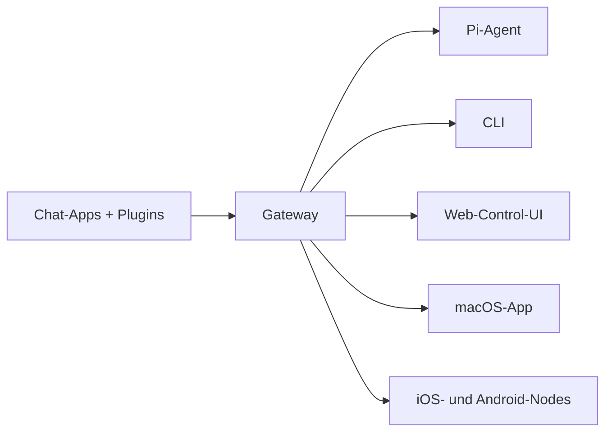

---
read_when:
    - OpenClaw neuen Nutzerinnen und Nutzern vorstellen
summary: OpenClaw ist ein Multi-Channel-Gateway für KI-Agenten, das auf jedem Betriebssystem läuft.
title: OpenClaw
x-i18n:
    generated_at: "2026-04-22T04:23:04Z"
    model: gpt-5.4
    provider: openai
    source_hash: 923d34fa604051d502e4bc902802d6921a4b89a9447f76123aa8d2ff085f0b99
    source_path: index.md
    workflow: 15
---

# OpenClaw 🦞

<p align="center">
    
    
</p>

> _"EXFOLIATE! EXFOLIATE!"_ — Wahrscheinlich ein Weltraumhummer

<p align="center">
  <strong>Gateway für KI-Agenten auf jedem Betriebssystem über Discord, Google Chat, iMessage, Matrix, Microsoft Teams, Signal, Slack, Telegram, WhatsApp, Zalo und mehr.</strong><br />
  Senden Sie eine Nachricht und erhalten Sie eine Agentenantwort direkt in Ihre Tasche. Betreiben Sie ein einziges Gateway über integrierte Channels, gebündelte Channel-Plugins, WebChat und mobile Nodes.
</p>

<Columns>
  <Card title="Erste Schritte" href="/de/start/getting-started" icon="rocket">
    Installieren Sie OpenClaw und starten Sie das Gateway in wenigen Minuten.
  </Card>
  <Card title="Onboarding ausführen" href="/de/start/wizard" icon="sparkles">
    Geführte Einrichtung mit `openclaw onboard` und Pairing-Abläufen.
  </Card>
  <Card title="Die Control UI öffnen" href="/web/control-ui" icon="layout-dashboard">
    Starten Sie das Browser-Dashboard für Chat, Konfiguration und Sitzungen.
  </Card>
</Columns>

## Was ist OpenClaw?

OpenClaw ist ein **selbst gehostetes Gateway**, das Ihre bevorzugten Chat-Apps und Channel-Oberflächen — integrierte Channels plus gebündelte oder externe Channel-Plugins wie Discord, Google Chat, iMessage, Matrix, Microsoft Teams, Signal, Slack, Telegram, WhatsApp, Zalo und mehr — mit KI-Coding-Agenten wie Pi verbindet. Sie betreiben einen einzigen Gateway-Prozess auf Ihrer eigenen Maschine (oder einem Server), und er wird zur Brücke zwischen Ihren Messaging-Apps und einem jederzeit verfügbaren KI-Assistenten.

**Für wen ist es gedacht?** Entwickler und Power-User, die einen persönlichen KI-Assistenten möchten, dem sie von überall aus Nachrichten senden können — ohne die Kontrolle über ihre Daten aufzugeben oder sich auf einen gehosteten Dienst zu verlassen.

**Was macht es anders?**

- **Selbst gehostet**: läuft auf Ihrer Hardware, nach Ihren Regeln
- **Multi-Channel**: ein Gateway bedient gleichzeitig integrierte Channels plus gebündelte oder externe Channel-Plugins
- **Agent-native**: entwickelt für Coding-Agenten mit Tool-Nutzung, Sitzungen, Speicher und Multi-Agent-Routing
- **Open Source**: MIT-lizenziert, von der Community getragen

**Was benötigen Sie?** Node 24 (empfohlen) oder Node 22 LTS (`22.14+`) zur Kompatibilität, einen API-Key Ihres gewählten Providers und 5 Minuten. Für beste Qualität und Sicherheit verwenden Sie das stärkste Modell der neuesten Generation, das Ihnen zur Verfügung steht.

## So funktioniert es



Das Gateway ist die einzige Quelle der Wahrheit für Sitzungen, Routing und Channel-Verbindungen.

## Hauptfunktionen

<Columns>
  <Card title="Multi-Channel-Gateway" icon="network" href="/de/channels">
    Discord, iMessage, Signal, Slack, Telegram, WhatsApp, WebChat und mehr mit einem einzigen Gateway-Prozess.
  </Card>
  <Card title="Plugin-Channels" icon="plug" href="/de/tools/plugin">
    Gebündelte Plugins fügen in normalen aktuellen Releases Matrix, Nostr, Twitch, Zalo und mehr hinzu.
  </Card>
  <Card title="Multi-Agent-Routing" icon="route" href="/de/concepts/multi-agent">
    Isolierte Sitzungen pro Agent, Workspace oder Absender.
  </Card>
  <Card title="Medienunterstützung" icon="image" href="/de/nodes/images">
    Senden und empfangen Sie Bilder, Audio und Dokumente.
  </Card>
  <Card title="Web-Control-UI" icon="monitor" href="/web/control-ui">
    Browser-Dashboard für Chat, Konfiguration, Sitzungen und Nodes.
  </Card>
  <Card title="Mobile Nodes" icon="smartphone" href="/de/nodes">
    Koppeln Sie iOS- und Android-Nodes für Canvas-, Kamera- und sprachaktivierte Workflows.
  </Card>
</Columns>

## Schnellstart

<Steps>
  <Step title="OpenClaw installieren">
    ```bash
    npm install -g openclaw@latest
    ```
  </Step>
  <Step title="Onboarding durchführen und den Dienst installieren">
    ```bash
    openclaw onboard --install-daemon
    ```
  </Step>
  <Step title="Chatten">
    Öffnen Sie die Control UI in Ihrem Browser und senden Sie eine Nachricht:

    ```bash
    openclaw dashboard
    ```

    Oder verbinden Sie einen Channel ([Telegram](/de/channels/telegram) ist am schnellsten) und chatten Sie von Ihrem Telefon aus.

  </Step>
</Steps>

Benötigen Sie die vollständige Installations- und Entwicklungsumgebung? Siehe [Getting Started](/de/start/getting-started).

## Dashboard

Öffnen Sie die browserbasierte Control UI, nachdem das Gateway gestartet wurde.

- Lokaler Standard: [http://127.0.0.1:18789/](http://127.0.0.1:18789/)
- Remote-Zugriff: [Web surfaces](/web) und [Tailscale](/de/gateway/tailscale)

<p align="center">
  
</p>

## Konfiguration (optional)

Die Konfiguration befindet sich unter `~/.openclaw/openclaw.json`.

- Wenn Sie **nichts tun**, verwendet OpenClaw die gebündelte Pi-Binärdatei im RPC-Modus mit Sitzungen pro Absender.
- Wenn Sie es stärker absichern möchten, beginnen Sie mit `channels.whatsapp.allowFrom` und (für Gruppen) Erwähnungsregeln.

Beispiel:

```json5
{
  channels: {
    whatsapp: {
      allowFrom: ["+15555550123"],
      groups: { "*": { requireMention: true } },
    },
  },
  messages: { groupChat: { mentionPatterns: ["@openclaw"] } },
}
```

## Hier starten

<Columns>
  <Card title="Docs-Hubs" href="/de/start/hubs" icon="book-open">
    Alle Docs und Leitfäden, nach Anwendungsfall organisiert.
  </Card>
  <Card title="Konfiguration" href="/de/gateway/configuration" icon="settings">
    Zentrale Gateway-Einstellungen, Tokens und Provider-Konfiguration.
  </Card>
  <Card title="Remote-Zugriff" href="/de/gateway/remote" icon="globe">
    SSH- und Tailnet-Zugriffsmuster.
  </Card>
  <Card title="Channels" href="/de/channels/telegram" icon="message-square">
    Channel-spezifische Einrichtung für Feishu, Microsoft Teams, WhatsApp, Telegram, Discord und mehr.
  </Card>
  <Card title="Nodes" href="/de/nodes" icon="smartphone">
    iOS- und Android-Nodes mit Pairing, Canvas, Kamera und Geräteaktionen.
  </Card>
  <Card title="Hilfe" href="/de/help" icon="life-buoy">
    Einstiegspunkt für häufige Lösungen und Fehlerbehebung.
  </Card>
</Columns>

## Mehr erfahren

<Columns>
  <Card title="Vollständige Funktionsliste" href="/de/concepts/features" icon="list">
    Vollständige Channel-, Routing- und Medienfunktionen.
  </Card>
  <Card title="Multi-Agent-Routing" href="/de/concepts/multi-agent" icon="route">
    Workspace-Isolation und Sitzungen pro Agent.
  </Card>
  <Card title="Sicherheit" href="/de/gateway/security" icon="shield">
    Tokens, Allowlists und Sicherheitskontrollen.
  </Card>
  <Card title="Fehlerbehebung" href="/de/gateway/troubleshooting" icon="wrench">
    Gateway-Diagnose und häufige Fehler.
  </Card>
  <Card title="Über das Projekt und Danksagungen" href="/de/reference/credits" icon="info">
    Projektursprung, Mitwirkende und Lizenz.
  </Card>
</Columns>
