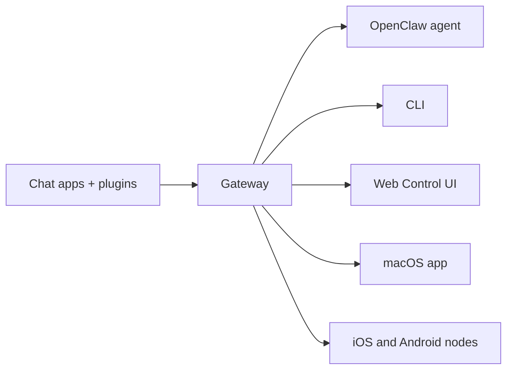

---
read_when:
    - OpenClaw Neueinsteigern vorstellen
summary: OpenClaw ist ein Multi-Channel-Gateway für KI-Agenten, das auf jedem Betriebssystem läuft.
title: OpenClaw
x-i18n:
    generated_at: "2026-06-27T17:37:03Z"
    model: gpt-5.5
    postprocess_version: locale-links-v1
    provider: openai
    source_hash: fcaa54a0a6d7aa62193fd9f03428bbcbfdcb2c00a184bcd6f49e4e093fefc473
    source_path: index.md
    workflow: 16
---

# OpenClaw 🦞

<p align="center">
    
    
</p>

> _"HÄUTE DICH! HÄUTE DICH!"_ — Ein Weltraumhummer, vermutlich

<p align="center">
  <strong>Gateway für jedes Betriebssystem für KI-Agenten über Discord, Google Chat, iMessage, Matrix, Microsoft Teams, Signal, Slack, Telegram, WhatsApp, Zalo und mehr.</strong><br />
  Senden Sie eine Nachricht und erhalten Sie eine Agent-Antwort direkt in Ihrer Tasche. Betreiben Sie ein Gateway über integrierte Kanäle, mitgelieferte Kanal-Plugins, WebChat und mobile Nodes hinweg.
</p>

<Columns>
  <Card title="Loslegen" href="/de/start/getting-started" icon="rocket">
    Installieren Sie OpenClaw und starten Sie das Gateway in wenigen Minuten.
  </Card>
  <Card title="Onboarding ausführen" href="/de/start/wizard" icon="sparkles">
    Geführte Einrichtung mit `openclaw onboard` und Kopplungsabläufen.
  </Card>
  <Card title="Control UI öffnen" href="/de/web/control-ui" icon="layout-dashboard">
    Starten Sie das Browser-Dashboard für Chat, Konfiguration und Sitzungen.
  </Card>
</Columns>

## Was ist OpenClaw?

OpenClaw ist ein **selbst gehostetes Gateway**, das Ihre bevorzugten Chat-Apps und Kanaloberflächen — integrierte Kanäle sowie mitgelieferte oder externe Kanal-Plugins wie Discord, Google Chat, iMessage, Matrix, Microsoft Teams, Signal, Slack, Telegram, WhatsApp, Zalo und mehr — mit KI-Coding-Agenten verbindet. Sie führen einen einzelnen Gateway-Prozess auf Ihrem eigenen Rechner (oder einem Server) aus, und er wird zur Brücke zwischen Ihren Messaging-Apps und einem jederzeit verfügbaren KI-Assistenten.

**Für wen ist es gedacht?** Für Entwickler und Power-User, die einen persönlichen KI-Assistenten möchten, dem sie von überall Nachrichten senden können — ohne die Kontrolle über ihre Daten aufzugeben oder sich auf einen gehosteten Dienst zu verlassen.

**Was macht es anders?**

- **Selbst gehostet**: läuft auf Ihrer Hardware, nach Ihren Regeln
- **Multi-Channel**: ein Gateway bedient integrierte Kanäle sowie mitgelieferte oder externe Kanal-Plugins gleichzeitig
- **Agent-nativ**: entwickelt für Coding-Agenten mit Tool-Nutzung, Sitzungen, Memory und Multi-Agent-Routing
- **Open Source**: MIT-lizenziert, community-getrieben

**Was benötigen Sie?** Node 24 (empfohlen) oder Node 22 LTS (`22.19+`) für Kompatibilität, einen API-Schlüssel Ihres gewählten Providers und 5 Minuten. Für beste Qualität und Sicherheit verwenden Sie das stärkste verfügbare Modell der neuesten Generation.

## Funktionsweise



Das Gateway ist die zentrale Quelle der Wahrheit für Sitzungen, Routing und Kanalverbindungen.

## Wichtige Funktionen

<Columns>
  <Card title="Multi-Channel-Gateway" icon="network" href="/de/channels">
    Discord, iMessage, Signal, Slack, Telegram, WhatsApp, WebChat und mehr mit einem einzelnen Gateway-Prozess.
  </Card>
  <Card title="Plugin-Kanäle" icon="plug" href="/de/tools/plugin">
    Mitgelieferte Plugins ergänzen Matrix, Nostr, Twitch, Zalo und mehr in normalen aktuellen Releases.
  </Card>
  <Card title="Multi-Agent-Routing" icon="route" href="/de/concepts/multi-agent">
    Isolierte Sitzungen pro Agent, Workspace oder Absender.
  </Card>
  <Card title="Medienunterstützung" icon="image" href="/de/nodes/images">
    Senden und empfangen Sie Bilder, Audio und Dokumente.
  </Card>
  <Card title="Web Control UI" icon="monitor" href="/de/web/control-ui">
    Browser-Dashboard für Chat, Konfiguration, Sitzungen und Nodes.
  </Card>
  <Card title="Mobile Nodes" icon="smartphone" href="/de/nodes">
    Koppeln Sie iOS- und Android-Nodes für Canvas-, Kamera- und sprachgestützte Workflows.
  </Card>
</Columns>

## Schnellstart

<Steps>
  <Step title="OpenClaw installieren">
    ```bash
    npm install -g openclaw@latest
    ```
  </Step>
  <Step title="Onboarding durchführen und Dienst installieren">
    ```bash
    openclaw onboard --install-daemon
    ```
  </Step>
  <Step title="Chatten">
    Öffnen Sie die Control UI in Ihrem Browser und senden Sie eine Nachricht:

    ```bash
    openclaw dashboard
    ```

    Oder verbinden Sie einen Kanal ([Telegram](/de/channels/telegram) ist am schnellsten) und chatten Sie von Ihrem Telefon aus.

  </Step>
</Steps>

Benötigen Sie die vollständige Installation und Entwicklungsumgebung? Siehe [Erste Schritte](/de/start/getting-started).

## Dashboard

Öffnen Sie die Browser-Control-UI, nachdem das Gateway gestartet ist.

- Lokaler Standard: [http://127.0.0.1:18789/](http://127.0.0.1:18789/)
- Remote-Zugriff: [Web-Oberflächen](/de/web) und [Tailscale](/de/gateway/tailscale)

<p align="center">
  
</p>

## Konfiguration (optional)

Die Konfiguration befindet sich unter `~/.openclaw/openclaw.json`.

- Wenn Sie **nichts tun**, verwendet OpenClaw die mitgelieferte OpenClaw-Agent-Laufzeit mit Sitzungen pro Absender.
- Wenn Sie sie absichern möchten, beginnen Sie mit `channels.whatsapp.allowFrom` und (für Gruppen) Erwähnungsregeln.

Beispiel:

```json5
{
  channels: {
    whatsapp: {
      allowFrom: ["+15555550123"],
      groups: { "*": { requireMention: true } },
    },
  },
  messages: { groupChat: { mentionPatterns: ["@openclaw"] } },
}
```

## Hier beginnen

<Columns>
  <Card title="Docs-Hubs" href="/de/start/hubs" icon="book-open">
    Alle Dokumentationen und Leitfäden, nach Anwendungsfall organisiert.
  </Card>
  <Card title="Konfiguration" href="/de/gateway/configuration" icon="settings">
    Zentrale Gateway-Einstellungen, Tokens und Provider-Konfiguration.
  </Card>
  <Card title="Remote-Zugriff" href="/de/gateway/remote" icon="globe">
    Zugriffsmuster für SSH und Tailnet.
  </Card>
  <Card title="Kanäle" href="/de/channels/telegram" icon="message-square">
    Kanalspezifische Einrichtung für Feishu, Microsoft Teams, WhatsApp, Telegram, Discord und mehr.
  </Card>
  <Card title="Nodes" href="/de/nodes" icon="smartphone">
    iOS- und Android-Nodes mit Kopplung, Canvas, Kamera und Geräteaktionen.
  </Card>
  <Card title="Hilfe" href="/de/help" icon="life-buoy">
    Einstiegspunkt für häufige Korrekturen und Fehlerbehebung.
  </Card>
</Columns>

## Mehr erfahren

<Columns>
  <Card title="Vollständige Funktionsliste" href="/de/concepts/features" icon="list">
    Vollständige Kanal-, Routing- und Medienfunktionen.
  </Card>
  <Card title="Multi-Agent-Routing" href="/de/concepts/multi-agent" icon="route">
    Workspace-Isolation und Sitzungen pro Agent.
  </Card>
  <Card title="Sicherheit" href="/de/gateway/security" icon="shield">
    Tokens, Allowlists und Sicherheitskontrollen.
  </Card>
  <Card title="Fehlerbehebung" href="/de/gateway/troubleshooting" icon="wrench">
    Gateway-Diagnosen und häufige Fehler.
  </Card>
  <Card title="Über das Projekt und Danksagungen" href="/de/reference/credits" icon="info">
    Projektursprünge, Mitwirkende und Lizenz.
  </Card>
</Columns>
