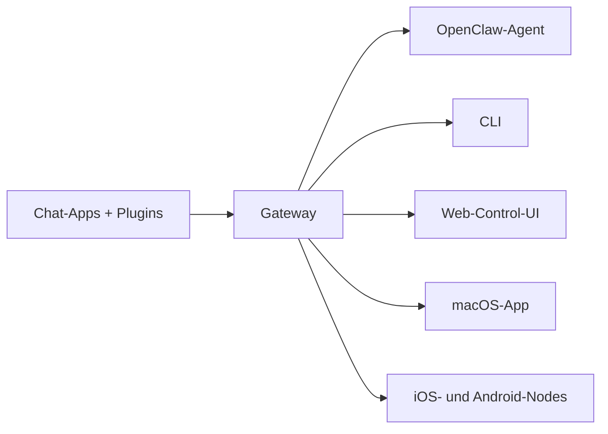

---
read_when:
    - OpenClaw für Neueinsteiger vorstellen
summary: OpenClaw ist ein Multi-Channel-Gateway für KI-Agenten, das auf jedem Betriebssystem läuft.
title: OpenClaw
x-i18n:
    generated_at: "2026-07-24T05:06:28Z"
    model: gpt-5.6
    postprocess_version: locale-links-v1
    prompt_version: 32
    provider: openai
    source_hash: 0ce948d12d4b4fcbde2597f9b33f50b99c4f677b69e0f5d72677b2f6683291f3
    source_path: index.md
    workflow: 16
---

# OpenClaw 🦞

<p align="center">
    
    
</p>

> _„EXFOLIEREN! EXFOLIEREN!“_ — Vermutlich ein Weltraumhummer

<p align="center">
  <strong>Ein Gateway für jedes Betriebssystem, das KI-Agenten mit Discord, Google Chat, iMessage, Matrix, Microsoft Teams, Signal, Slack, Telegram, WhatsApp, Zalo und weiteren Diensten verbindet.</strong><br />
  Senden Sie eine Nachricht und erhalten Sie unterwegs die Antwort eines Agenten. Betreiben Sie ein Gateway für Kanal-Plugins, WebChat und mobile Nodes.<br />
  Offen entwickelt von der gemeinnützigen <a href="https://openclaw.org">OpenClaw Foundation</a>.
</p>

<Columns>
  <Card title="Erste Schritte" href="/de/start/getting-started" icon="rocket">
    Installieren Sie OpenClaw und nehmen Sie das Gateway innerhalb weniger Minuten in Betrieb.
  </Card>
  <Card title="Onboarding ausführen" href="/de/start/wizard" icon="list-checks">
    Geführte Einrichtung mit `openclaw onboard` und Kopplungsabläufen.
  </Card>
  <Card title="Einen Kanal verbinden" href="/de/channels" icon="message-circle">
    Verbinden Sie Discord, Signal, Telegram, WhatsApp und weitere Dienste, um von überall zu chatten.
  </Card>
  <Card title="Control UI öffnen" href="/de/web/control-ui" icon="layout-dashboard">
    Starten Sie das Browser-Dashboard für Chat, Konfiguration und Sitzungen.
  </Card>
</Columns>

## Dokumentation durchsuchen

In mobilen Browsern wird das Abschnittsmenü möglicherweise ohne die vollständige Desktop-Tableiste angezeigt. Über
diese Übersichtslinks erreichen Sie dieselben übergeordneten Dokumentationsbereiche direkt aus dem Seiteninhalt.

<Columns>
  <Card title="Erste Schritte" href="/de" icon="rocket">
    Übersicht, Beispiele, erste Schritte und Einrichtungsanleitungen.
  </Card>
  <Card title="Installation" href="/de/install" icon="download">
    Installationswege, Aktualisierungen, Container, Hosting und erweiterte Einrichtung.
  </Card>
  <Card title="Kanäle" href="/de/channels" icon="messages-square">
    Nachrichtenkanäle, Kopplung, Routing, Zugriffsgruppen und Kanal-QA.
  </Card>
  <Card title="Agenten" href="/de/concepts/architecture" icon="bot">
    Architektur, Sitzungen, Kontext, Speicher und Multi-Agenten-Routing.
  </Card>
  <Card title="Funktionen" href="/de/tools" icon="wand-sparkles">
    Werkzeuge, Skills, Cron, Webhooks und Automatisierungsfunktionen.
  </Card>
  <Card title="ClawHub" href="/clawhub" icon="store">
    Plugin-Marktplatz, Veröffentlichung, Kuratierung und Vertrauensrichtlinien.
  </Card>
  <Card title="Modelle" href="/de/providers" icon="brain">
    Provider, Modellkonfiguration, Failover und lokale Modelldienste.
  </Card>
  <Card title="Plattformen" href="/de/platforms" icon="monitor-smartphone">
    macOS, Windows, iOS, Android, Nodes und Weboberflächen.
  </Card>
  <Card title="Gateway und Betrieb" href="/de/gateway" icon="server">
    Gateway-Konfiguration, Sicherheit, Diagnose und Betrieb.
  </Card>
  <Card title="Referenz" href="/de/cli" icon="terminal">
    CLI-Referenz, Schemas, RPC, Versionshinweise und Vorlagen.
  </Card>
  <Card title="Hilfe" href="/de/help" icon="life-buoy">
    Fehlerbehebung, häufig gestellte Fragen, Tests, Diagnose und Umgebungsprüfungen.
  </Card>
</Columns>

## Was ist OpenClaw?

OpenClaw ist ein **selbst gehostetes Gateway**, das Ihre bevorzugten Chat-Apps — Discord, Google Chat, iMessage, Matrix, Microsoft Teams, Signal, Slack, Telegram, WhatsApp, Zalo und weitere über Kanal-Plugins — mit KI-Programmieragenten verbindet. Sie führen einen einzigen Gateway-Prozess auf Ihrem eigenen Rechner oder einem Server aus, der als Brücke zwischen Ihren Messaging-Apps und einem jederzeit verfügbaren KI-Assistenten dient.

**Für wen ist es gedacht?** Für Entwickler und erfahrene Benutzer, die einen persönlichen KI-Assistenten von überall per Nachricht erreichen möchten, ohne die Kontrolle über ihre Daten aufzugeben oder von einem gehosteten Dienst abhängig zu sein.

**Was zeichnet es aus?**

- **Selbst gehostet**: läuft auf Ihrer Hardware nach Ihren Regeln
- **Mehrkanalfähig**: Ein Gateway bedient gleichzeitig jedes konfigurierte Kanal-Plugin
- **Für Agenten konzipiert**: ausgelegt für Programmieragenten mit Werkzeugnutzung, Sitzungen, Speicher und Multi-Agenten-Routing
- **Open Source**: MIT-lizenziert und von der Community getragen

**Was benötigen Sie?** Node 24.15+ (empfohlen), Node 22 LTS (`22.22.3+`) für Kompatibilität oder Node 25.9+, einen API-Schlüssel Ihres gewählten Providers und 5 Minuten. Verwenden Sie für bestmögliche Qualität und Sicherheit das leistungsfähigste verfügbare Modell der neuesten Generation.

## Funktionsweise



Das Gateway ist die zentrale maßgebliche Instanz für Sitzungen, Routing und Kanalverbindungen.

## Zentrale Funktionen

<Columns>
  <Card title="Mehrkanal-Gateway" icon="network" href="/de/channels">
    Discord, iMessage, Signal, Slack, Telegram, WhatsApp, WebChat und weitere Dienste mit einem einzigen Gateway-Prozess.
  </Card>
  <Card title="Kanal-Plugins" icon="plug" href="/de/tools/plugin">
    Kanal-Plugins ergänzen Matrix, Nostr, Twitch, Zalo und weitere Dienste; offizielle Plugins werden bei Bedarf installiert.
  </Card>
  <Card title="Multi-Agenten-Routing" icon="route" href="/de/concepts/multi-agent">
    Isolierte Sitzungen pro Agent, Arbeitsbereich oder Absender.
  </Card>
  <Card title="Medienunterstützung" icon="image" href="/de/nodes/images">
    Senden und empfangen Sie Bilder, Audioinhalte und Dokumente.
  </Card>
  <Card title="Web-Control-UI" icon="monitor" href="/de/web/control-ui">
    Browser-Dashboard für Chat, Konfiguration, Sitzungen und Nodes.
  </Card>
  <Card title="Mobile Nodes" icon="smartphone" href="/de/nodes">
    Koppeln Sie iOS- und Android-Nodes für Canvas-, Kamera- und sprachgestützte Arbeitsabläufe.
  </Card>
</Columns>

## Schnellstart

<Steps>
  <Step title="OpenClaw installieren">
    ```bash
    npm install -g openclaw@latest
    ```
  </Step>
  <Step title="Onboarding durchführen und Dienst installieren">
    ```bash
    openclaw onboard --install-daemon
    ```
  </Step>
  <Step title="Chatten">
    Öffnen Sie die Control UI in Ihrem Browser und senden Sie eine Nachricht:

    ```bash
    openclaw dashboard
    ```

    Oder verbinden Sie einen Kanal ([Telegram](/de/channels/telegram) ist am schnellsten) und chatten Sie von Ihrem Smartphone aus.

  </Step>
</Steps>

Benötigen Sie die vollständige Installations- und Entwicklungsumgebung? Weitere Informationen finden Sie unter [Erste Schritte](/de/start/getting-started).

## Dashboard

Öffnen Sie nach dem Start des Gateways die Control UI im Browser.

- Lokaler Standard: [http://127.0.0.1:18789/](http://127.0.0.1:18789/)
- Remote-Zugriff: [Weboberflächen](/de/web) und [Tailscale](/de/gateway/tailscale)

<p align="center">
  
</p>

## Konfiguration (optional)

Die Konfiguration befindet sich unter `~/.openclaw/openclaw.json`.

- Wenn Sie **nichts unternehmen**, verwendet OpenClaw die mitgelieferte OpenClaw-Agenten-Laufzeitumgebung. Direktnachrichten teilen sich die Hauptsitzung des Agenten und jeder Gruppenchat erhält eine eigene Sitzung.
- Wenn Sie den Zugriff einschränken möchten, beginnen Sie mit `channels.whatsapp.allowFrom` und verwenden Sie für Gruppen zusätzlich Erwähnungsregeln.

Beispiel:

```json5
{
  channels: {
    whatsapp: {
      allowFrom: ["+15555550123"],
      groups: { "*": { requireMention: true } },
    },
  },
  messages: { groupChat: { mentionPatterns: ["@openclaw"] } },
}
```

## Hier beginnen

<Columns>
  <Card title="Dokumentationsübersichten" href="/de/start/hubs" icon="book-open">
    Alle Dokumentationen und Anleitungen, nach Anwendungsfall geordnet.
  </Card>
  <Card title="Konfiguration" href="/de/gateway/configuration" icon="settings">
    Zentrale Gateway-Einstellungen, Tokens und Provider-Konfiguration.
  </Card>
  <Card title="Remote-Zugriff" href="/de/gateway/remote" icon="globe">
    Zugriffsmuster für SSH und Tailnet.
  </Card>
  <Card title="Kanäle" href="/de/channels/telegram" icon="message-square">
    Kanalspezifische Einrichtung für Discord, Feishu, Microsoft Teams, Telegram, WhatsApp und weitere Dienste.
  </Card>
  <Card title="Nodes" href="/de/nodes" icon="smartphone">
    iOS- und Android-Nodes mit Kopplung, Canvas, Kamera und Geräteaktionen.
  </Card>
  <Card title="Hilfe" href="/de/help" icon="life-buoy">
    Einstiegspunkt für häufige Lösungen und Fehlerbehebung.
  </Card>
</Columns>

## Weitere Informationen

<Columns>
  <Card title="Vollständige Funktionsliste" href="/de/concepts/features" icon="list">
    Sämtliche Kanal-, Routing- und Medienfunktionen.
  </Card>
  <Card title="Multi-Agenten-Routing" href="/de/concepts/multi-agent" icon="route">
    Arbeitsbereichsisolierung und Sitzungen pro Agent.
  </Card>
  <Card title="Sicherheit" href="/de/gateway/security" icon="shield">
    Tokens, Positivlisten und Sicherheitskontrollen.
  </Card>
  <Card title="Fehlerbehebung" href="/de/gateway/troubleshooting" icon="wrench">
    Gateway-Diagnose und häufige Fehler.
  </Card>
  <Card title="Über das Projekt und Danksagungen" href="/de/reference/credits" icon="info">
    Ursprünge des Projekts, Mitwirkende und Lizenz.
  </Card>
</Columns>
