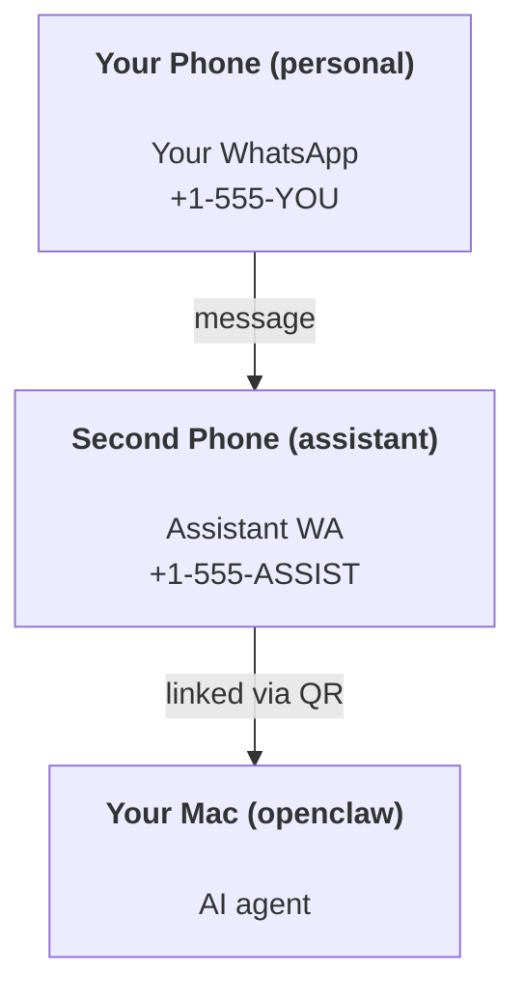

---
read_when:
    - Einrichten einer neuen Assistenteninstanz
    - Sicherheits- und Berechtigungsimplikationen prüfen
summary: End-to-End-Anleitung zum Ausführen von OpenClaw als persönlicher Assistent mit Sicherheitshinweisen
title: Einrichtung des persönlichen Assistenten
x-i18n:
    generated_at: "2026-06-27T18:14:26Z"
    model: gpt-5.5
    postprocess_version: locale-links-v1
    provider: openai
    source_hash: b0cd640872a2a60fd88d2dc3df6d038ef8574163430d8683ef9b67921b0c87f4
    source_path: start/openclaw.md
    workflow: 16
---

OpenClaw ist ein selbst gehosteter Gateway, der Discord, Google Chat, iMessage, Matrix, Microsoft Teams, Signal, Slack, Telegram, WhatsApp, Zalo und weitere Dienste mit KI-Agenten verbindet. Diese Anleitung behandelt die Einrichtung als „persönlicher Assistent“: eine dedizierte WhatsApp-Nummer, die sich wie Ihr dauerhaft verfügbarer KI-Assistent verhält.

## ⚠️ Sicherheit zuerst

Sie bringen einen Agenten in die Lage, Folgendes zu tun:

- Befehle auf Ihrem Rechner ausführen (abhängig von Ihrer Tool-Richtlinie)
- Dateien in Ihrem Arbeitsbereich lesen/schreiben
- Nachrichten über WhatsApp/Telegram/Discord/Mattermost und andere gebündelte Kanäle zurücksenden

Beginnen Sie konservativ:

- Setzen Sie immer `channels.whatsapp.allowFrom` (betreiben Sie auf Ihrem persönlichen Mac niemals eine weltweit offene Instanz).
- Verwenden Sie eine dedizierte WhatsApp-Nummer für den Assistenten.
- Heartbeats laufen jetzt standardmäßig alle 30 Minuten. Deaktivieren Sie sie, bis Sie der Einrichtung vertrauen, indem Sie `agents.defaults.heartbeat.every: "0m"` setzen.

## Voraussetzungen

- OpenClaw ist installiert und onboarded - siehe [Erste Schritte](/de/start/getting-started), falls Sie dies noch nicht erledigt haben
- Eine zweite Telefonnummer (SIM/eSIM/Prepaid) für den Assistenten

## Die Einrichtung mit zwei Telefonen (empfohlen)

Sie möchten Folgendes:



Wenn Sie Ihr persönliches WhatsApp mit OpenClaw verknüpfen, wird jede Nachricht an Sie zu „Agenten-Eingabe“. Das ist selten das, was Sie möchten.

## Schnellstart in 5 Minuten

1. WhatsApp Web koppeln (zeigt QR-Code; mit dem Assistenten-Telefon scannen):

```bash
openclaw channels login
```

2. Gateway starten (laufen lassen):

```bash
openclaw gateway --port 18789
```

3. Eine minimale Konfiguration in `~/.openclaw/openclaw.json` ablegen:

```json5
{
  gateway: { mode: "local" },
  channels: { whatsapp: { allowFrom: ["+15555550123"] } },
}
```

Senden Sie nun von Ihrem zugelassenen Telefon eine Nachricht an die Assistenten-Nummer.

Wenn das Onboarding abgeschlossen ist, öffnet OpenClaw automatisch das Dashboard und gibt einen sauberen (nicht tokenisierten) Link aus. Wenn das Dashboard zur Authentifizierung auffordert, fügen Sie das konfigurierte Shared Secret in die Control-UI-Einstellungen ein. Onboarding verwendet standardmäßig ein Token (`gateway.auth.token`), aber Passwortauthentifizierung funktioniert ebenfalls, wenn Sie `gateway.auth.mode` auf `password` umgestellt haben. Später erneut öffnen: `openclaw dashboard`.

## Dem Agenten einen Arbeitsbereich geben (AGENTS)

OpenClaw liest Betriebsanweisungen und „Gedächtnis“ aus seinem Arbeitsbereichsverzeichnis.

Standardmäßig verwendet OpenClaw `~/.openclaw/workspace` als Agenten-Arbeitsbereich und erstellt ihn (plus Starterdateien `AGENTS.md`, `SOUL.md`, `TOOLS.md`, `IDENTITY.md`, `USER.md`, `HEARTBEAT.md`) automatisch beim Setup/ersten Agentenlauf. `BOOTSTRAP.md` wird nur erstellt, wenn der Arbeitsbereich ganz neu ist (sie sollte nicht wiederkommen, nachdem Sie sie gelöscht haben). `MEMORY.md` ist optional (wird nicht automatisch erstellt); wenn vorhanden, wird sie für normale Sitzungen geladen. Subagenten-Sitzungen injizieren nur `AGENTS.md` und `TOOLS.md`.

<Tip>
Behandeln Sie diesen Ordner wie das Gedächtnis von OpenClaw und machen Sie ihn zu einem Git-Repository (idealerweise privat), damit Ihre `AGENTS.md` und Gedächtnisdateien gesichert sind. Wenn Git installiert ist, werden ganz neue Arbeitsbereiche automatisch initialisiert.
</Tip>

```bash
openclaw setup
```

Vollständiges Arbeitsbereichs-Layout + Backup-Anleitung: [Agenten-Arbeitsbereich](/de/concepts/agent-workspace)
Gedächtnis-Workflow: [Gedächtnis](/de/concepts/memory)

Optional: Wählen Sie mit `agents.defaults.workspace` einen anderen Arbeitsbereich (unterstützt `~`).

```json5
{
  agents: {
    defaults: {
      workspace: "~/.openclaw/workspace",
    },
  },
}
```

Wenn Sie bereits eigene Arbeitsbereichsdateien aus einem Repository ausliefern, können Sie die Erstellung von Bootstrap-Dateien vollständig deaktivieren:

```json5
{
  agents: {
    defaults: {
      skipBootstrap: true,
    },
  },
}
```

## Die Konfiguration, die daraus „einen Assistenten“ macht

OpenClaw verwendet standardmäßig eine gute Assistenten-Einrichtung, aber normalerweise möchten Sie Folgendes anpassen:

- Persona/Anweisungen in [`SOUL.md`](/de/concepts/soul)
- Denk-Standardeinstellungen (falls gewünscht)
- Heartbeats (sobald Sie ihnen vertrauen)

Beispiel:

```json5
{
  logging: { level: "info" },
  agents: {
    defaults: {
      model: { primary: "anthropic/claude-opus-4-6" },
      workspace: "~/.openclaw/workspace",
      thinkingDefault: "high",
      timeoutSeconds: 1800,
      // Start with 0; enable later.
      heartbeat: { every: "0m" },
    },
    list: [
      {
        id: "main",
        default: true,
        groupChat: {
          mentionPatterns: ["@openclaw", "openclaw"],
        },
      },
    ],
  },
  channels: {
    whatsapp: {
      allowFrom: ["+15555550123"],
      groups: {
        "*": { requireMention: true },
      },
    },
  },
  session: {
    scope: "per-sender",
    resetTriggers: ["/new", "/reset"],
    reset: {
      mode: "daily",
      atHour: 4,
      idleMinutes: 10080,
    },
  },
}
```

## Sitzungen und Gedächtnis

- Sitzungsdateien: `~/.openclaw/agents/<agentId>/sessions/{{SessionId}}.jsonl`
- Sitzungsmetadaten (Token-Nutzung, letzte Route usw.): `~/.openclaw/agents/<agentId>/sessions/sessions.json` (legacy: `~/.openclaw/sessions/sessions.json`)
- `/new` oder `/reset` startet eine neue Sitzung für diesen Chat (konfigurierbar über `resetTriggers`). Wenn allein gesendet, bestätigt OpenClaw den Reset, ohne das Modell aufzurufen.
- `/compact [instructions]` komprimiert den Sitzungskontext und meldet das verbleibende Kontextbudget.

## Heartbeats (proaktiver Modus)

Standardmäßig führt OpenClaw alle 30 Minuten einen Heartbeat mit folgendem Prompt aus:
`Read HEARTBEAT.md if it exists (workspace context). Follow it strictly. Do not infer or repeat old tasks from prior chats. If nothing needs attention, reply HEARTBEAT_OK.`
Setzen Sie `agents.defaults.heartbeat.every: "0m"`, um dies zu deaktivieren.

- Wenn `HEARTBEAT.md` existiert, aber effektiv leer ist (nur Leerzeilen, Markdown-/HTML-Kommentare, Markdown-Überschriften wie `# Heading`, Fence-Marker oder leere Checklist-Stubs), überspringt OpenClaw den Heartbeat-Lauf, um API-Aufrufe zu sparen.
- Wenn die Datei fehlt, läuft der Heartbeat trotzdem, und das Modell entscheidet, was zu tun ist.
- Wenn der Agent mit `HEARTBEAT_OK` antwortet (optional mit kurzem Padding; siehe `agents.defaults.heartbeat.ackMaxChars`), unterdrückt OpenClaw die ausgehende Zustellung für diesen Heartbeat.
- Standardmäßig ist die Heartbeat-Zustellung an DM-artige `user:<id>`-Ziele erlaubt. Setzen Sie `agents.defaults.heartbeat.directPolicy: "block"`, um die Zustellung an direkte Ziele zu unterdrücken, während Heartbeat-Läufe aktiv bleiben.
- Heartbeats führen vollständige Agenten-Turns aus - kürzere Intervalle verbrauchen mehr Tokens.

```json5
{
  agents: {
    defaults: {
      heartbeat: { every: "30m" },
    },
  },
}
```

## Medien rein und raus

Eingehende Anhänge (Bilder/Audio/Dokumente) können Ihrem Befehl über Templates bereitgestellt werden:

- `{{MediaPath}}` (lokaler temporärer Dateipfad)
- `{{MediaUrl}}` (Pseudo-URL)
- `{{Transcript}}` (wenn Audiotranskription aktiviert ist)

Ausgehende Anhänge vom Agenten verwenden strukturierte Medienfelder im Nachrichten-Tool oder in der Antwort-Payload, zum Beispiel `media`, `mediaUrl`, `mediaUrls`, `path` oder `filePath`. Beispielargumente für das Nachrichten-Tool:

```json
{
  "message": "Here's the screenshot.",
  "mediaUrl": "https://example.com/screenshot.png"
}
```

OpenClaw sendet strukturierte Medien zusammen mit dem Text. Legacy-Endantworten des Assistenten können zur Kompatibilität weiterhin normalisiert werden, aber Tool-Ausgabe, Browser-Ausgabe, Streaming-Blöcke und Nachrichtenaktionen parsen Text nicht als Anhangsbefehle.

Das Verhalten lokaler Pfade folgt demselben Vertrauensmodell für Dateilesezugriffe wie der Agent:

- Wenn `tools.fs.workspaceOnly` `true` ist, bleiben ausgehende lokale Medienpfade auf das temporäre OpenClaw-Root, den Medien-Cache, Agenten-Arbeitsbereichspfade und von der Sandbox generierte Dateien beschränkt.
- Wenn `tools.fs.workspaceOnly` `false` ist, können ausgehende lokale Medien host-lokale Dateien verwenden, die der Agent bereits lesen darf.
- Lokale Pfade können absolut, arbeitsbereichsrelativ oder mit `~/` relativ zum Home-Verzeichnis sein.
- Host-lokale Sendungen erlauben weiterhin nur Medien und sichere Dokumenttypen (Bilder, Audio, Video, PDF, Office-Dokumente und validierte Textdokumente wie Markdown/MD, TXT, JSON, YAML und YML). Dies ist eine Erweiterung der bestehenden Vertrauensgrenze für Host-Lesezugriff, kein Secret-Scanner: Wenn der Agent eine host-lokale `secret.txt` oder `config.json` lesen kann, kann er diese Datei anhängen, wenn Erweiterung und Inhaltsvalidierung passen.

Das bedeutet, dass generierte Bilder/Dateien außerhalb des Arbeitsbereichs jetzt gesendet werden können, wenn Ihre Dateisystemrichtlinie diese Lesezugriffe bereits erlaubt, während beliebige host-lokale Texterweiterungen weiterhin blockiert bleiben. Halten Sie sensible Dateien außerhalb des für den Agenten lesbaren Dateisystems, oder verwenden Sie `tools.fs.workspaceOnly=true` für strengere Sendungen mit lokalen Pfaden.

## Betriebs-Checkliste

```bash
openclaw status          # local status (creds, sessions, queued events)
openclaw status --all    # full diagnosis (read-only, pasteable)
openclaw status --deep   # asks the gateway for a live health probe with channel probes when supported
openclaw health --json   # gateway health snapshot (WS; default can return a fresh cached snapshot)
```

Logs liegen unter `/tmp/openclaw/` (Standard: `openclaw-YYYY-MM-DD.log`).

## Nächste Schritte

- WebChat: [WebChat](/de/web/webchat)
- Gateway-Betrieb: [Gateway-Runbook](/de/gateway)
- Cron + Aufwachvorgänge: [Cron-Jobs](/de/automation/cron-jobs)
- macOS-Menüleistenbegleiter: [OpenClaw-macOS-App](/de/platforms/macos)
- iOS-Node-App: [iOS-App](/de/platforms/ios)
- Android-Node-App: [Android-App](/de/platforms/android)
- Windows Hub: [Windows](/de/platforms/windows)
- Linux-Status: [Linux-App](/de/platforms/linux)
- Sicherheit: [Sicherheit](/de/gateway/security)

## Verwandt

- [Erste Schritte](/de/start/getting-started)
- [Setup](/de/start/setup)
- [Kanalübersicht](/de/channels)
