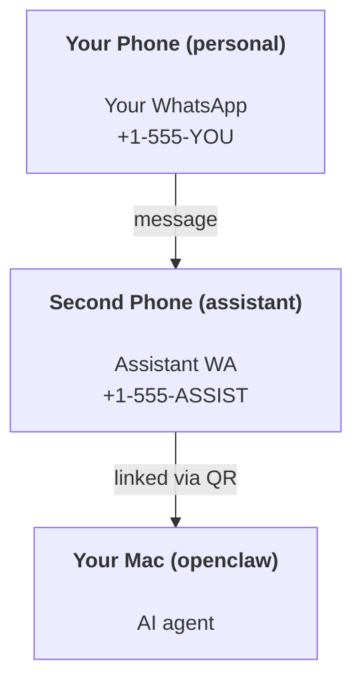

---
read_when:
    - Onboarding einer neuen Assistenteninstanz
    - Prüfung der Sicherheits- und Berechtigungsimplikationen
summary: End-to-End-Anleitung zum Betrieb von OpenClaw als persönlichem Assistenten mit Sicherheitshinweisen
title: Einrichtung des persönlichen Assistenten
x-i18n:
    generated_at: "2026-05-11T20:36:50Z"
    model: gpt-5.5
    provider: openai
    source_hash: 74dd13c4b43faa8e29e1fd56a355f36c6cf7c3fa8193bb62c1056211933f4df9
    source_path: start/openclaw.md
    workflow: 16
---

OpenClaw ist ein selbstgehosteter Gateway, der Discord, Google Chat, iMessage, Matrix, Microsoft Teams, Signal, Slack, Telegram, WhatsApp, Zalo und mehr mit KI-Agenten verbindet. Diese Anleitung behandelt die Einrichtung als „persönlicher Assistent“: eine dedizierte WhatsApp-Nummer, die sich wie Ihr jederzeit verfügbarer KI-Assistent verhält.

## ⚠️ Sicherheit zuerst

Sie versetzen einen Agenten in die Lage, Folgendes zu tun:

- Befehle auf Ihrem Rechner ausführen (abhängig von Ihrer Tool-Richtlinie)
- Dateien in Ihrem Arbeitsbereich lesen/schreiben
- Nachrichten über WhatsApp/Telegram/Discord/Mattermost und andere gebündelte Kanäle zurücksenden

Beginnen Sie konservativ:

- Setzen Sie immer `channels.whatsapp.allowFrom` (betreiben Sie es auf Ihrem persönlichen Mac niemals offen für die ganze Welt).
- Verwenden Sie eine dedizierte WhatsApp-Nummer für den Assistenten.
- Heartbeats laufen jetzt standardmäßig alle 30 Minuten. Deaktivieren Sie sie, bis Sie der Einrichtung vertrauen, indem Sie `agents.defaults.heartbeat.every: "0m"` setzen.

## Voraussetzungen

- OpenClaw ist installiert und eingerichtet – siehe [Erste Schritte](/de/start/getting-started), falls Sie dies noch nicht getan haben
- Eine zweite Telefonnummer (SIM/eSIM/Prepaid) für den Assistenten

## Die Einrichtung mit zwei Telefonen (empfohlen)

Sie möchten Folgendes:



Wenn Sie Ihr persönliches WhatsApp mit OpenClaw verknüpfen, wird jede an Sie gerichtete Nachricht zu „Agenteneingabe“. Das ist selten das, was Sie möchten.

## Schnellstart in 5 Minuten

1. WhatsApp Web koppeln (zeigt QR an; mit dem Assistenten-Telefon scannen):

```bash
openclaw channels login
```

2. Gateway starten (laufen lassen):

```bash
openclaw gateway --port 18789
```

3. Eine minimale Konfiguration in `~/.openclaw/openclaw.json` einfügen:

```json5
{
  gateway: { mode: "local" },
  channels: { whatsapp: { allowFrom: ["+15555550123"] } },
}
```

Senden Sie nun von Ihrem in der Zulassungsliste eingetragenen Telefon eine Nachricht an die Assistenten-Nummer.

Wenn das Onboarding abgeschlossen ist, öffnet OpenClaw automatisch das Dashboard und gibt einen sauberen Link (ohne Token) aus. Wenn das Dashboard zur Authentifizierung auffordert, fügen Sie das konfigurierte gemeinsame Geheimnis in den Einstellungen der Control UI ein. Onboarding verwendet standardmäßig ein Token (`gateway.auth.token`), aber Passwortauthentifizierung funktioniert ebenfalls, wenn Sie `gateway.auth.mode` auf `password` umgestellt haben. Später erneut öffnen: `openclaw dashboard`.

## Dem Agenten einen Arbeitsbereich geben (AGENTS)

OpenClaw liest Betriebsanweisungen und „Speicher“ aus seinem Arbeitsbereichsverzeichnis.

Standardmäßig verwendet OpenClaw `~/.openclaw/workspace` als Agentenarbeitsbereich und erstellt ihn (plus Starterdateien `AGENTS.md`, `SOUL.md`, `TOOLS.md`, `IDENTITY.md`, `USER.md`, `HEARTBEAT.md`) automatisch beim Setup/ersten Agentenlauf. `BOOTSTRAP.md` wird nur erstellt, wenn der Arbeitsbereich völlig neu ist (sie sollte nicht wieder erscheinen, nachdem Sie sie gelöscht haben). `MEMORY.md` ist optional (wird nicht automatisch erstellt); wenn vorhanden, wird sie für normale Sitzungen geladen. Subagent-Sitzungen injizieren nur `AGENTS.md` und `TOOLS.md`.

<Tip>
Behandeln Sie diesen Ordner wie den Speicher von OpenClaw und machen Sie ihn zu einem Git-Repository (idealerweise privat), damit Ihre `AGENTS.md` und Speicherdateien gesichert sind. Wenn Git installiert ist, werden ganz neue Arbeitsbereiche automatisch initialisiert.
</Tip>

```bash
openclaw setup
```

Vollständiges Layout des Arbeitsbereichs + Backup-Anleitung: [Agentenarbeitsbereich](/de/concepts/agent-workspace)
Speicher-Workflow: [Speicher](/de/concepts/memory)

Optional: Wählen Sie mit `agents.defaults.workspace` einen anderen Arbeitsbereich (unterstützt `~`).

```json5
{
  agents: {
    defaults: {
      workspace: "~/.openclaw/workspace",
    },
  },
}
```

Wenn Sie bereits eigene Arbeitsbereichsdateien aus einem Repository ausliefern, können Sie die Erstellung von Bootstrap-Dateien vollständig deaktivieren:

```json5
{
  agents: {
    defaults: {
      skipBootstrap: true,
    },
  },
}
```

## Die Konfiguration, die daraus „einen Assistenten“ macht

OpenClaw verwendet standardmäßig eine gute Assistenten-Einrichtung, aber Sie möchten in der Regel Folgendes anpassen:

- Persona/Anweisungen in [`SOUL.md`](/de/concepts/soul)
- Denk-Standardeinstellungen (falls gewünscht)
- Heartbeats (sobald Sie der Einrichtung vertrauen)

Beispiel:

```json5
{
  logging: { level: "info" },
  agents: {
    defaults: {
      model: { primary: "anthropic/claude-opus-4-6" },
      workspace: "~/.openclaw/workspace",
      thinkingDefault: "high",
      timeoutSeconds: 1800,
      // Start with 0; enable later.
      heartbeat: { every: "0m" },
    },
    list: [
      {
        id: "main",
        default: true,
        groupChat: {
          mentionPatterns: ["@openclaw", "openclaw"],
        },
      },
    ],
  },
  channels: {
    whatsapp: {
      allowFrom: ["+15555550123"],
      groups: {
        "*": { requireMention: true },
      },
    },
  },
  session: {
    scope: "per-sender",
    resetTriggers: ["/new", "/reset"],
    reset: {
      mode: "daily",
      atHour: 4,
      idleMinutes: 10080,
    },
  },
}
```

## Sitzungen und Speicher

- Sitzungsdateien: `~/.openclaw/agents/<agentId>/sessions/{{SessionId}}.jsonl`
- Sitzungsmetadaten (Tokenverbrauch, letzte Route usw.): `~/.openclaw/agents/<agentId>/sessions/sessions.json` (alt: `~/.openclaw/sessions/sessions.json`)
- `/new` oder `/reset` startet eine frische Sitzung für diesen Chat (über `resetTriggers` konfigurierbar). Wenn allein gesendet, bestätigt OpenClaw das Zurücksetzen, ohne das Modell aufzurufen.
- `/compact [instructions]` kompaktiert den Sitzungskontext und meldet das verbleibende Kontextbudget.

## Heartbeats (proaktiver Modus)

Standardmäßig führt OpenClaw alle 30 Minuten einen Heartbeat mit folgendem Prompt aus:
`Read HEARTBEAT.md if it exists (workspace context). Follow it strictly. Do not infer or repeat old tasks from prior chats. If nothing needs attention, reply HEARTBEAT_OK.`
Setzen Sie `agents.defaults.heartbeat.every: "0m"`, um dies zu deaktivieren.

- Wenn `HEARTBEAT.md` existiert, aber praktisch leer ist (nur Leerzeilen und Markdown-Überschriften wie `# Heading`), überspringt OpenClaw den Heartbeat-Lauf, um API-Aufrufe zu sparen.
- Wenn die Datei fehlt, läuft der Heartbeat trotzdem und das Modell entscheidet, was zu tun ist.
- Wenn der Agent mit `HEARTBEAT_OK` antwortet (optional mit kurzer Auffüllung; siehe `agents.defaults.heartbeat.ackMaxChars`), unterdrückt OpenClaw die ausgehende Zustellung für diesen Heartbeat.
- Standardmäßig ist die Heartbeat-Zustellung an DM-artige Ziele `user:<id>` erlaubt. Setzen Sie `agents.defaults.heartbeat.directPolicy: "block"`, um die Zustellung an direkte Ziele zu unterdrücken, während Heartbeat-Läufe aktiv bleiben.
- Heartbeats führen vollständige Agenten-Turns aus – kürzere Intervalle verbrauchen mehr Tokens.

```json5
{
  agents: {
    defaults: {
      heartbeat: { every: "30m" },
    },
  },
}
```

## Medien ein- und ausgehend

Eingehende Anhänge (Bilder/Audio/Dokumente) können Ihrem Befehl über Vorlagen bereitgestellt werden:

- `{{MediaPath}}` (lokaler temporärer Dateipfad)
- `{{MediaUrl}}` (Pseudo-URL)
- `{{Transcript}}` (wenn Audiotranskription aktiviert ist)

Ausgehende Anhänge vom Agenten: Fügen Sie `MEDIA:<path-or-url>` in einer eigenen Zeile ein (keine Leerzeichen). Beispiel:

```
Here's the screenshot.
MEDIA:https://example.com/screenshot.png
```

OpenClaw extrahiert diese und sendet sie zusammen mit dem Text als Medien.

Das Verhalten lokaler Pfade folgt demselben Vertrauensmodell für Dateizugriffe wie der Agent:

- Wenn `tools.fs.workspaceOnly` `true` ist, bleiben ausgehende lokale `MEDIA:`-Pfade auf das temporäre OpenClaw-Stammverzeichnis, den Mediencache, Agentenarbeitsbereichspfade und von der Sandbox generierte Dateien beschränkt.
- Wenn `tools.fs.workspaceOnly` `false` ist, kann ausgehendes `MEDIA:` hostlokale Dateien verwenden, die der Agent bereits lesen darf.
- Lokale Pfade können absolut, relativ zum Arbeitsbereich oder relativ zum Home-Verzeichnis mit `~/` sein.
- Hostlokales Senden erlaubt weiterhin nur Medien und sichere Dokumenttypen (Bilder, Audio, Video, PDF und Office-Dokumente). Klartextdateien und geheimnisartig wirkende Dateien werden nicht als sendbare Medien behandelt.

Das bedeutet, dass generierte Bilder/Dateien außerhalb des Arbeitsbereichs jetzt gesendet werden können, wenn Ihre Dateisystemrichtlinie diese Lesezugriffe bereits erlaubt, ohne beliebige hostlokale Textanhänge erneut für Exfiltration zu öffnen.

## Betriebs-Checkliste

```bash
openclaw status          # local status (creds, sessions, queued events)
openclaw status --all    # full diagnosis (read-only, pasteable)
openclaw status --deep   # asks the gateway for a live health probe with channel probes when supported
openclaw health --json   # gateway health snapshot (WS; default can return a fresh cached snapshot)
```

Logs befinden sich unter `/tmp/openclaw/` (Standard: `openclaw-YYYY-MM-DD.log`).

## Nächste Schritte

- WebChat: [WebChat](/de/web/webchat)
- Gateway-Betrieb: [Gateway-Runbook](/de/gateway)
- Cron + Aufwecken: [Cron-Jobs](/de/automation/cron-jobs)
- macOS-Menüleistenbegleiter: [OpenClaw-macOS-App](/de/platforms/macos)
- iOS-Node-App: [iOS-App](/de/platforms/ios)
- Android-Node-App: [Android-App](/de/platforms/android)
- Windows-Status: [Windows (WSL2)](/de/platforms/windows)
- Linux-Status: [Linux-App](/de/platforms/linux)
- Sicherheit: [Sicherheit](/de/gateway/security)

## Verwandt

- [Erste Schritte](/de/start/getting-started)
- [Einrichtung](/de/start/setup)
- [Kanalübersicht](/de/channels)
