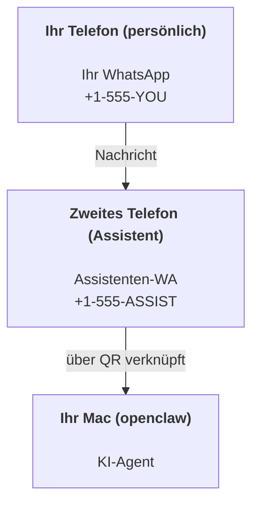

---
read_when:
    - Onboarding einer neuen Assistenteninstanz
    - Überprüfung der Auswirkungen auf Sicherheit und Berechtigungen
summary: End-to-End-Anleitung für die Verwendung von OpenClaw als persönlichem Assistenten mit Sicherheitshinweisen
title: Einrichtung des persönlichen Assistenten
x-i18n:
    generated_at: "2026-07-24T05:22:32Z"
    model: gpt-5.6
    postprocess_version: locale-links-v1
    prompt_version: 32
    provider: openai
    source_hash: b980045730bba1f2c411717954079ddf00c681d26bf64f55cb1b87a9fa951b03
    source_path: start/openclaw.md
    workflow: 16
---

OpenClaw ist ein selbst gehostetes Gateway, das Discord, Google Chat, iMessage, Matrix, Microsoft Teams, Signal, Slack, Telegram, WhatsApp, Zalo und weitere Dienste mit KI-Agenten verbindet. Dieser Leitfaden beschreibt die Einrichtung als „persönlicher Assistent“: eine dedizierte WhatsApp-Nummer, die sich wie Ihr ständig verfügbarer KI-Assistent verhält.

## Sicherheit zuerst

Wenn Sie einem Agenten einen Kanal bereitstellen, kann er dadurch Befehle auf Ihrem Computer ausführen (abhängig von Ihrer Tool-Richtlinie), Dateien in Ihrem Arbeitsbereich lesen und schreiben sowie Nachrichten über jeden verbundenen Kanal versenden. Beginnen Sie vorsichtig:

- Legen Sie immer `channels.whatsapp.allowFrom` fest (auf Ihrem persönlichen Mac niemals offen für die ganze Welt ausführen).
- Verwenden Sie für den Assistenten eine dedizierte WhatsApp-Nummer.
- Heartbeats werden standardmäßig alle 30 Minuten ausgeführt. Deaktivieren Sie sie, bis Sie der Einrichtung vertrauen, indem Sie `agents.defaults.heartbeat.every: "0m"` festlegen.

## Voraussetzungen

- OpenClaw ist installiert und eingerichtet – lesen Sie [Erste Schritte](/de/start/getting-started), falls Sie dies noch nicht erledigt haben
- Eine zweite Telefonnummer (SIM/eSIM/Prepaid) für den Assistenten

## Einrichtung mit zwei Telefonen (empfohlen)

Das gewünschte Ergebnis sieht so aus:



Wenn Sie Ihr persönliches WhatsApp mit OpenClaw verknüpfen, wird jede an Sie gerichtete Nachricht zur „Agenteneingabe“. Das ist nur selten erwünscht.

## Schnellstart in 5 Minuten

1. Koppeln Sie WhatsApp Web (ein QR-Code wird angezeigt; scannen Sie ihn mit dem Assistententelefon):

```bash
openclaw channels login
```

2. Starten Sie das Gateway (lassen Sie es weiterlaufen):

```bash
openclaw gateway --port 18789
```

3. Speichern Sie eine Minimalkonfiguration unter `~/.openclaw/openclaw.json`:

```json5
{
  gateway: { mode: "local" },
  channels: { whatsapp: { allowFrom: ["+15555550123"] } },
}
```

Senden Sie nun von Ihrem Telefon auf der Zulassungsliste eine Nachricht an die Assistentennummer.

Nach Abschluss der Einrichtung öffnet OpenClaw automatisch das Dashboard und gibt einen bereinigten Link (ohne Token) aus. Wenn das Dashboard zur Authentifizierung auffordert, fügen Sie das konfigurierte gemeinsame Geheimnis in die Einstellungen der Control UI ein. Die Einrichtung verwendet standardmäßig ein Token (`gateway.auth.token`), aber die Passwortauthentifizierung funktioniert ebenfalls, wenn Sie `gateway.auth.mode` auf `password` umgestellt haben. So öffnen Sie es später erneut: `openclaw dashboard`.

## Dem Agenten einen Arbeitsbereich geben (AGENTS)

OpenClaw liest Betriebsanweisungen und den „Speicher“ aus seinem Arbeitsbereichsverzeichnis.

Standardmäßig verwendet OpenClaw `~/.openclaw/workspace` als Arbeitsbereich des Agenten und erstellt ihn (einschließlich der anfänglichen Dateien `AGENTS.md`, `SOUL.md`, `TOOLS.md`, `IDENTITY.md`, `USER.md`) automatisch bei der Einrichtung oder beim ersten Agentenlauf. `BOOTSTRAP.md` wird nur für einen völlig neuen Arbeitsbereich erstellt und sollte nach dem Löschen nicht erneut erscheinen. `MEMORY.md` ist optional und wird niemals automatisch erstellt; wenn die Datei vorhanden ist, wird sie für normale Sitzungen geladen. In Sitzungen von Unteragenten werden nur `AGENTS.md` und `TOOLS.md` eingefügt.

<Tip>
Behandeln Sie diesen Ordner wie den Speicher von OpenClaw und machen Sie ihn zu einem Git-Repository (idealerweise privat), damit Ihre `AGENTS.md` und Speicherdateien gesichert werden. Wenn Git installiert ist, werden völlig neue Arbeitsbereiche automatisch mit `git init` initialisiert.
</Tip>

So erstellen Sie die Arbeitsbereichs- und Konfigurationsordner, ohne den vollständigen Einrichtungsassistenten auszuführen:

```bash
openclaw setup --baseline
```

(Die alleinige Angabe von `openclaw setup` ist ein Alias für `openclaw onboard` und führt den vollständigen interaktiven Assistenten aus.)

Vollständiges Arbeitsbereichslayout und Sicherungsleitfaden: [Agentenarbeitsbereich](/de/concepts/agent-workspace)
Speicher-Workflow: [Speicher](/de/concepts/memory)

Optional: Wählen Sie mit `agents.defaults.workspace` einen anderen Arbeitsbereich aus (unterstützt `~`).

```json5
{
  agents: {
    defaults: {
      workspace: "~/.openclaw/workspace",
    },
  },
}
```

Wenn Sie bereits eigene Arbeitsbereichsdateien aus einem Repository bereitstellen, können Sie die Erstellung der Bootstrap-Dateien vollständig deaktivieren:

```json5
{
  agents: {
    defaults: {
      skipBootstrap: true,
    },
  },
}
```

## Die Konfiguration, die daraus „einen Assistenten“ macht

OpenClaw bietet standardmäßig eine gute Assistentenkonfiguration, üblicherweise sollten Sie jedoch Folgendes anpassen:

- Persönlichkeit/Anweisungen in [`SOUL.md`](/de/concepts/soul)
- Standardeinstellungen für das Denken (falls gewünscht)
- Heartbeats (sobald Sie der Einrichtung vertrauen)

Beispiel:

```json5
{
  logging: { level: "info" },
  agents: {
    defaults: {
      model: { primary: "anthropic/claude-opus-4-8" },
      workspace: "~/.openclaw/workspace",
      thinkingDefault: "high",
      timeoutSeconds: 1800,
      // Start with 0; enable later.
      heartbeat: { every: "0m" },
    },
    list: [
      {
        id: "main",
        default: true,
        groupChat: {
          mentionPatterns: ["@openclaw", "openclaw"],
        },
      },
    ],
  },
  channels: {
    whatsapp: {
      allowFrom: ["+15555550123"],
      groups: {
        "*": { requireMention: true },
      },
    },
  },
  session: {
    scope: "per-sender",
    resetTriggers: ["/new", "/reset"],
    reset: {
      mode: "daily",
      atHour: 4,
      idleMinutes: 10080,
    },
  },
}
```

## Sitzungen und Speicher

- Sitzungszeilen, Transkriptzeilen und Metadaten (Token-Nutzung, letzte Route usw.): `~/.openclaw/agents/<agentId>/agent/openclaw-agent.sqlite`
- Veraltete/archivierte Transkriptartefakte: `~/.openclaw/agents/<agentId>/sessions/`
- Migrationsquelle für veraltete Zeilen: `~/.openclaw/agents/<agentId>/sessions/sessions.json`
- `/new` oder `/reset` startet für diesen Chat eine neue Sitzung (konfigurierbar über `session.resetTriggers`). Wenn der Befehl allein gesendet wird, bestätigt OpenClaw das Zurücksetzen, ohne das Modell aufzurufen.
- `/compact [instructions]` komprimiert den Sitzungskontext und meldet das verbleibende Kontextbudget.

## Heartbeats (proaktiver Modus)

Standardmäßig führt OpenClaw alle 30 Minuten einen Heartbeat mit folgender Eingabeaufforderung aus:
`Follow the heartbeat monitor scratch context when provided. Recurring tasks are cron jobs; create or change their schedules with cron tools or the openclaw cron CLI, not heartbeat scratch. Do not infer or repeat old tasks from prior chats. If nothing needs attention, reply HEARTBEAT_OK.`
Legen Sie zum Deaktivieren `agents.defaults.heartbeat.every: "0m"` fest. Heartbeat-Checklisten befinden sich im Cron-Arbeitsbereich des Monitors (siehe [Heartbeat](/de/gateway/heartbeat)); `openclaw doctor --fix` migriert eine veraltete Arbeitsbereichsdatei `HEARTBEAT.md` dorthin.

- Wenn der Monitor-Arbeitsbereich vorhanden, aber praktisch leer ist (nur Leerzeilen, Markdown-/HTML-Kommentare, Markdown-Überschriften wie `# Heading`, Codezaun-Markierungen oder leere Checklisten-Platzhalter), überspringt OpenClaw den Heartbeat-Lauf, um API-Aufrufe zu sparen.
- Wenn kein Arbeitsbereich vorhanden ist, wird der Heartbeat dennoch ausgeführt und das Modell entscheidet, was zu tun ist.
- Wenn der Agent mit `HEARTBEAT_OK` antwortet (optional mit kurzem Fülltext; siehe `agents.defaults.heartbeat.ackMaxChars`), unterdrückt OpenClaw für diesen Heartbeat die ausgehende Zustellung.
- Standardmäßig ist die Heartbeat-Zustellung an DM-ähnliche `user:<id>`-Ziele zulässig. Legen Sie `agents.defaults.heartbeat.directPolicy: "block"` fest, um die Zustellung an direkte Ziele zu unterdrücken, während die Heartbeat-Läufe aktiv bleiben.
- Heartbeats führen vollständige Agentendurchläufe aus – kürzere Intervalle verbrauchen mehr Token.

```json5
{
  agents: {
    defaults: {
      heartbeat: { every: "30m" },
    },
  },
}
```

## Ein- und ausgehende Medien

Eingehende Anhänge (Bilder/Audio/Dokumente) können Ihrem Befehl über Vorlagen bereitgestellt werden:

- `{{MediaPath}}` (lokaler Pfad einer temporären Datei)
- `{{MediaUrl}}` (Pseudo-URL)
- `{{Transcript}}` (wenn die Audiotranskription aktiviert ist)

Ausgehende Anhänge des Agenten verwenden strukturierte Medienfelder im Nachrichten-Tool oder in der Antwortnutzlast, beispielsweise `media`, `mediaUrl`, `mediaUrls`, `path` oder `filePath`. Beispielargumente für das Nachrichten-Tool:

```json
{
  "message": "Here's the screenshot.",
  "mediaUrl": "https://example.com/screenshot.png"
}
```

OpenClaw sendet strukturierte Medien zusammen mit dem Text. Veraltete abschließende Assistentenantworten können aus Kompatibilitätsgründen weiterhin normalisiert werden, aber Tool-Ausgaben, Browserausgaben, Streaming-Blöcke und Nachrichtenaktionen interpretieren Text nicht als Anhangsbefehle.

Das Verhalten lokaler Pfade folgt demselben Vertrauensmodell für Dateizugriffe wie der Agent:

- Wenn `tools.fs.workspaceOnly` auf `true` gesetzt ist, bleiben ausgehende lokale Medienpfade auf das temporäre Stammverzeichnis von OpenClaw, den Mediencache, die Arbeitsbereichspfade des Agenten und in der Sandbox erzeugte Dateien beschränkt.
- Wenn `tools.fs.workspaceOnly` auf `false` gesetzt ist, können ausgehende lokale Medien Dateien auf dem Host verwenden, die der Agent bereits lesen darf.
- Lokale Pfade können absolut, relativ zum Arbeitsbereich oder mit `~/` relativ zum Benutzerverzeichnis angegeben werden.
- Beim Senden hostlokaler Dateien sind weiterhin nur Medien und sichere Dokumenttypen zulässig (Bilder, Audio, Video, PDF, Office-Dokumente und validierte Textdokumente wie Markdown/MD, TXT, JSON, YAML und YML). Dies ist eine Erweiterung der bestehenden Vertrauensgrenze für Host-Lesezugriffe und kein Scanner für Geheimnisse: Wenn der Agent eine hostlokale Datei `secret.txt` oder `config.json` lesen kann, kann er diese Datei anhängen, sofern Dateiendung und Inhaltsvalidierung übereinstimmen.

Bewahren Sie vertrauliche Dateien außerhalb des für den Agenten lesbaren Dateisystems auf oder verwenden Sie weiterhin `tools.fs.workspaceOnly: true`, um strengere Regeln für das Senden lokaler Pfade anzuwenden.

## Betriebscheckliste

```bash
openclaw status          # local status (creds, sessions, queued events)
openclaw status --all    # full diagnosis (read-only, pasteable)
openclaw status --deep   # probe channels (WhatsApp Web + Telegram + Discord + Slack + Signal)
openclaw health --json   # gateway health snapshot over the WS connection
```

Protokolle befinden sich unter `/tmp/openclaw/`: `openclaw-YYYY-MM-DD.log` für das Standardprofil und `openclaw-<profile>-YYYY-MM-DD.log` für benannte Profile.

## Nächste Schritte

- WebChat: [WebChat](/de/web/webchat)
- Gateway-Betrieb: [Gateway-Betriebshandbuch](/de/gateway)
- Cron und Aktivierungen: [Cron-Aufträge](/de/automation/cron-jobs)
- Begleitprogramm für die macOS-Menüleiste: [OpenClaw-macOS-App](/de/platforms/macos)
- iOS-Node-App: [iOS-App](/de/platforms/ios)
- Android-Node-App: [Android-App](/de/platforms/android)
- Windows-Hub: [Windows](/de/platforms/windows)
- Linux-Status: [Linux-App](/de/platforms/linux)
- Sicherheit: [Sicherheit](/de/gateway/security)

## Verwandte Themen

- [Erste Schritte](/de/start/getting-started)
- [Einrichtung](/de/start/setup)
- [Kanalübersicht](/de/channels)
