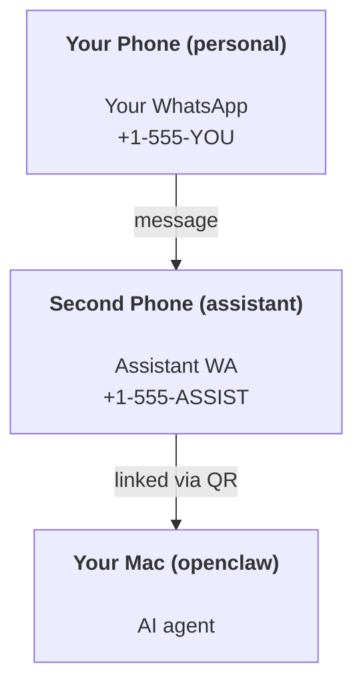

---
read_when:
    - Onboarding einer neuen Assistenteninstanz
    - Prüfen der Auswirkungen auf Sicherheit und Berechtigungen
summary: End-to-End-Anleitung zum Ausführen von OpenClaw als persönlichen Assistenten mit Sicherheitshinweisen
title: Einrichtung des persönlichen Assistenten
x-i18n:
    generated_at: "2026-04-30T07:15:35Z"
    model: gpt-5.5
    provider: openai
    source_hash: b0614272f9a2b30e0900c55b39a8bd6a2b71b9f5d5fbf0fe00c534b91193e6a0
    source_path: start/openclaw.md
    workflow: 16
---

# Einen persönlichen Assistenten mit OpenClaw erstellen

OpenClaw ist ein selbst gehostetes Gateway, das Discord, Google Chat, iMessage, Matrix, Microsoft Teams, Signal, Slack, Telegram, WhatsApp, Zalo und weitere Kanäle mit KI-Agenten verbindet. Dieser Leitfaden behandelt die Einrichtung als „persönlicher Assistent“: eine dedizierte WhatsApp-Nummer, die sich wie Ihr stets aktiver KI-Assistent verhält.

## ⚠️ Sicherheit zuerst

Sie versetzen einen Agenten in die Lage:

- Befehle auf Ihrem Rechner auszuführen (abhängig von Ihrer Tool-Richtlinie)
- Dateien in Ihrem Workspace zu lesen/zu schreiben
- Nachrichten über WhatsApp/Telegram/Discord/Mattermost und andere gebündelte Kanäle zurückzusenden

Beginnen Sie konservativ:

- Setzen Sie immer `channels.whatsapp.allowFrom` (betreiben Sie Ihren persönlichen Mac niemals offen für die ganze Welt).
- Verwenden Sie eine dedizierte WhatsApp-Nummer für den Assistenten.
- Heartbeats werden jetzt standardmäßig alle 30 Minuten ausgeführt. Deaktivieren Sie sie, bis Sie der Einrichtung vertrauen, indem Sie `agents.defaults.heartbeat.every: "0m"` setzen.

## Voraussetzungen

- OpenClaw ist installiert und eingerichtet — siehe [Erste Schritte](/de/start/getting-started), falls Sie dies noch nicht erledigt haben
- Eine zweite Telefonnummer (SIM/eSIM/Prepaid) für den Assistenten

## Die Zwei-Telefon-Einrichtung (empfohlen)

Sie möchten Folgendes:



Wenn Sie Ihr persönliches WhatsApp mit OpenClaw verknüpfen, wird jede Nachricht an Sie zu „Agent-Eingabe“. Das ist selten das, was Sie möchten.

## 5-Minuten-Schnellstart

1. Koppeln Sie WhatsApp Web (zeigt QR an; scannen Sie ihn mit dem Assistenten-Telefon):

```bash
openclaw channels login
```

2. Starten Sie das Gateway (laufen lassen):

```bash
openclaw gateway --port 18789
```

3. Legen Sie eine minimale Konfiguration in `~/.openclaw/openclaw.json` ab:

```json5
{
  gateway: { mode: "local" },
  channels: { whatsapp: { allowFrom: ["+15555550123"] } },
}
```

Senden Sie nun von Ihrem zugelassenen Telefon eine Nachricht an die Assistenten-Nummer.

Wenn das Onboarding abgeschlossen ist, öffnet OpenClaw automatisch das Dashboard und gibt einen sauberen (nicht tokenisierten) Link aus. Wenn das Dashboard zur Authentifizierung auffordert, fügen Sie das konfigurierte gemeinsame Secret in die Control-UI-Einstellungen ein. Onboarding verwendet standardmäßig ein Token (`gateway.auth.token`), aber Passwortauthentifizierung funktioniert ebenfalls, wenn Sie `gateway.auth.mode` auf `password` umgestellt haben. Später erneut öffnen: `openclaw dashboard`.

## Dem Agenten einen Workspace geben (AGENTS)

OpenClaw liest Betriebsanweisungen und „Memory“ aus seinem Workspace-Verzeichnis.

Standardmäßig verwendet OpenClaw `~/.openclaw/workspace` als Agent-Workspace und erstellt ihn (plus Starterdateien `AGENTS.md`, `SOUL.md`, `TOOLS.md`, `IDENTITY.md`, `USER.md`, `HEARTBEAT.md`) automatisch bei der Einrichtung bzw. beim ersten Agent-Lauf. `BOOTSTRAP.md` wird nur erstellt, wenn der Workspace ganz neu ist (sie sollte nach dem Löschen nicht wieder auftauchen). `MEMORY.md` ist optional (wird nicht automatisch erstellt); wenn vorhanden, wird sie für normale Sitzungen geladen. Subagent-Sitzungen injizieren nur `AGENTS.md` und `TOOLS.md`.

<Tip>
Behandeln Sie diesen Ordner wie das Memory von OpenClaw und machen Sie ihn zu einem Git-Repository (idealerweise privat), damit Ihre `AGENTS.md` und Memory-Dateien gesichert sind. Wenn Git installiert ist, werden brandneue Workspaces automatisch initialisiert.
</Tip>

```bash
openclaw setup
```

Vollständiges Workspace-Layout + Backup-Leitfaden: [Agent-Workspace](/de/concepts/agent-workspace)
Memory-Workflow: [Memory](/de/concepts/memory)

Optional: Wählen Sie mit `agents.defaults.workspace` einen anderen Workspace (unterstützt `~`).

```json5
{
  agents: {
    defaults: {
      workspace: "~/.openclaw/workspace",
    },
  },
}
```

Wenn Sie Ihre eigenen Workspace-Dateien bereits aus einem Repository ausliefern, können Sie die Erstellung von Bootstrap-Dateien vollständig deaktivieren:

```json5
{
  agents: {
    defaults: {
      skipBootstrap: true,
    },
  },
}
```

## Die Konfiguration, die daraus „einen Assistenten“ macht

OpenClaw hat standardmäßig eine gute Assistenten-Einrichtung, aber üblicherweise möchten Sie Folgendes anpassen:

- Persona/Anweisungen in [`SOUL.md`](/de/concepts/soul)
- Denk-Standardwerte (falls gewünscht)
- Heartbeats (sobald Sie ihnen vertrauen)

Beispiel:

```json5
{
  logging: { level: "info" },
  agent: {
    model: "anthropic/claude-opus-4-6",
    workspace: "~/.openclaw/workspace",
    thinkingDefault: "high",
    timeoutSeconds: 1800,
    // Start with 0; enable later.
    heartbeat: { every: "0m" },
  },
  channels: {
    whatsapp: {
      allowFrom: ["+15555550123"],
      groups: {
        "*": { requireMention: true },
      },
    },
  },
  routing: {
    groupChat: {
      mentionPatterns: ["@openclaw", "openclaw"],
    },
  },
  session: {
    scope: "per-sender",
    resetTriggers: ["/new", "/reset"],
    reset: {
      mode: "daily",
      atHour: 4,
      idleMinutes: 10080,
    },
  },
}
```

## Sitzungen und Memory

- Sitzungsdateien: `~/.openclaw/agents/<agentId>/sessions/{{SessionId}}.jsonl`
- Sitzungsmetadaten (Token-Nutzung, letzte Route usw.): `~/.openclaw/agents/<agentId>/sessions/sessions.json` (Legacy: `~/.openclaw/sessions/sessions.json`)
- `/new` oder `/reset` startet eine neue Sitzung für diesen Chat (konfigurierbar über `resetTriggers`). Wenn allein gesendet, bestätigt OpenClaw das Zurücksetzen, ohne das Modell aufzurufen.
- `/compact [instructions]` komprimiert den Sitzungskontext und meldet das verbleibende Kontextbudget.

## Heartbeats (proaktiver Modus)

Standardmäßig führt OpenClaw alle 30 Minuten einen Heartbeat mit folgendem Prompt aus:
`Read HEARTBEAT.md if it exists (workspace context). Follow it strictly. Do not infer or repeat old tasks from prior chats. If nothing needs attention, reply HEARTBEAT_OK.`
Setzen Sie `agents.defaults.heartbeat.every: "0m"`, um dies zu deaktivieren.

- Wenn `HEARTBEAT.md` existiert, aber faktisch leer ist (nur Leerzeilen und Markdown-Überschriften wie `# Heading`), überspringt OpenClaw den Heartbeat-Lauf, um API-Aufrufe zu sparen.
- Wenn die Datei fehlt, läuft der Heartbeat trotzdem und das Modell entscheidet, was zu tun ist.
- Wenn der Agent mit `HEARTBEAT_OK` antwortet (optional mit kurzem Zusatz; siehe `agents.defaults.heartbeat.ackMaxChars`), unterdrückt OpenClaw die ausgehende Zustellung für diesen Heartbeat.
- Standardmäßig ist die Heartbeat-Zustellung an DM-artige Ziele `user:<id>` erlaubt. Setzen Sie `agents.defaults.heartbeat.directPolicy: "block"`, um die Zustellung an direkte Ziele zu unterdrücken, während Heartbeat-Läufe aktiv bleiben.
- Heartbeats führen vollständige Agent-Durchläufe aus — kürzere Intervalle verbrauchen mehr Tokens.

```json5
{
  agent: {
    heartbeat: { every: "30m" },
  },
}
```

## Medien hinein und hinaus

Eingehende Anhänge (Bilder/Audio/Dokumente) können Ihrem Befehl über Vorlagen bereitgestellt werden:

- `{{MediaPath}}` (lokaler temporärer Dateipfad)
- `{{MediaUrl}}` (Pseudo-URL)
- `{{Transcript}}` (wenn Audiotranskription aktiviert ist)

Ausgehende Anhänge vom Agenten: Fügen Sie `MEDIA:<path-or-url>` in einer eigenen Zeile ein (keine Leerzeichen). Beispiel:

```
Here’s the screenshot.
MEDIA:https://example.com/screenshot.png
```

OpenClaw extrahiert diese und sendet sie zusammen mit dem Text als Medien.

Das Verhalten lokaler Pfade folgt demselben Vertrauensmodell für Dateilesezugriffe wie der Agent:

- Wenn `tools.fs.workspaceOnly` `true` ist, bleiben ausgehende lokale `MEDIA:`-Pfade auf das temporäre OpenClaw-Root, den Mediencache, Agent-Workspace-Pfade und von der Sandbox erzeugte Dateien beschränkt.
- Wenn `tools.fs.workspaceOnly` `false` ist, kann ausgehendes `MEDIA:` host-lokale Dateien verwenden, die der Agent bereits lesen darf.
- Host-lokales Senden erlaubt weiterhin nur Medien und sichere Dokumenttypen (Bilder, Audio, Video, PDF und Office-Dokumente). Klartextdateien und Dateien, die wie Secrets wirken, werden nicht als sendbare Medien behandelt.

Das bedeutet, dass generierte Bilder/Dateien außerhalb des Workspace jetzt gesendet werden können, wenn Ihre Dateisystemrichtlinie diese Lesezugriffe bereits erlaubt, ohne beliebige hostseitige Textanhänge erneut für Exfiltration zu öffnen.

## Betriebscheckliste

```bash
openclaw status          # local status (creds, sessions, queued events)
openclaw status --all    # full diagnosis (read-only, pasteable)
openclaw status --deep   # asks the gateway for a live health probe with channel probes when supported
openclaw health --json   # gateway health snapshot (WS; default can return a fresh cached snapshot)
```

Logs liegen unter `/tmp/openclaw/` (Standard: `openclaw-YYYY-MM-DD.log`).

## Nächste Schritte

- WebChat: [WebChat](/de/web/webchat)
- Gateway-Betrieb: [Gateway-Runbook](/de/gateway)
- Cron + Wakeups: [Cron-Jobs](/de/automation/cron-jobs)
- macOS-Menüleistenbegleiter: [OpenClaw-macOS-App](/de/platforms/macos)
- iOS-Node-App: [iOS-App](/de/platforms/ios)
- Android-Node-App: [Android-App](/de/platforms/android)
- Windows-Status: [Windows (WSL2)](/de/platforms/windows)
- Linux-Status: [Linux-App](/de/platforms/linux)
- Sicherheit: [Sicherheit](/de/gateway/security)

## Verwandt

- [Erste Schritte](/de/start/getting-started)
- [Einrichtung](/de/start/setup)
- [Kanalübersicht](/de/channels)
