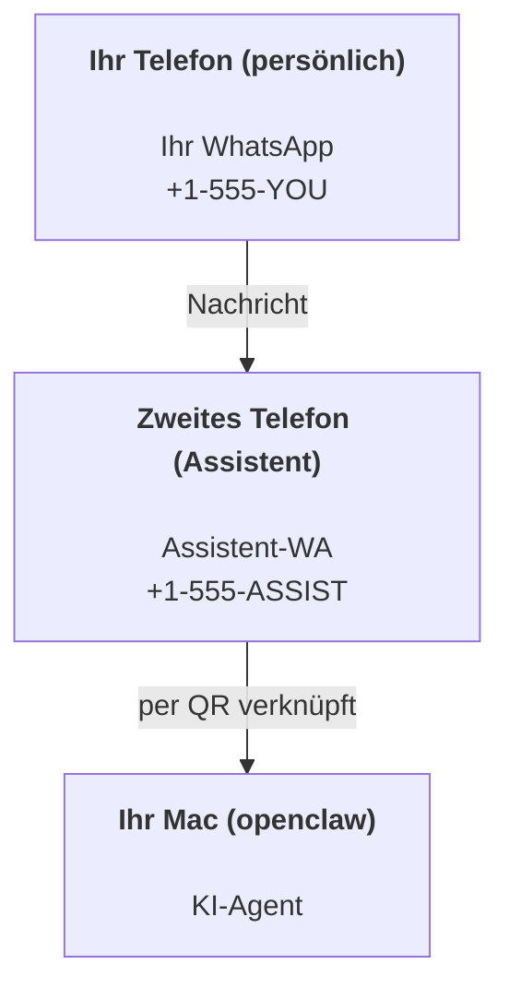

---
read_when:
    - Einrichten einer neuen Assistenteninstanz
    - Überprüfung der Sicherheits-/Berechtigungsauswirkungen
summary: End-to-End-Anleitung zum Ausführen von OpenClaw als persönlicher Assistent mit Sicherheitshinweisen
title: Einrichtung als persönlicher Assistent
x-i18n:
    generated_at: "2026-04-25T13:56:51Z"
    model: gpt-5.4
    provider: openai
    source_hash: 1647b78e8cf23a3a025969c52fbd8a73aed78df27698abf36bbf62045dc30e3b
    source_path: start/openclaw.md
    workflow: 15
---

# Einen persönlichen Assistenten mit OpenClaw erstellen

OpenClaw ist ein selbst gehostetes Gateway, das Discord, Google Chat, iMessage, Matrix, Microsoft Teams, Signal, Slack, Telegram, WhatsApp, Zalo und mehr mit KI-Agenten verbindet. Dieser Leitfaden behandelt die Einrichtung als „persönlicher Assistent“: eine dedizierte WhatsApp-Nummer, die sich wie Ihr immer aktiver KI-Assistent verhält.

## ⚠️ Sicherheit zuerst

Sie versetzen einen Agenten in die Lage:

- Befehle auf Ihrem Rechner auszuführen (abhängig von Ihrer Tool-Richtlinie)
- Dateien in Ihrem Workspace zu lesen und zu schreiben
- Nachrichten über WhatsApp/Telegram/Discord/Mattermost und andere mitgelieferte Kanäle wieder nach außen zu senden

Beginnen Sie konservativ:

- Setzen Sie immer `channels.whatsapp.allowFrom` (betreiben Sie das niemals weltweit offen auf Ihrem persönlichen Mac).
- Verwenden Sie für den Assistenten eine dedizierte WhatsApp-Nummer.
- Heartbeats sind jetzt standardmäßig auf alle 30 Minuten gesetzt. Deaktivieren Sie sie, bis Sie der Einrichtung vertrauen, indem Sie `agents.defaults.heartbeat.every: "0m"` setzen.

## Voraussetzungen

- OpenClaw installiert und eingerichtet — siehe [Erste Schritte](/de/start/getting-started), falls Sie das noch nicht getan haben
- Eine zweite Telefonnummer (SIM/eSIM/Prepaid) für den Assistenten

## Die Zwei-Telefon-Einrichtung (empfohlen)

Sie möchten Folgendes:



Wenn Sie Ihr persönliches WhatsApp mit OpenClaw verknüpfen, wird jede Nachricht an Sie zu „Agenteneingabe“. Das ist selten das, was Sie möchten.

## Schnellstart in 5 Minuten

1. WhatsApp Web koppeln (zeigt einen QR-Code an; mit dem Assistenten-Telefon scannen):

```bash
openclaw channels login
```

2. Das Gateway starten (laufen lassen):

```bash
openclaw gateway --port 18789
```

3. Eine minimale Konfiguration in `~/.openclaw/openclaw.json` anlegen:

```json5
{
  gateway: { mode: "local" },
  channels: { whatsapp: { allowFrom: ["+15555550123"] } },
}
```

Senden Sie jetzt von Ihrem auf der Allowlist stehenden Telefon eine Nachricht an die Assistenten-Nummer.

Wenn das Onboarding abgeschlossen ist, öffnet OpenClaw automatisch das Dashboard und gibt einen sauberen Link (ohne Token) aus. Wenn das Dashboard zur Authentifizierung auffordert, fügen Sie das konfigurierte Shared Secret in die Control UI-Einstellungen ein. Das Onboarding verwendet standardmäßig ein Token (`gateway.auth.token`), aber Passwort-Authentifizierung funktioniert ebenfalls, wenn Sie `gateway.auth.mode` auf `password` umgestellt haben. Zum späteren erneuten Öffnen: `openclaw dashboard`.

## Dem Agenten einen Workspace geben (AGENTS)

OpenClaw liest Betriebsanweisungen und „Speicher“ aus seinem Workspace-Verzeichnis.

Standardmäßig verwendet OpenClaw `~/.openclaw/workspace` als Agent-Workspace und erstellt diesen (plus die initialen Dateien `AGENTS.md`, `SOUL.md`, `TOOLS.md`, `IDENTITY.md`, `USER.md`, `HEARTBEAT.md`) bei der Einrichtung bzw. beim ersten Agentenlauf automatisch. `BOOTSTRAP.md` wird nur erstellt, wenn der Workspace ganz neu ist (sie sollte nicht wieder erscheinen, nachdem Sie sie gelöscht haben). `MEMORY.md` ist optional (wird nicht automatisch erstellt); wenn vorhanden, wird sie für normale Sitzungen geladen. Subagent-Sitzungen injizieren nur `AGENTS.md` und `TOOLS.md`.

Tipp: Behandeln Sie diesen Ordner wie den „Speicher“ von OpenClaw und machen Sie ihn zu einem Git-Repository (idealerweise privat), damit Ihre `AGENTS.md`- und Speicherdateien gesichert sind. Wenn Git installiert ist, werden ganz neue Workspaces automatisch initialisiert.

```bash
openclaw setup
```

Vollständiges Workspace-Layout + Leitfaden zur Sicherung: [Agent workspace](/de/concepts/agent-workspace)  
Speicher-Workflow: [Memory](/de/concepts/memory)

Optional: Wählen Sie mit `agents.defaults.workspace` einen anderen Workspace (unterstützt `~`).

```json5
{
  agents: {
    defaults: {
      workspace: "~/.openclaw/workspace",
    },
  },
}
```

Wenn Sie bereits eigene Workspace-Dateien aus einem Repository bereitstellen, können Sie die Erstellung von Bootstrap-Dateien vollständig deaktivieren:

```json5
{
  agents: {
    defaults: {
      skipBootstrap: true,
    },
  },
}
```

## Die Konfiguration, die daraus „einen Assistenten“ macht

OpenClaw verwendet standardmäßig eine gute Assistenten-Konfiguration, aber in der Regel möchten Sie Folgendes anpassen:

- Persona/Anweisungen in [`SOUL.md`](/de/concepts/soul)
- Standardwerte für Thinking (falls gewünscht)
- Heartbeats (sobald Sie ihm vertrauen)

Beispiel:

```json5
{
  logging: { level: "info" },
  agent: {
    model: "anthropic/claude-opus-4-6",
    workspace: "~/.openclaw/workspace",
    thinkingDefault: "high",
    timeoutSeconds: 1800,
    // Mit 0 beginnen; später aktivieren.
    heartbeat: { every: "0m" },
  },
  channels: {
    whatsapp: {
      allowFrom: ["+15555550123"],
      groups: {
        "*": { requireMention: true },
      },
    },
  },
  routing: {
    groupChat: {
      mentionPatterns: ["@openclaw", "openclaw"],
    },
  },
  session: {
    scope: "per-sender",
    resetTriggers: ["/new", "/reset"],
    reset: {
      mode: "daily",
      atHour: 4,
      idleMinutes: 10080,
    },
  },
}
```

## Sitzungen und Speicher

- Sitzungsdateien: `~/.openclaw/agents/<agentId>/sessions/{{SessionId}}.jsonl`
- Sitzungsmetadaten (Token-Nutzung, letzte Route usw.): `~/.openclaw/agents/<agentId>/sessions/sessions.json` (Altbestand: `~/.openclaw/sessions/sessions.json`)
- `/new` oder `/reset` startet eine neue Sitzung für diesen Chat (konfigurierbar über `resetTriggers`). Wenn der Befehl allein gesendet wird, antwortet der Agent mit einer kurzen Begrüßung, um das Zurücksetzen zu bestätigen.
- `/compact [instructions]` führt eine Compaction des Sitzungskontexts durch und meldet das verbleibende Kontextbudget.

## Heartbeats (proaktiver Modus)

Standardmäßig führt OpenClaw alle 30 Minuten einen Heartbeat mit dem Prompt aus:  
`Read HEARTBEAT.md if it exists (workspace context). Follow it strictly. Do not infer or repeat old tasks from prior chats. If nothing needs attention, reply HEARTBEAT_OK.`  
Setzen Sie `agents.defaults.heartbeat.every: "0m"`, um dies zu deaktivieren.

- Wenn `HEARTBEAT.md` vorhanden, aber praktisch leer ist (nur Leerzeilen und Markdown-Überschriften wie `# Heading`), überspringt OpenClaw den Heartbeat-Lauf, um API-Aufrufe zu sparen.
- Wenn die Datei fehlt, läuft der Heartbeat trotzdem und das Modell entscheidet, was zu tun ist.
- Wenn der Agent mit `HEARTBEAT_OK` antwortet (optional mit kurzem Auffülltext; siehe `agents.defaults.heartbeat.ackMaxChars`), unterdrückt OpenClaw die ausgehende Zustellung für diesen Heartbeat.
- Standardmäßig ist die Heartbeat-Zustellung an DM-artige `user:<id>`-Ziele erlaubt. Setzen Sie `agents.defaults.heartbeat.directPolicy: "block"`, um die Zustellung an direkte Ziele zu unterdrücken, während Heartbeat-Läufe aktiv bleiben.
- Heartbeats führen vollständige Agenten-Turns aus — kürzere Intervalle verbrauchen mehr Tokens.

```json5
{
  agent: {
    heartbeat: { every: "30m" },
  },
}
```

## Medien ein- und ausgehend

Eingehende Anhänge (Bilder/Audio/Dokumente) können über Templates an Ihren Befehl übergeben werden:

- `{{MediaPath}}` (lokaler temporärer Dateipfad)
- `{{MediaUrl}}` (Pseudo-URL)
- `{{Transcript}}` (wenn Audio-Transkription aktiviert ist)

Ausgehende Anhänge vom Agenten: Fügen Sie `MEDIA:<path-or-url>` in einer eigenen Zeile ein (ohne Leerzeichen). Beispiel:

```
Hier ist der Screenshot.
MEDIA:https://example.com/screenshot.png
```

OpenClaw extrahiert dies und sendet es zusammen mit dem Text als Medien.

Das Verhalten bei lokalen Pfaden folgt demselben Vertrauensmodell für Dateizugriffe wie beim Agenten:

- Wenn `tools.fs.workspaceOnly` auf `true` gesetzt ist, bleiben ausgehende lokale `MEDIA:`-Pfade auf das OpenClaw-Temp-Root, den Medien-Cache, Agent-Workspace-Pfade und in der Sandbox erzeugte Dateien beschränkt.
- Wenn `tools.fs.workspaceOnly` auf `false` gesetzt ist, kann ausgehendes `MEDIA:` host-lokale Dateien verwenden, die der Agent ohnehin lesen darf.
- Beim Senden host-lokaler Dateien sind weiterhin nur Medien und sichere Dokumenttypen erlaubt (Bilder, Audio, Video, PDF und Office-Dokumente). Klartext- und geheimnisähnliche Dateien werden nicht als sendbare Medien behandelt.

Das bedeutet, dass erzeugte Bilder/Dateien außerhalb des Workspace jetzt gesendet werden können, wenn Ihre fs-Richtlinie diese Lesezugriffe bereits erlaubt, ohne beliebige Exfiltration von Host-Textanhängen erneut zu öffnen.

## Checkliste für den Betrieb

```bash
openclaw status          # lokaler Status (Anmeldedaten, Sitzungen, eingereihte Ereignisse)
openclaw status --all    # vollständige Diagnose (schreibgeschützt, zum Einfügen geeignet)
openclaw status --deep   # fordert beim Gateway eine Live-Zustandsprüfung mit Kanalprüfungen an, wenn unterstützt
openclaw health --json   # Gateway-Zustands-Snapshot (WS; Standard kann einen frischen zwischengespeicherten Snapshot zurückgeben)
```

Logs befinden sich unter `/tmp/openclaw/` (Standard: `openclaw-YYYY-MM-DD.log`).

## Nächste Schritte

- WebChat: [WebChat](/de/web/webchat)
- Gateway-Betrieb: [Gateway runbook](/de/gateway)
- Cron + Weckvorgänge: [Cron jobs](/de/automation/cron-jobs)
- macOS-Menüleistenbegleiter: [OpenClaw macOS app](/de/platforms/macos)
- iOS-Node-App: [iOS app](/de/platforms/ios)
- Android-Node-App: [Android app](/de/platforms/android)
- Windows-Status: [Windows (WSL2)](/de/platforms/windows)
- Linux-Status: [Linux app](/de/platforms/linux)
- Sicherheit: [Security](/de/gateway/security)

## Verwandt

- [Erste Schritte](/de/start/getting-started)
- [Setup](/de/start/setup)
- [Kanalübersicht](/de/channels)
