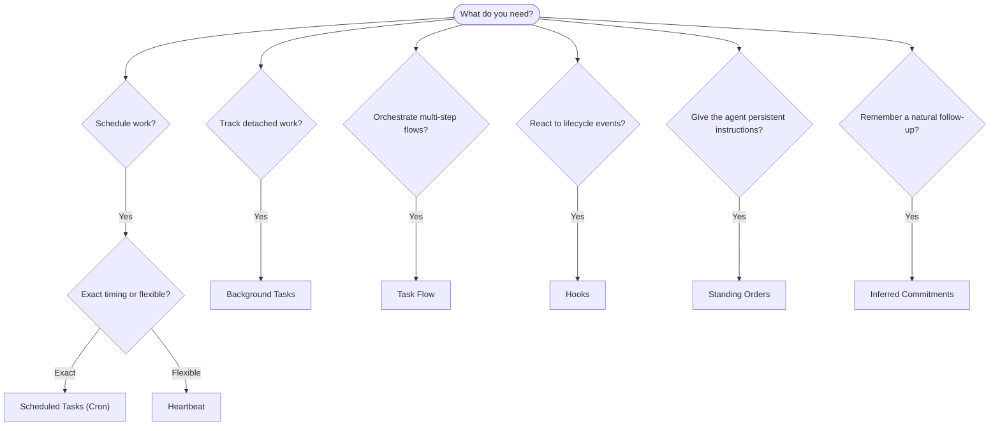

---
read_when:
    - Decidir cómo automatizar el trabajo con OpenClaw
    - Elegir entre Heartbeat, Cron, compromisos, ganchos y órdenes permanentes
    - Buscando el punto de entrada de automatización adecuado
summary: 'Descripción general de los mecanismos de automatización: tareas, cron, hooks, órdenes permanentes y Task Flow'
title: Automatización y tareas
x-i18n:
    generated_at: "2026-04-30T05:27:10Z"
    model: gpt-5.5
    provider: openai
    source_hash: a2465c39f21db8bcb98f980a2c4b2c03018dddd5f43de59d8bf6ce0d6e97d9ef
    source_path: automation/index.md
    workflow: 16
---

OpenClaw ejecuta trabajo en segundo plano mediante tareas, trabajos programados, compromisos inferidos, hooks de eventos e instrucciones permanentes. Esta página te ayuda a elegir el mecanismo correcto y a entender cómo encajan entre sí.

## Guía rápida de decisión

| Caso de uso                                      | Recomendado            | Por qué                                                 |
| ------------------------------------------------ | ---------------------- | ------------------------------------------------------- |
| Enviar un informe diario a las 9 AM en punto     | Scheduled Tasks (Cron) | Temporización exacta, ejecución aislada                 |
| Recuérdame en 20 minutos                         | Scheduled Tasks (Cron) | Ejecución única con temporización precisa (`--at`)      |
| Ejecutar análisis profundo semanal               | Scheduled Tasks (Cron) | Tarea independiente, puede usar otro modelo             |
| Revisar la bandeja de entrada cada 30 min        | Heartbeat              | Agrupa con otras comprobaciones, consciente del contexto |
| Supervisar el calendario para eventos próximos   | Heartbeat              | Encaje natural para conciencia periódica                |
| Hacer seguimiento tras una entrevista mencionada | Inferred Commitments   | Seguimiento tipo memoria, sin solicitud de recordatorio exacto |
| Contacto amable tras contexto del usuario        | Inferred Commitments   | Limitado al mismo agente y canal                        |
| Inspeccionar el estado de un subagente o ejecución ACP | Background Tasks       | El registro de tareas sigue todo el trabajo desacoplado |
| Auditar qué se ejecutó y cuándo                  | Background Tasks       | `openclaw tasks list` y `openclaw tasks audit`          |
| Investigación de varios pasos y luego resumen    | Task Flow              | Orquestación duradera con seguimiento de revisiones     |
| Ejecutar un script al restablecer la sesión      | Hooks                  | Basado en eventos, se dispara con eventos del ciclo de vida |
| Ejecutar código en cada llamada de herramienta   | Plugin hooks           | Los hooks en proceso pueden interceptar llamadas de herramientas |
| Comprobar siempre el cumplimiento antes de responder | Standing Orders        | Se inyecta automáticamente en cada sesión               |

### Scheduled Tasks (Cron) frente a Heartbeat

| Dimensión        | Scheduled Tasks (Cron)              | Heartbeat                             |
| ---------------- | ----------------------------------- | ------------------------------------- |
| Temporización    | Exacta (expresiones cron, ejecución única) | Aproximada (por defecto cada 30 min) |
| Contexto de sesión | Nuevo (aislado) o compartido      | Contexto completo de la sesión principal |
| Registros de tareas | Siempre se crean                 | Nunca se crean                        |
| Entrega          | Canal, webhook o silenciosa         | En línea en la sesión principal       |
| Ideal para       | Informes, recordatorios, trabajos en segundo plano | Revisiones de bandeja de entrada, calendario, notificaciones |

Usa Scheduled Tasks (Cron) cuando necesites temporización precisa o ejecución aislada. Usa Heartbeat cuando el trabajo se beneficie del contexto completo de la sesión y una temporización aproximada sea suficiente.

## Conceptos principales

### Tareas programadas (cron)

Cron es el programador integrado del Gateway para temporización precisa. Persiste trabajos, despierta al agente en el momento correcto y puede entregar la salida a un canal de chat o endpoint webhook. Admite recordatorios de ejecución única, expresiones recurrentes y disparadores webhook entrantes.

Consulta [Scheduled Tasks](/es/automation/cron-jobs).

### Tareas

El registro de tareas en segundo plano sigue todo el trabajo desacoplado: ejecuciones ACP, creación de subagentes, ejecuciones cron aisladas y operaciones de CLI. Las tareas son registros, no programadores. Usa `openclaw tasks list` y `openclaw tasks audit` para inspeccionarlas.

Consulta [Background Tasks](/es/automation/tasks).

### Compromisos inferidos

Los compromisos son memorias de seguimiento optativas y de corta duración. OpenClaw los infiere a partir de conversaciones normales, los limita al mismo agente y canal, y entrega los contactos pendientes mediante Heartbeat. Los recordatorios exactos solicitados por el usuario siguen perteneciendo a cron.

Consulta [Inferred Commitments](/es/concepts/commitments).

### Task Flow

Task Flow es el sustrato de orquestación de flujos por encima de las tareas en segundo plano. Gestiona flujos duraderos de varios pasos con modos de sincronización gestionados y reflejados, seguimiento de revisiones y `openclaw tasks flow list|show|cancel` para inspección.

Consulta [Task Flow](/es/automation/taskflow).

### Standing orders

Las standing orders otorgan al agente autoridad operativa permanente para programas definidos. Viven en archivos del espacio de trabajo (normalmente `AGENTS.md`) y se inyectan en cada sesión. Combínalas con cron para aplicación basada en tiempo.

Consulta [Standing Orders](/es/automation/standing-orders).

### Hooks

Los hooks internos son scripts basados en eventos activados por eventos del ciclo de vida del agente (`/new`, `/reset`, `/stop`), Compaction de sesión, inicio del Gateway y flujo de mensajes. Se descubren automáticamente desde directorios y pueden gestionarse con `openclaw hooks`. Para la intercepción de llamadas de herramientas en proceso, usa [Plugin hooks](/es/plugins/hooks).

Consulta [Hooks](/es/automation/hooks).

### Heartbeat

Heartbeat es un turno periódico de la sesión principal (por defecto cada 30 minutos). Agrupa múltiples comprobaciones (bandeja de entrada, calendario, notificaciones) en un turno del agente con el contexto completo de la sesión. Los turnos de Heartbeat no crean registros de tareas y no extienden la frescura del restablecimiento diario/por inactividad de la sesión. Usa `HEARTBEAT.md` para una pequeña lista de comprobación, o un bloque `tasks:` cuando quieras comprobaciones periódicas solo pendientes dentro del propio Heartbeat. Los archivos de Heartbeat vacíos se omiten como `empty-heartbeat-file`; el modo de tareas solo pendientes se omite como `no-tasks-due`. Los Heartbeats se aplazan mientras hay trabajo de cron activo o en cola, y `heartbeat.skipWhenBusy` también puede aplazarlos mientras subagentes o rutas anidadas están ocupados.

Consulta [Heartbeat](/es/gateway/heartbeat).

## Cómo funcionan juntos

- **Cron** gestiona programaciones precisas (informes diarios, revisiones semanales) y recordatorios de ejecución única. Todas las ejecuciones cron crean registros de tareas.
- **Heartbeat** gestiona supervisión rutinaria (bandeja de entrada, calendario, notificaciones) en un turno agrupado cada 30 minutos.
- **Hooks** reaccionan a eventos específicos (restablecimientos de sesión, Compaction, flujo de mensajes) con scripts personalizados. Los Plugin hooks cubren llamadas de herramientas.
- **Standing orders** dan al agente contexto persistente y límites de autoridad.
- **Task Flow** coordina flujos de varios pasos por encima de tareas individuales.
- **Tasks** siguen automáticamente todo el trabajo desacoplado para que puedas inspeccionarlo y auditarlo.

## Relacionado

- [Scheduled Tasks](/es/automation/cron-jobs) — programación precisa y recordatorios de ejecución única
- [Inferred Commitments](/es/concepts/commitments) — contactos de seguimiento tipo memoria
- [Background Tasks](/es/automation/tasks) — registro de tareas para todo el trabajo desacoplado
- [Task Flow](/es/automation/taskflow) — orquestación duradera de flujos de varios pasos
- [Hooks](/es/automation/hooks) — scripts de ciclo de vida basados en eventos
- [Plugin hooks](/es/plugins/hooks) — hooks en proceso para herramientas, prompts, mensajes y ciclo de vida
- [Standing Orders](/es/automation/standing-orders) — instrucciones persistentes del agente
- [Heartbeat](/es/gateway/heartbeat) — turnos periódicos de la sesión principal
- [Configuration Reference](/es/gateway/configuration-reference) — todas las claves de configuración
