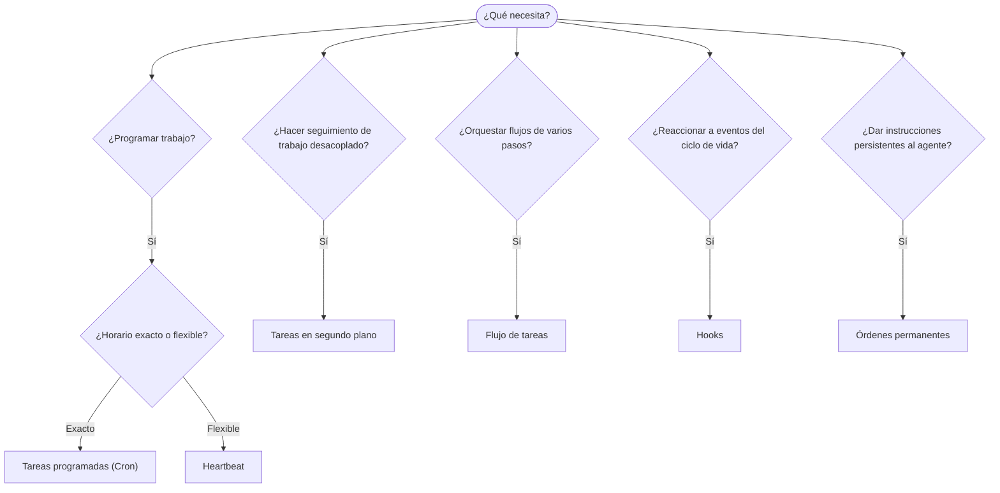

OpenClaw ejecuta trabajo en segundo plano mediante tareas, trabajos programados, hooks de eventos
e instrucciones permanentes. Utilice esta página para elegir el mecanismo adecuado.

## Guía rápida de decisión

| Caso de uso                                      | Recomendación              | Motivo                                                     |
| ------------------------------------------------ | -------------------------- | ---------------------------------------------------------- |
| Enviar un informe diario exactamente a las 9 AM  | Tareas programadas (Cron)  | Horario exacto, ejecución aislada                          |
| Recordarme algo dentro de 20 minutos             | Tareas programadas (Cron)  | Ejecución única con horario preciso (`--at`)   |
| Ejecutar un análisis profundo semanal            | Tareas programadas (Cron)  | Tarea independiente; puede usar un modelo diferente        |
| Revisar la bandeja de entrada cada 30 min         | Heartbeat                  | Agrupa la revisión con otras comprobaciones y usa contexto |
| Supervisar próximos eventos del calendario       | Heartbeat                  | Adecuado de forma natural para el seguimiento periódico    |
| Consultar el estado de un subagente o ejecución ACP | Tareas en segundo plano  | El registro de tareas rastrea todo el trabajo desacoplado   |
| Auditar qué se ejecutó y cuándo                   | Tareas en segundo plano    | `openclaw tasks list` y `openclaw tasks audit`                    |
| Investigar en varios pasos y luego resumir        | Flujo de tareas            | Orquestación duradera con seguimiento de revisiones        |
| Ejecutar un script al restablecer la sesión       | Hooks                      | Basado en eventos; se activa con eventos del ciclo de vida |
| Ejecutar código en cada llamada a herramienta     | Hooks de Plugin            | Los hooks en proceso pueden interceptar llamadas a herramientas |
| Comprobar siempre el cumplimiento antes de responder | Órdenes permanentes    | Se inyectan automáticamente en cada sesión                 |

### Tareas programadas (Cron) frente a Heartbeat

| Dimensión          | Tareas programadas (Cron)             | Heartbeat                                  |
| ------------------ | ------------------------------------- | ------------------------------------------ |
| Horario            | Exacto (expresiones cron, ejecución única) | Aproximado (cada 30 min de forma predeterminada) |
| Contexto de sesión | Nuevo (aislado) o compartido          | Contexto completo de la sesión principal   |
| Registros de tareas | Siempre se crean                     | Nunca se crean                             |
| Entrega            | Canal, Webhook o silenciosa           | Integrada en la sesión principal           |
| Ideal para         | Informes, recordatorios, trabajos en segundo plano | Revisiones de bandeja de entrada, calendario y notificaciones |

Utilice Tareas programadas (Cron) cuando necesite un horario preciso o una ejecución aislada. Utilice Heartbeat cuando el trabajo se beneficie del contexto completo de la sesión y un horario aproximado sea suficiente.

## Conceptos fundamentales

### Tareas programadas (cron)

Cron es el programador integrado de Gateway para horarios precisos. Conserva los trabajos, activa al agente en el momento adecuado y puede entregar los resultados a un canal de chat o endpoint de Webhook. Admite recordatorios de ejecución única, expresiones recurrentes y activadores de Webhook entrantes.

Consulte [Tareas programadas](/es/automation/cron-jobs).

### Tareas

El registro de tareas en segundo plano rastrea todo el trabajo desacoplado: ejecuciones ACP, creación de subagentes, ejecuciones cron aisladas y operaciones de CLI. Las tareas son registros, no programadores. Utilice `openclaw tasks list` y `openclaw tasks audit` para consultarlas.

Consulte [Tareas en segundo plano](/es/automation/tasks).

### Flujo de tareas

Flujo de tareas es la infraestructura de orquestación de flujos situada sobre las tareas en segundo plano. Gestiona flujos duraderos de varios pasos con modos de sincronización gestionada y reflejada, seguimiento de revisiones y `openclaw tasks flow list|show|cancel` para su consulta.

Consulte [Flujo de tareas](/es/automation/taskflow).

### Órdenes permanentes

Las órdenes permanentes conceden al agente autoridad operativa permanente para programas definidos. Residen en archivos del espacio de trabajo (normalmente `AGENTS.md`) y se inyectan en cada sesión. Combínelas con cron para aplicar reglas basadas en el tiempo.

Consulte [Órdenes permanentes](/es/automation/standing-orders).

### Hooks

Los hooks internos son scripts basados en eventos que se activan mediante eventos del ciclo de vida del agente
(`/new`, `/reset`, `/stop`), la Compaction de la sesión, el inicio de Gateway y el flujo de
mensajes. Se detectan en directorios de hooks y se gestionan con
`openclaw hooks`. Para interceptar llamadas a herramientas dentro del proceso, utilice
[hooks de Plugin](/es/plugins/hooks).

Consulte [Hooks](/es/automation/hooks).

### Heartbeat

Heartbeat es un turno periódico de la sesión principal (cada 30 minutos de forma predeterminada). Agrupa varias comprobaciones (bandeja de entrada, calendario y notificaciones) en un único turno del agente con el contexto completo de la sesión. Los turnos de Heartbeat no crean registros de tareas ni prolongan la vigencia del restablecimiento diario o por inactividad de la sesión. Utilice `HEARTBEAT.md` para una pequeña lista de comprobación o un bloque `tasks:` cuando desee realizar dentro del propio Heartbeat comprobaciones periódicas solo cuando correspondan. Los archivos de Heartbeat vacíos se omiten como `empty-heartbeat-file`; el modo de tareas solo cuando correspondan se omite como `no-tasks-due`. Los Heartbeats se aplazan mientras haya trabajo cron activo o en cola, y `heartbeat.skipWhenBusy` también puede aplazar un agente mientras estén ocupados los subagentes asociados a la clave de sesión de ese mismo agente o sus carriles anidados.

Consulte [Heartbeat](/es/gateway/heartbeat).

## Cómo funcionan conjuntamente

- **Cron** gestiona horarios precisos (informes diarios y revisiones semanales) y recordatorios de ejecución única. Todas las ejecuciones cron crean registros de tareas.
- **Heartbeat** gestiona la supervisión rutinaria (bandeja de entrada, calendario y notificaciones) en un único turno agrupado cada 30 minutos.
- **Los hooks** reaccionan a eventos específicos (restablecimientos de sesión, Compaction y flujo de mensajes) mediante scripts personalizados. Los hooks de Plugin abarcan las llamadas a herramientas.
- **Las órdenes permanentes** proporcionan al agente contexto persistente y límites de autoridad.
- **Flujo de tareas** coordina flujos de varios pasos sobre tareas individuales.
- **Las tareas** rastrean automáticamente todo el trabajo desacoplado para permitir su consulta y auditoría.

## Contenido relacionado

- [Tareas programadas](/es/automation/cron-jobs) — programación precisa y recordatorios de ejecución única
- [Tareas en segundo plano](/es/automation/tasks) — registro de tareas para todo el trabajo desacoplado
- [Flujo de tareas](/es/automation/taskflow) — orquestación duradera de flujos de varios pasos
- [Hooks](/es/automation/hooks) — scripts del ciclo de vida basados en eventos
- [Hooks de Plugin](/es/plugins/hooks) — hooks en proceso para herramientas, prompts, mensajes y el ciclo de vida
- [Órdenes permanentes](/es/automation/standing-orders) — instrucciones persistentes para el agente
- [Heartbeat](/es/gateway/heartbeat) — turnos periódicos de la sesión principal
- [Referencia de configuración](/es/gateway/configuration-reference) — todas las claves de configuración
