OpenClaw ejecuta trabajo en segundo plano mediante tareas, trabajos programados, compromisos inferidos,
enlaces de eventos e instrucciones permanentes. Usa esta página para elegir el
mecanismo adecuado.

## Guía rápida de decisión

```mermaid
flowchart TD
    START([¿Qué necesitas?]) --> Q1{¿Programar trabajo?}
    START --> Q2{¿Realizar seguimiento de trabajo desacoplado?}
    START --> Q3{¿Orquestar flujos de varios pasos?}
    START --> Q4{¿Reaccionar a eventos del ciclo de vida?}
    START --> Q5{¿Dar instrucciones persistentes al agente?}
    START --> Q6{¿Recordar un seguimiento natural?}

    Q1 -->|Sí| Q1a{¿Horario exacto o flexible?}
    Q1a -->|Exacto| CRON["Tareas programadas (Cron)"]
    Q1a -->|Flexible| HEARTBEAT[Heartbeat]

    Q2 -->|Sí| TASKS[Tareas en segundo plano]
    Q3 -->|Sí| FLOW[Flujo de tareas]
    Q4 -->|Sí| HOOKS[Enlaces]
    Q5 -->|Sí| SO[Órdenes permanentes]
    Q6 -->|Sí| COMMITMENTS[Compromisos inferidos]
```

| Caso de uso                                             | Recomendación                 | Motivo                                                         |
| ------------------------------------------------------- | ----------------------------- | -------------------------------------------------------------- |
| Enviar un informe diario exactamente a las 9:00         | Tareas programadas (Cron)     | Horario exacto, ejecución aislada                              |
| Recordarme algo dentro de 20 minutos                    | Tareas programadas (Cron)     | Ejecución única con horario preciso (`--at`)                   |
| Ejecutar un análisis profundo semanal                   | Tareas programadas (Cron)     | Tarea independiente, puede usar un modelo diferente            |
| Revisar la bandeja de entrada cada 30 min               | Heartbeat                     | Se agrupa con otras comprobaciones y tiene en cuenta el contexto |
| Supervisar el calendario para detectar próximos eventos | Heartbeat                     | Opción natural para una supervisión periódica                  |
| Consultar después de una entrevista mencionada          | Compromisos inferidos         | Seguimiento similar a un recuerdo, sin solicitud de aviso exacto |
| Consulta cordial tras conocer el contexto del usuario   | Compromisos inferidos         | Limitada al mismo agente y canal                               |
| Consultar el estado de un subagente o una ejecución ACP | Tareas en segundo plano       | El registro de tareas controla todo el trabajo desacoplado     |
| Auditar qué se ejecutó y cuándo                         | Tareas en segundo plano       | `openclaw tasks list` y `openclaw tasks audit`                 |
| Investigar en varios pasos y después resumir            | Flujo de tareas               | Orquestación duradera con seguimiento de revisiones            |
| Ejecutar un script al restablecer la sesión             | Enlaces                       | Basados en eventos, se activan durante eventos del ciclo de vida |
| Ejecutar código en cada llamada a herramientas          | Enlaces de Plugin             | Los enlaces dentro del proceso pueden interceptar llamadas a herramientas |
| Comprobar siempre el cumplimiento antes de responder    | Órdenes permanentes           | Se insertan automáticamente en cada sesión                     |

### Tareas programadas (Cron) frente a Heartbeat

| Dimensión            | Tareas programadas (Cron)                 | Heartbeat                                      |
| -------------------- | ----------------------------------------- | ---------------------------------------------- |
| Horario              | Exacto (expresiones cron, ejecución única) | Aproximado (valor predeterminado: cada 30 min) |
| Contexto de sesión   | Nuevo (aislado) o compartido              | Contexto completo de la sesión principal       |
| Registros de tareas  | Siempre se crean                          | Nunca se crean                                 |
| Entrega              | Canal, webhook o silenciosa               | Integrada en la sesión principal               |
| Uso recomendado      | Informes, avisos, trabajos en segundo plano | Bandeja de entrada, calendario, notificaciones |

Usa Tareas programadas (Cron) cuando necesites un horario preciso o una ejecución aislada. Usa Heartbeat cuando el trabajo se beneficie del contexto completo de la sesión y sea aceptable un horario aproximado.

## Conceptos principales

### Tareas programadas (cron)

Cron es el programador integrado del Gateway para horarios precisos. Conserva los trabajos, activa al agente en el momento adecuado y puede entregar el resultado a un canal de chat o a un endpoint de webhook. Admite avisos de ejecución única, expresiones recurrentes y activadores de webhook entrantes.

Consulta [Tareas programadas](/es/automation/cron-jobs).

### Tareas

El registro de tareas en segundo plano controla todo el trabajo desacoplado: ejecuciones ACP, creación de subagentes, ejecuciones cron aisladas y operaciones de la CLI. Las tareas son registros, no programadores. Usa `openclaw tasks list` y `openclaw tasks audit` para consultarlas.

Consulta [Tareas en segundo plano](/es/automation/tasks).

### Compromisos inferidos

Los compromisos son recuerdos de seguimiento opcionales y de corta duración. OpenClaw los infiere
a partir de conversaciones normales, los limita al mismo agente y canal, y
entrega las consultas pendientes mediante Heartbeat. Los avisos exactos solicitados por el usuario siguen
correspondiendo a Cron.

Consulta [Compromisos inferidos](/es/concepts/commitments).

### Flujo de tareas

El flujo de tareas es la base de orquestación de flujos situada sobre las tareas en segundo plano. Gestiona flujos duraderos de varios pasos con modos de sincronización administrada y reflejada, seguimiento de revisiones y `openclaw tasks flow list|show|cancel` para su consulta.

Consulta [Flujo de tareas](/es/automation/taskflow).

### Órdenes permanentes

Las órdenes permanentes conceden al agente autoridad operativa permanente para programas definidos. Residen en archivos del espacio de trabajo (normalmente `AGENTS.md`) y se insertan en cada sesión. Combínalas con Cron para aplicar reglas basadas en el tiempo.

Consulta [Órdenes permanentes](/es/automation/standing-orders).

### Enlaces

Los enlaces internos son scripts basados en eventos que se activan mediante eventos del ciclo de vida del agente
(`/new`, `/reset`, `/stop`), la Compaction de la sesión, el inicio del Gateway y el flujo de
mensajes. Se detectan en directorios de enlaces y se administran con
`openclaw hooks`. Para interceptar llamadas a herramientas dentro del proceso, usa los
[enlaces de Plugin](/es/plugins/hooks).

Consulta [Enlaces](/es/automation/hooks).

### Heartbeat

Heartbeat es un turno periódico de la sesión principal (de forma predeterminada, cada 30 minutos). Agrupa varias comprobaciones (bandeja de entrada, calendario y notificaciones) en un solo turno del agente con el contexto completo de la sesión. Los turnos de Heartbeat no crean registros de tareas ni prolongan la vigencia del restablecimiento diario o por inactividad de la sesión. Usa `HEARTBEAT.md` para una pequeña lista de comprobación, o un bloque `tasks:` cuando quieras realizar comprobaciones periódicas únicamente cuando haya tareas pendientes dentro del propio Heartbeat. Los archivos de Heartbeat vacíos se omiten como `empty-heartbeat-file`; el modo de tareas pendientes únicamente se omite como `no-tasks-due`. Los Heartbeat se aplazan mientras haya trabajo de Cron activo o en cola, y `heartbeat.skipWhenBusy` también puede aplazar un agente mientras estén ocupados los subagentes asociados a la clave de sesión de ese mismo agente o sus carriles anidados.

Consulta [Heartbeat](/es/gateway/heartbeat).

## Cómo funcionan conjuntamente

- **Cron** gestiona horarios precisos (informes diarios y revisiones semanales) y avisos de ejecución única. Todas las ejecuciones de Cron crean registros de tareas.
- **Heartbeat** gestiona la supervisión rutinaria (bandeja de entrada, calendario y notificaciones) en un único turno agrupado cada 30 minutos.
- **Enlaces** reacciona a eventos específicos (restablecimientos de sesión, Compaction y flujo de mensajes) mediante scripts personalizados. Los enlaces de Plugin abarcan las llamadas a herramientas.
- **Órdenes permanentes** proporciona al agente contexto persistente y límites de autoridad.
- **Flujo de tareas** coordina flujos de varios pasos sobre tareas individuales.
- **Tareas** controla automáticamente todo el trabajo desacoplado para que puedas consultarlo y auditarlo.

## Contenido relacionado

- [Tareas programadas](/es/automation/cron-jobs) — programación precisa y avisos de ejecución única
- [Compromisos inferidos](/es/concepts/commitments) — consultas de seguimiento similares a recuerdos
- [Tareas en segundo plano](/es/automation/tasks) — registro de tareas para todo el trabajo desacoplado
- [Flujo de tareas](/es/automation/taskflow) — orquestación duradera de flujos de varios pasos
- [Enlaces](/es/automation/hooks) — scripts del ciclo de vida basados en eventos
- [Enlaces de Plugin](/es/plugins/hooks) — enlaces dentro del proceso para herramientas, instrucciones, mensajes y el ciclo de vida
- [Órdenes permanentes](/es/automation/standing-orders) — instrucciones persistentes para el agente
- [Heartbeat](/es/gateway/heartbeat) — turnos periódicos de la sesión principal
- [Referencia de configuración](/es/gateway/configuration-reference) — todas las claves de configuración
