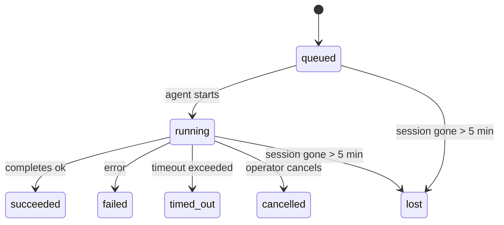

---
read_when:
    - Inspeccionar el trabajo en segundo plano en curso o completado recientemente
    - Depuración de fallos de entrega para ejecuciones de agente desacopladas
    - Comprender cómo las ejecuciones en segundo plano se relacionan con las sesiones, Cron y Heartbeat
sidebarTitle: Background tasks
summary: Seguimiento de tareas en segundo plano para ejecuciones de ACP, subagentes, trabajos cron aislados y operaciones de CLI
title: Tareas en segundo plano
x-i18n:
    generated_at: "2026-06-27T10:35:00Z"
    model: gpt-5.5
    postprocess_version: locale-links-v1
    provider: openai
    source_hash: 4a630a52d0d6bfd387a37415dd63fc4bfbce23f99eaa8cb780c3d6f8913675fd
    source_path: automation/tasks.md
    workflow: 16
---

<Note>
¿Buscas programación? Consulta [Automatización](/es/automation) para elegir el mecanismo adecuado. Esta página es el registro de actividad del trabajo en segundo plano, no el programador.
</Note>

Las tareas en segundo plano rastrean el trabajo que se ejecuta **fuera de tu sesión principal de conversación**: ejecuciones de ACP, creación de subagentes, ejecuciones aisladas de trabajos Cron y operaciones iniciadas por la CLI.

Las tareas **no** reemplazan sesiones, trabajos Cron ni Heartbeats: son el **registro de actividad** que registra qué trabajo desvinculado ocurrió, cuándo y si se completó correctamente.

<Note>
No toda ejecución de agente crea una tarea. Los turnos de Heartbeat y el chat interactivo normal no lo hacen. Todas las ejecuciones Cron, creaciones de ACP, creaciones de subagentes y comandos de agente de la CLI sí lo hacen.
</Note>

## Resumen

- Las tareas son **registros**, no programadores: Cron y Heartbeat deciden _cuándo_ se ejecuta el trabajo; las tareas rastrean _qué ocurrió_.
- ACP, los subagentes, todos los trabajos Cron y las operaciones de la CLI crean tareas. Los turnos de Heartbeat no.
- Cada tarea avanza por `queued → running → terminal` (succeeded, failed, timed_out, cancelled o lost).
- Las tareas Cron permanecen activas mientras el runtime de Cron aún posee el trabajo; si el
  estado del runtime en memoria desaparece, el mantenimiento de tareas primero revisa el historial
  durable de ejecuciones Cron antes de marcar una tarea como perdida.
- La finalización está impulsada por push: el trabajo desvinculado puede notificar directamente o despertar la
  sesión solicitante/Heartbeat cuando termina, por lo que los bucles de sondeo de estado
  suelen tener la forma equivocada.
- Las ejecuciones Cron aisladas y las finalizaciones de subagentes intentan limpiar, con el mejor esfuerzo, las pestañas/procesos del navegador rastreados para su sesión hija antes de la contabilidad final de limpieza.
- La entrega Cron aislada suprime respuestas principales intermedias obsoletas mientras el trabajo de subagentes descendientes aún se está drenando, y prefiere la salida final del descendiente cuando llega antes de la entrega.
- Las notificaciones de finalización se entregan directamente a un canal o se ponen en cola para el siguiente Heartbeat.
- `openclaw tasks list` muestra todas las tareas; `openclaw tasks audit` muestra problemas.
- Los registros terminales se conservan durante 7 días y luego se depuran automáticamente.

## Inicio rápido

<Tabs>
  <Tab title="List and filter">
    ```bash
    # List all tasks (newest first)
    openclaw tasks list

    # Filter by runtime or status
    openclaw tasks list --runtime acp
    openclaw tasks list --status running
    ```

  </Tab>
  <Tab title="Inspect">
    ```bash
    # Show details for a specific task (by ID, run ID, or session key)
    openclaw tasks show <lookup>
    ```
  </Tab>
  <Tab title="Cancel and notify">
    ```bash
    # Cancel a running task (kills the child session)
    openclaw tasks cancel <lookup>

    # Change notification policy for a task
    openclaw tasks notify <lookup> state_changes
    ```

  </Tab>
  <Tab title="Audit and maintenance">
    ```bash
    # Run a health audit
    openclaw tasks audit

    # Preview or apply maintenance
    openclaw tasks maintenance
    openclaw tasks maintenance --apply
    ```

  </Tab>
  <Tab title="Task flow">
    ```bash
    # Inspect TaskFlow state
    openclaw tasks flow list
    openclaw tasks flow show <lookup>
    openclaw tasks flow cancel <lookup>
    ```
  </Tab>
</Tabs>

## Qué crea una tarea

| Origen                 | Tipo de runtime | Cuándo se crea un registro de tarea                                    | Política de notificación predeterminada |
| ---------------------- | ------------ | ---------------------------------------------------------------------- | --------------------- |
| Ejecuciones en segundo plano de ACP | `acp`        | Al crear una sesión hija de ACP                                        | `done_only`           |
| Orquestación de subagentes | `subagent`   | Al crear un subagente mediante `sessions_spawn`                        | `done_only`           |
| Trabajos Cron (todos los tipos) | `cron`       | En cada ejecución Cron (de sesión principal y aislada)                 | `silent`              |
| Operaciones de la CLI  | `cli`        | Comandos `openclaw agent` que se ejecutan a través del Gateway         | `silent`              |
| Trabajos multimedia de agente | `cli`        | Ejecuciones respaldadas por sesión de `image_generate`/`music_generate`/`video_generate` | `silent`              |

<AccordionGroup>
  <Accordion title="Notify defaults for cron and media">
    Las tareas Cron de sesión principal usan la política de notificación `silent` de forma predeterminada: crean registros para rastreo, pero no generan notificaciones. Las tareas Cron aisladas también usan `silent` de forma predeterminada, pero son más visibles porque se ejecutan en su propia sesión.

    Las ejecuciones respaldadas por sesión de `image_generate`, `music_generate` y `video_generate` también usan la política de notificación `silent`. Aun así crean registros de tarea, pero la finalización se devuelve a la sesión original del agente como un despertar interno para que el agente pueda escribir el mensaje de seguimiento y adjuntar el medio terminado por sí mismo. El agente solicitante sigue su contrato normal de respuesta visible: respuesta final automática cuando está configurada, o `message(action="send")` más `NO_REPLY` cuando la sesión requiere respuestas mediante la herramienta de mensajes. Si la sesión solicitante ya no está activa o falla su despertar activo, y el agente de finalización omite parte o todos los medios generados, OpenClaw envía una reserva directa idempotente solo con los medios faltantes al destino del canal original.

  </Accordion>
  <Accordion title="Concurrent media-generation guardrail">
    Mientras una tarea de generación multimedia respaldada por sesión sigue activa, las herramientas multimedia también actúan como barreras de protección contra reintentos accidentales. Las llamadas repetidas a `image_generate` para el mismo prompt devuelven el estado de la tarea activa coincidente, mientras que un prompt de imagen distinto puede iniciar su propia tarea. Las llamadas a `music_generate` y `video_generate` siguen devolviendo el estado de la tarea activa para esa sesión en lugar de iniciar una segunda generación concurrente. Usa `action: "status"` cuando quieras una consulta explícita de progreso/estado desde el lado del agente.
  </Accordion>
  <Accordion title="What does not create tasks">
    - Turnos de Heartbeat: sesión principal; consulta [Heartbeat](/es/gateway/heartbeat)
    - Turnos normales de chat interactivo
    - Respuestas directas de `/command`

  </Accordion>
</AccordionGroup>

## Ciclo de vida de las tareas



| Estado      | Qué significa                                                              |
| ----------- | -------------------------------------------------------------------------- |
| `queued`    | Creada, esperando a que el agente inicie                                   |
| `running`   | El turno del agente se está ejecutando activamente                         |
| `succeeded` | Completada correctamente                                                   |
| `failed`    | Completada con un error                                                    |
| `timed_out` | Superó el tiempo de espera configurado                                     |
| `cancelled` | Detenida por el operador mediante `openclaw tasks cancel`                  |
| `lost`      | El runtime perdió el estado de respaldo autoritativo después de un período de gracia de 5 minutos |

Las transiciones ocurren automáticamente: cuando termina la ejecución del agente asociado, el estado de la tarea se actualiza para coincidir.

La finalización de la ejecución del agente es autoritativa para los registros de tareas activos. Una ejecución desvinculada correcta finaliza como `succeeded`, los errores ordinarios de ejecución finalizan como `failed`, y los resultados de tiempo de espera o aborto finalizan como `timed_out`. Si un operador ya canceló la tarea, o el runtime ya registró un estado terminal más fuerte como `failed`, `timed_out` o `lost`, una señal de éxito posterior no rebaja ese estado terminal.

`lost` tiene en cuenta el runtime:

- Tareas ACP: desaparecieron los metadatos de la sesión hija de ACP de respaldo.
- Tareas de subagente: la sesión hija de respaldo desapareció del almacén del agente de destino.
- Tareas Cron: el runtime de Cron ya no rastrea el trabajo como activo y el historial
  durable de ejecuciones Cron no muestra un resultado terminal para esa ejecución. La auditoría
  sin conexión de la CLI no trata su propio estado vacío del runtime Cron en proceso como autoridad.
- Tareas de la CLI: las tareas con un id de ejecución/id de origen usan el contexto de ejecución en vivo, por lo que
  las filas persistentes de sesión hija o sesión de chat no las mantienen activas después de que
  desaparece la ejecución propiedad del Gateway. Las tareas de la CLI heredadas sin identidad de ejecución aún recurren
  a la sesión hija. Las ejecuciones `openclaw agent` respaldadas por Gateway también finalizan
  desde su resultado de ejecución, por lo que las ejecuciones completadas no permanecen activas hasta que el barrendero
  las marca como `lost`.

## Entrega y notificaciones

Cuando una tarea alcanza un estado terminal, OpenClaw te notifica. Hay dos rutas de entrega:

**Entrega directa**: si la tarea tiene un destino de canal (el `requesterOrigin`), el mensaje de finalización va directamente a ese canal (Telegram, Discord, Slack, etc.). Las finalizaciones de tareas de grupos y canales se enrutan en cambio a través de la sesión solicitante para que el agente principal pueda escribir la respuesta visible. Para finalizaciones de subagentes, OpenClaw también conserva el enrutamiento vinculado de hilo/tema cuando está disponible y puede completar un `to` / cuenta faltante desde la ruta almacenada de la sesión solicitante (`lastChannel` / `lastTo` / `lastAccountId`) antes de rendirse con la entrega directa.

**Entrega en cola de sesión**: si la entrega directa falla o no hay origen definido, la actualización se pone en cola como un evento del sistema en la sesión del solicitante y aparece en el siguiente Heartbeat.

<Tip>
La finalización de tareas activa un despertar inmediato de Heartbeat para que veas el resultado rápidamente: no tienes que esperar al siguiente pulso programado de Heartbeat.
</Tip>

Eso significa que el flujo de trabajo habitual está basado en push: inicia el trabajo desvinculado una vez y luego deja que el runtime te despierte o notifique al finalizar. Sondea el estado de la tarea solo cuando necesites depuración, intervención o una auditoría explícita.

### Políticas de notificación

Controla cuánto recibes sobre cada tarea:

| Política             | Qué se entrega                                                         |
| --------------------- | ----------------------------------------------------------------------- |
| `done_only` (predeterminada) | Solo estado terminal (succeeded, failed, etc.): **este es el valor predeterminado** |
| `state_changes`       | Cada transición de estado y actualización de progreso                  |
| `silent`              | Nada en absoluto                                                        |

Cambia la política mientras una tarea se está ejecutando:

```bash
openclaw tasks notify <lookup> state_changes
```

## Referencia de la CLI

<AccordionGroup>
  <Accordion title="tasks list">
    ```bash
    openclaw tasks list [--runtime <acp|subagent|cron|cli>] [--status <status>] [--json]
    ```

    Columnas de salida: ID de tarea, tipo, estado, entrega, ID de ejecución, sesión hija, resumen.

  </Accordion>
  <Accordion title="tasks show">
    ```bash
    openclaw tasks show <lookup>
    ```

    El token de búsqueda acepta un ID de tarea, ID de ejecución o clave de sesión. Muestra el registro completo, incluidos tiempos, estado de entrega, error y resumen terminal.

  </Accordion>
  <Accordion title="tasks cancel">
    ```bash
    openclaw tasks cancel <lookup>
    ```

    Para tareas ACP y de subagente, esto mata la sesión hija. Para tareas rastreadas por la CLI, la cancelación se registra en el registro de tareas (no hay un identificador de runtime hijo separado). El estado pasa a `cancelled` y se envía una notificación de entrega cuando corresponde.

  </Accordion>
  <Accordion title="tasks notify">
    ```bash
    openclaw tasks notify <lookup> <done_only|state_changes|silent>
    ```
  </Accordion>
  <Accordion title="tasks audit">
    ```bash
    openclaw tasks audit [--json]
    ```

    Muestra problemas operativos. Los hallazgos también aparecen en `openclaw status` cuando se detectan problemas.

    | Hallazgo                  | Gravedad          | Activador                                                                                                                                |
    | ------------------------- | ----------------- | ---------------------------------------------------------------------------------------------------------------------------------------- |
    | `stale_queued`            | advertencia       | En cola durante más de 10 minutos                                                                                                        |
    | `stale_running`           | error             | En ejecución durante más de 30 minutos                                                                                                   |
    | `lost`                    | advertencia/error | La propiedad de la tarea respaldada por el runtime desapareció; las tareas perdidas retenidas advierten hasta `cleanupAfter`, luego pasan a ser errores |
    | `delivery_failed`         | advertencia       | La entrega falló y la política de notificación no es `silent`                                                                            |
    | `missing_cleanup`         | advertencia       | Tarea terminal sin marca de tiempo de limpieza                                                                                           |
    | `inconsistent_timestamps` | advertencia       | Infracción de la línea de tiempo (por ejemplo, terminó antes de empezar)                                                                 |

  </Accordion>
  <Accordion title="tasks maintenance">
    ```bash
    openclaw tasks maintenance [--json]
    openclaw tasks maintenance --apply [--json]
    ```

    Usa esto para previsualizar o aplicar la reconciliación, el marcado de limpieza y la poda para tareas, el estado del flujo de tareas y las filas obsoletas del registro de sesiones de ejecuciones de cron.

    La reconciliación tiene en cuenta el runtime:

    - Las tareas ACP/subagent comprueban su sesión secundaria subyacente.
    - Las tareas de subagent cuya sesión secundaria tiene una lápida de recuperación tras reinicio se marcan como perdidas en lugar de tratarse como sesiones subyacentes recuperables.
    - Las tareas Cron comprueban si el runtime de cron todavía posee el trabajo, luego recuperan el estado terminal desde los registros persistidos de ejecuciones de cron/estado del trabajo antes de recurrir a `lost`. Solo el proceso Gateway es autoritativo para el conjunto en memoria de trabajos cron activos; la auditoría offline de la CLI usa historial duradero pero no marca una tarea cron como perdida solo porque ese Set local esté vacío.
    - Las tareas CLI con identidad de ejecución comprueban el contexto de ejecución activo propietario, no solo las filas de sesión secundaria o sesión de chat.

    La limpieza al completarse también tiene en cuenta el runtime:

    - La finalización de subagent cierra, con el mejor esfuerzo, las pestañas/procesos de navegador rastreados para la sesión secundaria antes de que continúe la limpieza del anuncio.
    - La finalización de cron aislada cierra, con el mejor esfuerzo, las pestañas/procesos de navegador rastreados para la sesión cron antes de que la ejecución se desmonte por completo.
    - La entrega de cron aislada espera, cuando es necesario, el seguimiento de subagents descendientes y suprime el texto obsoleto de acuse del padre en lugar de anunciarlo.
    - La entrega de finalización de subagent usa solo el texto visible más reciente del asistente de la sesión secundaria. La salida de herramienta/toolResult no se promociona a texto de resultado secundario. Las ejecuciones terminales fallidas anuncian el estado de fallo sin reproducir el texto de respuesta capturado.
    - Los fallos de limpieza no ocultan el resultado real de la tarea.

    Al aplicar el mantenimiento, OpenClaw también elimina las filas obsoletas del registro de sesiones `cron:<jobId>:run:<uuid>` con más de 7 días de antigüedad, preservando las filas de trabajos cron actualmente en ejecución y dejando intactas las filas de sesiones no cron.

  </Accordion>
  <Accordion title="tasks flow list | show | cancel">
    ```bash
    openclaw tasks flow list [--status <status>] [--json]
    openclaw tasks flow show <lookup> [--json]
    openclaw tasks flow cancel <lookup>
    ```

    Usa estos comandos cuando lo que te importa es el flujo de tareas orquestador, no un registro individual de tarea en segundo plano.

  </Accordion>
</AccordionGroup>

## Tablero de tareas de chat (`/tasks`)

Usa `/tasks` en cualquier sesión de chat para ver las tareas en segundo plano vinculadas a esa sesión. El tablero muestra tareas activas y completadas recientemente con runtime, estado, tiempos y progreso o detalles de error.

Cuando la sesión actual no tiene tareas vinculadas visibles, `/tasks` recurre a recuentos de tareas locales del agente para que sigas teniendo una vista general sin filtrar detalles de otras sesiones.

Para el libro mayor completo del operador, usa la CLI: `openclaw tasks list`.

## Integración de estado (presión de tareas)

`openclaw status` incluye un resumen rápido de tareas:

```
Tasks: 3 queued · 2 running · 1 issues
```

El resumen informa:

- **active** - recuento de `queued` + `running`
- **failures** - recuento de `failed` + `timed_out` + `lost`
- **byRuntime** - desglose por `acp`, `subagent`, `cron`, `cli`

Tanto `/status` como la herramienta `session_status` usan una instantánea de tareas consciente de la limpieza: se prefieren las tareas activas, se ocultan las filas completadas obsoletas y los fallos recientes solo aparecen cuando no queda trabajo activo. Esto mantiene la tarjeta de estado centrada en lo que importa ahora mismo.

## Almacenamiento y mantenimiento

### Dónde viven las tareas

Los registros de tareas persisten en SQLite en:

```
$OPENCLAW_STATE_DIR/tasks/runs.sqlite
```

El registro se carga en memoria al iniciar el gateway y sincroniza las escrituras con SQLite para mantener durabilidad entre reinicios.
El Gateway mantiene acotado el registro de escritura anticipada de SQLite usando el umbral predeterminado de autocheckpoint de SQLite más checkpoints periódicos `PASSIVE`. El apagado y los checkpoints explícitos de mantenimiento siguen usando `TRUNCATE` para que los cierres normales puedan recuperar espacio de WAL sin hacer que el barrido en segundo plano espere a lectores activos.

### Mantenimiento automático

Un barrido se ejecuta cada **60 segundos** y gestiona cuatro cosas:

<Steps>
  <Step title="Reconciliation">
    Comprueba si las tareas activas todavía tienen respaldo autoritativo del runtime. Las tareas ACP/subagent usan el estado de la sesión secundaria, las tareas cron usan la propiedad de trabajos activos y las tareas CLI con identidad de ejecución usan el contexto de ejecución propietario. Si ese estado subyacente desaparece durante más de 5 minutos, la tarea se marca como `lost`.
  </Step>
  <Step title="ACP session repair">
    Cierra sesiones ACP terminales o huérfanas de un solo uso propiedad del padre, y cierra sesiones ACP persistentes terminales obsoletas o huérfanas solo cuando no queda ningún enlace de conversación activo.
  </Step>
  <Step title="Cleanup stamping">
    Establece una marca de tiempo `cleanupAfter` en tareas terminales (endedAt + 7 días). Durante la retención, las tareas perdidas siguen apareciendo en la auditoría como advertencias; después de que expire `cleanupAfter` o cuando falten metadatos de limpieza, son errores.
  </Step>
  <Step title="Pruning">
    Elimina los registros posteriores a su fecha `cleanupAfter`.
  </Step>
</Steps>

<Note>
**Retención:** los registros de tareas terminales se conservan durante **7 días** y luego se podan automáticamente. No se necesita configuración.
</Note>

## Cómo se relacionan las tareas con otros sistemas

<AccordionGroup>
  <Accordion title="Tasks and Task Flow">
    [Flujo de tareas](/es/automation/taskflow) es la capa de orquestación de flujos por encima de las tareas en segundo plano. Un solo flujo puede coordinar varias tareas durante su vida útil mediante modos de sincronización gestionados o reflejados. Usa `openclaw tasks` para inspeccionar registros individuales de tareas y `openclaw tasks flow` para inspeccionar el flujo orquestador.

    Consulta [Flujo de tareas](/es/automation/taskflow) para más detalles.

  </Accordion>
  <Accordion title="Tasks and cron">
    Las definiciones de trabajos Cron, el estado de ejecución en runtime y el historial de ejecuciones viven en la base de datos SQLite de estado compartido de OpenClaw. **Cada** ejecución de cron crea un registro de tarea, tanto de sesión principal como aislada. Las tareas cron de sesión principal usan de forma predeterminada la política de notificación `silent` para que se rastreen sin generar notificaciones.

    Consulta [Trabajos Cron](/es/automation/cron-jobs).

  </Accordion>
  <Accordion title="Tasks and heartbeat">
    Las ejecuciones de Heartbeat son turnos de sesión principal: no crean registros de tarea. Cuando una tarea se completa, puede activar un despertar de Heartbeat para que veas el resultado con prontitud.

    Consulta [Heartbeat](/es/gateway/heartbeat).

  </Accordion>
  <Accordion title="Tasks and sessions">
    Una tarea puede referenciar un `childSessionKey` (donde se ejecuta el trabajo) y un `requesterSessionKey` (quien la inició). Su `agentId` identifica al agente que ejecuta el trabajo, mientras que los campos de solicitante y propietario preservan el contexto de inicio y control. Las sesiones son contexto de conversación; las tareas son seguimiento de actividad por encima de eso.
  </Accordion>
  <Accordion title="Tasks and agent runs">
    El `runId` de una tarea enlaza con la ejecución del agente que realiza el trabajo. Los eventos del ciclo de vida del agente (inicio, fin, error) actualizan automáticamente el estado de la tarea; no necesitas gestionar el ciclo de vida manualmente.
  </Accordion>
</AccordionGroup>

## Relacionado

- [Automatización](/es/automation) - todos los mecanismos de automatización de un vistazo
- [CLI: tareas](/es/cli/tasks) - referencia de comandos de la CLI
- [Heartbeat](/es/gateway/heartbeat) - turnos periódicos de sesión principal
- [Tareas programadas](/es/automation/cron-jobs) - programación de trabajo en segundo plano
- [Flujo de tareas](/es/automation/taskflow) - orquestación de flujos por encima de tareas
