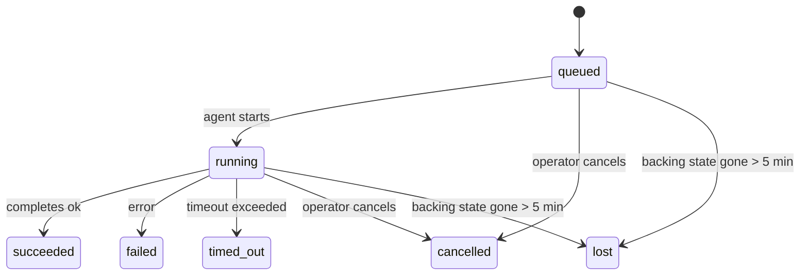

---
read_when:
    - Inspección del trabajo en segundo plano en curso o completado recientemente
    - Depuración de fallos de entrega en ejecuciones de agente desvinculadas
    - Comprender cómo las ejecuciones en segundo plano se relacionan con las sesiones, Cron y Heartbeat
sidebarTitle: Background tasks
summary: Seguimiento de tareas en segundo plano para ejecuciones de ACP, subagentes, ejecuciones de cron y operaciones de CLI
title: Tareas en segundo plano
x-i18n:
    generated_at: "2026-07-05T11:01:13Z"
    model: gpt-5.5
    postprocess_version: locale-links-v1
    provider: openai
    source_hash: 22f81c67fcdb5ef76f42b6afa96f3348614229f2f90dd870f821c32e9cf452a9
    source_path: automation/tasks.md
    workflow: 16
---

<Note>
¿Buscas programación? Consulta [Automatización](/es/automation) para elegir el mecanismo adecuado. Esta página es el libro de actividad del trabajo en segundo plano, no el programador.
</Note>

Las tareas en segundo plano registran el trabajo que se ejecuta **fuera de tu sesión de conversación principal**: ejecuciones ACP, creación de subagentes, ejecuciones de trabajos cron y operaciones iniciadas desde la CLI.

Las tareas **no** sustituyen a las sesiones, los trabajos cron ni los Heartbeats: son el **libro de actividad** que registra qué trabajo desacoplado ocurrió, cuándo y si se completó correctamente.

<Note>
No todas las ejecuciones de agente crean una tarea. Los turnos de Heartbeat y el chat interactivo normal no lo hacen. Todas las ejecuciones cron, creaciones ACP, creaciones de subagentes y comandos de agente de la CLI enviados por el Gateway sí lo hacen.
</Note>

## TL;DR

- Las tareas son **registros**, no programadores: cron y Heartbeat deciden _cuándo_ se ejecuta el trabajo; las tareas registran _qué ocurrió_.
- ACP, los subagentes, todos los trabajos cron y las operaciones de la CLI crean tareas. Los turnos de Heartbeat no.
- Cada tarea avanza por `queued → running → terminal` (succeeded, failed, timed_out, cancelled o lost).
- Las tareas cron permanecen activas mientras el runtime cron siga siendo propietario del trabajo; si el estado del runtime en memoria desaparece, el mantenimiento de tareas primero consulta el historial duradero de ejecuciones cron antes de marcar una tarea como perdida.
- La finalización se impulsa por notificaciones push: el trabajo desacoplado puede notificar directamente o despertar la sesión/Heartbeat solicitante cuando termina, por lo que los bucles de sondeo de estado suelen tener una forma equivocada.
- Las ejecuciones cron aisladas y las finalizaciones de subagentes intentan limpiar de la mejor manera posible las pestañas/procesos de navegador rastreados para su sesión hija antes de la contabilidad final de limpieza.
- La entrega cron aislada suprime respuestas principales provisionales obsoletas mientras el trabajo de subagentes descendientes aún se está drenando, y prefiere la salida final del descendiente cuando llega antes de la entrega.
- Las notificaciones de finalización se entregan directamente a un canal o se ponen en cola para el siguiente Heartbeat.
- `openclaw tasks list` muestra todas las tareas; `openclaw tasks audit` expone problemas.
- Los registros terminales se conservan durante 7 días (los registros `lost` durante 24 horas) y luego se eliminan automáticamente.

## Inicio rápido

<Tabs>
  <Tab title="List and filter">
    ```bash
    # List all tasks (newest first)
    openclaw tasks list

    # Filter by runtime or status
    openclaw tasks list --runtime acp
    openclaw tasks list --status running
    ```

  </Tab>
  <Tab title="Inspect">
    ```bash
    # Show details for a specific task (by task ID, run ID, or session key)
    openclaw tasks show <lookup>
    ```
  </Tab>
  <Tab title="Cancel and notify">
    ```bash
    # Cancel a running task (kills the child session)
    openclaw tasks cancel <lookup>

    # Change notification policy for a task
    openclaw tasks notify <lookup> state_changes
    ```

  </Tab>
  <Tab title="Audit and maintenance">
    ```bash
    # Run a health audit
    openclaw tasks audit

    # Preview or apply maintenance
    openclaw tasks maintenance
    openclaw tasks maintenance --apply
    ```

  </Tab>
  <Tab title="Task flow">
    ```bash
    # Inspect TaskFlow state
    openclaw tasks flow list
    openclaw tasks flow show <lookup>
    openclaw tasks flow cancel <lookup>
    ```
  </Tab>
</Tabs>

## Qué crea una tarea

| Origen                 | Tipo de runtime | Cuándo se crea un registro de tarea                                    | Política de notificación predeterminada |
| ---------------------- | --------------- | ---------------------------------------------------------------------- | --------------------------------------- |
| Ejecuciones ACP en segundo plano | `acp`        | Al crear una sesión ACP hija                                           | `done_only`                             |
| Orquestación de subagentes | `subagent`   | Al crear un subagente mediante `sessions_spawn`                        | `done_only`                             |
| Trabajos cron (todos los tipos) | `cron`       | Cada ejecución cron (de sesión principal y aislada)                    | `silent`                                |
| Operaciones de la CLI  | `cli`        | Comandos `openclaw agent` que se ejecutan a través del Gateway          | `silent`                                |
| Trabajos multimedia del agente | `cli`        | Ejecuciones respaldadas por sesión de `image_generate`/`music_generate`/`video_generate` | `silent`              |

<AccordionGroup>
  <Accordion title="Notify defaults for cron and media">
    Las tareas cron (de sesión principal y aisladas) usan la política de notificación `silent`: crean registros para seguimiento, pero no generan notificaciones de tarea propias; cron posee su ruta de entrega.

    Las ejecuciones respaldadas por sesión de `image_generate`, `music_generate` y `video_generate` también usan la política de notificación `silent`. Siguen creando registros de tarea, pero la finalización se devuelve a la sesión de agente original como un despertar interno para que el agente pueda escribir el mensaje de seguimiento y adjuntar el medio terminado por sí mismo. El agente solicitante sigue su contrato normal de respuesta visible: respuesta final automática cuando está configurada, o `message(action="send")` más `NO_REPLY` cuando la sesión requiere respuestas con herramienta de mensajes. Si la sesión solicitante ya no está activa o su despertar activo falla, y el agente de finalización omite algunos o todos los medios generados, OpenClaw envía una reserva directa idempotente con solo los medios faltantes al destino de canal original.

  </Accordion>
  <Accordion title="Concurrent media-generation guardrail">
    Mientras una tarea de generación de medios respaldada por sesión sigue activa, `image_generate`, `music_generate` y `video_generate` protegen contra reintentos accidentales: repetir la llamada para la misma solicitud/prompt devuelve el estado de la tarea activa coincidente en lugar de iniciar un duplicado, mientras que un prompt distinto puede iniciar su propia tarea. Usa `action: "status"` cuando quieras una consulta explícita de progreso/estado desde el lado del agente.
  </Accordion>
  <Accordion title="What does not create tasks">
    - Turnos de Heartbeat: sesión principal; consulta [Heartbeat](/es/gateway/heartbeat)
    - Turnos normales de chat interactivo
    - Respuestas directas a `/command`

  </Accordion>
</AccordionGroup>

## Ciclo de vida de las tareas



| Estado      | Qué significa                                                               |
| ----------- | --------------------------------------------------------------------------- |
| `queued`    | Creada, esperando a que el agente inicie                                    |
| `running`   | El turno del agente se está ejecutando activamente                          |
| `succeeded` | Completada correctamente                                                    |
| `failed`    | Completada con un error                                                     |
| `timed_out` | Superó el tiempo de espera configurado                                      |
| `cancelled` | Detenida por el operador mediante `openclaw tasks cancel`, o la ejecución fue abortada |
| `lost`      | El runtime perdió el estado de respaldo autoritativo tras un periodo de gracia de 5 minutos |

Las transiciones ocurren automáticamente: los eventos del ciclo de vida de la ejecución del agente (inicio, fin, error) actualizan el estado de la tarea; no lo gestionas manualmente.

La finalización de la ejecución del agente es autoritativa para los registros de tareas activas. Una ejecución desacoplada correcta finaliza como `succeeded`, los errores ordinarios de ejecución finalizan como `failed`, los tiempos de espera finalizan como `timed_out` y los resultados de cancelación/aborto finalizan como `cancelled`. Una vez que una tarea es terminal, las señales posteriores del ciclo de vida no la degradan: una tarea cancelada por operador o ya marcada como `failed`/`timed_out`/`lost` permanece así aunque después llegue una señal de éxito.

`lost` es consciente del runtime:

- Tareas ACP: solo un turno ACP en proceso y activo en el Gateway demuestra que la ejecución está viva; los metadatos de sesión persistidos por sí solos no lo hacen. La auditoría offline de la CLI se mantiene conservadora y nunca reclama tareas ACP.
- Tareas de subagentes: la sesión hija de respaldo desapareció del almacén del agente destino (o lleva una lápida de recuperación tras reinicio).
- Tareas cron: el runtime cron ya no rastrea el trabajo como activo y el historial duradero de ejecuciones cron no muestra un resultado terminal para esa ejecución. La auditoría offline de la CLI no trata su propio estado vacío del runtime cron en proceso como autoridad.
- Tareas de la CLI: las tareas con un id de ejecución/id de origen usan el contexto de ejecución activo, de modo que las filas persistentes de sesión hija o sesión de chat no las mantienen vivas después de que desaparece la ejecución propiedad del Gateway. Las tareas heredadas de la CLI sin identidad de ejecución aún recurren a la sesión hija. Las ejecuciones `openclaw agent` respaldadas por Gateway también finalizan a partir de su resultado de ejecución, por lo que las ejecuciones completadas no permanecen activas hasta que el barrendero las marca como `lost`.

## Entrega y notificaciones

Cuando una tarea alcanza un estado terminal, OpenClaw te notifica. Hay dos rutas de entrega:

**Entrega directa**: si la tarea tiene un destino de canal (el `requesterOrigin`), el mensaje de finalización va directamente a ese canal (Discord, Slack, Telegram, etc.). Las finalizaciones de tareas de grupo y canal se enrutan en cambio a través de la sesión solicitante para que el agente principal pueda escribir la respuesta visible. Para las finalizaciones de subagentes, OpenClaw también conserva el enrutamiento enlazado de hilo/tema cuando está disponible y puede completar un `to` / cuenta faltante desde la ruta almacenada de la sesión solicitante (`lastChannel` / `lastTo` / `lastAccountId`) antes de abandonar la entrega directa.

**Entrega en cola de sesión**: si la entrega directa falla o no hay origen definido, la actualización se pone en cola como un evento del sistema en la sesión del solicitante y aparece en el siguiente Heartbeat.

<Tip>
Las finalizaciones de tareas en cola de sesión activan un despertar inmediato de Heartbeat, por lo que ves el resultado rápidamente: no tienes que esperar al siguiente tick de Heartbeat programado.
</Tip>

Eso significa que el flujo de trabajo habitual se basa en push: inicia el trabajo desacoplado una vez y deja que el runtime te despierte o notifique al finalizar. Sondea el estado de la tarea solo cuando necesites depuración, intervención o una auditoría explícita.

### Políticas de notificación

Controla cuánto quieres saber sobre cada tarea:

| Política             | Qué se entrega                                          |
| -------------------- | ------------------------------------------------------- |
| `done_only` (predeterminado) | Solo el estado terminal (succeeded, failed, etc.) |
| `state_changes`      | Cada transición de estado y actualización de progreso   |
| `silent`             | Nada en absoluto (predeterminado para tareas cron, de la CLI y multimedia) |

Cambia la política mientras una tarea se está ejecutando:

```bash
openclaw tasks notify <lookup> state_changes
```

## Referencia de la CLI

<AccordionGroup>
  <Accordion title="tasks list">
    ```bash
    openclaw tasks list [--runtime <acp|subagent|cron|cli>] [--status <status>] [--json]
    ```

    Columnas de salida: Tarea, Tipo, Estado, Entrega, Ejecución, Sesión hija, Resumen. `openclaw tasks` sin argumentos se comporta como `openclaw tasks list`.

  </Accordion>
  <Accordion title="tasks show">
    ```bash
    openclaw tasks show <lookup> [--json]
    ```

    El token de búsqueda acepta un ID de tarea, ID de ejecución o clave de sesión. Muestra el registro completo, incluidos tiempos, estado de entrega, error y resumen terminal.

  </Accordion>
  <Accordion title="tasks cancel">
    ```bash
    openclaw tasks cancel <lookup>
    ```

    Para tareas ACP y de subagentes, esto mata la sesión hija; las cancelaciones ACP y cron se enrutan a través del Gateway en ejecución (`tasks.cancel`). Para tareas rastreadas por la CLI, la cancelación se registra en el registro de tareas (no hay un manejador de runtime hijo separado). El estado transiciona a `cancelled` y se envía una notificación de entrega cuando corresponde.

  </Accordion>
  <Accordion title="tasks notify">
    ```bash
    openclaw tasks notify <lookup> <done_only|state_changes|silent>
    ```
  </Accordion>
  <Accordion title="tasks audit">
    ```bash
    openclaw tasks audit [--severity <warn|error>] [--code <name>] [--limit <n>] [--json]
    ```

    Expone problemas operativos de tareas **y** TaskFlows en un solo informe. Los hallazgos también aparecen en `openclaw status` cuando se detectan problemas.

    Hallazgos de tareas:

    | Hallazgo                  | Gravedad   | Desencadenante                                                                                                      |
    | ------------------------- | ---------- | ------------------------------------------------------------------------------------------------------------ |
    | `stale_queued`            | warn       | En cola durante más de 10 minutos                                                                              |
    | `stale_running`           | error      | En ejecución durante más de 30 minutos                                                                             |
    | `lost`                    | warn/error | La propiedad de la tarea respaldada por runtime desapareció; las tareas perdidas retenidas advierten hasta `cleanupAfter`, luego se convierten en errores |
    | `delivery_failed`         | warn       | La entrega falló y la política de notificación no es `silent`                                                            |
    | `missing_cleanup`         | warn       | Tarea terminal sin marca de tiempo de limpieza                                                                      |
    | `inconsistent_timestamps` | warn       | Infracción de la línea de tiempo (por ejemplo, terminó antes de empezar)                                                        |

    Hallazgos de TaskFlow:

    | Hallazgo               | Gravedad   | Desencadenante                                                                    |
    | ---------------------- | ---------- | --------------------------------------------------------------------------- |
    | `restore_failed`       | error      | Falló la restauración del registro de flujos desde SQLite                                    |
    | `stale_running`        | error      | El flujo en ejecución no ha avanzado durante más de 30 minutos                      |
    | `stale_waiting`        | warn       | El flujo en espera no ha avanzado durante más de 30 minutos                      |
    | `stale_blocked`        | warn       | El flujo bloqueado no ha avanzado durante más de 30 minutos                      |
    | `cancel_stuck`         | warn       | La cancelación se solicitó hace más de 5 minutos, no hay tareas hijas activas y sigue sin ser terminal |
    | `missing_linked_tasks` | warn/error | Flujo administrado obsoleto sin tareas vinculadas ni estado de espera                       |
    | `blocked_task_missing` | warn       | El flujo bloqueado apunta a un id de tarea que ya no existe                      |

  </Accordion>
  <Accordion title="tasks maintenance">
    ```bash
    openclaw tasks maintenance [--json]
    openclaw tasks maintenance --apply [--json]
    ```

    Usa esto para previsualizar o aplicar reconciliación, marcado de limpieza y poda para tareas, estado de TaskFlow y filas obsoletas del registro de sesiones de ejecución de cron.

    La reconciliación tiene en cuenta el runtime:

    - Las tareas ACP requieren un turno activo en proceso en el Gateway; las tareas de subagente comprueban su sesión hija de respaldo.
    - Las tareas de subagente cuya sesión hija tiene una lápida de recuperación tras reinicio se marcan como perdidas en lugar de tratarse como sesiones de respaldo recuperables.
    - Las tareas de Cron comprueban si el runtime de cron todavía posee el trabajo y luego recuperan el estado terminal desde los registros de ejecución de cron persistidos/estado del trabajo antes de recurrir a `lost`. Solo el proceso Gateway es autoritativo para el conjunto en memoria de trabajos activos de cron; la auditoría offline de la CLI usa historial duradero, pero no marca una tarea de cron como perdida solo porque ese conjunto local esté vacío.
    - Las tareas de CLI con identidad de ejecución comprueban el contexto de ejecución activo propietario, no solo las filas de sesión hija o sesión de chat.

    La limpieza de finalización también tiene en cuenta el runtime:

    - La finalización de subagente intenta cerrar, en modo best-effort, las pestañas/procesos de navegador rastreados para la sesión hija antes de que continúe la limpieza del anuncio.
    - La finalización de cron aislado intenta cerrar, en modo best-effort, las pestañas/procesos de navegador rastreados para la sesión de cron antes de que la ejecución se desmonte por completo.
    - La entrega de cron aislado espera, cuando es necesario, al seguimiento de subagentes descendientes y suprime el texto obsoleto de confirmación del padre en lugar de anunciarlo.
    - La entrega de finalización de subagente usa solo el texto visible más reciente del asistente hijo. La salida de herramienta/toolResult no se promociona a texto de resultado hijo. Las ejecuciones terminales fallidas anuncian el estado de fallo sin reproducir el texto de respuesta capturado.
    - Los fallos de limpieza no ocultan el resultado real de la tarea.

    Al aplicar mantenimiento, OpenClaw también elimina filas obsoletas del registro de sesiones `cron:<jobId>:run:<runId>` con más de 7 días de antigüedad, preservando las filas de trabajos cron actualmente en ejecución y dejando intactas las filas de sesión que no son cron.

  </Accordion>
  <Accordion title="tasks flow list | show | cancel">
    ```bash
    openclaw tasks flow list [--status <status>] [--json]
    openclaw tasks flow show <lookup> [--json]
    openclaw tasks flow cancel <lookup>
    ```

    El token de búsqueda de flujo acepta un id de flujo o una clave de propietario. Úsalos cuando el [Task Flow](/es/automation/taskflow) orquestador sea lo que te importa, en lugar de un registro individual de tarea en segundo plano.

  </Accordion>
</AccordionGroup>

## Tablero de tareas de chat (`/tasks`)

Usa `/tasks` en cualquier sesión de chat para ver las tareas en segundo plano vinculadas a esa sesión. El tablero muestra hasta cinco tareas activas y completadas recientemente con runtime, estado, tiempos y detalles de progreso o error.

Cuando la sesión actual no tiene tareas vinculadas visibles, `/tasks` recurre a recuentos de tareas locales del agente para que sigas obteniendo una vista general sin filtrar detalles de otras sesiones.

Para el libro mayor completo del operador, usa la CLI: `openclaw tasks list`.

## Integración de estado (presión de tareas)

`openclaw status` incluye una línea de tareas de un vistazo:

```
Tasks    2 active · 1 queued · 1 running · 1 issue · audit clean · 6 tracked
```

El resumen cuenta el trabajo activo (`queued` + `running`), los fallos (`failed` + `timed_out` + `lost`), los hallazgos de auditoría y el total de registros rastreados; la carga JSON también desglosa los recuentos por runtime (`acp`, `subagent`, `cron`, `cli`).

Tanto `/status` como la herramienta `session_status` usan una instantánea de tareas consciente de la limpieza: se prefieren las tareas activas, las filas vencidas se ocultan y las tareas terminales solo aparecen durante una breve ventana reciente (5 minutos), enfocando los fallos cuando no queda trabajo activo. Esto mantiene la tarjeta de estado centrada en lo que importa ahora.

## Almacenamiento y mantenimiento

### Dónde viven las tareas

Los registros de tareas y el estado de entrega persisten en la base de datos de estado SQLite compartida de OpenClaw:

```
~/.openclaw/state/openclaw.sqlite   (tables: task_runs, task_delivery_state, flow_runs)
```

Configura `OPENCLAW_STATE_DIR` para mover toda la raíz de estado (por defecto `~/.openclaw`) a otro lugar; la ruta de la base de datos compartida se mueve con ella.

El registro se carga en memoria en el primer uso y persiste cada escritura de vuelta a SQLite, de modo que los registros sobreviven a los reinicios del gateway. El crecimiento de WAL se mantiene acotado mediante el umbral predeterminado de autocheckpoint de SQLite más puntos de control `PASSIVE` periódicos; el apagado y los puntos de control explícitos de mantenimiento usan `TRUNCATE`, de modo que los cierres normales recuperan espacio de WAL sin hacer que el barrendero en segundo plano espere a lectores activos.

Los almacenes sidecar heredados de instalaciones antiguas (`tasks/runs.sqlite`, `flows/registry.sqlite`) son importados a la base de datos compartida por `openclaw doctor`.

### Mantenimiento automático

Un barrendero se ejecuta cada **60 segundos** (primera pasada unos 5 segundos después del inicio del gateway) y gestiona cuatro cosas:

<Steps>
  <Step title="Reconciliation">
    Comprueba si las tareas activas todavía tienen respaldo autoritativo del runtime. Las tareas ACP requieren un turno activo en proceso, las tareas de subagente usan el estado de sesión hija, las tareas de cron usan propiedad de trabajo activo más historial de ejecución duradero, y las tareas de CLI con identidad de ejecución usan el contexto de ejecución propietario. Si el estado de respaldo desaparece durante más de 5 minutos (30 minutos para tareas nativas de subagente sin hijos), la tarea se marca como `lost`.
  </Step>
  <Step title="ACP session repair">
    Cierra sesiones ACP one-shot terminales o huérfanas propiedad del padre, y cierra sesiones ACP persistentes terminales u obsoletas solo cuando no queda ningún vínculo de conversación activo.
  </Step>
  <Step title="Cleanup stamping">
    Establece una marca de tiempo `cleanupAfter` en tareas terminales (hora terminal + ventana de retención). Durante la retención, las tareas perdidas siguen apareciendo en la auditoría como advertencias; cuando `cleanupAfter` vence o faltan metadatos de limpieza, se convierten en errores.
  </Step>
  <Step title="Pruning">
    Elimina registros posteriores a su fecha `cleanupAfter`.
  </Step>
</Steps>

<Note>
**Retención:** los registros de tareas terminales se conservan durante **7 días** (los registros `lost` durante **24 horas**) y luego se podan automáticamente. No se necesita configuración.
</Note>

## Cómo se relacionan las tareas con otros sistemas

<AccordionGroup>
  <Accordion title="Tasks and Task Flow">
    [Task Flow](/es/automation/taskflow) es la capa de orquestación de flujos por encima de las tareas en segundo plano. Un solo flujo puede coordinar varias tareas a lo largo de su vida útil mediante modos de sincronización administrados o reflejados. Usa `openclaw tasks` para inspeccionar registros de tareas individuales y `openclaw tasks flow` para inspeccionar el flujo orquestador.

  </Accordion>
  <Accordion title="Tasks and cron">
    Las definiciones de trabajos de Cron, el estado de ejecución del runtime y el historial de ejecuciones viven en la base de datos de estado SQLite compartida de OpenClaw. **Cada** ejecución de cron crea un registro de tarea, tanto de sesión principal como aislada, con política de notificación `silent`, de modo que las ejecuciones de cron se rastrean sin generar notificaciones de tarea propias.

    Consulta [Trabajos Cron](/es/automation/cron-jobs).

  </Accordion>
  <Accordion title="Tasks and heartbeat">
    Las ejecuciones de Heartbeat son turnos de sesión principal: no crean registros de tareas. Cuando una tarea se completa, puede activar un despertar de heartbeat para que veas el resultado rápidamente.

    Consulta [Heartbeat](/es/gateway/heartbeat).

  </Accordion>
  <Accordion title="Tasks and sessions">
    Una tarea puede hacer referencia a un `childSessionKey` (donde se ejecuta el trabajo) y a un `requesterSessionKey` (quien lo inició). Su `agentId` identifica al agente que ejecuta el trabajo, mientras que los campos de solicitante y propietario conservan el contexto de lanzamiento y control. Las sesiones son contexto de conversación; las tareas son seguimiento de actividad encima de eso.
  </Accordion>
  <Accordion title="Tasks and agent runs">
    El `runId` de una tarea enlaza con la ejecución del agente que hace el trabajo. Los eventos de ciclo de vida del agente (inicio, fin, error) actualizan automáticamente el estado de la tarea; no necesitas gestionar el ciclo de vida manualmente.
  </Accordion>
</AccordionGroup>

## Relacionado

- [Automatización](/es/automation) - todos los mecanismos de automatización de un vistazo
- [CLI: Tareas](/es/cli/tasks) - referencia de comandos de CLI
- [Heartbeat](/es/gateway/heartbeat) - turnos periódicos de sesión principal
- [Tareas programadas](/es/automation/cron-jobs) - programación de trabajo en segundo plano
- [Task Flow](/es/automation/taskflow) - orquestación de flujos por encima de las tareas
