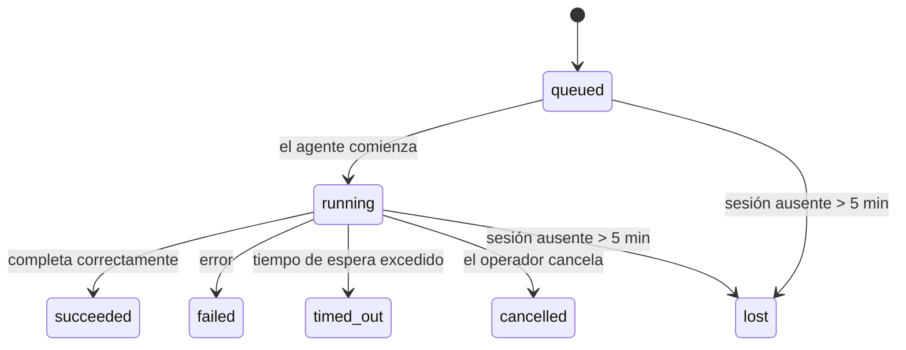

---
read_when:
    - Inspeccionando el trabajo en segundo plano en curso o completado recientemente
    - Depuración de errores de entrega en ejecuciones desacopladas de agentes
    - Comprender cómo las ejecuciones en segundo plano se relacionan con las sesiones, Cron y Heartbeat
summary: Seguimiento de tareas en segundo plano para ejecuciones de ACP, subagentes, trabajos de Cron aislados y operaciones de CLI
title: Tareas en segundo plano
x-i18n:
    generated_at: "2026-04-21T05:12:47Z"
    model: gpt-5.4
    provider: openai
    source_hash: ba5511b1c421bdf505fc7d34f09e453ac44e85213fcb0f082078fa957aa91fe7
    source_path: automation/tasks.md
    workflow: 15
---

# Tareas en segundo plano

> **¿Buscas programación?** Consulta [Automation & Tasks](/es/automation) para elegir el mecanismo adecuado. Esta página cubre el **seguimiento** del trabajo en segundo plano, no su programación.

Las tareas en segundo plano hacen seguimiento del trabajo que se ejecuta **fuera de tu sesión principal de conversación**:
ejecuciones de ACP, lanzamientos de subagentes, ejecuciones aisladas de trabajos de Cron y operaciones iniciadas por la CLI.

Las tareas **no** sustituyen a las sesiones, los trabajos de Cron ni los Heartbeat; son el **registro de actividad** que deja constancia de qué trabajo desacoplado ocurrió, cuándo ocurrió y si tuvo éxito.

<Note>
No todas las ejecuciones de agentes crean una tarea. Los turnos de Heartbeat y el chat interactivo normal no lo hacen. Todas las ejecuciones de Cron, los lanzamientos de ACP, los lanzamientos de subagentes y los comandos de agente desde la CLI sí lo hacen.
</Note>

## En resumen

- Las tareas son **registros**, no programadores: Cron y Heartbeat deciden _cuándo_ se ejecuta el trabajo; las tareas hacen seguimiento de _lo que ocurrió_.
- ACP, los subagentes, todos los trabajos de Cron y las operaciones de CLI crean tareas. Los turnos de Heartbeat no.
- Cada tarea pasa por `queued → running → terminal` (`succeeded`, `failed`, `timed_out`, `cancelled` o `lost`).
- Las tareas de Cron permanecen activas mientras el entorno de ejecución de Cron siga siendo propietario del trabajo; las tareas de CLI respaldadas por chat permanecen activas solo mientras el contexto de ejecución propietario siga activo.
- La finalización se basa en envío: el trabajo desacoplado puede notificar directamente o reactivar la sesión/Heartbeat solicitante cuando termina, por lo que los bucles de sondeo de estado normalmente no son el enfoque adecuado.
- Las ejecuciones aisladas de Cron y las finalizaciones de subagentes limpian en la medida de lo posible las pestañas/procesos de navegador rastreados para su sesión hija antes de la limpieza contable final.
- La entrega de ejecuciones aisladas de Cron suprime respuestas intermedias obsoletas del padre mientras el trabajo de subagentes descendientes sigue vaciándose, y da preferencia a la salida final descendiente cuando esta llega antes de la entrega.
- Las notificaciones de finalización se entregan directamente a un canal o se ponen en cola para el siguiente Heartbeat.
- `openclaw tasks list` muestra todas las tareas; `openclaw tasks audit` muestra los problemas.
- Los registros terminales se conservan durante 7 días y luego se eliminan automáticamente.

## Inicio rápido

```bash
# Lista todas las tareas (las más nuevas primero)
openclaw tasks list

# Filtra por entorno de ejecución o estado
openclaw tasks list --runtime acp
openclaw tasks list --status running

# Muestra los detalles de una tarea específica (por ID, ID de ejecución o clave de sesión)
openclaw tasks show <lookup>

# Cancela una tarea en ejecución (mata la sesión hija)
openclaw tasks cancel <lookup>

# Cambia la política de notificación de una tarea
openclaw tasks notify <lookup> state_changes

# Ejecuta una auditoría de estado
openclaw tasks audit

# Previsualiza o aplica mantenimiento
openclaw tasks maintenance
openclaw tasks maintenance --apply

# Inspecciona el estado de TaskFlow
openclaw tasks flow list
openclaw tasks flow show <lookup>
openclaw tasks flow cancel <lookup>
```

## Qué crea una tarea

| Origen                 | Tipo de entorno de ejecución | Cuándo se crea un registro de tarea                      | Política de notificación predeterminada |
| ---------------------- | ---------------------------- | -------------------------------------------------------- | --------------------------------------- |
| Ejecuciones en segundo plano de ACP | `acp`        | Al lanzar una sesión hija de ACP                         | `done_only`                             |
| Orquestación de subagentes | `subagent`   | Al lanzar un subagente mediante `sessions_spawn`         | `done_only`                             |
| Trabajos de Cron (todos los tipos) | `cron`       | En cada ejecución de Cron (sesión principal y aislada)   | `silent`                                |
| Operaciones de CLI         | `cli`        | Comandos `openclaw agent` que se ejecutan por el Gateway | `silent`                                |
| Trabajos de medios del agente       | `cli`        | Ejecuciones `video_generate` respaldadas por sesión      | `silent`                                |

Las tareas de Cron de la sesión principal usan `silent` como política de notificación predeterminada: crean registros para seguimiento, pero no generan notificaciones. Las tareas de Cron aisladas también usan `silent` de forma predeterminada, pero son más visibles porque se ejecutan en su propia sesión.

Las ejecuciones `video_generate` respaldadas por sesión también usan `silent` como política de notificación predeterminada. Siguen creando registros de tareas, pero la finalización se devuelve a la sesión original del agente como una reactivación interna para que el agente pueda escribir el mensaje de seguimiento y adjuntar él mismo el video terminado. Si activas `tools.media.asyncCompletion.directSend`, las finalizaciones asíncronas de `music_generate` y `video_generate` intentan primero la entrega directa al canal antes de recurrir a la ruta de reactivación de la sesión solicitante.

Mientras una tarea `video_generate` respaldada por sesión sigue activa, la herramienta también actúa como barrera de seguridad: las llamadas repetidas a `video_generate` en esa misma sesión devuelven el estado de la tarea activa en lugar de iniciar una segunda generación simultánea. Usa `action: "status"` cuando quieras una consulta explícita de progreso/estado desde el lado del agente.

**Qué no crea tareas:**

- Turnos de Heartbeat: sesión principal; consulta [Heartbeat](/es/gateway/heartbeat)
- Turnos normales de chat interactivo
- Respuestas directas de `/command`

## Ciclo de vida de la tarea



| Estado      | Qué significa                                                             |
| ----------- | ------------------------------------------------------------------------- |
| `queued`    | Creada, esperando a que el agente comience                                |
| `running`   | El turno del agente se está ejecutando activamente                        |
| `succeeded` | Finalizó correctamente                                                    |
| `failed`    | Finalizó con un error                                                     |
| `timed_out` | Superó el tiempo de espera configurado                                    |
| `cancelled` | Detenida por el operador mediante `openclaw tasks cancel`                 |
| `lost`      | El entorno de ejecución perdió el estado de respaldo autoritativo tras un período de gracia de 5 minutos |

Las transiciones ocurren automáticamente: cuando termina la ejecución del agente asociada, el estado de la tarea se actualiza para reflejarlo.

`lost` depende del entorno de ejecución:

- Tareas de ACP: desaparecieron los metadatos de respaldo de la sesión hija de ACP.
- Tareas de subagentes: la sesión hija de respaldo desapareció del almacén del agente de destino.
- Tareas de Cron: el entorno de ejecución de Cron ya no rastrea el trabajo como activo.
- Tareas de CLI: las tareas aisladas de sesión hija usan la sesión hija; las tareas de CLI respaldadas por chat usan en su lugar el contexto de ejecución activo, por lo que las filas persistentes de sesión de canal/grupo/directa no las mantienen activas.

## Entrega y notificaciones

Cuando una tarea alcanza un estado terminal, OpenClaw te lo notifica. Hay dos rutas de entrega:

**Entrega directa**: si la tarea tiene un destino de canal (el `requesterOrigin`), el mensaje de finalización va directamente a ese canal (Telegram, Discord, Slack, etc.). Para las finalizaciones de subagentes, OpenClaw también conserva el enrutamiento de hilo/tema vinculado cuando está disponible y puede completar un `to` o cuenta ausentes a partir de la ruta almacenada de la sesión solicitante (`lastChannel` / `lastTo` / `lastAccountId`) antes de abandonar la entrega directa.

**Entrega en cola de sesión**: si la entrega directa falla o no se establece un origen, la actualización se pone en cola como un evento del sistema en la sesión del solicitante y aparece en el siguiente Heartbeat.

<Tip>
La finalización de una tarea activa una reactivación inmediata de Heartbeat para que veas el resultado rápidamente; no tienes que esperar al siguiente tick programado de Heartbeat.
</Tip>

Eso significa que el flujo de trabajo habitual se basa en envío: inicia el trabajo desacoplado una vez y luego deja que el entorno de ejecución te reactive o te notifique al completarse. Sondea el estado de la tarea solo cuando necesites depuración, intervención o una auditoría explícita.

### Políticas de notificación

Controla cuánto quieres saber sobre cada tarea:

| Política              | Qué se entrega                                                          |
| --------------------- | ----------------------------------------------------------------------- |
| `done_only` (predeterminada) | Solo el estado terminal (`succeeded`, `failed`, etc.); **esta es la opción predeterminada** |
| `state_changes`       | Cada transición de estado y actualización de progreso                   |
| `silent`              | Nada en absoluto                                                        |

Cambia la política mientras una tarea está en ejecución:

```bash
openclaw tasks notify <lookup> state_changes
```

## Referencia de CLI

### `tasks list`

```bash
openclaw tasks list [--runtime <acp|subagent|cron|cli>] [--status <status>] [--json]
```

Columnas de salida: ID de tarea, tipo, estado, entrega, ID de ejecución, sesión hija, resumen.

### `tasks show`

```bash
openclaw tasks show <lookup>
```

El token de búsqueda acepta un ID de tarea, ID de ejecución o clave de sesión. Muestra el registro completo, incluidos tiempo, estado de entrega, error y resumen terminal.

### `tasks cancel`

```bash
openclaw tasks cancel <lookup>
```

Para tareas de ACP y subagentes, esto mata la sesión hija. Para tareas rastreadas por CLI, la cancelación se registra en el registro de tareas (no hay un identificador independiente del entorno de ejecución hijo). El estado pasa a `cancelled` y se envía una notificación de entrega cuando corresponde.

### `tasks notify`

```bash
openclaw tasks notify <lookup> <done_only|state_changes|silent>
```

### `tasks audit`

```bash
openclaw tasks audit [--json]
```

Muestra problemas operativos. Los hallazgos también aparecen en `openclaw status` cuando se detectan problemas.

| Hallazgo                  | Severidad | Disparador                                            |
| ------------------------- | --------- | ----------------------------------------------------- |
| `stale_queued`            | warn      | En cola durante más de 10 minutos                     |
| `stale_running`           | error     | En ejecución durante más de 30 minutos                |
| `lost`                    | error     | Desapareció la propiedad de la tarea respaldada por el entorno de ejecución |
| `delivery_failed`         | warn      | La entrega falló y la política de notificación no es `silent` |
| `missing_cleanup`         | warn      | Tarea terminal sin marca de tiempo de limpieza        |
| `inconsistent_timestamps` | warn      | Violación de la línea temporal (por ejemplo, terminó antes de empezar) |

### `tasks maintenance`

```bash
openclaw tasks maintenance [--json]
openclaw tasks maintenance --apply [--json]
```

Usa esto para previsualizar o aplicar conciliación, marcado de limpieza y depuración para las tareas y el estado de Task Flow.

La conciliación depende del entorno de ejecución:

- Las tareas de ACP/subagentes verifican su sesión hija de respaldo.
- Las tareas de Cron verifican si el entorno de ejecución de Cron sigue siendo propietario del trabajo.
- Las tareas de CLI respaldadas por chat verifican el contexto de ejecución activo propietario, no solo la fila de sesión de chat.

La limpieza de finalización también depende del entorno de ejecución:

- La finalización de subagentes cierra en la medida de lo posible las pestañas/procesos de navegador rastreados para la sesión hija antes de que continúe la limpieza del anuncio.
- La finalización de Cron aislado cierra en la medida de lo posible las pestañas/procesos de navegador rastreados para la sesión de Cron antes de que la ejecución se desmonte por completo.
- La entrega de Cron aislado espera el seguimiento de subagentes descendientes cuando es necesario y suprime el texto obsoleto de acuse de recibo del padre en lugar de anunciarlo.
- La entrega de finalización de subagentes da preferencia al texto visible más reciente del asistente; si está vacío, recurre al texto sanitizado más reciente de `tool`/`toolResult`, y las ejecuciones de solo llamada a herramienta que terminan por tiempo de espera pueden resumirse en un breve resumen de progreso parcial.
- Los errores de limpieza no ocultan el resultado real de la tarea.

### `tasks flow list|show|cancel`

```bash
openclaw tasks flow list [--status <status>] [--json]
openclaw tasks flow show <lookup> [--json]
openclaw tasks flow cancel <lookup>
```

Úsalos cuando lo que te importa es el TaskFlow orquestador y no un registro individual de tarea en segundo plano.

## Tablero de tareas del chat (`/tasks`)

Usa `/tasks` en cualquier sesión de chat para ver las tareas en segundo plano vinculadas a esa sesión. El tablero muestra
tareas activas y completadas recientemente con el entorno de ejecución, estado, tiempo y detalles de progreso o error.

Cuando la sesión actual no tiene tareas vinculadas visibles, `/tasks` recurre a los conteos de tareas locales del agente
para que sigas obteniendo una visión general sin filtrar detalles de otras sesiones.

Para el registro completo del operador, usa la CLI: `openclaw tasks list`.

## Integración de estado (presión de tareas)

`openclaw status` incluye un resumen de tareas de un vistazo:

```
Tasks: 3 queued · 2 running · 1 issues
```

El resumen informa:

- **active** — recuento de `queued` + `running`
- **failures** — recuento de `failed` + `timed_out` + `lost`
- **byRuntime** — desglose por `acp`, `subagent`, `cron`, `cli`

Tanto `/status` como la herramienta `session_status` usan una instantánea de tareas con reconocimiento de limpieza: se da prioridad a las tareas activas, las filas completadas obsoletas se ocultan y los fallos recientes solo aparecen cuando ya no queda trabajo activo. Esto mantiene la tarjeta de estado centrada en lo que importa en este momento.

## Almacenamiento y mantenimiento

### Dónde viven las tareas

Los registros de tareas persisten en SQLite en:

```
$OPENCLAW_STATE_DIR/tasks/runs.sqlite
```

El registro se carga en memoria al iniciar el Gateway y sincroniza las escrituras con SQLite para garantizar durabilidad entre reinicios.

### Mantenimiento automático

Un proceso de barrido se ejecuta cada **60 segundos** y gestiona tres cosas:

1. **Conciliación** — comprueba si las tareas activas siguen teniendo un respaldo autoritativo del entorno de ejecución. Las tareas de ACP/subagentes usan el estado de la sesión hija, las tareas de Cron usan la propiedad del trabajo activo y las tareas de CLI respaldadas por chat usan el contexto de ejecución propietario. Si ese estado de respaldo desaparece durante más de 5 minutos, la tarea se marca como `lost`.
2. **Marcado de limpieza** — establece una marca de tiempo `cleanupAfter` en las tareas terminales (`endedAt` + 7 días).
3. **Depuración** — elimina los registros que han superado su fecha `cleanupAfter`.

**Retención**: los registros de tareas terminales se conservan durante **7 días** y luego se depuran automáticamente. No se necesita configuración.

## Cómo se relacionan las tareas con otros sistemas

### Tareas y TaskFlow

[TaskFlow](/es/automation/taskflow) es la capa de orquestación de flujos por encima de las tareas en segundo plano. Un único flujo puede coordinar varias tareas a lo largo de su ciclo de vida mediante modos de sincronización administrados o reflejados. Usa `openclaw tasks` para inspeccionar registros individuales de tareas y `openclaw tasks flow` para inspeccionar el flujo orquestador.

Consulta [TaskFlow](/es/automation/taskflow) para más detalles.

### Tareas y Cron

La **definición** de un trabajo de Cron vive en `~/.openclaw/cron/jobs.json`; el estado de ejecución vive junto a ella en `~/.openclaw/cron/jobs-state.json`. **Cada** ejecución de Cron crea un registro de tarea, tanto en la sesión principal como en modo aislado. Las tareas de Cron de la sesión principal usan `silent` como política de notificación predeterminada para hacer seguimiento sin generar notificaciones.

Consulta [Cron Jobs](/es/automation/cron-jobs).

### Tareas y Heartbeat

Las ejecuciones de Heartbeat son turnos de la sesión principal; no crean registros de tareas. Cuando una tarea termina, puede activar una reactivación de Heartbeat para que veas el resultado con rapidez.

Consulta [Heartbeat](/es/gateway/heartbeat).

### Tareas y sesiones

Una tarea puede hacer referencia a un `childSessionKey` (donde se ejecuta el trabajo) y a un `requesterSessionKey` (quién lo inició). Las sesiones son el contexto de conversación; las tareas son el seguimiento de actividad por encima de ese contexto.

### Tareas y ejecuciones de agentes

El `runId` de una tarea enlaza con la ejecución del agente que realiza el trabajo. Los eventos del ciclo de vida del agente (inicio, fin, error) actualizan automáticamente el estado de la tarea; no necesitas gestionar manualmente el ciclo de vida.

## Relacionado

- [Automation & Tasks](/es/automation) — todos los mecanismos de automatización de un vistazo
- [TaskFlow](/es/automation/taskflow) — orquestación de flujos por encima de las tareas
- [Scheduled Tasks](/es/automation/cron-jobs) — programación de trabajo en segundo plano
- [Heartbeat](/es/gateway/heartbeat) — turnos periódicos de la sesión principal
- [CLI: Tasks](/cli/index#tasks) — referencia de comandos de la CLI
