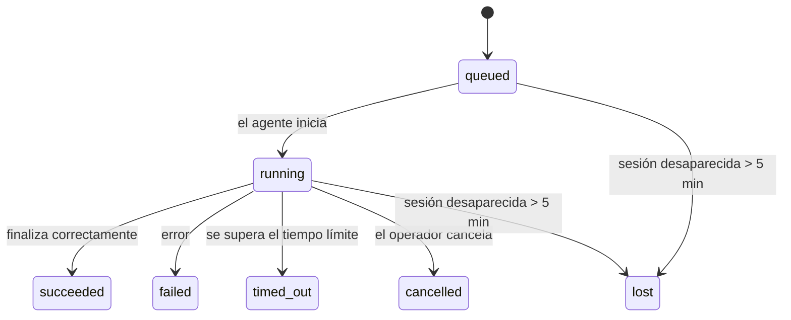

---
read_when:
    - Inspeccionar el trabajo en segundo plano en curso o completado recientemente
    - Depuración de fallos de entrega en ejecuciones desacopladas de agentes
    - Comprender cómo las ejecuciones en segundo plano se relacionan con las sesiones, Cron y Heartbeat
sidebarTitle: Background tasks
summary: Seguimiento de tareas en segundo plano para ejecuciones de ACP, subagentes, trabajos de Cron aislados y operaciones de CLI
title: Tareas en segundo plano
x-i18n:
    generated_at: "2026-04-26T11:23:02Z"
    model: gpt-5.4
    provider: openai
    source_hash: 46952a378babdee9f43102bfa71dbd35b6ca7ecb142ffce3785eeb479e19d6b6
    source_path: automation/tasks.md
    workflow: 15
---

<Note>
¿Buscas programación? Consulta [Automatización y tareas](/es/automation) para elegir el mecanismo adecuado. Esta página cubre el **seguimiento** del trabajo en segundo plano, no su programación.
</Note>

Las tareas en segundo plano registran el trabajo que se ejecuta **fuera de tu sesión principal de conversación**: ejecuciones de ACP, creación de subagentes, ejecuciones aisladas de trabajos de Cron y operaciones iniciadas desde la CLI.

Las tareas **no** reemplazan a las sesiones, los trabajos de Cron ni los Heartbeats: son el **registro de actividad** que documenta qué trabajo desacoplado ocurrió, cuándo ocurrió y si se completó correctamente.

<Note>
No todas las ejecuciones de agentes crean una tarea. Los turnos de Heartbeat y el chat interactivo normal no lo hacen. Todas las ejecuciones de Cron, creaciones de ACP, creaciones de subagentes y comandos de agente de CLI sí lo hacen.
</Note>

## Resumen rápido

- Las tareas son **registros**, no programadores: Cron y Heartbeat deciden _cuándo_ se ejecuta el trabajo; las tareas registran _qué ocurrió_.
- ACP, los subagentes, todos los trabajos de Cron y las operaciones de CLI crean tareas. Los turnos de Heartbeat no.
- Cada tarea pasa por `queued → running → terminal` (`succeeded`, `failed`, `timed_out`, `cancelled` o `lost`).
- Las tareas de Cron permanecen activas mientras el runtime de Cron siga siendo propietario del trabajo; si el estado del runtime en memoria desaparece, el mantenimiento de tareas primero comprueba el historial duradero de ejecuciones de Cron antes de marcar una tarea como `lost`.
- La finalización está impulsada por notificaciones push: el trabajo desacoplado puede notificar directamente o activar la sesión solicitante/el Heartbeat cuando termina, por lo que los bucles de sondeo de estado normalmente no son el enfoque adecuado.
- Las ejecuciones aisladas de Cron y las finalizaciones de subagentes limpian, en el mejor esfuerzo posible, las pestañas/procesos de navegador rastreados de su sesión hija antes del registro final de limpieza.
- La entrega de Cron aislado suprime respuestas intermedias obsoletas del padre mientras el trabajo de subagentes descendientes todavía se está vaciando, y prefiere la salida final del descendiente cuando llega antes de la entrega.
- Las notificaciones de finalización se entregan directamente a un canal o se ponen en cola para el siguiente Heartbeat.
- `openclaw tasks list` muestra todas las tareas; `openclaw tasks audit` muestra los problemas.
- Los registros terminales se conservan durante 7 días y luego se eliminan automáticamente.

## Inicio rápido

<Tabs>
  <Tab title="Listar y filtrar">
    ```bash
    # Lista todas las tareas (las más recientes primero)
    openclaw tasks list

    # Filtra por runtime o estado
    openclaw tasks list --runtime acp
    openclaw tasks list --status running
    ```

  </Tab>
  <Tab title="Inspeccionar">
    ```bash
    # Muestra los detalles de una tarea específica (por ID, ID de ejecución o clave de sesión)
    openclaw tasks show <lookup>
    ```
  </Tab>
  <Tab title="Cancelar y notificar">
    ```bash
    # Cancela una tarea en ejecución (mata la sesión hija)
    openclaw tasks cancel <lookup>

    # Cambia la política de notificación de una tarea
    openclaw tasks notify <lookup> state_changes
    ```

  </Tab>
  <Tab title="Auditoría y mantenimiento">
    ```bash
    # Ejecuta una auditoría de estado
    openclaw tasks audit

    # Previsualiza o aplica mantenimiento
    openclaw tasks maintenance
    openclaw tasks maintenance --apply
    ```

  </Tab>
  <Tab title="Flujo de tareas">
    ```bash
    # Inspecciona el estado de TaskFlow
    openclaw tasks flow list
    openclaw tasks flow show <lookup>
    openclaw tasks flow cancel <lookup>
    ```
  </Tab>
</Tabs>

## Qué crea una tarea

| Origen                 | Tipo de runtime | Cuándo se crea un registro de tarea                    | Política de notificación predeterminada |
| ---------------------- | --------------- | ------------------------------------------------------ | --------------------------------------- |
| Ejecuciones en segundo plano de ACP | `acp`        | Al crear una sesión hija de ACP                        | `done_only`                             |
| Orquestación de subagentes | `subagent`   | Al crear un subagente mediante `sessions_spawn`        | `done_only`                             |
| Trabajos de Cron (todos los tipos) | `cron`       | En cada ejecución de Cron (sesión principal y aislada) | `silent`                                |
| Operaciones de CLI     | `cli`           | Comandos `openclaw agent` que se ejecutan a través del Gateway | `silent`                          |
| Trabajos multimedia del agente | `cli`     | Ejecuciones de `video_generate` respaldadas por sesión | `silent`                                |

<AccordionGroup>
  <Accordion title="Valores predeterminados de notificación para Cron y multimedia">
    Las tareas de Cron de sesión principal usan la política de notificación `silent` de forma predeterminada: crean registros para seguimiento, pero no generan notificaciones. Las tareas de Cron aisladas también usan `silent` de forma predeterminada, pero son más visibles porque se ejecutan en su propia sesión.

    Las ejecuciones de `video_generate` respaldadas por sesión también usan la política de notificación `silent`. Siguen creando registros de tarea, pero la finalización se devuelve a la sesión original del agente como una activación interna para que el agente pueda escribir el mensaje de seguimiento y adjuntar él mismo el video finalizado. Si activas `tools.media.asyncCompletion.directSend`, las finalizaciones asíncronas de `music_generate` y `video_generate` intentan primero la entrega directa al canal antes de volver a la ruta de activación de la sesión solicitante.

  </Accordion>
  <Accordion title="Protección contra concurrencia de video_generate">
    Mientras una tarea de `video_generate` respaldada por sesión siga activa, la herramienta también actúa como protección: llamadas repetidas a `video_generate` en esa misma sesión devuelven el estado de la tarea activa en lugar de iniciar una segunda generación concurrente. Usa `action: "status"` cuando quieras una consulta explícita de progreso/estado desde el lado del agente.
  </Accordion>
  <Accordion title="Qué no crea tareas">
    - Turnos de Heartbeat: sesión principal; consulta [Heartbeat](/es/gateway/heartbeat)
    - Turnos normales de chat interactivo
    - Respuestas directas de `/command`
  </Accordion>
</AccordionGroup>

## Ciclo de vida de la tarea



| Estado      | Qué significa                                                             |
| ----------- | ------------------------------------------------------------------------- |
| `queued`    | Se creó y está esperando a que el agente inicie                           |
| `running`   | El turno del agente se está ejecutando activamente                        |
| `succeeded` | Se completó correctamente                                                 |
| `failed`    | Se completó con un error                                                  |
| `timed_out` | Superó el tiempo límite configurado                                       |
| `cancelled` | Lo detuvo el operador mediante `openclaw tasks cancel`                    |
| `lost`      | El runtime perdió el estado de respaldo autoritativo tras un período de gracia de 5 minutos |

Las transiciones ocurren automáticamente: cuando finaliza la ejecución del agente asociada, el estado de la tarea se actualiza para reflejarlo.

La finalización de la ejecución del agente es autoritativa para los registros de tareas activas. Una ejecución desacoplada correcta finaliza como `succeeded`, los errores normales de ejecución finalizan como `failed`, y los resultados por tiempo de espera o aborto finalizan como `timed_out`. Si un operador ya canceló la tarea, o si el runtime ya registró un estado terminal más fuerte como `failed`, `timed_out` o `lost`, una señal posterior de éxito no degrada ese estado terminal.

`lost` depende del runtime:

- Tareas de ACP: desaparecieron los metadatos de la sesión hija de ACP.
- Tareas de subagente: la sesión hija de respaldo desapareció del almacén del agente de destino.
- Tareas de Cron: el runtime de Cron ya no rastrea el trabajo como activo y el historial duradero de ejecuciones de Cron no muestra un resultado terminal para esa ejecución. La auditoría offline de CLI no trata su propio estado vacío del runtime de Cron en proceso como autoritativo.
- Tareas de CLI: las tareas de sesión hija aislada usan la sesión hija; las tareas de CLI respaldadas por chat usan en su lugar el contexto de ejecución activo, por lo que las filas persistentes de sesión de canal/grupo/directa no las mantienen activas. Las ejecuciones de `openclaw agent` respaldadas por Gateway también finalizan a partir de su resultado de ejecución, por lo que las ejecuciones completadas no permanecen activas hasta que el recolector las marque como `lost`.

## Entrega y notificaciones

Cuando una tarea alcanza un estado terminal, OpenClaw te notifica. Hay dos rutas de entrega:

**Entrega directa**: si la tarea tiene un destino de canal (el `requesterOrigin`), el mensaje de finalización va directamente a ese canal (Telegram, Discord, Slack, etc.). Para las finalizaciones de subagentes, OpenClaw también conserva el enrutamiento del hilo/tema vinculado cuando está disponible y puede completar un `to` / cuenta faltante a partir de la ruta almacenada de la sesión solicitante (`lastChannel` / `lastTo` / `lastAccountId`) antes de abandonar la entrega directa.

**Entrega en cola de sesión**: si la entrega directa falla o no se establece un origen, la actualización se pone en cola como un evento del sistema en la sesión del solicitante y aparece en el siguiente Heartbeat.

<Tip>
La finalización de tareas activa un Heartbeat inmediato para que veas el resultado rápidamente; no tienes que esperar al siguiente tick programado de Heartbeat.
</Tip>

Eso significa que el flujo habitual se basa en push: inicia el trabajo desacoplado una vez y luego deja que el runtime te active o te notifique al completarse. Consulta el estado de la tarea solo cuando necesites depuración, intervención o una auditoría explícita.

### Políticas de notificación

Controla cuánto quieres recibir de cada tarea:

| Política              | Qué se entrega                                                           |
| --------------------- | ------------------------------------------------------------------------ |
| `done_only` (predeterminada) | Solo el estado terminal (`succeeded`, `failed`, etc.): **este es el valor predeterminado** |
| `state_changes`       | Cada transición de estado y actualización de progreso                    |
| `silent`              | Nada en absoluto                                                         |

Cambia la política mientras una tarea está en ejecución:

```bash
openclaw tasks notify <lookup> state_changes
```

## Referencia de CLI

<AccordionGroup>
  <Accordion title="tasks list">
    ```bash
    openclaw tasks list [--runtime <acp|subagent|cron|cli>] [--status <status>] [--json]
    ```

    Columnas de salida: ID de tarea, Tipo, Estado, Entrega, ID de ejecución, Sesión hija, Resumen.

  </Accordion>
  <Accordion title="tasks show">
    ```bash
    openclaw tasks show <lookup>
    ```

    El token de búsqueda acepta un ID de tarea, un ID de ejecución o una clave de sesión. Muestra el registro completo, incluidos tiempos, estado de entrega, error y resumen terminal.

  </Accordion>
  <Accordion title="tasks cancel">
    ```bash
    openclaw tasks cancel <lookup>
    ```

    Para las tareas de ACP y subagentes, esto mata la sesión hija. Para las tareas rastreadas por CLI, la cancelación se registra en el registro de tareas (no hay un identificador de runtime hijo independiente). El estado pasa a `cancelled` y se envía una notificación de entrega cuando corresponde.

  </Accordion>
  <Accordion title="tasks notify">
    ```bash
    openclaw tasks notify <lookup> <done_only|state_changes|silent>
    ```
  </Accordion>
  <Accordion title="tasks audit">
    ```bash
    openclaw tasks audit [--json]
    ```

    Muestra problemas operativos. Los hallazgos también aparecen en `openclaw status` cuando se detectan problemas.

    | Hallazgo                 | Severidad  | Disparador                                                                                                   |
| ------------------------ | ---------- | ------------------------------------------------------------------------------------------------------------ |
| `stale_queued`           | warn       | En cola durante más de 10 minutos                                                                            |
| `stale_running`          | error      | En ejecución durante más de 30 minutos                                                                       |
| `lost`                   | warn/error | La propiedad de la tarea respaldada por el runtime desapareció; las tareas perdidas retenidas muestran advertencia hasta `cleanupAfter`, y luego pasan a ser errores |
| `delivery_failed`        | warn       | La entrega falló y la política de notificación no es `silent`                                                |
| `missing_cleanup`        | warn       | Tarea terminal sin marca de tiempo de limpieza                                                               |
| `inconsistent_timestamps`| warn       | Violación de la cronología (por ejemplo, terminó antes de comenzar)                                          |

  </Accordion>
  <Accordion title="tasks maintenance">
    ```bash
    openclaw tasks maintenance [--json]
    openclaw tasks maintenance --apply [--json]
    ```

    Usa esto para previsualizar o aplicar reconciliación, marcado de limpieza y depuración para las tareas y el estado de Task Flow.

    La reconciliación depende del runtime:

    - Las tareas de ACP/subagente comprueban su sesión hija de respaldo.
    - Las tareas de Cron comprueban si el runtime de Cron sigue siendo propietario del trabajo y luego recuperan el estado terminal de los registros persistidos de ejecuciones/estado del trabajo de Cron antes de recurrir a `lost`. Solo el proceso Gateway es autoritativo para el conjunto en memoria de trabajos activos de Cron; la auditoría offline de CLI usa historial duradero, pero no marca una tarea de Cron como `lost` únicamente porque ese `Set` local esté vacío.
    - Las tareas de CLI respaldadas por chat comprueban el contexto activo de ejecución propietario, no solo la fila de sesión de chat.

    La limpieza de finalización también depende del runtime:

    - La finalización de subagentes cierra, en el mejor esfuerzo posible, las pestañas/procesos de navegador rastreados para la sesión hija antes de que continúe la limpieza del anuncio.
    - La finalización de Cron aislado cierra, en el mejor esfuerzo posible, las pestañas/procesos de navegador rastreados para la sesión de Cron antes de que la ejecución se desmonte por completo.
    - La entrega de Cron aislado espera, cuando es necesario, a que termine el seguimiento del subagente descendiente y suprime el texto obsoleto de acuse de recibo del padre en lugar de anunciarlo.
    - La entrega de finalización de subagentes prefiere el texto visible más reciente del asistente; si está vacío, recurre al texto saneado más reciente de tool/toolResult, y las ejecuciones de solo llamada de herramienta con tiempo de espera pueden reducirse a un breve resumen de progreso parcial. Las ejecuciones terminales fallidas anuncian el estado de error sin volver a reproducir el texto de respuesta capturado.
    - Los fallos de limpieza no ocultan el resultado real de la tarea.

  </Accordion>
  <Accordion title="tasks flow list | show | cancel">
    ```bash
    openclaw tasks flow list [--status <status>] [--json]
    openclaw tasks flow show <lookup> [--json]
    openclaw tasks flow cancel <lookup>
    ```

    Usa estos comandos cuando lo que te importe sea el Task Flow de orquestación, en lugar de un registro individual de tarea en segundo plano.

  </Accordion>
</AccordionGroup>

## Tablero de tareas del chat (`/tasks`)

Usa `/tasks` en cualquier sesión de chat para ver las tareas en segundo plano vinculadas a esa sesión. El tablero muestra tareas activas y completadas recientemente con runtime, estado, tiempos y detalles de progreso o error.

Cuando la sesión actual no tiene tareas vinculadas visibles, `/tasks` recurre a los recuentos de tareas locales del agente para que sigas teniendo una visión general sin filtrar detalles de otras sesiones.

Para el registro completo del operador, usa la CLI: `openclaw tasks list`.

## Integración de estado (presión de tareas)

`openclaw status` incluye un resumen de tareas de un vistazo:

```
Tasks: 3 queued · 2 running · 1 issues
```

El resumen informa de lo siguiente:

- **active** — recuento de `queued` + `running`
- **failures** — recuento de `failed` + `timed_out` + `lost`
- **byRuntime** — desglose por `acp`, `subagent`, `cron`, `cli`

Tanto `/status` como la herramienta `session_status` usan una instantánea de tareas consciente de la limpieza: se prefieren las tareas activas, las filas completadas obsoletas se ocultan y los fallos recientes solo aparecen cuando no queda trabajo activo. Esto mantiene la tarjeta de estado centrada en lo que importa en este momento.

## Almacenamiento y mantenimiento

### Dónde viven las tareas

Los registros de tareas persisten en SQLite en:

```
$OPENCLAW_STATE_DIR/tasks/runs.sqlite
```

El registro se carga en memoria al iniciar el Gateway y sincroniza las escrituras con SQLite para ofrecer durabilidad entre reinicios.

### Mantenimiento automático

Un recolector se ejecuta cada **60 segundos** y se encarga de tres cosas:

<Steps>
  <Step title="Reconciliación">
    Comprueba si las tareas activas siguen teniendo respaldo autoritativo del runtime. Las tareas de ACP/subagente usan el estado de la sesión hija, las tareas de Cron usan la propiedad del trabajo activo y las tareas de CLI respaldadas por chat usan el contexto de ejecución propietario. Si ese estado de respaldo desaparece durante más de 5 minutos, la tarea se marca como `lost`.
  </Step>
  <Step title="Marcado de limpieza">
    Establece una marca de tiempo `cleanupAfter` en las tareas terminales (`endedAt + 7 days`). Durante la retención, las tareas perdidas siguen apareciendo en la auditoría como advertencias; después de que expire `cleanupAfter` o cuando falten metadatos de limpieza, pasan a ser errores.
  </Step>
  <Step title="Depuración">
    Elimina los registros que superaron su fecha `cleanupAfter`.
  </Step>
</Steps>

<Note>
**Retención:** los registros terminales de tareas se conservan durante **7 días** y luego se depuran automáticamente. No se necesita ninguna configuración.
</Note>

## Cómo se relacionan las tareas con otros sistemas

<AccordionGroup>
  <Accordion title="Tareas y Task Flow">
    [Task Flow](/es/automation/taskflow) es la capa de orquestación de flujos por encima de las tareas en segundo plano. Un solo flujo puede coordinar múltiples tareas a lo largo de su vida útil usando modos de sincronización administrados o reflejados. Usa `openclaw tasks` para inspeccionar registros individuales de tareas y `openclaw tasks flow` para inspeccionar el flujo de orquestación.

    Consulta [Task Flow](/es/automation/taskflow) para más detalles.

  </Accordion>
  <Accordion title="Tareas y Cron">
    Una **definición** de trabajo de Cron vive en `~/.openclaw/cron/jobs.json`; el estado de ejecución del runtime vive junto a ella en `~/.openclaw/cron/jobs-state.json`. **Cada** ejecución de Cron crea un registro de tarea, tanto en sesión principal como aislada. Las tareas de Cron de sesión principal usan `silent` como política de notificación predeterminada, por lo que hacen seguimiento sin generar notificaciones.

    Consulta [Trabajos de Cron](/es/automation/cron-jobs).

  </Accordion>
  <Accordion title="Tareas y Heartbeat">
    Las ejecuciones de Heartbeat son turnos de sesión principal: no crean registros de tarea. Cuando una tarea se completa, puede activar un Heartbeat para que veas el resultado con rapidez.

    Consulta [Heartbeat](/es/gateway/heartbeat).

  </Accordion>
  <Accordion title="Tareas y sesiones">
    Una tarea puede hacer referencia a una `childSessionKey` (donde se ejecuta el trabajo) y a una `requesterSessionKey` (quién la inició). Las sesiones son el contexto de la conversación; las tareas son el seguimiento de actividad sobre ese contexto.
  </Accordion>
  <Accordion title="Tareas y ejecuciones de agentes">
    El `runId` de una tarea enlaza con la ejecución del agente que realiza el trabajo. Los eventos del ciclo de vida del agente (inicio, fin, error) actualizan automáticamente el estado de la tarea; no necesitas gestionar el ciclo de vida manualmente.
  </Accordion>
</AccordionGroup>

## Relacionado

- [Automatización y tareas](/es/automation) — todos los mecanismos de automatización de un vistazo
- [CLI: Tasks](/es/cli/tasks) — referencia de comandos de CLI
- [Heartbeat](/es/gateway/heartbeat) — turnos periódicos de la sesión principal
- [Tareas programadas](/es/automation/cron-jobs) — programación de trabajo en segundo plano
- [Task Flow](/es/automation/taskflow) — orquestación de flujos por encima de las tareas
