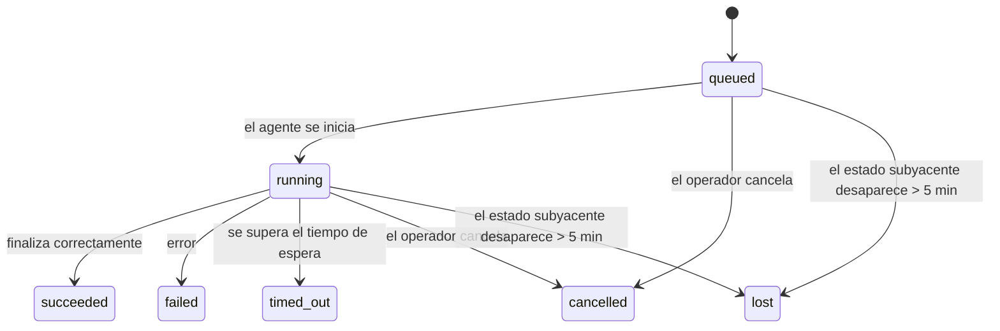

---
read_when:
    - Inspección del trabajo en segundo plano en curso o completado recientemente
    - Depuración de errores de entrega en ejecuciones de agentes desvinculadas
    - Comprender cómo se relacionan las ejecuciones en segundo plano con las sesiones, Cron y Heartbeat
sidebarTitle: Background tasks
summary: Seguimiento de tareas en segundo plano para ejecuciones de ACP, subagentes, ejecuciones de Cron y operaciones de la CLI
title: Tareas en segundo plano
x-i18n:
    generated_at: "2026-07-12T14:17:46Z"
    model: gpt-5.6
    postprocess_version: locale-links-v1
    prompt_version: 15
    provider: openai
    source_hash: 0a945e8103c5df5a64785f326a9d0b08784ac32a2ca6fa3d4c399d75fc54be2b
    source_path: automation/tasks.md
    workflow: 16
---

<Note>
¿Busca opciones de programación? Consulte [Automatización](/es/automation) para elegir el mecanismo adecuado. Esta página es el registro de actividad del trabajo en segundo plano, no el programador.
</Note>

Las tareas en segundo plano registran el trabajo que se ejecuta **fuera de la sesión de conversación principal**: ejecuciones de ACP, creación de subagentes, ejecuciones de trabajos cron y operaciones iniciadas desde la CLI.

Las tareas **no** sustituyen las sesiones, los trabajos cron ni los heartbeats: son el **registro de actividad** que recoge qué trabajo desacoplado se realizó, cuándo y si se completó correctamente.

<Note>
No todas las ejecuciones del agente crean una tarea. Los turnos de heartbeat y el chat interactivo normal no lo hacen. Todas las ejecuciones de cron, las creaciones de ACP, las creaciones de subagentes y los comandos de agente de la CLI enviados por el Gateway sí lo hacen.
</Note>

## Resumen

- Las tareas son **registros**, no programadores: cron y heartbeat deciden _cuándo_ se ejecuta el trabajo; las tareas registran _qué ocurrió_.
- ACP, los subagentes, todos los trabajos cron y las operaciones de la CLI crean tareas. Los turnos de heartbeat no.
- Cada tarea pasa por `queued → running → terminal` (succeeded, failed, timed_out, cancelled o lost).
- Las tareas cron permanecen activas mientras el entorno de ejecución de cron siga siendo responsable del trabajo; si el estado del entorno de ejecución en memoria desaparece, el mantenimiento de tareas consulta primero el historial persistente de ejecuciones de cron antes de marcar una tarea como perdida.
- La finalización se notifica de forma activa: el trabajo desacoplado puede notificar directamente o despertar la sesión solicitante o el heartbeat cuando termina, por lo que los bucles de consulta de estado normalmente no son el enfoque adecuado.
- Las ejecuciones de cron aisladas y las finalizaciones de subagentes intentan, en la medida de lo posible, cerrar las pestañas y los procesos del navegador registrados para su sesión secundaria antes de realizar el registro final de limpieza.
- La entrega de cron aislada suprime las respuestas provisionales obsoletas del agente principal mientras sigue finalizando el trabajo de los subagentes descendientes y da preferencia al resultado final de estos si llega antes de la entrega.
- Las notificaciones de finalización se envían directamente a un canal o se ponen en cola para el siguiente heartbeat.
- `openclaw tasks list` muestra todas las tareas; `openclaw tasks audit` señala los problemas.
- Los registros terminales se conservan durante 7 días (los registros `lost`, durante 24 horas) y después se eliminan automáticamente.

## Inicio rápido

<Tabs>
  <Tab title="Mostrar y filtrar">
    ```bash
    # Mostrar todas las tareas (las más recientes primero)
    openclaw tasks list

    # Filtrar por entorno de ejecución o estado
    openclaw tasks list --runtime acp
    openclaw tasks list --status running
    ```

  </Tab>
  <Tab title="Inspeccionar">
    ```bash
    # Mostrar los detalles de una tarea específica (por ID de tarea, ID de ejecución o clave de sesión)
    openclaw tasks show <lookup>
    ```
  </Tab>
  <Tab title="Cancelar y notificar">
    ```bash
    # Cancelar una tarea en ejecución (finaliza la sesión secundaria)
    openclaw tasks cancel <lookup>

    # Cambiar la política de notificaciones de una tarea
    openclaw tasks notify <lookup> state_changes
    ```

  </Tab>
  <Tab title="Auditoría y mantenimiento">
    ```bash
    # Ejecutar una auditoría de estado
    openclaw tasks audit

    # Previsualizar o aplicar el mantenimiento
    openclaw tasks maintenance
    openclaw tasks maintenance --apply
    ```

  </Tab>
  <Tab title="Flujo de tareas">
    ```bash
    # Inspeccionar el estado de TaskFlow
    openclaw tasks flow list
    openclaw tasks flow show <lookup>
    openclaw tasks flow cancel <lookup>
    ```
  </Tab>
</Tabs>

## Qué crea una tarea

| Origen                   | Tipo de entorno de ejecución | Cuándo se crea un registro de tarea                                     | Política de notificaciones predeterminada |
| ------------------------ | ---------------------------- | ----------------------------------------------------------------------- | ------------------------------------------ |
| Ejecuciones de ACP en segundo plano | `acp`              | Al crear una sesión secundaria de ACP                                   | `done_only`                                |
| Orquestación de subagentes | `subagent`                  | Al crear un subagente mediante `sessions_spawn`                         | `done_only`                                |
| Trabajos cron (todos los tipos) | `cron`                  | En cada ejecución de cron (en la sesión principal y aislada)            | `silent`                                   |
| Operaciones de la CLI    | `cli`                        | Comandos `openclaw agent` que se ejecutan a través del Gateway          | `silent`                                   |
| Trabajos multimedia del agente | `cli`                  | Ejecuciones de `image_generate`/`music_generate`/`video_generate` respaldadas por una sesión | `silent`                  |

<AccordionGroup>
  <Accordion title="Valores predeterminados de notificación para cron y contenido multimedia">
    Las tareas cron (de sesión principal y aisladas) utilizan la política de notificaciones `silent`: crean registros para realizar el seguimiento, pero no generan notificaciones de tarea propias; cron controla su vía de entrega.

    Las ejecuciones de `image_generate`, `music_generate` y `video_generate` respaldadas por una sesión también utilizan la política de notificaciones `silent`. Siguen creando registros de tareas, pero la finalización se devuelve a la sesión original del agente mediante una activación interna para que este pueda escribir el mensaje de seguimiento y adjuntar el contenido multimedia terminado. El agente solicitante sigue su contrato normal de respuesta visible: una respuesta final automática cuando está configurada, o `message(action="send")` junto con `NO_REPLY` cuando la sesión requiere respuestas mediante la herramienta de mensajes. Si la sesión solicitante ya no está activa o falla su activación, y el agente de finalización omite parte o la totalidad del contenido multimedia generado, OpenClaw envía directamente al destino del canal original una alternativa idempotente que contiene únicamente el contenido multimedia faltante.

  </Accordion>
  <Accordion title="Protección para la generación simultánea de contenido multimedia">
    Mientras una tarea de generación de contenido multimedia respaldada por una sesión siga activa, `image_generate`, `music_generate` y `video_generate` evitan los reintentos accidentales: si se repite la llamada con la misma indicación o solicitud, se devuelve el estado de la tarea activa correspondiente en lugar de iniciar un duplicado, mientras que una indicación distinta puede iniciar su propia tarea. Utilice `action: "status"` cuando quiera consultar explícitamente el progreso o el estado desde el agente.
  </Accordion>
  <Accordion title="Qué no crea tareas">
    - Turnos de heartbeat en la sesión principal; consulte [Heartbeat](/es/gateway/heartbeat)
    - Turnos normales de chat interactivo
    - Respuestas directas de `/command`

  </Accordion>
</AccordionGroup>

## Ciclo de vida de las tareas



| Estado      | Qué significa                                                               |
| ----------- | --------------------------------------------------------------------------- |
| `queued`    | Creada, a la espera de que se inicie el agente                              |
| `running`   | El turno del agente se está ejecutando activamente                          |
| `succeeded` | Finalizada correctamente                                                    |
| `failed`    | Finalizada con un error                                                      |
| `timed_out` | Ha superado el tiempo de espera configurado                                 |
| `cancelled` | Detenida por el operador mediante `openclaw tasks cancel` o se abortó la ejecución |
| `lost`      | El entorno de ejecución perdió el estado subyacente autoritativo tras un período de gracia de 5 minutos |

Las transiciones se producen automáticamente: los eventos del ciclo de vida de la ejecución del agente (inicio, fin y error) actualizan el estado de la tarea; no es necesario administrarlo manualmente.

La finalización de la ejecución del agente es la fuente autoritativa para los registros de tareas activas. Una ejecución desacoplada correcta finaliza como `succeeded`, los errores ordinarios de ejecución finalizan como `failed`, los tiempos de espera finalizan como `timed_out` y las cancelaciones o interrupciones finalizan como `cancelled`. Una vez que una tarea alcanza un estado terminal, las señales posteriores del ciclo de vida no rebajan su estado: una tarea cancelada por un operador o que ya tiene el estado `failed`/`timed_out`/`lost` permanece así aunque posteriormente llegue una señal de éxito.

`lost` depende del entorno de ejecución:

- Tareas ACP: solo un turno de ACP activo en el proceso del Gateway demuestra que la ejecución sigue activa; los metadatos persistentes de la sesión por sí solos no lo demuestran. La auditoría sin conexión de la CLI es conservadora y nunca recupera tareas ACP.
- Tareas de subagentes: la sesión secundaria subyacente desapareció del almacén del agente de destino (o contiene una marca de recuperación tras un reinicio).
- Tareas cron: el entorno de ejecución de cron ya no registra el trabajo como activo y el historial persistente de ejecuciones de cron no muestra un resultado terminal para esa ejecución. La auditoría sin conexión de la CLI no considera autoritativo su propio estado vacío del entorno de ejecución de cron en el proceso.
- Tareas de la CLI: las tareas con un ID de ejecución o un ID de origen utilizan el contexto de ejecución activo, por lo que las filas persistentes de sesiones secundarias o sesiones de chat no las mantienen activas una vez que desaparece la ejecución controlada por el Gateway. Las tareas heredadas de la CLI sin identidad de ejecución siguen recurriendo a la sesión secundaria. Las ejecuciones de `openclaw agent` respaldadas por el Gateway también finalizan en función del resultado de su ejecución, por lo que las ejecuciones completadas no permanecen activas hasta que el proceso de limpieza las marca como `lost`.

## Entrega y notificaciones

Cuando una tarea alcanza un estado terminal, OpenClaw envía una notificación. Existen dos vías de entrega:

**Entrega directa**: si la tarea tiene un canal de destino (`requesterOrigin`), el mensaje de finalización se envía directamente a ese canal (Discord, Slack, Telegram, etc.). En cambio, las finalizaciones de tareas de grupos y canales se encaminan a través de la sesión solicitante para que el agente principal pueda redactar la respuesta visible. En las finalizaciones de subagentes, OpenClaw también conserva el enrutamiento vinculado de hilos o temas cuando está disponible y puede completar un valor `to` o una cuenta faltantes a partir de la ruta almacenada en la sesión solicitante (`lastChannel` / `lastTo` / `lastAccountId`) antes de abandonar la entrega directa.

**Entrega en cola de sesión**: si falla la entrega directa o no se ha definido un origen, la actualización se pone en cola como evento del sistema en la sesión solicitante y aparece en el siguiente heartbeat.

<Tip>
Las finalizaciones de tareas puestas en cola en la sesión activan inmediatamente un heartbeat, por lo que el resultado aparece con rapidez; no es necesario esperar al siguiente intervalo programado de heartbeat.
</Tip>

Esto significa que el flujo de trabajo habitual se basa en notificaciones activas: inicie una vez el trabajo desacoplado y permita que el entorno de ejecución active la sesión o envíe una notificación al finalizar. Consulte el estado de las tareas únicamente cuando necesite depurar, intervenir o realizar una auditoría explícita.

### Políticas de notificaciones

Controle cuánta información recibe sobre cada tarea:

| Política              | Qué se entrega                                           |
| --------------------- | -------------------------------------------------------- |
| `done_only` (predeterminada) | Solo el estado terminal (succeeded, failed, etc.) |
| `state_changes`       | Cada transición de estado y actualización de progreso    |
| `silent`              | Nada (predeterminada para tareas cron, de la CLI y multimedia) |

Cambie la política mientras se ejecuta una tarea:

```bash
openclaw tasks notify <lookup> state_changes
```

## Referencia de la CLI

<AccordionGroup>
  <Accordion title="tasks list">
    ```bash
    openclaw tasks list [--runtime <acp|subagent|cron|cli>] [--status <status>] [--json]
    ```

    Columnas de salida: tarea, tipo, estado, entrega, ejecución, sesión secundaria y resumen. `openclaw tasks` sin argumentos se comporta como `openclaw tasks list`.

  </Accordion>
  <Accordion title="tasks show">
    ```bash
    openclaw tasks show <lookup> [--json]
    ```

    El token de búsqueda acepta un ID de tarea, un ID de ejecución o una clave de sesión. Muestra el registro completo, incluidos los tiempos, el estado de entrega, el error y el resumen terminal.

  </Accordion>
  <Accordion title="tasks cancel">
    ```bash
    openclaw tasks cancel <lookup>
    ```

    En las tareas ACP y de subagentes, esto finaliza la sesión secundaria; las cancelaciones de ACP y cron se encaminan a través del Gateway en ejecución (`tasks.cancel`). En las tareas registradas por la CLI, la cancelación se registra en el registro de tareas (no existe un identificador independiente del entorno de ejecución secundario). El estado cambia a `cancelled` y, cuando corresponde, se envía una notificación de entrega.

  </Accordion>
  <Accordion title="tasks notify">
    ```bash
    openclaw tasks notify <lookup> <done_only|state_changes|silent>
    ```
  </Accordion>
  <Accordion title="tasks audit">
    ```bash
    openclaw tasks audit [--severity <warn|error>] [--code <name>] [--limit <n>] [--json]
    ```

    Muestra en un único informe los problemas operativos de las tareas **y** de los TaskFlows. Los hallazgos también aparecen en `openclaw status` cuando se detectan problemas.

    Hallazgos de tareas:

    | Hallazgo                  | Gravedad      | Desencadenante                                                                                                                     |
    | ------------------------- | ------------- | ---------------------------------------------------------------------------------------------------------------------------------- |
    | `stale_queued`            | advertencia   | En cola durante más de 10 minutos                                                                                                  |
    | `stale_running`           | error         | En ejecución durante más de 30 minutos                                                                                             |
    | `lost`                    | advertencia/error | La propiedad de la tarea respaldada por el entorno de ejecución desapareció; las tareas perdidas retenidas generan advertencias hasta `cleanupAfter` y después se convierten en errores |
    | `delivery_failed`         | advertencia   | La entrega falló y la política de notificación no es `silent`                                                                      |
    | `missing_cleanup`         | advertencia   | Tarea terminal sin marca de tiempo de limpieza                                                                                     |
    | `inconsistent_timestamps` | advertencia   | Infracción de la cronología (por ejemplo, finalizó antes de iniciarse)                                                             |

    Hallazgos de TaskFlow:

    | Hallazgo               | Gravedad      | Desencadenante                                                                                                 |
    | ---------------------- | ------------- | -------------------------------------------------------------------------------------------------------------- |
    | `restore_failed`       | error         | Falló la restauración del registro de flujos desde SQLite                                                      |
    | `stale_running`        | error         | El flujo en ejecución no ha avanzado durante más de 30 minutos                                                |
    | `stale_waiting`        | advertencia   | El flujo en espera no ha avanzado durante más de 30 minutos                                                   |
    | `stale_blocked`        | advertencia   | El flujo bloqueado no ha avanzado durante más de 30 minutos                                                   |
    | `cancel_stuck`         | advertencia   | La cancelación se solicitó hace más de 5 minutos, no hay tareas secundarias activas y todavía no es terminal |
    | `missing_linked_tasks` | advertencia/error | Flujo administrado obsoleto sin tareas vinculadas ni estado de espera                                      |
    | `blocked_task_missing` | advertencia   | El flujo bloqueado apunta a un identificador de tarea que ya no existe                                        |

  </Accordion>
  <Accordion title="mantenimiento de tareas">
    ```bash
    openclaw tasks maintenance [--json]
    openclaw tasks maintenance --apply [--json]
    ```

    Use esta opción para obtener una vista previa o aplicar la conciliación, la asignación de marcas de limpieza y la depuración de tareas, del estado de TaskFlow y de filas obsoletas del registro de sesiones de ejecuciones de cron.

    La conciliación tiene en cuenta el entorno de ejecución:

    - Las tareas ACP requieren un turno activo dentro del proceso en el Gateway; las tareas de subagentes comprueban su sesión secundaria subyacente.
    - Las tareas de subagentes cuya sesión secundaria tiene una marca de recuperación tras reinicio se marcan como perdidas en lugar de tratarse como sesiones subyacentes recuperables.
    - Las tareas de Cron comprueban si el entorno de ejecución de cron todavía es propietario del trabajo y, después, recuperan el estado terminal de los registros persistentes de ejecuciones de cron o del estado del trabajo antes de recurrir a `lost`. Solo el proceso del Gateway es autoritativo para el conjunto en memoria de trabajos activos de cron; la auditoría de la CLI sin conexión usa el historial persistente, pero no marca una tarea de cron como perdida únicamente porque ese conjunto local esté vacío.
    - Las tareas de la CLI con identidad de ejecución comprueban el contexto activo propietario de la ejecución, no solo las filas de sesiones secundarias o de chat.

    La limpieza al completar también tiene en cuenta el entorno de ejecución:

    - Al completar un subagente, se intenta cerrar las pestañas y los procesos del navegador registrados para la sesión secundaria antes de continuar con la limpieza del anuncio.
    - Al completar una ejecución aislada de cron, se intenta cerrar las pestañas y los procesos del navegador registrados para la sesión de cron antes de desmantelar por completo la ejecución.
    - La entrega de una ejecución aislada de cron espera a que finalice el seguimiento de los subagentes descendientes cuando es necesario y suprime el texto obsoleto de confirmación del elemento principal en lugar de anunciarlo.
    - La entrega al completar un subagente usa únicamente el texto visible más reciente del asistente secundario. La salida de tool/toolResult no se incorpora al texto del resultado secundario. Las ejecuciones terminales fallidas anuncian el estado del fallo sin reproducir el texto de respuesta capturado.
    - Los fallos de limpieza no ocultan el resultado real de la tarea.

    Al aplicar el mantenimiento, OpenClaw también elimina las filas obsoletas del registro de sesiones `cron:<jobId>:run:<runId>` con más de 7 días, a la vez que conserva las filas de los trabajos de cron que se están ejecutando y no modifica las filas de sesiones que no sean de cron.

  </Accordion>
  <Accordion title="tasks flow list | show | cancel">
    ```bash
    openclaw tasks flow list [--status <status>] [--json]
    openclaw tasks flow show <lookup> [--json]
    openclaw tasks flow cancel <lookup>
    ```

    El token de búsqueda de flujo acepta un identificador de flujo o una clave de propietario. Use estos comandos cuando lo que le interesa sea el [Flujo de tareas](/es/automation/taskflow) de orquestación, en lugar de un registro individual de tarea en segundo plano.

  </Accordion>
</AccordionGroup>

## Panel de tareas del chat (`/tasks`)

Use `/tasks` en cualquier sesión de chat para ver las tareas en segundo plano vinculadas a esa sesión. El panel muestra hasta cinco tareas activas y completadas recientemente, con detalles del entorno de ejecución, estado, tiempos y progreso o error.

Cuando la sesión actual no tiene tareas vinculadas visibles, `/tasks` recurre a los recuentos de tareas locales del agente, de modo que se siga obteniendo una visión general sin revelar detalles de otras sesiones.

Para consultar el registro completo del operador, use la CLI: `openclaw tasks list`.

### Interfaz de control

La interfaz web de control tiene una página **Tareas** en la barra lateral con las tareas activas y recientes en segundo plano, actualizadas en tiempo real. Úsela para inspeccionar el progreso, abrir sesiones vinculadas, actualizar el registro o cancelar tareas en cola y en ejecución.

Los paneles de chat también tienen una sección contraíble **Tareas en segundo plano** limitada al agente del panel: tareas y subagentes en ejecución con un control para detenerlos, una sección de elementos finalizados y enlaces para Ver la transcripción de la sesión secundaria de cada tarea. Ábrala mediante el botón de actividad del encabezado del panel (o el botón flotante de actividad en el chat de un solo panel).

## Integración de estado (carga de tareas)

`openclaw status` incluye una línea de tareas resumida:

```
Tareas    2 activas · 1 en cola · 1 en ejecución · 1 problema · auditoría sin problemas · 6 registradas
```

El resumen cuenta el trabajo activo (`queued` + `running`), los fallos (`failed` + `timed_out` + `lost`), los hallazgos de auditoría y el total de registros rastreados; la carga JSON también desglosa los recuentos por entorno de ejecución (`acp`, `subagent`, `cron`, `cli`).

Tanto `/status` como la herramienta `session_status` usan una instantánea de tareas que tiene en cuenta la limpieza: se prefieren las tareas activas, se ocultan las filas vencidas y las tareas terminales solo aparecen durante un breve intervalo reciente (5 minutos), dando prioridad a los fallos cuando no queda trabajo activo. Así, la tarjeta de estado se centra en lo que importa en este momento.

## Almacenamiento y mantenimiento

### Dónde se almacenan las tareas

Los registros de tareas y el estado de entrega persisten en la base de datos de estado SQLite compartida de OpenClaw:

```
~/.openclaw/state/openclaw.sqlite   (tablas: task_runs, task_delivery_state, flow_runs)
```

Defina `OPENCLAW_STATE_DIR` para mover toda la raíz de estado (de forma predeterminada, `~/.openclaw`) a otra ubicación; la ruta de la base de datos compartida se mueve con ella.

El registro se carga en memoria durante el primer uso y cada escritura vuelve a persistirse en SQLite, por lo que los registros sobreviven a los reinicios del Gateway. El crecimiento de WAL se mantiene limitado mediante el umbral predeterminado de puntos de control automáticos de SQLite y puntos de control `PASSIVE` periódicos; los puntos de control durante el apagado y el mantenimiento explícito usan `TRUNCATE`, de modo que los cierres normales recuperan el espacio de WAL sin hacer que el proceso de limpieza en segundo plano espere a los lectores activos.

Los almacenes auxiliares heredados de instalaciones anteriores (`tasks/runs.sqlite`, `flows/registry.sqlite`) se importan en la base de datos compartida mediante `openclaw doctor`.

### Mantenimiento automático

Un proceso de limpieza se ejecuta cada **60 segundos** (la primera pasada se realiza aproximadamente 5 segundos después de iniciar el Gateway) y gestiona cuatro aspectos:

<Steps>
  <Step title="Conciliación">
    Comprueba si las tareas activas aún tienen un respaldo autoritativo en el entorno de ejecución. Las tareas ACP requieren un turno activo dentro del proceso, las tareas de subagentes usan el estado de la sesión secundaria, las tareas de cron usan la propiedad de los trabajos activos junto con el historial persistente de ejecuciones y las tareas de la CLI con identidad de ejecución usan el contexto propietario de la ejecución. Si el estado subyacente ha desaparecido durante más de 5 minutos (30 minutos para las tareas de subagentes nativas sin sesión secundaria), la tarea se marca como `lost`.
  </Step>
  <Step title="Reparación de sesiones ACP">
    Cierra las sesiones ACP terminales o huérfanas de ejecución única propiedad del elemento principal, y cierra las sesiones ACP persistentes terminales obsoletas o huérfanas solo cuando ya no queda ninguna vinculación de conversación activa.
  </Step>
  <Step title="Asignación de marcas de limpieza">
    Establece una marca de tiempo `cleanupAfter` en las tareas terminales (hora terminal + período de retención). Durante la retención, las tareas perdidas siguen apareciendo en la auditoría como advertencias; después de que venza `cleanupAfter`, o cuando falten los metadatos de limpieza, se convierten en errores.
  </Step>
  <Step title="Depuración">
    Elimina los registros cuya fecha `cleanupAfter` haya pasado.
  </Step>
</Steps>

<Note>
**Retención:** los registros de tareas terminales se conservan durante **7 días** (los registros `lost`, durante **24 horas**) y después se depuran automáticamente. No se requiere configuración.
</Note>

## Relación de las tareas con otros sistemas

<AccordionGroup>
  <Accordion title="Tareas y Flujo de tareas">
    El [Flujo de tareas](/es/automation/taskflow) es la capa de orquestación de flujos situada sobre las tareas en segundo plano. Un solo flujo puede coordinar varias tareas durante su ciclo de vida mediante modos de sincronización administrados o reflejados. Use `openclaw tasks` para inspeccionar registros individuales de tareas y `openclaw tasks flow` para inspeccionar el flujo de orquestación.

  </Accordion>
  <Accordion title="Tareas y cron">
    Las definiciones de trabajos de Cron, el estado de ejecución y el historial de ejecuciones se almacenan en la base de datos de estado SQLite compartida de OpenClaw. **Cada** ejecución de cron crea un registro de tarea, tanto en la sesión principal como en una sesión aislada, con la política de notificación `silent`, de modo que las ejecuciones de cron se rastrean sin generar sus propias notificaciones de tareas.

    Consulte [Trabajos de Cron](/es/automation/cron-jobs).

  </Accordion>
  <Accordion title="Tareas y Heartbeat">
    Las ejecuciones de Heartbeat son turnos de la sesión principal: no crean registros de tareas. Cuando se completa una tarea, puede activar una reanudación de Heartbeat para que el resultado se muestre de inmediato.

    Consulte [Heartbeat](/es/gateway/heartbeat).

  </Accordion>
  <Accordion title="Tareas y sesiones">
    Una tarea puede hacer referencia a una `childSessionKey` (donde se ejecuta el trabajo) y una `requesterSessionKey` (quién lo inició). Su `agentId` identifica al agente que ejecuta el trabajo, mientras que los campos del solicitante y del propietario conservan el contexto de inicio y control. Las sesiones son el contexto de conversación; las tareas constituyen una capa adicional de seguimiento de la actividad.
  </Accordion>
  <Accordion title="Tareas y ejecuciones de agentes">
    El `runId` de una tarea la vincula con la ejecución del agente que realiza el trabajo. Los eventos del ciclo de vida del agente (inicio, finalización y error) actualizan automáticamente el estado de la tarea; no es necesario gestionar el ciclo de vida manualmente.
  </Accordion>
</AccordionGroup>

## Contenido relacionado

- [Automatización](/es/automation) - todos los mecanismos de automatización de un vistazo
- [CLI: Tareas](/es/cli/tasks) - referencia de comandos de la CLI
- [Heartbeat](/es/gateway/heartbeat) - turnos periódicos de la sesión principal
- [Tareas programadas](/es/automation/cron-jobs) - programación de trabajo en segundo plano
- [Flujo de tareas](/es/automation/taskflow) - orquestación de flujos sobre las tareas
