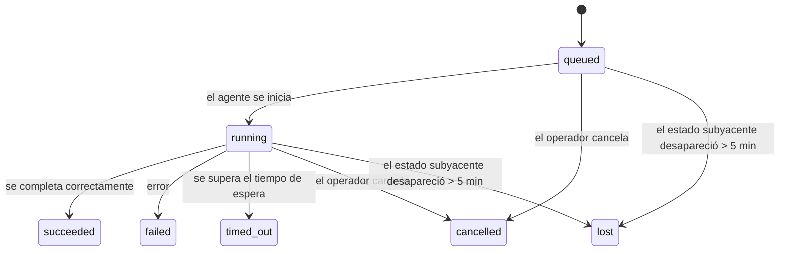

---
read_when:
    - Inspección del trabajo en segundo plano en curso o completado recientemente
    - Depuración de fallos de entrega en ejecuciones de agentes desvinculadas
    - Comprender cómo se relacionan las ejecuciones en segundo plano con las sesiones, Cron y Heartbeat
sidebarTitle: Background tasks
summary: Seguimiento de tareas en segundo plano para ejecuciones de ACP, subagentes, ejecuciones de Cron y operaciones de la CLI
title: Tareas en segundo plano
x-i18n:
    generated_at: "2026-07-19T01:46:06Z"
    model: gpt-5.6
    postprocess_version: locale-links-v1
    prompt_version: 32
    provider: openai
    source_hash: dbdc5ced133764fec0c8b9ae7b1957e24272dc9c1c86099de81f6923955d6b5a
    source_path: automation/tasks.md
    workflow: 16
---

<Note>
¿Busca opciones de programación? Consulte [Automatización](/es/automation) para elegir el mecanismo adecuado. Esta página es el registro de actividad del trabajo en segundo plano, no el programador.
</Note>

Las tareas en segundo plano registran el trabajo que se ejecuta **fuera de la sesión de conversación principal**: ejecuciones de ACP, creación de subagentes, ejecuciones de trabajos de Cron y operaciones iniciadas desde la CLI.

Las tareas **no** sustituyen a las sesiones, los trabajos de Cron ni los Heartbeat: son el **registro de actividad** que conserva qué trabajo independiente se realizó, cuándo y si se completó correctamente.

<Note>
No todas las ejecuciones del agente crean una tarea. Los turnos de Heartbeat y el chat interactivo normal no lo hacen. Todas las ejecuciones de Cron, las creaciones de ACP, las creaciones de subagentes, los comandos del agente de la CLI enviados por el Gateway y los comandos en segundo plano `exec` iniciados por el agente sí lo hacen.
</Note>

## Resumen

- Las tareas son **registros**, no programadores: Cron y Heartbeat deciden _cuándo_ se ejecuta el trabajo; las tareas registran _qué ocurrió_.
- ACP, los subagentes, todos los trabajos de Cron y las operaciones de la CLI crean tareas. Los turnos de Heartbeat no.
- Cada tarea pasa por `queued → running → terminal` (succeeded, failed, timed_out, cancelled o lost).
- Las tareas de Cron permanecen activas mientras el entorno de ejecución de Cron siga controlando el trabajo; si el estado del entorno de ejecución en memoria desaparece, el mantenimiento de tareas consulta primero el historial persistente de ejecuciones de Cron antes de marcar una tarea como perdida.
- La finalización se gestiona mediante notificaciones: el trabajo independiente puede notificar directamente o activar la sesión o el Heartbeat del solicitante cuando termina, por lo que los bucles de sondeo de estado no suelen ser el enfoque adecuado.
- Las ejecuciones aisladas de Cron y las finalizaciones de subagentes intentan, en la medida de lo posible, cerrar las pestañas y los procesos del navegador registrados para su sesión secundaria antes de efectuar el registro final de limpieza.
- La entrega de Cron aislada omite las respuestas provisionales obsoletas de la sesión principal mientras el trabajo de los subagentes descendientes sigue finalizando y prioriza el resultado final del descendiente si llega antes de la entrega.
- Las notificaciones de finalización se entregan directamente a un canal o se ponen en cola para el siguiente Heartbeat.
- `openclaw tasks list` muestra todas las tareas; `openclaw tasks audit` muestra los problemas.
- Los registros terminales se conservan durante 7 días (los registros `lost` durante 24 horas) y después se eliminan automáticamente.

## Inicio rápido

<Tabs>
  <Tab title="Enumerar y filtrar">
    ```bash
    # Enumerar todas las tareas (primero las más recientes)
    openclaw tasks list

    # Filtrar por entorno de ejecución o estado
    openclaw tasks list --runtime acp
    openclaw tasks list --status running
    ```

  </Tab>
  <Tab title="Inspeccionar">
    ```bash
    # Mostrar los detalles de una tarea específica (por ID de tarea, ID de ejecución o clave de sesión)
    openclaw tasks show <lookup>
    ```
  </Tab>
  <Tab title="Cancelar y notificar">
    ```bash
    # Cancelar una tarea en ejecución (finaliza la sesión secundaria)
    openclaw tasks cancel <lookup>

    # Cambiar la política de notificaciones de una tarea
    openclaw tasks notify <lookup> state_changes
    ```

  </Tab>
  <Tab title="Auditoría y mantenimiento">
    ```bash
    # Ejecutar una auditoría de estado
    openclaw tasks audit

    # Previsualizar o aplicar el mantenimiento
    openclaw tasks maintenance
    openclaw tasks maintenance --apply
    ```

  </Tab>
  <Tab title="Flujo de tareas">
    ```bash
    # Inspeccionar el estado de TaskFlow
    openclaw tasks flow list
    openclaw tasks flow show <lookup>
    openclaw tasks flow cancel <lookup>
    ```
  </Tab>
</Tabs>

## Qué crea una tarea

| Origen                 | Tipo de entorno de ejecución | Cuándo se crea un registro de tarea                                          | Política de notificaciones predeterminada |
| ---------------------- | ------------ | ---------------------------------------------------------------------- | --------------------- |
| Ejecuciones de ACP en segundo plano    | `acp`        | Al crear una sesión secundaria de ACP                                           | `done_only`           |
| Orquestación de subagentes | `subagent`   | Al crear un subagente mediante `sessions_spawn`                               | `done_only`           |
| Trabajos de Cron (todos los tipos)  | `cron`       | En cada ejecución de Cron (en la sesión principal y aislada)                       | `silent`              |
| Operaciones de la CLI         | `cli`        | Comandos `openclaw agent` que se ejecutan mediante el Gateway                 | `silent`              |
| Trabajos multimedia del agente       | `cli`        | Ejecuciones `image_generate`/`music_generate`/`video_generate` respaldadas por una sesión | `silent`              |

<AccordionGroup>
  <Accordion title="Valores predeterminados de notificación para Cron y multimedia">
    Las tareas de Cron (en la sesión principal y aisladas) utilizan la política de notificaciones `silent`: crean registros para su seguimiento, pero no generan notificaciones de tareas propias; Cron controla su ruta de entrega.

    Las ejecuciones `image_generate`, `music_generate` y `video_generate` respaldadas por una sesión también utilizan la política de notificaciones `silent`. Siguen creando registros de tareas, pero la finalización se devuelve a la sesión original del agente como una activación interna para que este pueda escribir el mensaje de seguimiento y adjuntar el contenido multimedia terminado. El agente solicitante sigue su contrato normal de respuesta visible: una respuesta final automática cuando está configurada, o `message(action="send")` junto con `NO_REPLY` cuando la sesión requiere respuestas mediante la herramienta de mensajes. Si la sesión solicitante ya no está activa o falla su activación, y el agente de finalización omite parte o la totalidad del contenido multimedia generado, OpenClaw envía directamente a su destino del canal original una respuesta alternativa idempotente que contiene únicamente el contenido multimedia que falta.

  </Accordion>
  <Accordion title="Protección para la generación simultánea de contenido multimedia">
    Mientras siga activa una tarea de generación de contenido multimedia respaldada por una sesión, `image_generate`, `music_generate` y `video_generate` evitan reintentos accidentales: si se repite la llamada para la misma solicitud o instrucción, se devuelve el estado de la tarea activa correspondiente en lugar de iniciar un duplicado, mientras que una instrucción distinta puede iniciar su propia tarea. Utilice `action: "status"` cuando necesite consultar explícitamente el progreso o el estado desde el agente.
  </Accordion>
  <Accordion title="Qué no crea tareas">
    - Turnos de Heartbeat en la sesión principal; consulte [Heartbeat](/es/gateway/heartbeat)
    - Turnos normales del chat interactivo
    - Respuestas directas de `/command`

  </Accordion>
</AccordionGroup>

## Ciclo de vida de las tareas



| Estado      | Significado                                                               |
| ----------- | --------------------------------------------------------------------------- |
| `queued`    | Creada, en espera de que se inicie el agente                                     |
| `running`   | El turno del agente se está ejecutando activamente                                            |
| `succeeded` | Finalizada correctamente                                                      |
| `failed`    | Finalizada con un error                                                     |
| `timed_out` | Se superó el tiempo de espera configurado                                             |
| `cancelled` | Detenida por el operador mediante `openclaw tasks cancel`, o se anuló la ejecución |
| `lost`      | El entorno de ejecución perdió el estado subyacente autoritativo tras un periodo de gracia de 5 minutos  |

Las transiciones ocurren automáticamente: los eventos del ciclo de vida de la ejecución del agente (inicio, finalización y error) actualizan el estado de la tarea; no se administra manualmente.

La finalización de la ejecución del agente es la fuente autoritativa para los registros de tareas activos. Una ejecución independiente correcta finaliza como `succeeded`, los errores ordinarios de ejecución finalizan como `failed`, los tiempos de espera finalizan como `timed_out` y las cancelaciones o anulaciones finalizan como `cancelled`. Una vez que una tarea alcanza un estado terminal, las señales posteriores del ciclo de vida no lo degradan: una tarea cancelada por el operador o que ya esté en estado `failed`/`timed_out`/`lost` permanece así incluso si posteriormente llega una señal de ejecución correcta.

`lost` tiene en cuenta el entorno de ejecución:

- Tareas de ACP: solo un turno de ACP activo en el proceso del Gateway demuestra que la ejecución sigue activa; los metadatos persistentes de la sesión por sí solos no lo demuestran. La auditoría sin conexión de la CLI adopta un criterio conservador y nunca recupera tareas de ACP.
- Tareas de subagentes: la sesión secundaria subyacente desapareció del almacén del agente de destino (o contiene un marcador de recuperación tras un reinicio).
- Tareas de Cron: el entorno de ejecución de Cron ya no registra el trabajo como activo y el historial persistente de ejecuciones de Cron no muestra ningún resultado terminal para esa ejecución. La auditoría sin conexión de la CLI no considera autoritativo su propio estado vacío del entorno de ejecución de Cron en el proceso.
- Tareas de la CLI: las tareas con un ID de ejecución u origen utilizan el contexto de ejecución activo, por lo que las filas persistentes de la sesión secundaria o de chat no las mantienen activas después de que desaparece la ejecución controlada por el Gateway. Las tareas heredadas de la CLI sin identidad de ejecución siguen recurriendo a la sesión secundaria. Las ejecuciones `openclaw agent` respaldadas por el Gateway también finalizan a partir del resultado de su ejecución, por lo que las ejecuciones completadas no permanecen activas hasta que el proceso de limpieza las marca como `lost`.

## Entrega y notificaciones

Cuando una tarea alcanza un estado terminal, OpenClaw envía una notificación. Existen dos rutas de entrega:

**Entrega directa**: si la tarea tiene un destino de canal (el `requesterOrigin`), el mensaje de finalización se envía directamente a ese canal (Discord, Slack, Telegram, etc.). En cambio, las finalizaciones de tareas de grupos y canales se enrutan mediante la sesión solicitante para que el agente principal pueda escribir la respuesta visible. Para las finalizaciones de subagentes, OpenClaw también conserva el enrutamiento vinculado del hilo o tema cuando está disponible y puede completar un `to` o una cuenta ausentes a partir de la ruta almacenada de la sesión solicitante (`lastChannel` / `lastTo` / `lastAccountId`) antes de renunciar a la entrega directa.

**Entrega en cola de la sesión**: si la entrega directa falla o no se ha establecido ningún origen, la actualización se pone en cola como un evento del sistema en la sesión solicitante y aparece en el siguiente Heartbeat.

<Tip>
Las finalizaciones de tareas puestas en cola en la sesión activan inmediatamente un Heartbeat, por lo que el resultado aparece rápidamente: no es necesario esperar al siguiente intervalo programado de Heartbeat.
</Tip>

Esto significa que el flujo de trabajo habitual se basa en notificaciones: se inicia una vez el trabajo independiente y después se permite que el entorno de ejecución active la sesión o envíe una notificación al finalizar. Consulte el estado de la tarea solo cuando necesite depuración, intervención o una auditoría explícita.

### Políticas de notificación

Controle cuánta información se recibe sobre cada tarea:

| Política                | Qué se entrega                                       |
| --------------------- | ------------------------------------------------------- |
| `done_only` (predeterminada) | Solo el estado terminal (succeeded, failed, etc.)           |
| `state_changes`       | Cada transición de estado y actualización del progreso              |
| `silent`              | Nada (valor predeterminado para las tareas de Cron, la CLI y multimedia) |

Cambie la política mientras se ejecuta una tarea:

```bash
openclaw tasks notify <lookup> state_changes
```

## Referencia de la CLI

<AccordionGroup>
  <Accordion title="tasks list">
    ```bash
    openclaw tasks list [--runtime <acp|subagent|cron|cli>] [--status <status>] [--json]
    ```

    Columnas de salida: tarea, tipo, estado, entrega, ejecución, sesión secundaria y resumen. `openclaw tasks` sin argumentos se comporta como `openclaw tasks list`.

  </Accordion>
  <Accordion title="tasks show">
    ```bash
    openclaw tasks show <lookup> [--json]
    ```

    El token de búsqueda acepta un ID de tarea, un ID de ejecución o una clave de sesión. Muestra el registro completo, incluidos los tiempos, el estado de entrega, el error y el resumen terminal.

  </Accordion>
  <Accordion title="tasks cancel">
    ```bash
    openclaw tasks cancel <lookup>
    ```

    Para las tareas de ACP y de subagentes, esto finaliza la sesión secundaria; las cancelaciones de ACP y Cron se enrutan a través del Gateway en ejecución (`tasks.cancel`). Para las tareas rastreadas por la CLI, la cancelación se registra en el registro de tareas (no hay un identificador independiente del entorno de ejecución secundario). El estado cambia a `cancelled` y se envía una notificación de entrega cuando corresponde.

  </Accordion>
  <Accordion title="notificación de tareas">
    ```bash
    openclaw tasks notify <lookup> <done_only|state_changes|silent>
    ```
  </Accordion>
  <Accordion title="auditoría de tareas">
    ```bash
    openclaw tasks audit [--severity <warn|error>] [--code <name>] [--limit <n>] [--json]
    ```

    Muestra los problemas operativos de las tareas **y** los TaskFlows en un único informe. Los hallazgos también aparecen en `openclaw status` cuando se detectan problemas.

    Hallazgos de tareas:

    | Hallazgo                   | Gravedad   | Desencadenante                                                                                                      |
    | ------------------------- | ---------- | ------------------------------------------------------------------------------------------------------------ |
    | `stale_queued`            | advertencia       | En cola durante más de 10 minutos                                                                              |
    | `stale_running`           | error      | En ejecución durante más de 30 minutos                                                                             |
    | `lost`                    | advertencia/error | La propiedad de la tarea respaldada por el entorno de ejecución desapareció; las tareas perdidas retenidas generan advertencias hasta `cleanupAfter` y después se convierten en errores |
    | `delivery_failed`         | advertencia       | La entrega falló y la política de notificación no es `silent`                                                            |
    | `missing_cleanup`         | advertencia       | Tarea terminal sin marca de tiempo de limpieza                                                                      |
    | `inconsistent_timestamps` | advertencia       | Infracción de la cronología (por ejemplo, finalizó antes de comenzar)                                                        |

    Hallazgos de TaskFlow:

    | Hallazgo                | Gravedad   | Desencadenante                                                                    |
    | ---------------------- | ---------- | --------------------------------------------------------------------------- |
    | `restore_failed`       | error      | Falló la restauración del registro de flujos desde SQLite                                    |
    | `stale_running`        | error      | El flujo en ejecución no ha avanzado durante más de 30 minutos                      |
    | `stale_waiting`        | advertencia       | El flujo en espera no ha avanzado durante más de 30 minutos                      |
    | `stale_blocked`        | advertencia       | El flujo bloqueado no ha avanzado durante más de 30 minutos                      |
    | `cancel_stuck`         | advertencia       | La cancelación se solicitó hace más de 5 minutos, no hay tareas secundarias activas y el flujo sigue sin ser terminal |
    | `missing_linked_tasks` | advertencia/error | Flujo administrado obsoleto sin tareas vinculadas ni estado de espera                       |
    | `blocked_task_missing` | advertencia       | El flujo bloqueado apunta a un id. de tarea que ya no existe                      |

  </Accordion>
  <Accordion title="mantenimiento de tareas">
    ```bash
    openclaw tasks maintenance [--json]
    openclaw tasks maintenance --apply [--json]
    ```

    Se usa para previsualizar o aplicar la reconciliación, el marcado temporal de limpieza y la depuración de tareas, del estado de TaskFlow y de las filas obsoletas del registro de sesiones de ejecuciones de Cron.

    La reconciliación tiene en cuenta el entorno de ejecución:

    - Las tareas de ACP requieren un turno activo dentro del proceso en el Gateway; las tareas de subagentes comprueban la sesión secundaria que las respalda.
    - Las tareas de subagentes cuya sesión secundaria tiene una marca de recuperación tras reinicio se marcan como perdidas en lugar de tratarse como sesiones de respaldo recuperables.
    - Las tareas de Cron comprueban si el entorno de ejecución de Cron todavía es propietario del trabajo y, a continuación, recuperan el estado terminal de los registros persistentes de ejecuciones de Cron o del estado del trabajo antes de recurrir a `lost`. Solo el proceso del Gateway es autoritativo respecto al conjunto de trabajos activos de Cron en memoria; la auditoría sin conexión de la CLI utiliza el historial persistente, pero no marca una tarea de Cron como perdida únicamente porque ese conjunto local esté vacío.
    - Las tareas de la CLI con identidad de ejecución comprueban el contexto activo propietario de la ejecución, no solo las filas de sesiones secundarias o de chat.

    La limpieza al finalizar también tiene en cuenta el entorno de ejecución:

    - Al finalizar un subagente, se intenta cerrar las pestañas y los procesos del navegador rastreados para la sesión secundaria antes de continuar con la limpieza del anuncio.
    - Al finalizar una ejecución aislada de Cron, se intenta cerrar las pestañas y los procesos del navegador rastreados para la sesión de Cron antes de que la ejecución termine por completo.
    - La entrega de una ejecución aislada de Cron espera a que finalice el seguimiento de los subagentes descendientes cuando es necesario y suprime el texto obsoleto de confirmación del elemento principal en lugar de anunciarlo.
    - La entrega al finalizar un subagente utiliza únicamente el texto visible más reciente del asistente secundario. La salida de tool/toolResult no se convierte en texto de resultado secundario. Las ejecuciones terminales fallidas anuncian el estado de error sin reproducir el texto de respuesta capturado.
    - Los fallos de limpieza no ocultan el resultado real de la tarea.

    Al aplicar el mantenimiento, OpenClaw también elimina las filas obsoletas `cron:<jobId>:run:<runId>` del registro de sesiones con más de 7 días, conserva las filas de los trabajos de Cron actualmente en ejecución y deja intactas las filas de sesiones que no pertenecen a Cron.

  </Accordion>
  <Accordion title="listar | mostrar | cancelar flujos de tareas">
    ```bash
    openclaw tasks flow list [--status <status>] [--json]
    openclaw tasks flow show <lookup> [--json]
    openclaw tasks flow cancel <lookup>
    ```

    El token de búsqueda del flujo acepta un id. de flujo o una clave de propietario. Estas opciones se usan cuando el [flujo de tareas](/es/automation/taskflow) de orquestación es el objeto de interés, en lugar de un registro individual de tarea en segundo plano.

  </Accordion>
</AccordionGroup>

## Panel de tareas del chat (`/tasks`)

Se usa `/tasks` en cualquier sesión de chat para ver las tareas en segundo plano vinculadas a esa sesión. El panel muestra hasta cinco tareas activas y finalizadas recientemente, con detalles del entorno de ejecución, estado, tiempos y progreso o error.

Cuando la sesión actual no tiene tareas vinculadas visibles, `/tasks` recurre a los recuentos de tareas locales del agente para seguir ofreciendo una vista general sin revelar detalles de otras sesiones.

Para consultar el registro completo del operador, se usa la CLI: `openclaw tasks list`.

### Interfaz de control

La interfaz de control web tiene una página **Tareas** en la barra lateral que muestra en tiempo real las tareas en segundo plano activas y recientes. Se usa para inspeccionar el progreso, abrir sesiones vinculadas, actualizar el registro o cancelar tareas en cola y en ejecución.

Los paneles de chat también tienen una sección contraíble de **Tareas en segundo plano** limitada al agente del panel: tareas y subagentes en ejecución con un control para detenerlos, una sección de elementos finalizados y enlaces para ver la transcripción de la sesión secundaria de cada tarea. Se abre desde el control de actividad del encabezado del panel (o desde el botón flotante de actividad en el chat de un solo panel).

Al seleccionar una tarea en la sección, se pueden inspeccionar su solicitud de entrada delimitada y su salida más reciente o el resumen del error. El trabajo en ejecución permanece separado del trabajo finalizado, y las filas finalizadas indican si la tarea se completó o falló. En iOS, se abre **Acciones del chat → Tareas en segundo plano**; en Android, se abre el menú adicional del chat y se selecciona **Tareas en segundo plano**. Ambas vistas móviles utilizan la misma agrupación de En ejecución y Finalizadas, y abren los detalles de la tarea al seleccionarla.

## Integración del estado (presión de tareas)

`openclaw status` incluye una línea de tareas para consultar de un vistazo:

```
Tareas    2 activas · 1 en cola · 1 en ejecución · 1 problema · auditoría sin problemas · 6 rastreadas
```

El resumen cuenta el trabajo activo (`queued` + `running`), los fallos (`failed` + `timed_out` + `lost`), los hallazgos de auditoría y el total de registros rastreados; la carga JSON también desglosa los recuentos por entorno de ejecución (`acp`, `subagent`, `cron`, `cli`).

Tanto `/status` como la herramienta `session_status` utilizan una instantánea de tareas que tiene en cuenta la limpieza: se priorizan las tareas activas, se ocultan las filas caducadas y las tareas terminales solo aparecen durante un breve periodo reciente (5 minutos), con los fallos destacados cuando no queda trabajo activo. Esto mantiene la tarjeta de estado centrada en lo que importa en ese momento.

## Almacenamiento y mantenimiento

### Ubicación de las tareas

Los registros de tareas y el estado de entrega persisten en la base de datos SQLite compartida de estado de OpenClaw:

```
~/.openclaw/state/openclaw.sqlite   (tablas: task_runs, task_delivery_state, flow_runs)
```

Se establece `OPENCLAW_STATE_DIR` para trasladar toda la raíz de estado (de forma predeterminada, `~/.openclaw`) a otra ubicación; la ruta de la base de datos compartida se traslada con ella.

El registro se carga en memoria al usarlo por primera vez y cada escritura se persiste en SQLite, por lo que los registros sobreviven a los reinicios del Gateway. El crecimiento del WAL se mantiene limitado mediante el umbral predeterminado de puntos de control automáticos de SQLite y los puntos de control periódicos `PASSIVE`; los puntos de control del cierre y del mantenimiento explícito utilizan `TRUNCATE` para que los cierres normales recuperen espacio del WAL sin que el proceso de limpieza en segundo plano tenga que esperar a los lectores activos.

Los almacenes auxiliares heredados de instalaciones anteriores (`tasks/runs.sqlite`, `flows/registry.sqlite`) se importan en la base de datos compartida mediante `openclaw doctor`.

### Mantenimiento automático

Un proceso de limpieza se ejecuta cada **60 segundos** (la primera pasada se produce aproximadamente 5 segundos después de iniciar el Gateway) y se ocupa de cuatro aspectos:

<Steps>
  <Step title="Reconciliación">
    Comprueba si las tareas activas siguen teniendo un respaldo autoritativo del entorno de ejecución. Las tareas de ACP requieren un turno activo dentro del proceso, las tareas de subagentes utilizan el estado de la sesión secundaria, las tareas de Cron utilizan la propiedad del trabajo activo junto con el historial persistente de ejecuciones y las tareas de la CLI con identidad de ejecución utilizan el contexto propietario de la ejecución. Si el estado de respaldo ha desaparecido durante más de 5 minutos (30 minutos para las tareas nativas de subagentes sin sesión secundaria), la tarea se marca como `lost`.
  </Step>
  <Step title="Reparación de sesiones de ACP">
    Cierra las sesiones de ACP de ejecución única, terminales o huérfanas, que pertenecen al elemento principal, y cierra las sesiones persistentes de ACP obsoletas, terminales o huérfanas, solo cuando no queda ninguna vinculación de conversación activa.
  </Step>
  <Step title="Marcado temporal de limpieza">
    Establece una marca de tiempo `cleanupAfter` en las tareas terminales (hora de finalización + periodo de retención). Durante la retención, las tareas perdidas siguen apareciendo en la auditoría como advertencias; después de que caduque `cleanupAfter` o cuando faltan los metadatos de limpieza, se convierten en errores.
  </Step>
  <Step title="Depuración">
    Elimina los registros posteriores a su fecha `cleanupAfter`.
  </Step>
</Steps>

<Note>
**Retención:** los registros de tareas terminales se conservan durante **7 días** (los registros `lost`, durante **24 horas**) y después se depuran automáticamente. No se necesita configuración.
</Note>

## Relación de las tareas con otros sistemas

<AccordionGroup>
  <Accordion title="Tareas y flujo de tareas">
    El [flujo de tareas](/es/automation/taskflow) es la capa de orquestación de flujos situada por encima de las tareas en segundo plano. Un único flujo puede coordinar varias tareas durante su ciclo de vida mediante modos de sincronización administrados o reflejados. Se usa `openclaw tasks` para inspeccionar registros individuales de tareas y `openclaw tasks flow` para inspeccionar el flujo de orquestación.

  </Accordion>
  <Accordion title="Tareas y Cron">
    Las definiciones de trabajos de Cron, el estado de ejecución del entorno y el historial de ejecuciones residen en la base de datos SQLite compartida de estado de OpenClaw. **Cada** ejecución de Cron crea un registro de tarea —tanto las de la sesión principal como las aisladas— con la política de notificación `silent`, por lo que las ejecuciones de Cron se rastrean sin generar notificaciones de tareas propias.

    Véase [Trabajos de Cron](/es/automation/cron-jobs).

  </Accordion>
  <Accordion title="Tareas y Heartbeat">
    Las ejecuciones de Heartbeat son turnos de la sesión principal; no crean registros de tareas. Cuando finaliza una tarea, puede activar un despertar de Heartbeat para que el resultado se muestre rápidamente.

    Véase [Heartbeat](/es/gateway/heartbeat).

  </Accordion>
  <Accordion title="Tareas y sesiones">
    Una tarea puede hacer referencia a una `childSessionKey` (donde se ejecuta el trabajo) y a un `requesterSessionKey` (quién la inició). Su `agentId` identifica al agente que ejecuta el trabajo, mientras que los campos de solicitante y propietario conservan el contexto de inicio y control. Las sesiones constituyen el contexto de conversación; las tareas permiten hacer un seguimiento de la actividad sobre ese contexto.
  </Accordion>
  <Accordion title="Tareas y ejecuciones de agentes">
    El `runId` de una tarea enlaza con la ejecución del agente que realiza el trabajo. Los eventos del ciclo de vida del agente (inicio, finalización, error) actualizan automáticamente el estado de la tarea; no es necesario gestionar el ciclo de vida manualmente.
  </Accordion>
</AccordionGroup>

## Contenido relacionado

- [Automatización](/es/automation) - todos los mecanismos de automatización de un vistazo
- [CLI: tareas](/es/cli/tasks) - referencia de comandos de la CLI
- [Heartbeat](/es/gateway/heartbeat) - turnos periódicos de la sesión principal
- [Tareas programadas](/es/automation/cron-jobs) - programación del trabajo en segundo plano
- [TaskFlow](/es/automation/taskflow) - orquestación de flujos por encima de las tareas
