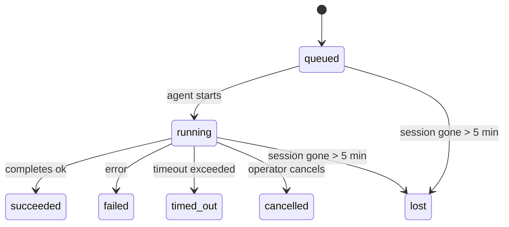

---
read_when:
    - Inspeccionar el trabajo en segundo plano en curso o completado recientemente
    - Depuración de fallos de entrega en ejecuciones de agentes desacopladas
    - Comprender cómo se relacionan las ejecuciones en segundo plano con las sesiones, Cron y Heartbeat
sidebarTitle: Background tasks
summary: Seguimiento de tareas en segundo plano para ejecuciones de ACP, subagentes, trabajos Cron aislados y operaciones de CLI
title: Tareas en segundo plano
x-i18n:
    generated_at: "2026-05-05T05:23:01Z"
    model: gpt-5.5
    provider: openai
    source_hash: bafd959feaf2e220820ec56bf1ef144207d05757418e9971ebf427844cf30c46
    source_path: automation/tasks.md
    workflow: 16
---

<Note>
¿Buscas programación? Consulta [Automatización y tareas](/es/automation) para elegir el mecanismo adecuado. Esta página es el registro de actividad del trabajo en segundo plano, no el programador.
</Note>

Las tareas en segundo plano hacen seguimiento del trabajo que se ejecuta **fuera de tu sesión principal de conversación**: ejecuciones de ACP, creación de subagentes, ejecuciones aisladas de trabajos Cron y operaciones iniciadas desde la CLI.

Las tareas **no** sustituyen a las sesiones, los trabajos Cron ni los Heartbeat — son el **registro de actividad** que registra qué trabajo desacoplado ocurrió, cuándo y si se completó correctamente.

<Note>
No todas las ejecuciones de agente crean una tarea. Los turnos de Heartbeat y el chat interactivo normal no lo hacen. Todas las ejecuciones de Cron, las creaciones de ACP, las creaciones de subagentes y los comandos de agente de la CLI sí lo hacen.
</Note>

## TL;DR

- Las tareas son **registros**, no programadores — Cron y Heartbeat deciden _cuándo_ se ejecuta el trabajo; las tareas registran _qué ocurrió_.
- ACP, los subagentes, todos los trabajos Cron y las operaciones de la CLI crean tareas. Los turnos de Heartbeat no.
- Cada tarea avanza por `queued → running → terminal` (succeeded, failed, timed_out, cancelled o lost).
- Las tareas de Cron permanecen activas mientras el runtime de Cron todavía es propietario del trabajo; si el
  estado en memoria del runtime desaparece, el mantenimiento de tareas primero revisa el historial durable de
  ejecuciones de Cron antes de marcar una tarea como perdida.
- La finalización está impulsada por notificaciones push: el trabajo desacoplado puede notificar directamente o despertar la
  sesión solicitante/Heartbeat cuando termina, por lo que los bucles de sondeo de estado
  suelen tener una forma incorrecta.
- Las ejecuciones aisladas de Cron y las finalizaciones de subagentes intentan, con el mejor esfuerzo, limpiar pestañas/procesos del navegador rastreados para su sesión hija antes del registro final de limpieza.
- La entrega aislada de Cron suprime respuestas parentales intermedias obsoletas mientras el trabajo de subagentes descendientes aún se está drenando, y prefiere la salida final de los descendientes cuando llega antes de la entrega.
- Las notificaciones de finalización se entregan directamente a un canal o se ponen en cola para el siguiente Heartbeat.
- `openclaw tasks list` muestra todas las tareas; `openclaw tasks audit` expone problemas.
- Los registros terminales se conservan durante 7 días y luego se depuran automáticamente.

## Inicio rápido

<Tabs>
  <Tab title="Listar y filtrar">
    ```bash
    # List all tasks (newest first)
    openclaw tasks list

    # Filter by runtime or status
    openclaw tasks list --runtime acp
    openclaw tasks list --status running
    ```

  </Tab>
  <Tab title="Inspeccionar">
    ```bash
    # Show details for a specific task (by ID, run ID, or session key)
    openclaw tasks show <lookup>
    ```
  </Tab>
  <Tab title="Cancelar y notificar">
    ```bash
    # Cancel a running task (kills the child session)
    openclaw tasks cancel <lookup>

    # Change notification policy for a task
    openclaw tasks notify <lookup> state_changes
    ```

  </Tab>
  <Tab title="Auditoría y mantenimiento">
    ```bash
    # Run a health audit
    openclaw tasks audit

    # Preview or apply maintenance
    openclaw tasks maintenance
    openclaw tasks maintenance --apply
    ```

  </Tab>
  <Tab title="Flujo de tareas">
    ```bash
    # Inspect TaskFlow state
    openclaw tasks flow list
    openclaw tasks flow show <lookup>
    openclaw tasks flow cancel <lookup>
    ```
  </Tab>
</Tabs>

## Qué crea una tarea

| Origen                 | Tipo de runtime | Cuándo se crea un registro de tarea                          | Política de notificación predeterminada |
| ---------------------- | ------------ | ------------------------------------------------------ | --------------------- |
| Ejecuciones en segundo plano de ACP    | `acp`        | Al crear una sesión hija de ACP                           | `done_only`           |
| Orquestación de subagentes | `subagent`   | Al crear un subagente mediante `sessions_spawn`               | `done_only`           |
| Trabajos Cron (todos los tipos)  | `cron`       | En cada ejecución de Cron (sesión principal y aislada)       | `silent`              |
| Operaciones de la CLI         | `cli`        | Comandos `openclaw agent` que se ejecutan a través del Gateway | `silent`              |
| Trabajos de medios del agente       | `cli`        | Ejecuciones respaldadas por sesión de `music_generate`/`video_generate`  | `silent`              |

<AccordionGroup>
  <Accordion title="Valores predeterminados de notificación para Cron y medios">
    Las tareas Cron de sesión principal usan la política de notificación `silent` de forma predeterminada — crean registros para seguimiento pero no generan notificaciones. Las tareas Cron aisladas también usan `silent` de forma predeterminada, pero son más visibles porque se ejecutan en su propia sesión.

    Las ejecuciones respaldadas por sesión de `music_generate` y `video_generate` también usan la política de notificación `silent`. Aun así crean registros de tareas, pero la finalización se devuelve a la sesión original del agente como una activación interna para que el agente pueda escribir el mensaje de seguimiento y adjuntar los medios terminados por sí mismo. Las finalizaciones en grupos/canales siguen la política normal de respuesta visible, por lo que el agente usa la herramienta de mensajes cuando la entrega de origen lo requiere. Si el agente de finalización no produce evidencia de entrega con la herramienta de mensajes en una ruta solo de herramientas, OpenClaw envía la alternativa de finalización directamente al canal original en lugar de dejar los medios privados.

  </Accordion>
  <Accordion title="Límite preventivo para video_generate concurrente">
    Mientras una tarea `video_generate` respaldada por sesión sigue activa, la herramienta también actúa como límite preventivo: las llamadas repetidas a `video_generate` en esa misma sesión devuelven el estado de la tarea activa en lugar de iniciar una segunda generación concurrente. Usa `action: "status"` cuando quieras una consulta explícita de progreso/estado desde el lado del agente.
  </Accordion>
  <Accordion title="Qué no crea tareas">
    - Turnos de Heartbeat — sesión principal; consulta [Heartbeat](/es/gateway/heartbeat)
    - Turnos normales de chat interactivo
    - Respuestas directas de `/command`

  </Accordion>
</AccordionGroup>

## Ciclo de vida de una tarea



| Estado      | Qué significa                                                              |
| ----------- | -------------------------------------------------------------------------- |
| `queued`    | Creada, esperando a que el agente comience                                    |
| `running`   | El turno del agente se está ejecutando activamente                                           |
| `succeeded` | Se completó correctamente                                                     |
| `failed`    | Se completó con un error                                                    |
| `timed_out` | Superó el tiempo de espera configurado                                            |
| `cancelled` | Detenida por el operador mediante `openclaw tasks cancel`                        |
| `lost`      | El runtime perdió el estado de respaldo autoritativo después de un período de gracia de 5 minutos |

Las transiciones ocurren automáticamente — cuando finaliza la ejecución del agente asociada, el estado de la tarea se actualiza para coincidir.

La finalización de la ejecución del agente es autoritativa para los registros de tareas activos. Una ejecución desacoplada correcta finaliza como `succeeded`, los errores ordinarios de ejecución finalizan como `failed`, y los resultados de tiempo de espera o aborto finalizan como `timed_out`. Si un operador ya canceló la tarea, o el runtime ya registró un estado terminal más fuerte como `failed`, `timed_out` o `lost`, una señal de éxito posterior no degrada ese estado terminal.

`lost` conoce el runtime:

- Tareas de ACP: desaparecieron los metadatos de respaldo de la sesión hija de ACP.
- Tareas de subagentes: la sesión hija de respaldo desapareció del almacén del agente de destino.
- Tareas de Cron: el runtime de Cron ya no rastrea el trabajo como activo y el historial durable
  de ejecuciones de Cron no muestra un resultado terminal para esa ejecución. La auditoría de la CLI
  sin conexión no trata su propio estado vacío del runtime de Cron en proceso como autoridad.
- Tareas de la CLI: las tareas aisladas de sesión hija usan la sesión hija; las tareas de la CLI
  respaldadas por chat usan en su lugar el contexto de ejecución en vivo, por lo que las filas persistentes de
  sesiones de canal/grupo/directas no las mantienen activas. Las ejecuciones respaldadas por el Gateway de
  `openclaw agent` también finalizan a partir de su resultado de ejecución, por lo que las ejecuciones completadas
  no permanecen activas hasta que el barredor las marque como `lost`.

## Entrega y notificaciones

Cuando una tarea alcanza un estado terminal, OpenClaw te notifica. Hay dos rutas de entrega:

**Entrega directa** — si la tarea tiene un destino de canal (el `requesterOrigin`), el mensaje de finalización va directamente a ese canal (Telegram, Discord, Slack, etc.). Para las finalizaciones de subagentes, OpenClaw también conserva el enrutamiento vinculado de hilo/tema cuando está disponible y puede completar un `to` / cuenta faltante a partir de la ruta almacenada de la sesión solicitante (`lastChannel` / `lastTo` / `lastAccountId`) antes de renunciar a la entrega directa.

**Entrega en cola de sesión** — si la entrega directa falla o no se configuró ningún origen, la actualización se pone en cola como evento del sistema en la sesión del solicitante y aparece en el siguiente Heartbeat.

<Tip>
La finalización de tareas dispara una activación inmediata de Heartbeat para que veas el resultado rápidamente — no tienes que esperar al siguiente pulso programado de Heartbeat.
</Tip>

Eso significa que el flujo de trabajo habitual se basa en push: inicia el trabajo desacoplado una vez y deja que el runtime te active o notifique al finalizar. Sondea el estado de la tarea solo cuando necesites depuración, intervención o una auditoría explícita.

### Políticas de notificación

Controla cuánto recibes sobre cada tarea:

| Política                | Qué se entrega                                                       |
| --------------------- | ----------------------------------------------------------------------- |
| `done_only` (predeterminada) | Solo estado terminal (succeeded, failed, etc.) — **esta es la opción predeterminada** |
| `state_changes`       | Cada transición de estado y actualización de progreso                              |
| `silent`              | Nada en absoluto                                                          |

Cambia la política mientras una tarea se está ejecutando:

```bash
openclaw tasks notify <lookup> state_changes
```

## Referencia de la CLI

<AccordionGroup>
  <Accordion title="tasks list">
    ```bash
    openclaw tasks list [--runtime <acp|subagent|cron|cli>] [--status <status>] [--json]
    ```

    Columnas de salida: ID de tarea, Tipo, Estado, Entrega, ID de ejecución, Sesión hija, Resumen.

  </Accordion>
  <Accordion title="tasks show">
    ```bash
    openclaw tasks show <lookup>
    ```

    El token de búsqueda acepta un ID de tarea, ID de ejecución o clave de sesión. Muestra el registro completo, incluidos tiempos, estado de entrega, error y resumen terminal.

  </Accordion>
  <Accordion title="tasks cancel">
    ```bash
    openclaw tasks cancel <lookup>
    ```

    Para las tareas de ACP y subagentes, esto mata la sesión hija. Para tareas rastreadas por la CLI, la cancelación se registra en el registro de tareas (no hay un identificador separado del runtime hijo). El estado transiciona a `cancelled` y se envía una notificación de entrega cuando corresponde.

  </Accordion>
  <Accordion title="tasks notify">
    ```bash
    openclaw tasks notify <lookup> <done_only|state_changes|silent>
    ```
  </Accordion>
  <Accordion title="tasks audit">
    ```bash
    openclaw tasks audit [--json]
    ```

    Expone problemas operativos. Los hallazgos también aparecen en `openclaw status` cuando se detectan problemas.

    | Hallazgo                  | Gravedad   | Activador                                                                                                      |
    | ------------------------- | ---------- | -------------------------------------------------------------------------------------------------------------- |
    | `stale_queued`            | warn       | En cola durante más de 10 minutos                                                                              |
    | `stale_running`           | error      | En ejecución durante más de 30 minutos                                                                         |
    | `lost`                    | warn/error | La propiedad de la tarea respaldada por runtime desapareció; las tareas perdidas retenidas advierten hasta `cleanupAfter`, luego se convierten en errores |
    | `delivery_failed`         | warn       | La entrega falló y la política de notificación no es `silent`                                                  |
    | `missing_cleanup`         | warn       | Tarea terminal sin marca de tiempo de limpieza                                                                 |
    | `inconsistent_timestamps` | warn       | Infracción de la línea de tiempo (por ejemplo, terminó antes de comenzar)                                      |

  </Accordion>
  <Accordion title="tasks maintenance">
    ```bash
    openclaw tasks maintenance [--json]
    openclaw tasks maintenance --apply [--json]
    ```

    Usa esto para previsualizar o aplicar reconciliación, marcado de limpieza y poda para las tareas y el estado de Task Flow.

    La reconciliación tiene en cuenta el runtime:

    - Las tareas ACP/subagent comprueban su sesión secundaria de respaldo.
    - Las tareas subagent cuya sesión secundaria tiene una lápida de recuperación tras reinicio se marcan como perdidas en lugar de tratarse como sesiones de respaldo recuperables.
    - Las tareas Cron comprueban si el runtime de cron aún posee el trabajo, luego recuperan el estado terminal desde los registros persistidos de ejecuciones de cron o el estado del trabajo antes de recurrir a `lost`. Solo el proceso Gateway es autoritativo para el conjunto en memoria de trabajos activos de cron; la auditoría CLI sin conexión usa historial duradero, pero no marca una tarea cron como perdida únicamente porque ese Set local esté vacío.
    - Las tareas CLI respaldadas por chat comprueban el contexto de ejecución activo propietario, no solo la fila de sesión de chat.

    La limpieza de finalización también tiene en cuenta el runtime:

    - La finalización de subagent intenta cerrar, con el mejor esfuerzo, las pestañas/procesos de navegador registrados para la sesión secundaria antes de que continúe la limpieza del anuncio.
    - La finalización de cron aislado intenta cerrar, con el mejor esfuerzo, las pestañas/procesos de navegador registrados para la sesión de cron antes de que la ejecución se desmonte por completo.
    - La entrega de cron aislado espera el seguimiento de subagent descendiente cuando es necesario y suprime el texto obsoleto de acuse de recibo del padre en lugar de anunciarlo.
    - La entrega de finalización de subagent prefiere el texto visible más reciente del asistente; si está vacío, recurre al texto saneado más reciente de herramienta/toolResult, y las ejecuciones de llamadas a herramientas con solo tiempo de espera pueden reducirse a un breve resumen de progreso parcial. Las ejecuciones terminales fallidas anuncian el estado de fallo sin reproducir el texto de respuesta capturado.
    - Los fallos de limpieza no ocultan el resultado real de la tarea.

  </Accordion>
  <Accordion title="tasks flow list | show | cancel">
    ```bash
    openclaw tasks flow list [--status <status>] [--json]
    openclaw tasks flow show <lookup> [--json]
    openclaw tasks flow cancel <lookup>
    ```

    Úsalos cuando el Task Flow orquestador sea lo que te importa, en lugar de un registro individual de tarea en segundo plano.

  </Accordion>
</AccordionGroup>

## Tablero de tareas de chat (`/tasks`)

Usa `/tasks` en cualquier sesión de chat para ver las tareas en segundo plano vinculadas a esa sesión. El tablero muestra tareas activas y completadas recientemente con runtime, estado, tiempos y detalles de progreso o error.

Cuando la sesión actual no tiene tareas vinculadas visibles, `/tasks` recurre a los conteos de tareas locales del agente para que sigas obteniendo una visión general sin filtrar detalles de otras sesiones.

Para el libro mayor completo del operador, usa la CLI: `openclaw tasks list`.

## Integración de estado (presión de tareas)

`openclaw status` incluye un resumen de tareas de un vistazo:

```
Tasks: 3 queued · 2 running · 1 issues
```

El resumen informa:

- **active** — conteo de `queued` + `running`
- **failures** — conteo de `failed` + `timed_out` + `lost`
- **byRuntime** — desglose por `acp`, `subagent`, `cron`, `cli`

Tanto `/status` como la herramienta `session_status` usan una instantánea de tareas consciente de la limpieza: se prefieren las tareas activas, se ocultan las filas completadas obsoletas y los fallos recientes solo aparecen cuando no queda trabajo activo. Esto mantiene la tarjeta de estado enfocada en lo que importa ahora mismo.

## Almacenamiento y mantenimiento

### Dónde viven las tareas

Los registros de tareas persisten en SQLite en:

```
$OPENCLAW_STATE_DIR/tasks/runs.sqlite
```

El registro se carga en memoria al inicio de gateway y sincroniza las escrituras con SQLite para ofrecer durabilidad entre reinicios.
El Gateway mantiene acotado el registro de escritura anticipada de SQLite usando el umbral de autocheckpoint predeterminado de SQLite más puntos de control `TRUNCATE` periódicos y al apagar.

### Mantenimiento automático

Un barrido se ejecuta cada **60 segundos** y se encarga de cuatro cosas:

<Steps>
  <Step title="Reconciliation">
    Comprueba si las tareas activas aún tienen respaldo autoritativo del runtime. Las tareas ACP/subagent usan el estado de la sesión secundaria, las tareas cron usan la propiedad de trabajos activos y las tareas CLI respaldadas por chat usan el contexto de ejecución propietario. Si ese estado de respaldo desaparece durante más de 5 minutos, la tarea se marca como `lost`.
  </Step>
  <Step title="ACP session repair">
    Cierra sesiones ACP terminales o huérfanas de un solo uso propiedad del padre, y cierra sesiones ACP persistentes terminales u huérfanas obsoletas solo cuando no queda ningún vínculo de conversación activo.
  </Step>
  <Step title="Cleanup stamping">
    Establece una marca de tiempo `cleanupAfter` en las tareas terminales (endedAt + 7 días). Durante la retención, las tareas perdidas aún aparecen en la auditoría como advertencias; después de que `cleanupAfter` expire o cuando falten metadatos de limpieza, son errores.
  </Step>
  <Step title="Pruning">
    Elimina registros posteriores a su fecha `cleanupAfter`.
  </Step>
</Steps>

<Note>
**Retención:** los registros de tareas terminales se conservan durante **7 días** y luego se podan automáticamente. No se necesita configuración.
</Note>

## Cómo se relacionan las tareas con otros sistemas

<AccordionGroup>
  <Accordion title="Tasks and Task Flow">
    [Task Flow](/es/automation/taskflow) es la capa de orquestación de flujos por encima de las tareas en segundo plano. Un solo flujo puede coordinar varias tareas durante su ciclo de vida mediante modos de sincronización gestionados o reflejados. Usa `openclaw tasks` para inspeccionar registros de tareas individuales y `openclaw tasks flow` para inspeccionar el flujo orquestador.

    Consulta [Task Flow](/es/automation/taskflow) para obtener más detalles.

  </Accordion>
  <Accordion title="Tasks and cron">
    Una **definición** de trabajo cron vive en `~/.openclaw/cron/jobs.json`; el estado de ejecución en runtime vive junto a ella en `~/.openclaw/cron/jobs-state.json`. **Cada** ejecución de cron crea un registro de tarea, tanto de sesión principal como aislada. Las tareas cron de sesión principal usan de forma predeterminada la política de notificación `silent`, por lo que se registran sin generar notificaciones.

    Consulta [Trabajos Cron](/es/automation/cron-jobs).

  </Accordion>
  <Accordion title="Tasks and heartbeat">
    Las ejecuciones de Heartbeat son turnos de sesión principal: no crean registros de tareas. Cuando una tarea se completa, puede activar una reactivación de Heartbeat para que veas el resultado con prontitud.

    Consulta [Heartbeat](/es/gateway/heartbeat).

  </Accordion>
  <Accordion title="Tasks and sessions">
    Una tarea puede hacer referencia a un `childSessionKey` (donde se ejecuta el trabajo) y a un `requesterSessionKey` (quien la inició). Las sesiones son contexto de conversación; las tareas son seguimiento de actividad por encima de eso.
  </Accordion>
  <Accordion title="Tasks and agent runs">
    El `runId` de una tarea se vincula a la ejecución del agente que realiza el trabajo. Los eventos de ciclo de vida del agente (inicio, fin, error) actualizan automáticamente el estado de la tarea; no necesitas gestionar el ciclo de vida manualmente.
  </Accordion>
</AccordionGroup>

## Relacionado

- [Automatización y tareas](/es/automation) — todos los mecanismos de automatización de un vistazo
- [CLI: Tareas](/es/cli/tasks) — referencia de comandos de la CLI
- [Heartbeat](/es/gateway/heartbeat) — turnos periódicos de sesión principal
- [Tareas programadas](/es/automation/cron-jobs) — programación de trabajo en segundo plano
- [Task Flow](/es/automation/taskflow) — orquestación de flujos por encima de las tareas
