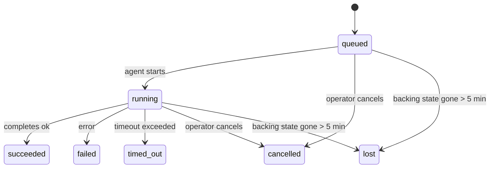

---
read_when:
    - Inspección del trabajo en segundo plano en curso o completado recientemente
    - Depuración de fallos de entrega en ejecuciones de agentes desacopladas
    - Cómo se relacionan las ejecuciones en segundo plano con las sesiones, Cron y Heartbeat
sidebarTitle: Background tasks
summary: Seguimiento de tareas en segundo plano para ejecuciones de ACP, subagentes, ejecuciones de Cron y operaciones de la CLI
title: Tareas en segundo plano
x-i18n:
    generated_at: "2026-07-11T22:50:05Z"
    model: gpt-5.6
    postprocess_version: locale-links-v1
    provider: openai
    source_hash: 0a945e8103c5df5a64785f326a9d0b08784ac32a2ca6fa3d4c399d75fc54be2b
    source_path: automation/tasks.md
    workflow: 16
---

<Note>
¿Buscas programación? Consulta [Automatización](/es/automation) para elegir el mecanismo adecuado. Esta página es el registro de actividad del trabajo en segundo plano, no el programador.
</Note>

Las tareas en segundo plano registran el trabajo que se ejecuta **fuera de tu sesión de conversación principal**: ejecuciones de ACP, creación de subagentes, ejecuciones de trabajos cron y operaciones iniciadas desde la CLI.

Las tareas **no** sustituyen a las sesiones, los trabajos cron ni los Heartbeat: son el **registro de actividad** que documenta qué trabajo desacoplado se realizó, cuándo y si se completó correctamente.

<Note>
No todas las ejecuciones de agentes crean una tarea. Los turnos de Heartbeat y el chat interactivo normal no lo hacen. Todas las ejecuciones de cron, las creaciones de ACP, las creaciones de subagentes y los comandos de agente de la CLI enviados por el Gateway sí lo hacen.
</Note>

## Resumen

- Las tareas son **registros**, no programadores: cron y Heartbeat deciden _cuándo_ se ejecuta el trabajo; las tareas registran _qué ocurrió_.
- ACP, los subagentes, todos los trabajos cron y las operaciones de la CLI crean tareas. Los turnos de Heartbeat no.
- Cada tarea avanza por `queued → running → terminal` (succeeded, failed, timed_out, cancelled o lost).
- Las tareas cron permanecen activas mientras el entorno de ejecución de cron siga controlando el trabajo; si desaparece el estado del entorno de ejecución en memoria, el mantenimiento de tareas comprueba primero el historial persistente de ejecuciones de cron antes de marcar una tarea como perdida.
- La finalización se basa en notificaciones: el trabajo desacoplado puede notificar directamente o reactivar la sesión o el Heartbeat del solicitante cuando termina, por lo que los bucles de consulta de estado suelen ser un enfoque inadecuado.
- Las ejecuciones aisladas de cron y las finalizaciones de subagentes intentan, en la medida de lo posible, cerrar las pestañas y los procesos del navegador registrados para su sesión secundaria antes de la limpieza administrativa final.
- La entrega de cron aislada omite las respuestas provisionales obsoletas del agente principal mientras aún se completa el trabajo de los subagentes descendientes, y prefiere la salida final de estos si llega antes de la entrega.
- Las notificaciones de finalización se entregan directamente a un canal o se ponen en cola para el siguiente Heartbeat.
- `openclaw tasks list` muestra todas las tareas; `openclaw tasks audit` señala los problemas.
- Los registros terminales se conservan durante 7 días (los registros `lost`, durante 24 horas) y después se eliminan automáticamente.

## Inicio rápido

<Tabs>
  <Tab title="Listar y filtrar">
    ```bash
    # List all tasks (newest first)
    openclaw tasks list

    # Filter by runtime or status
    openclaw tasks list --runtime acp
    openclaw tasks list --status running
    ```

  </Tab>
  <Tab title="Inspeccionar">
    ```bash
    # Show details for a specific task (by task ID, run ID, or session key)
    openclaw tasks show <lookup>
    ```
  </Tab>
  <Tab title="Cancelar y notificar">
    ```bash
    # Cancel a running task (kills the child session)
    openclaw tasks cancel <lookup>

    # Change notification policy for a task
    openclaw tasks notify <lookup> state_changes
    ```

  </Tab>
  <Tab title="Auditoría y mantenimiento">
    ```bash
    # Run a health audit
    openclaw tasks audit

    # Preview or apply maintenance
    openclaw tasks maintenance
    openclaw tasks maintenance --apply
    ```

  </Tab>
  <Tab title="Flujo de tareas">
    ```bash
    # Inspect TaskFlow state
    openclaw tasks flow list
    openclaw tasks flow show <lookup>
    openclaw tasks flow cancel <lookup>
    ```
  </Tab>
</Tabs>

## Qué crea una tarea

| Origen                   | Tipo de entorno de ejecución | Cuándo se crea un registro de tarea                                   | Política de notificación predeterminada |
| ------------------------ | ---------------------------- | ---------------------------------------------------------------------- | ---------------------------------------- |
| Ejecuciones de ACP en segundo plano | `acp`              | Al crear una sesión secundaria de ACP                                  | `done_only`                              |
| Orquestación de subagentes | `subagent`                 | Al crear un subagente mediante `sessions_spawn`                        | `done_only`                              |
| Trabajos cron (todos los tipos) | `cron`                | En cada ejecución de cron (en la sesión principal o aislada)           | `silent`                                 |
| Operaciones de la CLI    | `cli`                        | Comandos `openclaw agent` que se ejecutan mediante el Gateway          | `silent`                                 |
| Trabajos multimedia del agente | `cli`                  | Ejecuciones de `image_generate`/`music_generate`/`video_generate` respaldadas por una sesión | `silent`               |

<AccordionGroup>
  <Accordion title="Valores predeterminados de notificación para cron y contenido multimedia">
    Las tareas cron (tanto de la sesión principal como aisladas) usan la política de notificación `silent`: crean registros para su seguimiento, pero no generan notificaciones de tarea propias; cron controla su ruta de entrega.

    Las ejecuciones de `image_generate`, `music_generate` y `video_generate` respaldadas por una sesión también usan la política de notificación `silent`. Siguen creando registros de tareas, pero la finalización se devuelve a la sesión original del agente mediante una reactivación interna para que el agente pueda escribir el mensaje de seguimiento y adjuntar por sí mismo el contenido multimedia terminado. El agente solicitante sigue su contrato habitual de respuesta visible: una respuesta final automática cuando esté configurada, o `message(action="send")` seguido de `NO_REPLY` cuando la sesión requiera respuestas mediante la herramienta de mensajes. Si la sesión solicitante ya no está activa o falla su reactivación, y el agente de finalización omite parte o la totalidad del contenido multimedia generado, OpenClaw envía directamente al destino del canal original una respuesta de respaldo idempotente que contiene únicamente el contenido multimedia faltante.

  </Accordion>
  <Accordion title="Protección para la generación simultánea de contenido multimedia">
    Mientras siga activa una tarea de generación de contenido multimedia respaldada por una sesión, `image_generate`, `music_generate` y `video_generate` evitan los reintentos accidentales: repetir la llamada para la misma instrucción o solicitud devuelve el estado de la tarea activa correspondiente en lugar de iniciar un duplicado, mientras que una instrucción distinta puede iniciar su propia tarea. Usa `action: "status"` cuando quieras consultar explícitamente el progreso o el estado desde el agente.
  </Accordion>
  <Accordion title="Qué no crea tareas">
    - Turnos de Heartbeat en la sesión principal; consulta [Heartbeat](/es/gateway/heartbeat)
    - Turnos normales de chat interactivo
    - Respuestas directas a `/command`

  </Accordion>
</AccordionGroup>

## Ciclo de vida de las tareas



| Estado      | Significado                                                                  |
| ----------- | ---------------------------------------------------------------------------- |
| `queued`    | Creada y a la espera de que el agente se inicie                              |
| `running`   | El turno del agente se está ejecutando activamente                           |
| `succeeded` | Finalizada correctamente                                                     |
| `failed`    | Finalizada con un error                                                       |
| `timed_out` | Superó el tiempo de espera configurado                                        |
| `cancelled` | Detenida por el operador mediante `openclaw tasks cancel`, o se abortó la ejecución |
| `lost`      | El entorno de ejecución perdió el estado de respaldo autoritativo tras un período de gracia de 5 minutos |

Las transiciones se producen automáticamente: los eventos del ciclo de vida de la ejecución del agente (inicio, fin y error) actualizan el estado de la tarea; no es necesario administrarlo manualmente.

La finalización de la ejecución del agente es la fuente autoritativa para los registros de tareas activas. Una ejecución desacoplada correcta finaliza como `succeeded`, los errores ordinarios de ejecución finalizan como `failed`, los tiempos de espera finalizan como `timed_out` y las cancelaciones o interrupciones finalizan como `cancelled`. Una vez que una tarea alcanza un estado terminal, las señales posteriores del ciclo de vida no la degradan: una tarea cancelada por un operador o que ya esté en estado `failed`/`timed_out`/`lost` permanece así aunque posteriormente llegue una señal de éxito.

`lost` depende del entorno de ejecución:

- Tareas de ACP: solo un turno activo de ACP dentro del proceso del Gateway demuestra que la ejecución sigue activa; los metadatos persistentes de la sesión por sí solos no lo demuestran. La auditoría sin conexión de la CLI es conservadora y nunca recupera tareas de ACP.
- Tareas de subagentes: la sesión secundaria de respaldo desapareció del almacén del agente de destino (o contiene una marca de recuperación tras reinicio).
- Tareas cron: el entorno de ejecución de cron ya no registra el trabajo como activo y el historial persistente de ejecuciones de cron no muestra un resultado terminal para esa ejecución. La auditoría sin conexión de la CLI no considera autoritativo su propio estado vacío del entorno de ejecución de cron dentro del proceso.
- Tareas de la CLI: las tareas con un identificador de ejecución o de origen usan el contexto de ejecución activo, por lo que las filas persistentes de sesiones secundarias o de chat no las mantienen activas después de que desaparece la ejecución controlada por el Gateway. Las tareas heredadas de la CLI sin identidad de ejecución siguen recurriendo a la sesión secundaria. Las ejecuciones de `openclaw agent` respaldadas por el Gateway también finalizan a partir del resultado de su ejecución, por lo que las ejecuciones completadas no permanecen activas hasta que el proceso de mantenimiento las marca como `lost`.

## Entrega y notificaciones

Cuando una tarea alcanza un estado terminal, OpenClaw te lo notifica. Hay dos rutas de entrega:

**Entrega directa**: si la tarea tiene un canal de destino (`requesterOrigin`), el mensaje de finalización se envía directamente a ese canal (Discord, Slack, Telegram, etc.). En cambio, las finalizaciones de tareas de grupos y canales se encaminan mediante la sesión solicitante para que el agente principal pueda escribir la respuesta visible. Para las finalizaciones de subagentes, OpenClaw también conserva el enrutamiento vinculado del hilo o tema cuando está disponible y puede completar un valor `to` o una cuenta que falten a partir de la ruta almacenada en la sesión solicitante (`lastChannel` / `lastTo` / `lastAccountId`) antes de desistir de la entrega directa.

**Entrega en cola de la sesión**: si falla la entrega directa o no se ha definido ningún origen, la actualización se pone en cola como un evento del sistema en la sesión del solicitante y aparece en el siguiente Heartbeat.

<Tip>
Las finalizaciones de tareas puestas en cola en la sesión activan de inmediato un Heartbeat, por lo que ves el resultado rápidamente; no tienes que esperar al siguiente ciclo programado de Heartbeat.
</Tip>

Esto significa que el flujo de trabajo habitual se basa en notificaciones: inicia una vez el trabajo desacoplado y deja que el entorno de ejecución te reactive o notifique cuando finalice. Consulta el estado de las tareas solo cuando necesites depurar, intervenir o realizar una auditoría explícita.

### Políticas de notificación

Controla cuánta información recibes sobre cada tarea:

| Política              | Qué se entrega                                               |
| --------------------- | ------------------------------------------------------------ |
| `done_only` (predeterminada) | Solo el estado terminal (succeeded, failed, etc.)     |
| `state_changes`       | Cada transición de estado y actualización de progreso        |
| `silent`              | Nada (valor predeterminado para tareas cron, de la CLI y multimedia) |

Cambia la política mientras se ejecuta una tarea:

```bash
openclaw tasks notify <lookup> state_changes
```

## Referencia de la CLI

<AccordionGroup>
  <Accordion title="tasks list">
    ```bash
    openclaw tasks list [--runtime <acp|subagent|cron|cli>] [--status <status>] [--json]
    ```

    Columnas de salida: Tarea, Tipo, Estado, Entrega, Ejecución, Sesión secundaria y Resumen. `openclaw tasks` sin argumentos se comporta como `openclaw tasks list`.

  </Accordion>
  <Accordion title="tasks show">
    ```bash
    openclaw tasks show <lookup> [--json]
    ```

    El token de búsqueda acepta un identificador de tarea, un identificador de ejecución o una clave de sesión. Muestra el registro completo, incluidos los tiempos, el estado de entrega, el error y el resumen terminal.

  </Accordion>
  <Accordion title="tasks cancel">
    ```bash
    openclaw tasks cancel <lookup>
    ```

    Para las tareas de ACP y de subagentes, esto finaliza la sesión secundaria; las cancelaciones de ACP y cron se encaminan mediante el Gateway en ejecución (`tasks.cancel`). Para las tareas registradas por la CLI, la cancelación se registra en el registro de tareas (no existe un identificador independiente del entorno de ejecución secundario). El estado cambia a `cancelled` y se envía una notificación de entrega cuando corresponde.

  </Accordion>
  <Accordion title="tasks notify">
    ```bash
    openclaw tasks notify <lookup> <done_only|state_changes|silent>
    ```
  </Accordion>
  <Accordion title="tasks audit">
    ```bash
    openclaw tasks audit [--severity <warn|error>] [--code <name>] [--limit <n>] [--json]
    ```

    Señala en un único informe los problemas operativos de las tareas **y** los TaskFlow. Los hallazgos también aparecen en `openclaw status` cuando se detectan problemas.

    Hallazgos de tareas:

    | Hallazgo                  | Gravedad        | Desencadenante                                                                                                                    |
    | ------------------------- | ---------------- | --------------------------------------------------------------------------------------------------------------------------------- |
    | `stale_queued`            | advertencia      | En cola durante más de 10 minutos                                                                                                 |
    | `stale_running`           | error            | En ejecución durante más de 30 minutos                                                                                            |
    | `lost`                    | advertencia/error | Desapareció la propiedad de la tarea respaldada por el entorno de ejecución; las tareas perdidas conservadas generan advertencias hasta `cleanupAfter` y luego se convierten en errores |
    | `delivery_failed`         | advertencia      | La entrega falló y la política de notificación no es `silent`                                                                     |
    | `missing_cleanup`         | advertencia      | Tarea terminal sin marca de tiempo de limpieza                                                                                    |
    | `inconsistent_timestamps` | advertencia      | Infracción de la cronología (por ejemplo, finalizó antes de comenzar)                                                             |

    Hallazgos de TaskFlow:

    | Hallazgo               | Gravedad         | Desencadenante                                                                                     |
    | ---------------------- | ---------------- | -------------------------------------------------------------------------------------------------- |
    | `restore_failed`       | error            | Falló la restauración del registro de flujos desde SQLite                                           |
    | `stale_running`        | error            | El flujo en ejecución no ha avanzado durante más de 30 minutos                                      |
    | `stale_waiting`        | advertencia      | El flujo en espera no ha avanzado durante más de 30 minutos                                         |
    | `stale_blocked`        | advertencia      | El flujo bloqueado no ha avanzado durante más de 30 minutos                                         |
    | `cancel_stuck`         | advertencia      | La cancelación se solicitó hace más de 5 minutos, no hay tareas secundarias activas y aún no es terminal |
    | `missing_linked_tasks` | advertencia/error | Flujo administrado obsoleto sin tareas vinculadas ni estado de espera                               |
    | `blocked_task_missing` | advertencia      | El flujo bloqueado apunta a un id de tarea que ya no existe                                         |

  </Accordion>
  <Accordion title="mantenimiento de tareas">
    ```bash
    openclaw tasks maintenance [--json]
    openclaw tasks maintenance --apply [--json]
    ```

    Úselo para previsualizar o aplicar la reconciliación, el marcado de limpieza y la depuración de tareas, del estado de TaskFlow y de las filas obsoletas del registro de sesiones de ejecuciones de Cron.

    La reconciliación tiene en cuenta el entorno de ejecución:

    - Las tareas ACP requieren un turno activo en el proceso del Gateway; las tareas de subagentes comprueban su sesión secundaria subyacente.
    - Las tareas de subagentes cuya sesión secundaria tiene una marca de recuperación tras reinicio se marcan como perdidas en lugar de tratarse como sesiones subyacentes recuperables.
    - Las tareas de Cron comprueban si el entorno de ejecución de Cron aún es propietario del trabajo y, después, recuperan el estado terminal desde los registros persistentes de ejecuciones de Cron o el estado del trabajo antes de recurrir a `lost`. Solo el proceso del Gateway tiene autoridad sobre el conjunto en memoria de trabajos activos de Cron; la auditoría sin conexión de la CLI utiliza el historial persistente, pero no marca una tarea de Cron como perdida únicamente porque ese conjunto local esté vacío.
    - Las tareas de la CLI con identidad de ejecución comprueban el contexto activo propietario de la ejecución, no solo las filas de sesiones secundarias o de chat.

    La limpieza al finalizar también tiene en cuenta el entorno de ejecución:

    - Al finalizar un subagente, se intenta cerrar las pestañas y los procesos del navegador rastreados para la sesión secundaria antes de continuar con la limpieza del anuncio.
    - Al finalizar una ejecución aislada de Cron, se intenta cerrar las pestañas y los procesos del navegador rastreados para la sesión de Cron antes de desmontar por completo la ejecución.
    - La entrega de una ejecución aislada de Cron espera a que terminen las acciones posteriores de los subagentes descendientes cuando sea necesario y suprime el texto obsoleto de confirmación del padre en lugar de anunciarlo.
    - La entrega al finalizar un subagente utiliza únicamente el texto visible más reciente del asistente en la sesión secundaria. La salida de tool/toolResult no se convierte en texto de resultado de la sesión secundaria. Las ejecuciones terminales fallidas anuncian el estado de error sin reproducir el texto de respuesta capturado.
    - Los errores de limpieza no ocultan el resultado real de la tarea.

    Al aplicar el mantenimiento, OpenClaw también elimina las filas obsoletas del registro de sesiones `cron:<jobId>:run:<runId>` con más de 7 días de antigüedad, conserva las filas de los trabajos de Cron que se encuentran actualmente en ejecución y deja intactas las filas de sesiones que no pertenecen a Cron.

  </Accordion>
  <Accordion title="tasks flow list | show | cancel">
    ```bash
    openclaw tasks flow list [--status <status>] [--json]
    openclaw tasks flow show <lookup> [--json]
    openclaw tasks flow cancel <lookup>
    ```

    El identificador de búsqueda del flujo acepta un id de flujo o una clave de propietario. Úselos cuando lo importante sea el [flujo de tareas](/es/automation/taskflow) que realiza la orquestación, en lugar de un registro individual de tarea en segundo plano.

  </Accordion>
</AccordionGroup>

## Panel de tareas del chat (`/tasks`)

Use `/tasks` en cualquier sesión de chat para ver las tareas en segundo plano vinculadas a esa sesión. El panel muestra hasta cinco tareas activas y completadas recientemente con detalles del entorno de ejecución, el estado, los tiempos y el progreso o error.

Cuando la sesión actual no tiene tareas vinculadas visibles, `/tasks` recurre a los recuentos de tareas locales del agente para ofrecer una visión general sin revelar detalles de otras sesiones.

Para consultar el registro completo del operador, use la CLI: `openclaw tasks list`.

### Interfaz web de control

La interfaz web de control tiene una página **Tareas** en la barra lateral con las tareas en segundo plano activas y recientes en tiempo real. Úsela para inspeccionar el progreso, abrir sesiones vinculadas, actualizar el registro o cancelar tareas en cola y en ejecución.

Los paneles de chat también tienen una sección contraíble de **Tareas en segundo plano** limitada al agente del panel: muestra las tareas y los subagentes en ejecución con un control para detenerlos, una sección de finalizadas y enlaces para ver la transcripción de la sesión secundaria de cada tarea. Ábrala desde el selector de actividad del encabezado del panel (o desde el botón flotante de actividad en el chat de un solo panel).

## Integración del estado (carga de tareas)

`openclaw status` incluye una línea de tareas resumida:

```
Tareas    2 activas · 1 en cola · 1 en ejecución · 1 problema · auditoría limpia · 6 rastreadas
```

El resumen contabiliza el trabajo activo (`queued` + `running`), los fallos (`failed` + `timed_out` + `lost`), los hallazgos de auditoría y el total de registros rastreados; la carga JSON también desglosa los recuentos por entorno de ejecución (`acp`, `subagent`, `cron`, `cli`).

Tanto `/status` como la herramienta `session_status` utilizan una instantánea de tareas que tiene en cuenta la limpieza: se priorizan las tareas activas, se ocultan las filas caducadas y las tareas terminales solo aparecen durante un breve período reciente (5 minutos), con énfasis en los fallos cuando no queda trabajo activo. Esto mantiene la tarjeta de estado centrada en lo importante en este momento.

## Almacenamiento y mantenimiento

### Dónde se guardan las tareas

Los registros de tareas y el estado de entrega persisten en la base de datos SQLite de estado compartida de OpenClaw:

```
~/.openclaw/state/openclaw.sqlite   (tablas: task_runs, task_delivery_state, flow_runs)
```

Establezca `OPENCLAW_STATE_DIR` para mover toda la raíz de estado (de forma predeterminada, `~/.openclaw`) a otra ubicación; la ruta de la base de datos compartida se moverá con ella.

El registro se carga en memoria con el primer uso y cada escritura se guarda en SQLite, por lo que los registros sobreviven a los reinicios del Gateway. El crecimiento del WAL se mantiene limitado mediante el umbral predeterminado de puntos de control automáticos de SQLite y puntos de control `PASSIVE` periódicos; los puntos de control al apagar y durante el mantenimiento explícito usan `TRUNCATE`, por lo que los cierres normales recuperan el espacio del WAL sin obligar al proceso de limpieza en segundo plano a esperar a los lectores activos.

Los almacenes auxiliares heredados de instalaciones anteriores (`tasks/runs.sqlite`, `flows/registry.sqlite`) se importan en la base de datos compartida mediante `openclaw doctor`.

### Mantenimiento automático

Un proceso de limpieza se ejecuta cada **60 segundos** (la primera pasada se realiza unos 5 segundos después de iniciar el Gateway) y se encarga de cuatro aspectos:

<Steps>
  <Step title="Reconciliación">
    Comprueba si las tareas activas aún cuentan con un respaldo autorizado del entorno de ejecución. Las tareas ACP requieren un turno activo en el proceso, las tareas de subagentes usan el estado de la sesión secundaria, las tareas de Cron usan la propiedad del trabajo activo junto con el historial persistente de ejecuciones y las tareas de la CLI con identidad de ejecución usan el contexto propietario de la ejecución. Si el estado subyacente lleva ausente más de 5 minutos (30 minutos en el caso de tareas nativas de subagentes sin sesión secundaria), la tarea se marca como `lost`.
  </Step>
  <Step title="Reparación de sesiones ACP">
    Cierra las sesiones ACP de un solo uso, terminales o huérfanas, propiedad del padre; también cierra las sesiones ACP persistentes obsoletas, terminales o huérfanas, solo cuando no queda ninguna vinculación de conversación activa.
  </Step>
  <Step title="Marcado de limpieza">
    Establece una marca de tiempo `cleanupAfter` en las tareas terminales (hora terminal + período de retención). Durante la retención, las tareas perdidas siguen apareciendo en la auditoría como advertencias; después de que caduque `cleanupAfter`, o cuando faltan los metadatos de limpieza, se convierten en errores.
  </Step>
  <Step title="Depuración">
    Elimina los registros cuya fecha `cleanupAfter` ya pasó.
  </Step>
</Steps>

<Note>
**Retención:** los registros de tareas terminales se conservan durante **7 días** (los registros `lost`, durante **24 horas**) y luego se depuran automáticamente. No se requiere configuración.
</Note>

## Relación de las tareas con otros sistemas

<AccordionGroup>
  <Accordion title="Tareas y flujo de tareas">
    El [flujo de tareas](/es/automation/taskflow) es la capa de orquestación de flujos situada sobre las tareas en segundo plano. Un único flujo puede coordinar varias tareas durante su ciclo de vida mediante modos de sincronización administrados o reflejados. Use `openclaw tasks` para inspeccionar registros individuales de tareas y `openclaw tasks flow` para inspeccionar el flujo que las orquesta.

  </Accordion>
  <Accordion title="Tareas y Cron">
    Las definiciones de trabajos de Cron, el estado de ejecución y el historial de ejecuciones se almacenan en la base de datos SQLite de estado compartida de OpenClaw. **Cada** ejecución de Cron crea un registro de tarea, tanto las de la sesión principal como las aisladas, con la política de notificación `silent`, por lo que las ejecuciones de Cron se rastrean sin generar notificaciones de tareas propias.

    Consulte [Trabajos de Cron](/es/automation/cron-jobs).

  </Accordion>
  <Accordion title="Tareas y Heartbeat">
    Las ejecuciones de Heartbeat son turnos de la sesión principal; no crean registros de tareas. Cuando se completa una tarea, puede activar un despertar de Heartbeat para que vea el resultado rápidamente.

    Consulte [Heartbeat](/es/gateway/heartbeat).

  </Accordion>
  <Accordion title="Tareas y sesiones">
    Una tarea puede hacer referencia a una `childSessionKey` (donde se ejecuta el trabajo) y a una `requesterSessionKey` (quien la inició). Su `agentId` identifica al agente que ejecuta el trabajo, mientras que los campos del solicitante y del propietario conservan el contexto de inicio y control. Las sesiones proporcionan el contexto de conversación; las tareas añaden el seguimiento de actividad sobre dicho contexto.
  </Accordion>
  <Accordion title="Tareas y ejecuciones de agentes">
    El `runId` de una tarea la vincula con la ejecución del agente que realiza el trabajo. Los eventos del ciclo de vida del agente (inicio, finalización y error) actualizan automáticamente el estado de la tarea; no es necesario administrar el ciclo de vida manualmente.
  </Accordion>
</AccordionGroup>

## Contenido relacionado

- [Automatización](/es/automation) - todos los mecanismos de automatización de un vistazo
- [CLI: tareas](/es/cli/tasks) - referencia de comandos de la CLI
- [Heartbeat](/es/gateway/heartbeat) - turnos periódicos de la sesión principal
- [Tareas programadas](/es/automation/cron-jobs) - programación de trabajo en segundo plano
- [Flujo de tareas](/es/automation/taskflow) - orquestación de flujos sobre las tareas
