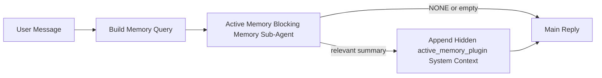

---
read_when:
    - Quieres entender para qué sirve Active Memory
    - Quieres activar Active Memory para un agente conversacional
    - Quieres ajustar el comportamiento de Active Memory sin habilitarlo en todas partes
summary: Un subagente de memoria bloqueante propiedad del Plugin que inyecta memoria relevante en las sesiones de chat interactivas
title: Active Memory
x-i18n:
    generated_at: "2026-04-12T23:28:12Z"
    model: gpt-5.4
    provider: openai
    source_hash: 11665dbc888b6d4dc667a47624cc1f2e4cc71e1d58e1f7d9b5fe4057ec4da108
    source_path: concepts/active-memory.md
    workflow: 15
---

# Active Memory

Active Memory es un subagente de memoria bloqueante opcional propiedad del Plugin que se ejecuta
antes de la respuesta principal para las sesiones conversacionales elegibles.

Existe porque la mayoría de los sistemas de memoria son capaces pero reactivos. Dependen de
que el agente principal decida cuándo buscar en la memoria, o de que el usuario diga cosas
como "recuerda esto" o "busca en la memoria". Para entonces, el momento en que la memoria
habría hecho que la respuesta se sintiera natural ya pasó.

Active Memory le da al sistema una oportunidad limitada de mostrar memoria relevante
antes de que se genere la respuesta principal.

## Pega esto en tu agente

Pega esto en tu agente si quieres que habilite Active Memory con una
configuración autocontenida y segura por defecto:

```json5
{
  plugins: {
    entries: {
      "active-memory": {
        enabled: true,
        config: {
          enabled: true,
          agents: ["main"],
          allowedChatTypes: ["direct"],
          modelFallback: "google/gemini-3-flash",
          queryMode: "recent",
          promptStyle: "balanced",
          timeoutMs: 15000,
          maxSummaryChars: 220,
          persistTranscripts: false,
          logging: true,
        },
      },
    },
  },
}
```

Esto activa el Plugin para el agente `main`, lo mantiene limitado a sesiones
de estilo mensaje directo de forma predeterminada, le permite heredar primero el modelo de la sesión actual y
usa el modelo de respaldo configurado solo si no hay disponible ningún modelo explícito o heredado.

Después de eso, reinicia el Gateway:

```bash
openclaw gateway
```

Para inspeccionarlo en vivo en una conversación:

```text
/verbose on
/trace on
```

## Activar Active Memory

La configuración más segura es:

1. habilitar el Plugin
2. apuntar a un agente conversacional
3. mantener el registro activado solo mientras haces ajustes

Comienza con esto en `openclaw.json`:

```json5
{
  plugins: {
    entries: {
      "active-memory": {
        enabled: true,
        config: {
          agents: ["main"],
          allowedChatTypes: ["direct"],
          modelFallback: "google/gemini-3-flash",
          queryMode: "recent",
          promptStyle: "balanced",
          timeoutMs: 15000,
          maxSummaryChars: 220,
          persistTranscripts: false,
          logging: true,
        },
      },
    },
  },
}
```

Luego reinicia el Gateway:

```bash
openclaw gateway
```

Qué significa esto:

- `plugins.entries.active-memory.enabled: true` activa el Plugin
- `config.agents: ["main"]` habilita Active Memory solo para el agente `main`
- `config.allowedChatTypes: ["direct"]` mantiene Active Memory activado de forma predeterminada solo para sesiones de estilo mensaje directo
- si `config.model` no está definido, Active Memory hereda primero el modelo de la sesión actual
- `config.modelFallback` opcionalmente proporciona tu propio proveedor/modelo de respaldo para recuperación
- `config.promptStyle: "balanced"` usa el estilo de prompt predeterminado de propósito general para el modo `recent`
- Active Memory sigue ejecutándose solo en sesiones de chat interactivas persistentes elegibles

## Cómo verlo

Active Memory inyecta contexto oculto del sistema para el modelo. No expone
etiquetas sin procesar `<active_memory_plugin>...</active_memory_plugin>` al cliente.

## Alternancia por sesión

Usa el comando del Plugin cuando quieras pausar o reanudar Active Memory para la
sesión de chat actual sin editar la configuración:

```text
/active-memory status
/active-memory off
/active-memory on
```

Esto tiene alcance de sesión. No cambia
`plugins.entries.active-memory.enabled`, la selección de agentes ni otra
configuración global.

Si quieres que el comando escriba la configuración y pause o reanude Active Memory para
todas las sesiones, usa la forma global explícita:

```text
/active-memory status --global
/active-memory off --global
/active-memory on --global
```

La forma global escribe `plugins.entries.active-memory.config.enabled`. Deja
`plugins.entries.active-memory.enabled` activado para que el comando siga disponible para
volver a activar Active Memory más adelante.

Si quieres ver qué está haciendo Active Memory en una sesión en vivo, activa las
alternancias de sesión que coincidan con la salida que quieres:

```text
/verbose on
/trace on
```

Con eso habilitado, OpenClaw puede mostrar:

- una línea de estado de Active Memory como `Active Memory: ok 842ms recent 34 chars` cuando `/verbose on`
- un resumen legible de depuración como `Active Memory Debug: Lemon pepper wings with blue cheese.` cuando `/trace on`

Esas líneas se derivan de la misma pasada de Active Memory que alimenta el contexto
oculto del sistema, pero están formateadas para humanos en lugar de exponer marcado de prompt
sin procesar. Se envían como un mensaje de diagnóstico de seguimiento después de la respuesta
normal del asistente para que clientes de canal como Telegram no muestren una burbuja de
diagnóstico separada antes de la respuesta.

De forma predeterminada, la transcripción del subagente de memoria bloqueante es temporal y se elimina
después de que termina la ejecución.

Flujo de ejemplo:

```text
/verbose on
/trace on
what wings should i order?
```

Forma visible esperada de la respuesta:

```text
...normal assistant reply...

🧩 Active Memory: ok 842ms recent 34 chars
🔎 Active Memory Debug: Lemon pepper wings with blue cheese.
```

## Cuándo se ejecuta

Active Memory usa dos filtros:

1. **Opt-in de configuración**
   El Plugin debe estar habilitado, y el id del agente actual debe aparecer en
   `plugins.entries.active-memory.config.agents`.
2. **Elegibilidad estricta en tiempo de ejecución**
   Incluso cuando está habilitado y dirigido, Active Memory solo se ejecuta para
   sesiones de chat interactivas persistentes elegibles.

La regla real es:

```text
plugin enabled
+
agent id targeted
+
allowed chat type
+
eligible interactive persistent chat session
=
active memory runs
```

Si cualquiera de esos falla, Active Memory no se ejecuta.

## Tipos de sesión

`config.allowedChatTypes` controla qué tipos de conversaciones pueden ejecutar Active
Memory en absoluto.

El valor predeterminado es:

```json5
allowedChatTypes: ["direct"]
```

Eso significa que Active Memory se ejecuta de forma predeterminada en sesiones de estilo mensaje directo, pero
no en sesiones de grupo o canal a menos que las habilites explícitamente.

Ejemplos:

```json5
allowedChatTypes: ["direct"]
```

```json5
allowedChatTypes: ["direct", "group"]
```

```json5
allowedChatTypes: ["direct", "group", "channel"]
```

## Dónde se ejecuta

Active Memory es una función de enriquecimiento conversacional, no una
función de inferencia para toda la plataforma.

| Superficie                                                          | ¿Ejecuta Active Memory?                                 |
| ------------------------------------------------------------------- | ------------------------------------------------------- |
| Sesiones persistentes de Control UI / chat web                      | Sí, si el Plugin está habilitado y el agente está dirigido |
| Otras sesiones de canal interactivas en la misma ruta de chat persistente | Sí, si el Plugin está habilitado y el agente está dirigido |
| Ejecuciones headless de una sola vez                                | No                                                      |
| Ejecuciones en segundo plano/Heartbeat                              | No                                                      |
| Rutas internas genéricas de `agent-command`                         | No                                                      |
| Ejecución interna/de subagente auxiliar                             | No                                                      |

## Por qué usarlo

Usa Active Memory cuando:

- la sesión es persistente y de cara al usuario
- el agente tiene memoria a largo plazo significativa para buscar
- la continuidad y la personalización importan más que el determinismo puro del prompt

Funciona especialmente bien para:

- preferencias estables
- hábitos recurrentes
- contexto del usuario a largo plazo que debería aparecer de forma natural

No es una buena opción para:

- automatización
- workers internos
- tareas de API de una sola vez
- lugares donde la personalización oculta sería sorprendente

## Cómo funciona

La forma en tiempo de ejecución es:



El subagente de memoria bloqueante solo puede usar:

- `memory_search`
- `memory_get`

Si la conexión es débil, debe devolver `NONE`.

## Modos de consulta

`config.queryMode` controla cuánto de la conversación ve el subagente de memoria bloqueante.

## Estilos de prompt

`config.promptStyle` controla qué tan dispuesto o estricto es el subagente de memoria bloqueante
al decidir si devolver memoria.

Estilos disponibles:

- `balanced`: valor predeterminado de propósito general para el modo `recent`
- `strict`: el menos dispuesto; mejor cuando quieres muy poca contaminación del contexto cercano
- `contextual`: el más favorable para la continuidad; mejor cuando el historial de conversación debe importar más
- `recall-heavy`: más dispuesto a mostrar memoria con coincidencias más débiles pero aún plausibles
- `precision-heavy`: prefiere agresivamente `NONE` a menos que la coincidencia sea evidente
- `preference-only`: optimizado para favoritos, hábitos, rutinas, gustos y hechos personales recurrentes

Asignación predeterminada cuando `config.promptStyle` no está definido:

```text
message -> strict
recent -> balanced
full -> contextual
```

Si defines `config.promptStyle` explícitamente, esa anulación prevalece.

Ejemplo:

```json5
promptStyle: "preference-only"
```

## Política de modelo de respaldo

Si `config.model` no está definido, Active Memory intenta resolver un modelo en este orden:

```text
explicit plugin model
-> current session model
-> agent primary model
-> optional configured fallback model
```

`config.modelFallback` controla el paso de respaldo configurado.

Respaldo personalizado opcional:

```json5
modelFallback: "google/gemini-3-flash"
```

Si no se resuelve ningún modelo explícito, heredado ni de respaldo configurado, Active Memory
omite la recuperación en ese turno.

`config.modelFallbackPolicy` se conserva solo como un campo de compatibilidad obsoleto
para configuraciones antiguas. Ya no cambia el comportamiento en tiempo de ejecución.

## Vías de escape avanzadas

Estas opciones intencionalmente no forman parte de la configuración recomendada.

`config.thinking` puede anular el nivel de pensamiento del subagente de memoria bloqueante:

```json5
thinking: "medium"
```

Valor predeterminado:

```json5
thinking: "off"
```

No habilites esto de forma predeterminada. Active Memory se ejecuta en la ruta de respuesta, por lo que el tiempo adicional
de pensamiento incrementa directamente la latencia visible para el usuario.

`config.promptAppend` agrega instrucciones adicionales del operador después del prompt predeterminado de Active
Memory y antes del contexto de la conversación:

```json5
promptAppend: "Prefer stable long-term preferences over one-off events."
```

`config.promptOverride` reemplaza el prompt predeterminado de Active Memory. OpenClaw
sigue agregando después el contexto de la conversación:

```json5
promptOverride: "You are a memory search agent. Return NONE or one compact user fact."
```

No se recomienda personalizar prompts a menos que estés probando deliberadamente un
contrato de recuperación distinto. El prompt predeterminado está ajustado para devolver `NONE`
o contexto compacto de hechos del usuario para el modelo principal.

### `message`

Solo se envía el mensaje más reciente del usuario.

```text
Latest user message only
```

Úsalo cuando:

- quieres el comportamiento más rápido
- quieres el sesgo más fuerte hacia la recuperación de preferencias estables
- los turnos de seguimiento no necesitan contexto conversacional

Tiempo de espera recomendado:

- comienza alrededor de `3000` a `5000` ms

### `recent`

Se envían el mensaje más reciente del usuario más una pequeña cola conversacional reciente.

```text
Recent conversation tail:
user: ...
assistant: ...
user: ...

Latest user message:
...
```

Úsalo cuando:

- quieres un mejor equilibrio entre velocidad y base conversacional
- las preguntas de seguimiento suelen depender de los últimos turnos

Tiempo de espera recomendado:

- comienza alrededor de `15000` ms

### `full`

Se envía la conversación completa al subagente de memoria bloqueante.

```text
Full conversation context:
user: ...
assistant: ...
user: ...
...
```

Úsalo cuando:

- la máxima calidad de recuperación importa más que la latencia
- la conversación contiene preparación importante muy atrás en el hilo

Tiempo de espera recomendado:

- auméntalo considerablemente en comparación con `message` o `recent`
- comienza alrededor de `15000` ms o más según el tamaño del hilo

En general, el tiempo de espera debe aumentar con el tamaño del contexto:

```text
message < recent < full
```

## Persistencia de transcripciones

Las ejecuciones del subagente de memoria bloqueante de Active Memory crean una transcripción real
`session.jsonl` durante la llamada del subagente de memoria bloqueante.

De forma predeterminada, esa transcripción es temporal:

- se escribe en un directorio temporal
- se usa solo para la ejecución del subagente de memoria bloqueante
- se elimina inmediatamente después de que termina la ejecución

Si quieres conservar en disco esas transcripciones del subagente de memoria bloqueante para depuración o
inspección, activa la persistencia explícitamente:

```json5
{
  plugins: {
    entries: {
      "active-memory": {
        enabled: true,
        config: {
          agents: ["main"],
          persistTranscripts: true,
          transcriptDir: "active-memory",
        },
      },
    },
  },
}
```

Cuando está habilitado, Active Memory almacena las transcripciones en un directorio separado dentro de la
carpeta de sesiones del agente de destino, no en la ruta principal de transcripción de conversación
del usuario.

La estructura predeterminada es conceptualmente:

```text
agents/<agent>/sessions/active-memory/<blocking-memory-sub-agent-session-id>.jsonl
```

Puedes cambiar el subdirectorio relativo con `config.transcriptDir`.

Úsalo con cuidado:

- las transcripciones del subagente de memoria bloqueante pueden acumularse rápidamente en sesiones con mucha actividad
- el modo de consulta `full` puede duplicar mucho contexto de conversación
- estas transcripciones contienen contexto de prompt oculto y memorias recuperadas

## Configuración

Toda la configuración de Active Memory se encuentra en:

```text
plugins.entries.active-memory
```

Los campos más importantes son:

| Clave                       | Tipo                                                                                                 | Significado                                                                                             |
| --------------------------- | ---------------------------------------------------------------------------------------------------- | ------------------------------------------------------------------------------------------------------- |
| `enabled`                   | `boolean`                                                                                            | Habilita el Plugin en sí                                                                                 |
| `config.agents`             | `string[]`                                                                                           | IDs de agente que pueden usar Active Memory                                                              |
| `config.model`              | `string`                                                                                             | Referencia opcional del modelo del subagente de memoria bloqueante; cuando no está definido, Active Memory usa el modelo actual de la sesión |
| `config.queryMode`          | `"message" \| "recent" \| "full"`                                                                    | Controla cuánto de la conversación ve el subagente de memoria bloqueante                                |
| `config.promptStyle`        | `"balanced" \| "strict" \| "contextual" \| "recall-heavy" \| "precision-heavy" \| "preference-only"` | Controla qué tan dispuesto o estricto es el subagente de memoria bloqueante al decidir si devolver memoria |
| `config.thinking`           | `"off" \| "minimal" \| "low" \| "medium" \| "high" \| "xhigh" \| "adaptive"`                         | Anulación avanzada de pensamiento para el subagente de memoria bloqueante; valor predeterminado `off` para velocidad |
| `config.promptOverride`     | `string`                                                                                             | Reemplazo avanzado completo del prompt; no recomendado para uso normal                                   |
| `config.promptAppend`       | `string`                                                                                             | Instrucciones adicionales avanzadas añadidas al prompt predeterminado o reemplazado                     |
| `config.timeoutMs`          | `number`                                                                                             | Tiempo de espera estricto para el subagente de memoria bloqueante                                        |
| `config.maxSummaryChars`    | `number`                                                                                             | Máximo total de caracteres permitidos en el resumen de active-memory                                     |
| `config.logging`            | `boolean`                                                                                            | Emite registros de Active Memory mientras haces ajustes                                                  |
| `config.persistTranscripts` | `boolean`                                                                                            | Conserva en disco las transcripciones del subagente de memoria bloqueante en lugar de eliminar los archivos temporales |
| `config.transcriptDir`      | `string`                                                                                             | Directorio relativo de transcripciones del subagente de memoria bloqueante dentro de la carpeta de sesiones del agente |

Campos útiles para ajustes:

| Clave                         | Tipo     | Significado                                                  |
| ----------------------------- | -------- | ------------------------------------------------------------ |
| `config.maxSummaryChars`      | `number` | Máximo total de caracteres permitidos en el resumen de active-memory |
| `config.recentUserTurns`      | `number` | Turnos previos del usuario que se incluirán cuando `queryMode` sea `recent` |
| `config.recentAssistantTurns` | `number` | Turnos previos del asistente que se incluirán cuando `queryMode` sea `recent` |
| `config.recentUserChars`      | `number` | Máximo de caracteres por turno reciente del usuario          |
| `config.recentAssistantChars` | `number` | Máximo de caracteres por turno reciente del asistente        |
| `config.cacheTtlMs`           | `number` | Reutilización de caché para consultas idénticas repetidas    |

## Configuración recomendada

Empieza con `recent`.

```json5
{
  plugins: {
    entries: {
      "active-memory": {
        enabled: true,
        config: {
          agents: ["main"],
          queryMode: "recent",
          promptStyle: "balanced",
          timeoutMs: 15000,
          maxSummaryChars: 220,
          logging: true,
        },
      },
    },
  },
}
```

Si quieres inspeccionar el comportamiento en vivo mientras haces ajustes, usa `/verbose on` para la
línea de estado normal y `/trace on` para el resumen de depuración de active-memory, en lugar
de buscar un comando de depuración separado de active-memory. En los canales de chat, esas
líneas de diagnóstico se envían después de la respuesta principal del asistente en lugar de antes.

Luego pasa a:

- `message` si quieres menor latencia
- `full` si decides que el contexto adicional vale la pena aunque el subagente de memoria bloqueante sea más lento

## Depuración

Si Active Memory no aparece donde esperas:

1. Confirma que el Plugin esté habilitado en `plugins.entries.active-memory.enabled`.
2. Confirma que el id del agente actual figure en `config.agents`.
3. Confirma que estás probando a través de una sesión de chat interactiva persistente.
4. Activa `config.logging: true` y observa los registros del Gateway.
5. Verifica que la búsqueda en memoria en sí funcione con `openclaw memory status --deep`.

Si los aciertos de memoria son ruidosos, ajusta más estrictamente:

- `maxSummaryChars`

Si Active Memory es demasiado lento:

- reduce `queryMode`
- reduce `timeoutMs`
- reduce los conteos de turnos recientes
- reduce los límites de caracteres por turno

## Problemas comunes

### El proveedor de embeddings cambió inesperadamente

Active Memory usa el pipeline normal de `memory_search` en
`agents.defaults.memorySearch`. Eso significa que la configuración del proveedor de embeddings solo es un
requisito cuando tu configuración de `memorySearch` requiere embeddings para el comportamiento
que quieres.

En la práctica:

- la configuración explícita del proveedor es **obligatoria** si quieres un proveedor que no se
  detecte automáticamente, como `ollama`
- la configuración explícita del proveedor es **obligatoria** si la detección automática no resuelve
  ningún proveedor de embeddings utilizable para tu entorno
- la configuración explícita del proveedor es **muy recomendable** si quieres una selección
  determinista del proveedor en lugar de "el primero disponible gana"
- la configuración explícita del proveedor normalmente **no es obligatoria** si la detección automática ya
  resuelve el proveedor que quieres y ese proveedor es estable en tu implementación

Si `memorySearch.provider` no está definido, OpenClaw detecta automáticamente el primer proveedor de embeddings disponible.

Eso puede ser confuso en implementaciones reales:

- una nueva API key disponible puede cambiar qué proveedor usa la búsqueda en memoria
- una orden o superficie de diagnóstico puede hacer que el proveedor seleccionado parezca
  distinto de la ruta que realmente estás usando durante la sincronización de memoria en vivo o
  el arranque de la búsqueda
- los proveedores alojados pueden fallar con errores de cuota o límite de velocidad que solo aparecen
  una vez que Active Memory empieza a emitir búsquedas de recuperación antes de cada respuesta

Active Memory puede seguir ejecutándose sin embeddings cuando `memory_search` puede operar
en modo degradado solo léxico, lo que normalmente ocurre cuando no se puede resolver
ningún proveedor de embeddings.

No asumas la misma reserva en fallos de ejecución del proveedor como agotamiento de cuota,
límites de velocidad, errores de red/proveedor o modelos locales/remotos faltantes después de que ya se
haya seleccionado un proveedor.

En la práctica:

- si no se puede resolver ningún proveedor de embeddings, `memory_search` puede degradarse a
  recuperación solo léxica
- si se resuelve un proveedor de embeddings y luego falla en tiempo de ejecución, OpenClaw
  actualmente no garantiza una reserva léxica para esa solicitud
- si necesitas una selección determinista del proveedor, fija
  `agents.defaults.memorySearch.provider`
- si necesitas conmutación por error del proveedor ante errores en tiempo de ejecución, configura
  `agents.defaults.memorySearch.fallback` explícitamente

Si dependes de recuperación respaldada por embeddings, indexación multimodal o de un proveedor
local/remoto específico, fija el proveedor explícitamente en lugar de depender de
la detección automática.

Ejemplos comunes de fijación:

OpenAI:

```json5
{
  agents: {
    defaults: {
      memorySearch: {
        provider: "openai",
        model: "text-embedding-3-small",
      },
    },
  },
}
```

Gemini:

```json5
{
  agents: {
    defaults: {
      memorySearch: {
        provider: "gemini",
        model: "gemini-embedding-001",
      },
    },
  },
}
```

Ollama:

```json5
{
  agents: {
    defaults: {
      memorySearch: {
        provider: "ollama",
        model: "nomic-embed-text",
      },
    },
  },
}
```

Si esperas conmutación por error del proveedor ante errores en tiempo de ejecución como agotamiento de cuota,
fijar un proveedor por sí solo no es suficiente. Configura también una reserva explícita:

```json5
{
  agents: {
    defaults: {
      memorySearch: {
        provider: "openai",
        fallback: "gemini",
      },
    },
  },
}
```

### Depuración de problemas del proveedor

Si Active Memory es lento, está vacío o parece cambiar de proveedor inesperadamente:

- observa los registros del Gateway mientras reproduces el problema; busca líneas como
  `active-memory: ... start|done`, `memory sync failed (search-bootstrap)` o
  errores de embeddings específicos del proveedor
- activa `/trace on` para mostrar en la sesión el resumen de depuración de Active Memory propiedad del Plugin
- activa `/verbose on` si también quieres la línea de estado normal `🧩 Active Memory: ...`
  después de cada respuesta
- ejecuta `openclaw memory status --deep` para inspeccionar el backend actual de búsqueda en memoria
  y el estado del índice
- revisa `agents.defaults.memorySearch.provider` y la autenticación/configuración relacionada para
  asegurarte de que el proveedor que esperas sea realmente el que puede resolverse en tiempo de ejecución
- si usas `ollama`, verifica que el modelo de embeddings configurado esté instalado, por
  ejemplo con `ollama list`

Ejemplo de bucle de depuración:

```text
1. Inicia el Gateway y observa sus registros
2. En la sesión de chat, ejecuta /trace on
3. Envía un mensaje que deba activar Active Memory
4. Compara la línea de depuración visible en el chat con las líneas de registro del Gateway
5. Si la elección del proveedor es ambigua, fija agents.defaults.memorySearch.provider explícitamente
```

Ejemplo:

```json5
{
  agents: {
    defaults: {
      memorySearch: {
        provider: "ollama",
        model: "nomic-embed-text",
      },
    },
  },
}
```

O, si quieres embeddings de Gemini:

```json5
{
  agents: {
    defaults: {
      memorySearch: {
        provider: "gemini",
      },
    },
  },
}
```

Después de cambiar el proveedor, reinicia el Gateway y ejecuta una prueba nueva con
`/trace on` para que la línea de depuración de Active Memory refleje la nueva ruta de embeddings.

## Páginas relacionadas

- [Memory Search](/es/concepts/memory-search)
- [Referencia de configuración de memoria](/es/reference/memory-config)
- [Configuración del Plugin SDK](/es/plugins/sdk-setup)
