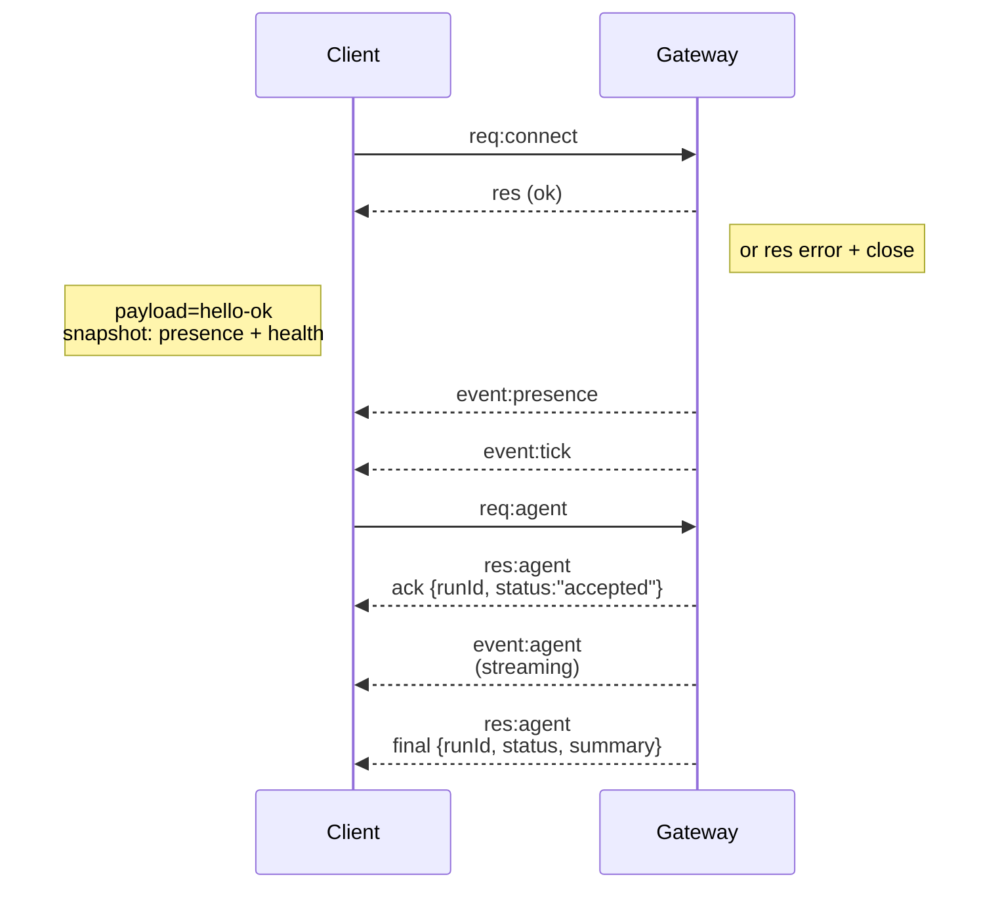

---
read_when:
    - Trabajando en el protocolo del Gateway, clientes o transportes
summary: Arquitectura del Gateway WebSocket, componentes y flujos de cliente
title: Arquitectura del Gateway
x-i18n:
    generated_at: "2026-04-24T05:24:42Z"
    model: gpt-5.4
    provider: openai
    source_hash: 91c553489da18b6ad83fc860014f5bfb758334e9789cb7893d4d00f81c650f02
    source_path: concepts/architecture.md
    workflow: 15
---

## Resumen

- Un único **Gateway** de larga duración es propietario de todas las superficies de mensajería (WhatsApp mediante
  Baileys, Telegram mediante grammY, Slack, Discord, Signal, iMessage, WebChat).
- Los clientes del plano de control (app de macOS, CLI, interfaz web, automatizaciones) se conectan al
  Gateway mediante **WebSocket** en el host de enlace configurado (predeterminado
  `127.0.0.1:18789`).
- Los **Nodes** (macOS/iOS/Android/headless) también se conectan mediante **WebSocket**, pero
  declaran `role: node` con capacidades/comandos explícitos.
- Un Gateway por host; es el único lugar que abre una sesión de WhatsApp.
- El **canvas host** se sirve desde el servidor HTTP del Gateway bajo:
  - `/__openclaw__/canvas/` (HTML/CSS/JS editable por el agente)
  - `/__openclaw__/a2ui/` (host A2UI)
    Usa el mismo puerto que el Gateway (predeterminado `18789`).

## Componentes y flujos

### Gateway (daemon)

- Mantiene conexiones con proveedores.
- Expone una API WS tipada (solicitudes, respuestas, eventos push del servidor).
- Valida los frames entrantes contra JSON Schema.
- Emite eventos como `agent`, `chat`, `presence`, `health`, `heartbeat`, `cron`.

### Clientes (app de macOS / CLI / administración web)

- Una conexión WS por cliente.
- Envían solicitudes (`health`, `status`, `send`, `agent`, `system-presence`).
- Se suscriben a eventos (`tick`, `agent`, `presence`, `shutdown`).

### Nodes (macOS / iOS / Android / headless)

- Se conectan al **mismo servidor WS** con `role: node`.
- Proporcionan una identidad de dispositivo en `connect`; el Pairing se basa **en el dispositivo** (rol `node`) y
  la aprobación vive en el almacén de Pairing del dispositivo.
- Exponen comandos como `canvas.*`, `camera.*`, `screen.record`, `location.get`.

Detalles del protocolo:

- [Protocolo del Gateway](/es/gateway/protocol)

### WebChat

- Interfaz estática que usa la API WS del Gateway para historial de chat y envíos.
- En configuraciones remotas, se conecta mediante el mismo túnel SSH/Tailscale que los demás
  clientes.

## Ciclo de vida de la conexión (cliente único)



## Protocolo en el cable (resumen)

- Transporte: WebSocket, frames de texto con carga útil JSON.
- El primer frame **debe** ser `connect`.
- Después del handshake:
  - Solicitudes: `{type:"req", id, method, params}` → `{type:"res", id, ok, payload|error}`
  - Eventos: `{type:"event", event, payload, seq?, stateVersion?}`
- `hello-ok.features.methods` / `events` son metadatos de descubrimiento, no un
  volcado generado de cada ruta auxiliar invocable.
- La autenticación con secreto compartido usa `connect.params.auth.token` o
  `connect.params.auth.password`, según el modo de autenticación del Gateway configurado.
- Los modos con identidad, como Tailscale Serve
  (`gateway.auth.allowTailscale: true`) o `gateway.auth.mode: "trusted-proxy"` sin loopback,
  satisfacen la autenticación desde las cabeceras de la solicitud
  en lugar de `connect.params.auth.*`.
- El ingreso privado con `gateway.auth.mode: "none"` desactiva por completo la autenticación
  con secreto compartido; mantén ese modo fuera de ingresos públicos o no confiables.
- Las claves de idempotencia son obligatorias para métodos con efectos secundarios (`send`, `agent`) para
  reintentar con seguridad; el servidor mantiene una caché de desduplicación de corta duración.
- Los Nodes deben incluir `role: "node"` más capacidades/comandos/permisos en `connect`.

## Pairing + confianza local

- Todos los clientes WS (operadores + Nodes) incluyen una **identidad de dispositivo** en `connect`.
- Los nuevos ID de dispositivo requieren aprobación de Pairing; el Gateway emite un **token de dispositivo**
  para conexiones posteriores.
- Las conexiones directas de loopback local pueden aprobarse automáticamente para mantener una UX fluida
  en el mismo host.
- OpenClaw también tiene una ruta estrecha de autoconexión local de backend/contenedor para flujos auxiliares
  de confianza con secreto compartido.
- Las conexiones de tailnet y LAN, incluidas las vinculaciones tailnet en el mismo host, siguen requiriendo
  aprobación explícita de Pairing.
- Todas las conexiones deben firmar el nonce `connect.challenge`.
- La carga útil de firma `v3` también vincula `platform` + `deviceFamily`; el Gateway
  fija los metadatos emparejados en la reconexión y requiere un Pairing de reparación para cambios de metadatos.
- Las conexiones **no locales** siguen requiriendo aprobación explícita.
- La autenticación del Gateway (`gateway.auth.*`) sigue aplicándose a **todas** las conexiones, locales o
  remotas.

Detalles: [Protocolo del Gateway](/es/gateway/protocol), [Pairing](/es/channels/pairing),
[Seguridad](/es/gateway/security).

## Tipado del protocolo y generación de código

- Los esquemas TypeBox definen el protocolo.
- JSON Schema se genera a partir de esos esquemas.
- Los modelos Swift se generan a partir del JSON Schema.

## Acceso remoto

- Preferido: Tailscale o VPN.
- Alternativa: túnel SSH

  ```bash
  ssh -N -L 18789:127.0.0.1:18789 user@host
  ```

- El mismo handshake + token de autenticación se aplican sobre el túnel.
- Se puede habilitar TLS + pinning opcional para WS en configuraciones remotas.

## Resumen operativo

- Iniciar: `openclaw gateway` (en primer plano, registros en stdout).
- Estado: `health` sobre WS (también incluido en `hello-ok`).
- Supervisión: launchd/systemd para reinicio automático.

## Invariantes

- Exactamente un Gateway controla una única sesión de Baileys por host.
- El handshake es obligatorio; cualquier primer frame que no sea JSON o no sea `connect` provoca un cierre inmediato.
- Los eventos no se reproducen; los clientes deben refrescar ante huecos.

## Relacionado

- [Bucle de agente](/es/concepts/agent-loop) — ciclo detallado de ejecución del agente
- [Protocolo del Gateway](/es/gateway/protocol) — contrato del protocolo WebSocket
- [Cola](/es/concepts/queue) — cola de comandos y concurrencia
- [Seguridad](/es/gateway/security) — modelo de confianza y refuerzo de seguridad
