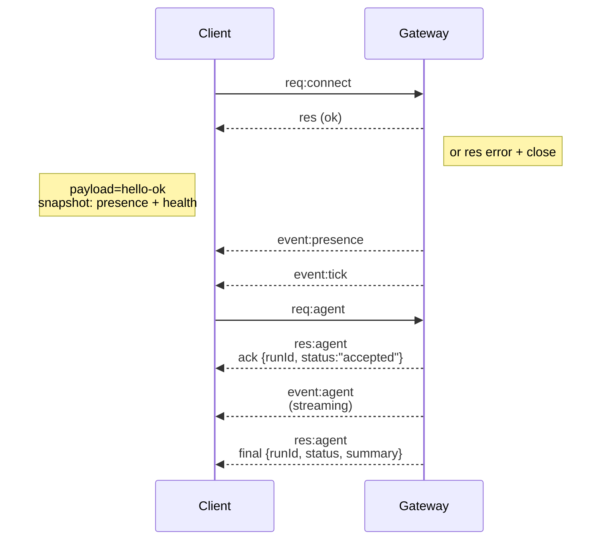

---
read_when:
    - Trabajo con el protocolo del Gateway, los clientes o los transportes
summary: Arquitectura, componentes y flujos de cliente del Gateway WebSocket
title: Arquitectura del Gateway
x-i18n:
    generated_at: "2026-07-11T22:58:48Z"
    model: gpt-5.6
    postprocess_version: locale-links-v1
    provider: openai
    source_hash: f8054bd87f738b957c24f8d6965d55365de2293d44902530a9ba778afa597cc7
    source_path: concepts/architecture.md
    workflow: 16
---

## Descripción general

- Un único **Gateway** de larga duración administra todas las superficies de mensajería (WhatsApp mediante
  Baileys, Telegram mediante grammY, Slack, Discord, Signal, iMessage y WebChat).
- Los clientes del plano de control (aplicación para macOS, CLI, interfaz web y automatizaciones) se conectan al
  Gateway mediante **WebSocket** en el host de enlace configurado (valor predeterminado:
  `127.0.0.1:18789`).
- Los **Nodes** (macOS/iOS/Android/sin interfaz gráfica) también se conectan mediante **WebSocket**, pero
  declaran `role: node` con capacidades y comandos explícitos.
- Se usa un Gateway por host; es el único lugar que abre una sesión de WhatsApp.
- El **host del lienzo** se sirve mediante el servidor HTTP del Gateway en:
  - `/__openclaw__/canvas/` (HTML/CSS/JS editable por el agente)
  - `/__openclaw__/a2ui/` (host de A2UI)

  Utiliza el mismo puerto que el Gateway (valor predeterminado: `18789`).

## Componentes y flujos

### Gateway (demonio)

- Mantiene las conexiones con los proveedores.
- Expone una API de WS tipada (solicitudes, respuestas y eventos enviados por el servidor).
- Valida las tramas entrantes con JSON Schema.
- Emite eventos como `agent`, `chat`, `presence`, `health`, `heartbeat` y `cron`.

### Clientes (aplicación para Mac / CLI / administración web)

- Una conexión WS por cliente.
- Envían solicitudes (`health`, `status`, `send`, `agent`, `system-presence`).
- Se suscriben a eventos (`tick`, `agent`, `presence`, `shutdown`).

### Nodes (macOS / iOS / Android / sin interfaz gráfica)

- Se conectan al **mismo servidor WS** con `role: node`.
- Proporcionan una identidad de dispositivo en `connect`; el emparejamiento se basa en el **dispositivo** (rol `node`) y
  la aprobación se almacena en el repositorio de emparejamiento de dispositivos.
- Exponen comandos como `canvas.*`, `camera.*`, `screen.record` y `location.get`.

Detalles del protocolo: [Protocolo del Gateway](/es/gateway/protocol)

### WebChat

- Interfaz estática que utiliza la API WS del Gateway para consultar el historial del chat y enviar mensajes.
- En configuraciones remotas, se conecta mediante el mismo túnel SSH/Tailscale que los demás
  clientes.

## Ciclo de vida de la conexión (un solo cliente)



## Protocolo de comunicación (resumen)

- Transporte: WebSocket, tramas de texto con cargas útiles JSON.
- La primera trama **debe** ser `connect`.
- Después del protocolo de enlace:
  - Solicitudes: `{type:"req", id, method, params}` → `{type:"res", id, ok, payload|error}`
  - Eventos: `{type:"event", event, payload, seq?, stateVersion?}`
- `hello-ok.features.methods` / `events` son metadatos de descubrimiento, no un
  volcado generado de todas las rutas auxiliares invocables.
- La autenticación mediante secreto compartido utiliza `connect.params.auth.token` o
  `connect.params.auth.password`, según el modo de autenticación configurado para el Gateway.
- Los modos que incluyen identidad, como Tailscale Serve
  (`gateway.auth.allowTailscale: true`) o `gateway.auth.mode: "trusted-proxy"`
  fuera de local loopback, satisfacen la autenticación mediante los encabezados de la solicitud
  en lugar de `connect.params.auth.*`.
- `gateway.auth.mode: "none"` para el ingreso privado desactiva por completo la autenticación mediante
  secreto compartido; no utilice ese modo en ingresos públicos o no confiables.
- Las claves de idempotencia son obligatorias para los métodos con efectos secundarios (`send`, `agent`) a fin de
  permitir reintentos seguros; el servidor mantiene una caché de deduplicación de corta duración.
- Los Nodes deben incluir `role: "node"`, además de las capacidades, los comandos y los permisos, en `connect`.

## Emparejamiento y confianza local

- Todos los clientes WS (operadores y Nodes) incluyen una **identidad de dispositivo** en `connect`.
- Los nuevos identificadores de dispositivo requieren aprobación de emparejamiento; el Gateway emite un **token de dispositivo**
  para las conexiones posteriores.
- Las conexiones directas mediante local loopback pueden aprobarse automáticamente para mantener una experiencia fluida
  en el mismo host.
- OpenClaw también cuenta con una ruta restringida de autoconexión local al backend o contenedor para
  flujos auxiliares confiables que utilizan secretos compartidos.
- Las conexiones mediante tailnet y LAN, incluidos los enlaces a tailnet en el mismo host, siguen requiriendo
  aprobación explícita de emparejamiento.
- Todas las conexiones deben firmar el nonce `connect.challenge`. La carga útil de firma `v3`
  también vincula `platform` y `deviceFamily`; el Gateway fija los metadatos emparejados al
  volver a conectarse y exige repetir el emparejamiento si cambian los metadatos.
- Las conexiones **no locales** siguen requiriendo aprobación explícita.
- La autenticación del Gateway (`gateway.auth.*`) sigue aplicándose a **todas** las conexiones, tanto locales como
  remotas.

Detalles: [Protocolo del Gateway](/es/gateway/protocol), [Emparejamiento](/es/channels/pairing),
[Seguridad](/es/gateway/security).

## Tipado del protocolo y generación de código

- Los esquemas de TypeBox definen el protocolo.
- JSON Schema se genera a partir de esos esquemas.
- Los modelos de Swift se generan a partir de JSON Schema.

## Acceso remoto

- Opción preferida: Tailscale o VPN.
- Alternativa: túnel SSH

  ```bash
  ssh -N -L 18789:127.0.0.1:18789 user@gateway-host
  ```

- El mismo protocolo de enlace y token de autenticación se aplican a través del túnel.
- En configuraciones remotas, se puede habilitar TLS con fijación opcional para WS.

## Resumen de operaciones

- Inicio: `openclaw gateway` (en primer plano, registra la salida en stdout).
- Estado: `health` mediante WS (también se incluye en `hello-ok`).
- Supervisión: launchd/systemd para el reinicio automático.

## Invariantes

- Exactamente un Gateway controla una única sesión de Baileys por host.
- El protocolo de enlace es obligatorio; cualquier primera trama que no sea JSON o `connect` provoca el cierre inmediato.
- Los eventos no se reproducen; los clientes deben actualizarse cuando haya interrupciones.

## Contenido relacionado

- [Bucle del agente](/es/concepts/agent-loop) — ciclo detallado de ejecución del agente
- [Protocolo del Gateway](/es/gateway/protocol) — contrato del protocolo WebSocket
- [Cola](/es/concepts/queue) — cola de comandos y concurrencia
- [Seguridad](/es/gateway/security) — modelo de confianza y refuerzo de seguridad
