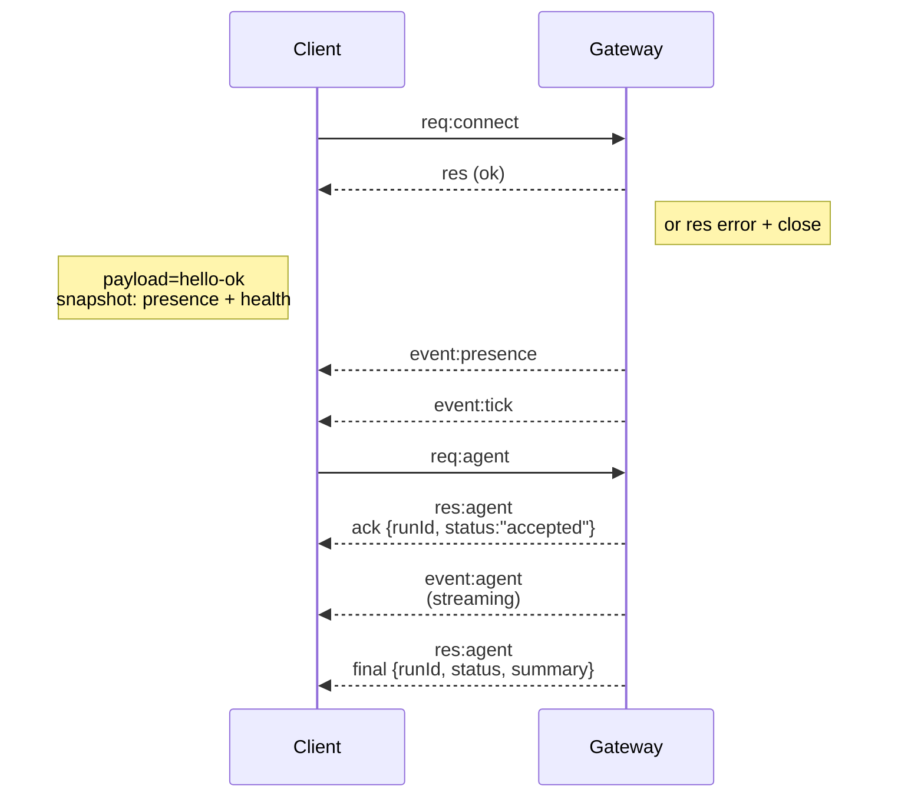

---
read_when:
    - Trabajar en el protocolo de Gateway, clientes o transportes
summary: Arquitectura, componentes y flujos de cliente del Gateway WebSocket
title: Arquitectura del Gateway
x-i18n:
    generated_at: "2026-05-06T05:29:30Z"
    model: gpt-5.5
    provider: openai
    source_hash: 433489081bfe07691b211f5076ec45ce0ed3fd043eb86128f73121f2cab71cd3
    source_path: concepts/architecture.md
    workflow: 16
---

## Resumen

- Un único **Gateway** de larga duración controla todas las superficies de mensajería (WhatsApp mediante
  Baileys, Telegram mediante grammY, Slack, Discord, Signal, iMessage, WebChat).
- Los clientes del plano de control (app de macOS, CLI, IU web, automatizaciones) se conectan al
  Gateway mediante **WebSocket** en el host de enlace configurado (predeterminado
  `127.0.0.1:18789`).
- Los **nodos** (macOS/iOS/Android/sin interfaz) también se conectan mediante **WebSocket**, pero
  declaran `role: node` con capacidades/comandos explícitos.
- Un Gateway por host; es el único lugar que abre una sesión de WhatsApp.
- El **host de canvas** se sirve desde el servidor HTTP del Gateway en:
  - `/__openclaw__/canvas/` (HTML/CSS/JS editable por el agente)
  - `/__openclaw__/a2ui/` (host A2UI)
    Usa el mismo puerto que el Gateway (predeterminado `18789`).

## Componentes y flujos

### Gateway (demonio)

- Mantiene las conexiones de proveedores.
- Expone una API WS tipada (solicitudes, respuestas, eventos enviados por el servidor).
- Valida los frames entrantes contra JSON Schema.
- Emite eventos como `agent`, `chat`, `presence`, `health`, `heartbeat`, `cron`.

### Clientes (app de Mac / CLI / administración web)

- Una conexión WS por cliente.
- Envían solicitudes (`health`, `status`, `send`, `agent`, `system-presence`).
- Se suscriben a eventos (`tick`, `agent`, `presence`, `shutdown`).

### Nodos (macOS / iOS / Android / sin interfaz)

- Se conectan al **mismo servidor WS** con `role: node`.
- Proporcionan una identidad de dispositivo en `connect`; el emparejamiento está **basado en dispositivo** (rol `node`) y
  la aprobación vive en el almacén de emparejamiento de dispositivos.
- Exponen comandos como `canvas.*`, `camera.*`, `screen.record`, `location.get`.

Detalles del protocolo:

- [Protocolo de Gateway](/es/gateway/protocol)

### WebChat

- IU estática que usa la API WS del Gateway para el historial de chat y los envíos.
- En configuraciones remotas, se conecta mediante el mismo túnel SSH/Tailscale que otros
  clientes.

## Ciclo de vida de la conexión (cliente único)



## Protocolo de conexión (resumen)

- Transporte: WebSocket, frames de texto con payloads JSON.
- El primer frame **debe** ser `connect`.
- Después del handshake:
  - Solicitudes: `{type:"req", id, method, params}` → `{type:"res", id, ok, payload|error}`
  - Eventos: `{type:"event", event, payload, seq?, stateVersion?}`
- `hello-ok.features.methods` / `events` son metadatos de descubrimiento, no un
  volcado generado de cada ruta helper invocable.
- La autenticación con secreto compartido usa `connect.params.auth.token` o
  `connect.params.auth.password`, según el modo de autenticación del gateway configurado.
- Los modos con identidad, como Tailscale Serve
  (`gateway.auth.allowTailscale: true`) o el modo sin loopback
  `gateway.auth.mode: "trusted-proxy"`, satisfacen la autenticación desde los encabezados de la solicitud
  en lugar de `connect.params.auth.*`.
- `gateway.auth.mode: "none"` para ingreso privado desactiva por completo la autenticación con secreto compartido;
  mantén ese modo fuera de ingresos públicos/no confiables.
- Las claves de idempotencia son obligatorias para métodos con efectos secundarios (`send`, `agent`) a fin de
  reintentar de forma segura; el servidor mantiene una caché de deduplicación de corta duración.
- Los nodos deben incluir `role: "node"` más capacidades/comandos/permisos en `connect`.

## Emparejamiento + confianza local

- Todos los clientes WS (operadores + nodos) incluyen una **identidad de dispositivo** en `connect`.
- Los nuevos IDs de dispositivo requieren aprobación de emparejamiento; el Gateway emite un **token de dispositivo**
  para conexiones posteriores.
- Las conexiones directas mediante local loopback pueden aprobarse automáticamente para mantener fluida la UX del mismo host.
- OpenClaw también tiene una ruta estrecha de autoconexión local del backend/contenedor para
  flujos helper confiables con secreto compartido.
- Las conexiones por tailnet y LAN, incluidos los enlaces tailnet del mismo host, aún requieren
  aprobación de emparejamiento explícita.
- Todas las conexiones deben firmar el nonce `connect.challenge`.
- El payload de firma `v3` también vincula `platform` + `deviceFamily`; el gateway
  fija los metadatos emparejados al reconectar y requiere emparejamiento de reparación ante cambios de metadatos.
- Las conexiones **no locales** siguen requiriendo aprobación explícita.
- La autenticación del Gateway (`gateway.auth.*`) sigue aplicándose a **todas** las conexiones, locales o
  remotas.

Detalles: [Protocolo de Gateway](/es/gateway/protocol), [Emparejamiento](/es/channels/pairing),
[Seguridad](/es/gateway/security).

## Tipado del protocolo y generación de código

- Los esquemas TypeBox definen el protocolo.
- JSON Schema se genera a partir de esos esquemas.
- Los modelos Swift se generan a partir de JSON Schema.

## Acceso remoto

- Preferido: Tailscale o VPN.
- Alternativa: túnel SSH

  ```bash
  ssh -N -L 18789:127.0.0.1:18789 user@host
  ```

- El mismo handshake + token de autenticación se aplican a través del túnel.
- TLS + pinning opcional pueden habilitarse para WS en configuraciones remotas.

## Instantánea de operaciones

- Inicio: `openclaw gateway` (primer plano, registros en stdout).
- Salud: `health` mediante WS (también incluido en `hello-ok`).
- Supervisión: launchd/systemd para reinicio automático.

## Invariantes

- Exactamente un Gateway controla una única sesión de Baileys por host.
- El handshake es obligatorio; cualquier primer frame que no sea JSON o no sea connect provoca un cierre estricto.
- Los eventos no se reproducen; los clientes deben refrescarse cuando haya brechas.

## Relacionado

- [Bucle del agente](/es/concepts/agent-loop) — ciclo detallado de ejecución del agente
- [Protocolo de Gateway](/es/gateway/protocol) — contrato del protocolo WebSocket
- [Cola](/es/concepts/queue) — cola de comandos y concurrencia
- [Seguridad](/es/gateway/security) — modelo de confianza y endurecimiento
