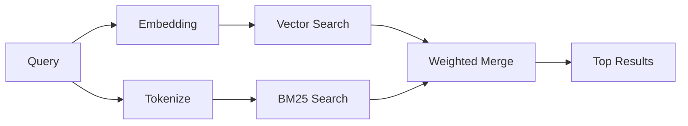

---
read_when:
    - Quieres entender cómo funciona memory_search
    - Quieres elegir un proveedor de embeddings
    - Quieres ajustar la calidad de búsqueda
summary: Cómo la búsqueda de memoria encuentra notas relevantes mediante embeddings y recuperación híbrida
title: Búsqueda en memoria
x-i18n:
    generated_at: "2026-06-27T11:13:06Z"
    model: gpt-5.5
    postprocess_version: locale-links-v1
    provider: openai
    source_hash: b0bcb8cf400100ba8b6ddbb46bdf8b2a89a8bc32a550ee6df47c874e7e9e0879
    source_path: concepts/memory-search.md
    workflow: 16
---

`memory_search` encuentra notas relevantes en tus archivos de memoria, incluso cuando la
redacción difiere del texto original. Funciona indexando la memoria en pequeños
fragmentos y buscándolos mediante embeddings, palabras clave o ambas cosas.

## Inicio rápido

La búsqueda de memoria usa embeddings de OpenAI de forma predeterminada. Para usar otro backend de
embeddings, establece un proveedor explícitamente:

```json5
{
  agents: {
    defaults: {
      memorySearch: {
        provider: "openai", // or "gemini", "local", "ollama", "openai-compatible", etc.
      },
    },
  },
}
```

Para configuraciones con varios endpoints y proveedores específicos de memoria, `provider` también puede
ser una entrada personalizada `models.providers.<id>`, como `ollama-5080`, cuando ese
proveedor establece `api: "ollama"` u otro propietario de adaptador de embeddings de memoria.

Para embeddings locales sin clave de API, instala
`@openclaw/llama-cpp-provider` y establece `provider: "local"`. Los checkouts de código fuente
aún pueden requerir aprobación de compilación nativa: `pnpm approve-builds` y luego
`pnpm rebuild node-llama-cpp`.

Algunos endpoints de embeddings compatibles con OpenAI requieren etiquetas asimétricas como
`input_type: "query"` para búsquedas y `input_type: "document"` o `"passage"`
para fragmentos indexados. Configúralas con `memorySearch.queryInputType` y
`memorySearch.documentInputType`; consulta la [referencia de configuración de memoria](/es/reference/memory-config#provider-specific-config).

## Proveedores compatibles

| Proveedor         | ID                  | Necesita clave de API | Notas                                |
| ----------------- | ------------------- | --------------------- | ------------------------------------ |
| Bedrock           | `bedrock`           | No                    | Usa la cadena de credenciales de AWS |
| DeepInfra         | `deepinfra`         | Sí                    | Predeterminado: `BAAI/bge-m3`        |
| Gemini            | `gemini`            | Sí                    | Admite indexación de imágenes/audio  |
| GitHub Copilot    | `github-copilot`    | No                    | Usa la suscripción a Copilot         |
| Local             | `local`             | No                    | Modelo GGUF, descarga de ~0,6 GB     |
| Mistral           | `mistral`           | Sí                    |                                      |
| Ollama            | `ollama`            | No                    | Local/autohospedado                  |
| OpenAI            | `openai`            | Sí                    | Predeterminado                       |
| OpenAI-compatible | `openai-compatible` | Normalmente           | `/v1/embeddings` genérico            |
| Voyage            | `voyage`            | Sí                    |                                      |

## Cómo funciona la búsqueda

OpenClaw ejecuta dos rutas de recuperación en paralelo y combina los resultados:



- **Búsqueda vectorial** encuentra notas con significado similar ("gateway host" coincide con
  "the machine running OpenClaw").
- **Búsqueda de palabras clave BM25** encuentra coincidencias exactas (IDs, cadenas de error, claves de
  configuración).

Si solo una ruta está disponible, la otra se ejecuta sola. El modo intencional
solo FTS (`provider: "none"`) y la selección automática/predeterminada de proveedor aún pueden usar
clasificación léxica cuando los embeddings no están disponibles.

Los proveedores explícitos de embeddings no locales son diferentes. Si estableces
`memorySearch.provider` en un proveedor concreto respaldado por remoto y ese proveedor
no está disponible en tiempo de ejecución, `memory_search` informa que la memoria no está disponible en lugar
de usar silenciosamente resultados solo FTS. Esto mantiene visible un proveedor semántico
configurado que está roto. Establece `provider: "none"` para recuperación deliberada solo FTS, o corrige
la configuración de proveedor/autenticación para restaurar la clasificación semántica.

## Mejorar la calidad de búsqueda

Dos funciones opcionales ayudan cuando tienes un historial de notas grande:

### Decaimiento temporal

Las notas antiguas pierden gradualmente peso de clasificación para que la información reciente aparezca primero.
Con la vida media predeterminada de 30 días, una nota del mes pasado puntúa al 50 % de
su peso original. Los archivos permanentes como `MEMORY.md` nunca decaen.

<Tip>
Activa el decaimiento temporal si tu agente tiene meses de notas diarias y la información
obsoleta sigue superando al contexto reciente.
</Tip>

### MMR (diversidad)

Reduce los resultados redundantes. Si cinco notas mencionan la misma configuración del enrutador, MMR
garantiza que los resultados principales cubran temas diferentes en lugar de repetirse.

<Tip>
Activa MMR si `memory_search` sigue devolviendo fragmentos casi duplicados de
distintas notas diarias.
</Tip>

### Activar ambas

```json5
{
  agents: {
    defaults: {
      memorySearch: {
        query: {
          hybrid: {
            mmr: { enabled: true },
            temporalDecay: { enabled: true },
          },
        },
      },
    },
  },
}
```

## Memoria multimodal

Con Gemini Embedding 2, puedes indexar imágenes y archivos de audio junto con
Markdown. Las consultas de búsqueda siguen siendo texto, pero coinciden con contenido visual y de audio.
Consulta la [referencia de configuración de memoria](/es/reference/memory-config) para la
configuración.

## Búsqueda de memoria de sesión

Opcionalmente, puedes indexar transcripciones de sesión para que `memory_search` pueda recordar
conversaciones anteriores. Esto es opcional mediante
`memorySearch.experimental.sessionMemory`. Consulta la
[referencia de configuración](/es/reference/memory-config) para obtener detalles.

## Solución de problemas

**¿Sin resultados?** Ejecuta `openclaw memory status` para comprobar el índice. Si está vacío, ejecuta
`openclaw memory index --force`.

**¿Solo coincidencias de palabras clave?** Puede que tu proveedor de embeddings no esté configurado. Comprueba
`openclaw memory status --deep`.

**¿Los embeddings locales agotan el tiempo de espera?** `ollama`, `lmstudio` y `local` usan un tiempo de espera de lote
en línea más largo de forma predeterminada. Si el host simplemente es lento, establece
`agents.defaults.memorySearch.sync.embeddingBatchTimeoutSeconds` y vuelve a ejecutar
`openclaw memory index --force`.

**¿No se encuentra texto CJK?** Reconstruye el índice FTS con
`openclaw memory index --force`.

## Lecturas adicionales

- [Active Memory](/es/concepts/active-memory) -- memoria de subagente para sesiones de chat interactivas
- [Memoria](/es/concepts/memory) -- disposición de archivos, backends, herramientas
- [Referencia de configuración de memoria](/es/reference/memory-config) -- todos los controles de configuración

## Relacionado

- [Resumen de memoria](/es/concepts/memory)
- [Active Memory](/es/concepts/active-memory)
- [Motor de memoria integrado](/es/concepts/memory-builtin)
