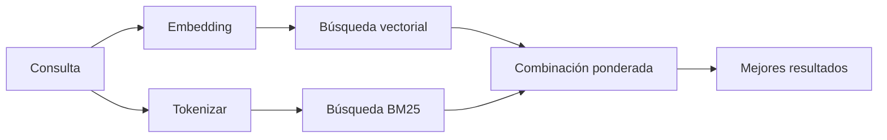

---
read_when:
    - Quieres entender cómo funciona memory_search
    - Se desea elegir un proveedor de embeddings
    - Quieres ajustar la calidad de la búsqueda
summary: Cómo la búsqueda en memoria encuentra notas relevantes mediante embeddings y recuperación híbrida
title: Búsqueda en la memoria
x-i18n:
    generated_at: "2026-07-22T10:30:25Z"
    model: gpt-5.6
    postprocess_version: locale-links-v1
    prompt_version: 32
    provider: openai
    source_hash: b2bd28b63ac55a2a890ed70a3015f76f1c7fbaa792b17a6ead51f4c8712fbd2d
    source_path: concepts/memory-search.md
    workflow: 16
---

`memory_search` encuentra notas relevantes en los archivos de memoria, incluso cuando la
redacción difiere del texto original. Divide la memoria en fragmentos pequeños y
los busca mediante embeddings, palabras clave o ambos.

## Inicio rápido

OpenClaw usa embeddings de OpenAI de forma predeterminada. Para usar otro proveedor, establézcalo
explícitamente:

```json5
{
  memory: {
    search: {
      provider: "openai", // o "gemini", "voyage", "mistral", "bedrock", "local", "ollama", "lmstudio", "github-copilot", "openai-compatible"
    },
  },
}
```

`provider` también puede hacer referencia a una entrada `models.providers.<id>` personalizada (por
ejemplo, `ollama-5080`), siempre que esa entrada establezca `api` en `"ollama"` u
otro id de proveedor con un adaptador de embeddings de memoria.

Para usar embeddings locales sin clave de API, instale el plugin oficial del proveedor llama.cpp
y establezca `provider: "local"`:

```bash
openclaw plugins install @openclaw/llama-cpp-provider
```

Los checkouts del código fuente siguen necesitando la aprobación de la compilación nativa: `pnpm approve-builds`, y después
`pnpm rebuild node-llama-cpp`.

Algunos endpoints de embeddings compatibles con OpenAI requieren etiquetas `input_type`
asimétricas, como `"query"` para las búsquedas y `"document"`/`"passage"` para los fragmentos
indexados. Establézcalas con `queryInputType` y `documentInputType`; consulte la
[referencia de configuración de memoria](/es/reference/memory-config#provider-specific-config).

## Proveedores compatibles

| Proveedor         | ID                  | Requiere clave de API | Notas                                  |
| ----------------- | ------------------- | --------------------- | -------------------------------------- |
| Bedrock           | `bedrock`           | No                    | Usa la cadena de credenciales de AWS   |
| DeepInfra         | `deepinfra`         | Sí                    | Modelo predeterminado `BAAI/bge-m3`    |
| Gemini            | `gemini`            | Sí                    | Admite la indexación de imágenes/audio |
| GitHub Copilot    | `github-copilot`    | No                    | Usa su suscripción a Copilot           |
| Local             | `local`             | No                    | Modelo GGUF, descarga automática de ~0.6 GB |
| LM Studio         | `lmstudio`          | No                    | Servidor local/autohospedado            |
| Mistral           | `mistral`           | Sí                    |                                        |
| Ollama            | `ollama`            | No                    | Servidor local/autohospedado            |
| OpenAI            | `openai`            | Sí                    | Predeterminado                         |
| Compatible con OpenAI | `openai-compatible` | Normalmente            | Endpoint `/v1/embeddings` genérico   |
| Voyage            | `voyage`            | Sí                    |                                        |

## Cómo funciona la búsqueda

OpenClaw ejecuta dos vías de recuperación en paralelo y combina los resultados:



- **La búsqueda vectorial** encuentra significados similares ("gateway host" coincide con "la
  máquina que ejecuta OpenClaw").
- **La búsqueda por palabras clave BM25** encuentra términos exactos (ID, cadenas de error, claves de
  configuración).
- **La búsqueda por nombre de archivo** indexa las rutas por separado del contenido de las notas. Las rutas completas
  exactas, los nombres base y las raíces de los nombres de archivo se clasifican por encima de las coincidencias parciales de rutas,
  mientras que los fragmentos y las puntuaciones de palabras clave del cuerpo siguen procediendo del contenido de las notas.

Si solo hay una vía disponible, esta se ejecuta por sí sola.

**Modo solo FTS.** Establezca `provider: "none"` para desactivar intencionadamente los embeddings
y buscar únicamente con palabras clave. Si `provider` no se establece o se establece en `"auto"`,
también se recurre a la clasificación solo por palabras clave si no se configura autenticación para embeddings,
sin generar ningún error; lo mismo ocurre con `provider: "local"` (el proveedor
GGUF/llama.cpp) cuando falla.

**Proveedor explícito no disponible.** Si especifica explícitamente cualquier otro proveedor
(por ejemplo, `openai`, `ollama`, `gemini`) y deja de estar disponible en el
momento de la solicitud (autenticación incorrecta, fallo de red), `memory_search` informa de que la memoria
no está disponible en lugar de degradarse silenciosamente a resultados solo FTS. Esto permite
detectar un proveedor configurado que no funciona. Establezca `provider: "none"` para usar deliberadamente
la recuperación solo FTS, o corrija la configuración del proveedor o de la autenticación para restaurar la clasificación
semántica.

## Mejora de la calidad de la búsqueda

Dos funciones opcionales resultan útiles cuando existe un historial de notas extenso.

### Decaimiento temporal

Las notas antiguas pierden gradualmente peso en la clasificación para que la información reciente aparezca primero.
Con la semivida predeterminada de 30 días, una nota del mes pasado obtiene el 50 % de su
peso original. `MEMORY.md` y otros archivos sin fecha dentro de `memory/` son
permanentes y nunca decaen; solo decaen los archivos `memory/YYYY-MM-DD.md` con fecha.

<Tip>
Active esta opción si el agente tiene meses de notas diarias y la información obsoleta
sigue clasificándose por encima del contexto reciente.
</Tip>

### MMR (diversidad)

Reduce los resultados redundantes. Si cinco notas mencionan la misma configuración del router,
MMR garantiza que los primeros resultados abarquen temas diferentes en lugar de repetirse.

<Tip>
Active esta opción si `memory_search` sigue devolviendo fragmentos casi duplicados de
distintas notas diarias.
</Tip>

### Activar ambas

```json5
{
  memory: {
    search: {
      query: {
        hybrid: {
          mmr: { enabled: true },
          temporalDecay: { enabled: true },
        },
      },
    },
  },
}
```

## Memoria multimodal

Con `gemini-embedding-2-preview`, puede indexar imágenes y audio junto con
Markdown. Esto solo se aplica a los archivos dentro de `memory.search.extraPaths`; las raíces de memoria
predeterminadas (`MEMORY.md`, `memory/*.md`) siguen admitiendo únicamente Markdown. Las consultas de búsqueda
siguen siendo de texto, pero se comparan con el contenido visual y de audio. Consulte la
[referencia de configuración de memoria](/es/reference/memory-config#multimodal-memory-gemini)
para ver cómo configurarlo.

## Búsqueda en la memoria de sesiones

Para recuperar texto completo exacto de las transcripciones de sesiones, use [`sessions_search`](/es/concepts/session-search)
y después abra un resultado con `sessions_history`. La búsqueda en la memoria de sesiones sigue siendo el complemento semántico
experimental.

También puede indexar las transcripciones de sesiones para que `memory_search` pueda recuperar conversaciones
anteriores. Esta función es opcional: establezca `experimental.sessionMemory: true` y añada
`"sessions"` a `sources` (el valor predeterminado de `sources` es `["memory"]`).

Los resultados de sesiones respetan `tools.sessions.visibility`: el valor predeterminado `"tree"` expone la
sesión actual, las sesiones que esta generó y las sesiones de grupo del mismo agente observadas
mediante el reconocimiento ambiental de grupos. Con `session.dmScope: "main"`, una configuración de
mensajes directos multiusuario comparte esa sesión principal, por lo que los usuarios dirigidos a ella pueden recuperar contenido
de los grupos que observa. Use un `dmScope` por interlocutor para aislar los mensajes directos, o establezca
la visibilidad en `"self"` para excluirse de las lecturas ambientales de sesiones observadas. Las demás
sesiones no relacionadas del mismo agente siguen requiriendo la visibilidad `"agent"`.

Cuando use el backend QMD, establezca también `memory.qmd.sessions.enabled: true` para que
las transcripciones se exporten a la colección QMD; `experimental.sessionMemory`
y `sources` por sí solos no exportan las transcripciones a QMD. Consulte la
[referencia de configuración](/es/reference/memory-config#session-memory-search-experimental).

## Solución de problemas

**¿No hay resultados?** Ejecute `openclaw memory status` para comprobar el índice. Si está vacío, ejecute
`openclaw memory index --force`.

**¿Solo hay coincidencias de palabras clave?** Es posible que el proveedor de embeddings no esté configurado. Compruebe
`openclaw memory status --deep`.

**¿Se agota el tiempo de espera de los embeddings locales?** `ollama`, `lmstudio` y `local` usan plazos
de procesamiento por lotes más largos gestionados por el proveedor. Compruebe el estado del proveedor y vuelva a ejecutar
`openclaw memory index --force`.

**¿No se encuentra texto CJK?** Reconstruya el índice FTS con
`openclaw memory index --force`.

## Contenido relacionado

- [Descripción general de la memoria](/es/concepts/memory)
- [Active Memory](/es/concepts/active-memory)
- [Motor de memoria integrado](/es/concepts/memory-builtin)
- [Referencia de configuración de memoria](/es/reference/memory-config)
