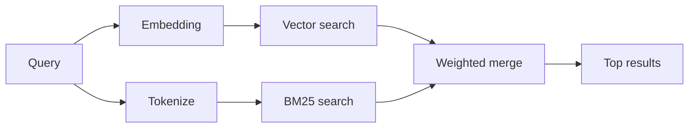

---
read_when:
    - Quieres entender cómo funciona `memory_search`
    - Quieres elegir un proveedor de embeddings
    - Quieres ajustar la calidad de búsqueda
summary: Cómo la búsqueda de memoria encuentra notas relevantes mediante embeddings y recuperación híbrida
title: Búsqueda en memoria
x-i18n:
    generated_at: "2026-07-05T11:14:30Z"
    model: gpt-5.5
    postprocess_version: locale-links-v1
    provider: openai
    source_hash: 1a29115d09ffc919e48a08e4b1ae4945f40b1e49c71c8a0a63af6f9f5ead1ddc
    source_path: concepts/memory-search.md
    workflow: 16
---

`memory_search` encuentra notas relevantes de tus archivos de memoria, incluso cuando la
redacción difiere del texto original. Divide la memoria en fragmentos pequeños y
los busca con embeddings, palabras clave o ambos.

## Inicio rápido

OpenClaw usa embeddings de OpenAI de forma predeterminada. Para usar otro proveedor, configúralo
explícitamente:

```json5
{
  agents: {
    defaults: {
      memorySearch: {
        provider: "openai", // or "gemini", "voyage", "mistral", "bedrock", "local", "ollama", "lmstudio", "github-copilot", "openai-compatible"
      },
    },
  },
}
```

`provider` también puede hacer referencia a una entrada personalizada `models.providers.<id>` (por
ejemplo `ollama-5080`), siempre que esa entrada establezca `api` en `"ollama"` u
otro id de proveedor con un adaptador de embeddings de memoria.

Para embeddings locales sin clave de API, instala el Plugin oficial de proveedor
llama.cpp y configura `provider: "local"`:

```bash
openclaw plugins install @openclaw/llama-cpp-provider
```

Los checkouts de código fuente aún necesitan aprobación de compilación nativa: `pnpm approve-builds`, y luego
`pnpm rebuild node-llama-cpp`.

Algunos endpoints de embeddings compatibles con OpenAI requieren etiquetas `input_type`
asimétricas, como `"query"` para búsquedas y `"document"`/`"passage"` para fragmentos
indexados. Configúralas con `queryInputType` y `documentInputType`; consulta
[Referencia de configuración de memoria](/es/reference/memory-config#provider-specific-config).

## Proveedores compatibles

| Proveedor         | ID                  | Requiere clave de API | Notas                                      |
| ----------------- | ------------------- | --------------------- | ------------------------------------------ |
| Bedrock           | `bedrock`           | No                    | Usa la cadena de credenciales de AWS       |
| DeepInfra         | `deepinfra`         | Sí                    | Modelo predeterminado `BAAI/bge-m3`        |
| Gemini            | `gemini`            | Sí                    | Admite indexación de imágenes/audio        |
| GitHub Copilot    | `github-copilot`    | No                    | Usa tu suscripción de Copilot              |
| Local             | `local`             | No                    | Modelo GGUF, descarga automática de ~0.6 GB |
| LM Studio         | `lmstudio`          | No                    | Servidor local/autohospedado               |
| Mistral           | `mistral`           | Sí                    |                                            |
| Ollama            | `ollama`            | No                    | Servidor local/autohospedado               |
| OpenAI            | `openai`            | Sí                    | Predeterminado                             |
| Compatible con OpenAI | `openai-compatible` | Normalmente       | Endpoint genérico `/v1/embeddings`         |
| Voyage            | `voyage`            | Sí                    |                                            |

## Cómo funciona la búsqueda

OpenClaw ejecuta dos rutas de recuperación en paralelo y fusiona los resultados:



- **Búsqueda vectorial** coincide con significado similar ("host de Gateway" coincide con "la
  máquina que ejecuta OpenClaw").
- **Búsqueda por palabras clave BM25** coincide con términos exactos (IDs, cadenas de error, claves de
  configuración).

Si solo una ruta está disponible, la otra se ejecuta sola.

**Modo solo FTS.** Configura `provider: "none"` para deshabilitar intencionalmente los embeddings
y buscar solo con palabras clave. Dejar `provider` sin definir o configurado en `"auto"`
también vuelve a la clasificación solo por palabras clave si no hay autenticación de embeddings configurada,
sin generar errores, y lo mismo hace `provider: "local"` (el proveedor GGUF/llama.cpp)
cuando falla.

**Proveedor explícito no disponible.** Si nombras cualquier otro proveedor explícitamente
(por ejemplo `openai`, `ollama`, `gemini`) y deja de estar disponible en el
momento de la solicitud (autenticación incorrecta, fallo de red), `memory_search` informa que la memoria
no está disponible en lugar de degradarse silenciosamente a resultados solo FTS. Esto mantiene visible un
proveedor configurado roto. Configura `provider: "none"` para una recuperación deliberada
solo FTS, o corrige la configuración del proveedor/autenticación para restaurar la clasificación semántica.

## Mejorar la calidad de búsqueda

Dos características opcionales ayudan con un historial grande de notas.

### Decaimiento temporal

Las notas antiguas pierden gradualmente peso de clasificación para que la información reciente aparezca primero.
Con la vida media predeterminada de 30 días, una nota del mes pasado puntúa al 50% de su
peso original. `MEMORY.md` y otros archivos sin fecha bajo `memory/` son
permanentes y nunca decaen; solo decaen los archivos con fecha `memory/YYYY-MM-DD.md`.

<Tip>
Activa esto si tu agente tiene meses de notas diarias y la información obsoleta
sigue clasificándose por encima del contexto reciente.
</Tip>

### MMR (diversidad)

Reduce resultados redundantes. Si cinco notas mencionan todas la misma configuración de router,
MMR garantiza que los resultados principales cubran temas diferentes en lugar de repetirse.

<Tip>
Activa esto si `memory_search` sigue devolviendo fragmentos casi duplicados de
diferentes notas diarias.
</Tip>

### Activar ambos

```json5
{
  agents: {
    defaults: {
      memorySearch: {
        query: {
          hybrid: {
            mmr: { enabled: true },
            temporalDecay: { enabled: true },
          },
        },
      },
    },
  },
}
```

## Memoria multimodal

Con `gemini-embedding-2-preview`, puedes indexar imágenes y audio junto con
Markdown. Esto solo se aplica a archivos bajo `memorySearch.extraPaths`; las raíces de memoria
predeterminadas (`MEMORY.md`, `memory/*.md`) permanecen solo Markdown. Las consultas de búsqueda
siguen siendo texto, pero coinciden con contenido visual y de audio. Consulta
[Referencia de configuración de memoria](/es/reference/memory-config#multimodal-memory-gemini)
para la configuración.

## Búsqueda en memoria de sesión

Opcionalmente, indexa transcripciones de sesión para que `memory_search` pueda recordar conversaciones
anteriores. Esto es opcional: configura `experimental.sessionMemory: true` y agrega
`"sessions"` a `sources` (el valor predeterminado de `sources` es `["memory"]`).

Los resultados de sesión obedecen `tools.sessions.visibility`: el valor predeterminado `"tree"` solo
expone la sesión actual y las sesiones que esta generó. Para recordar una sesión no relacionada
del mismo agente desde una sesión diferente (por ejemplo, una sesión despachada por Gateway
desde un DM), amplía la visibilidad a `"agent"`.

Al usar el backend QMD, configura también `memory.qmd.sessions.enabled: true` para que
las transcripciones se exporten a la colección QMD; `experimental.sessionMemory`
y `sources` por sí solos no exportan transcripciones a QMD. Consulta
[referencia de configuración](/es/reference/memory-config#session-memory-search-experimental).

## Solución de problemas

**¿Sin resultados?** Ejecuta `openclaw memory status` para revisar el índice. Si está vacío, ejecuta
`openclaw memory index --force`.

**¿Solo coincidencias por palabras clave?** Es posible que tu proveedor de embeddings no esté configurado. Revisa
`openclaw memory status --deep`.

**¿Los embeddings locales agotan el tiempo de espera?** `ollama`, `lmstudio` y `local` usan un tiempo de espera de lote
en línea más largo de forma predeterminada. Si el host simplemente es lento, configura
`agents.defaults.memorySearch.sync.embeddingBatchTimeoutSeconds` y vuelve a ejecutar
`openclaw memory index --force`.

**¿No se encuentra texto CJK?** Reconstruye el índice FTS con
`openclaw memory index --force`.

## Relacionado

- [Descripción general de la memoria](/es/concepts/memory)
- [Active Memory](/es/concepts/active-memory)
- [Motor de memoria integrado](/es/concepts/memory-builtin)
- [Referencia de configuración de memoria](/es/reference/memory-config)
