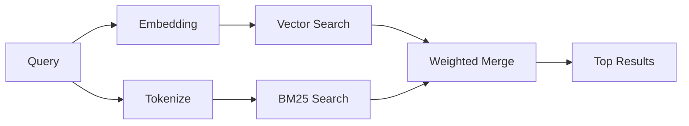

---
read_when:
    - Quieres entender cómo funciona memory_search
    - Quieres elegir un proveedor de embeddings
    - Quieres ajustar la calidad de búsqueda
summary: Cómo encuentra la búsqueda de memoria notas relevantes usando embeddings y recuperación híbrida
title: Búsqueda de memoria
x-i18n:
    generated_at: "2026-04-12T23:28:06Z"
    model: gpt-5.4
    provider: openai
    source_hash: 71fde251b7d2dc455574aa458e7e09136f30613609ad8dafeafd53b2729a0310
    source_path: concepts/memory-search.md
    workflow: 15
---

# Búsqueda de memoria

`memory_search` encuentra notas relevantes de tus archivos de memoria, incluso cuando la redacción difiere del texto original. Funciona indexando la memoria en fragmentos pequeños y buscándolos mediante embeddings, palabras clave o ambos.

## Inicio rápido

Si tienes configurada una clave de API de OpenAI, Gemini, Voyage o Mistral, la búsqueda de memoria funciona automáticamente. Para establecer un proveedor explícitamente:

```json5
{
  agents: {
    defaults: {
      memorySearch: {
        provider: "openai", // or "gemini", "local", "ollama", etc.
      },
    },
  },
}
```

Para embeddings locales sin clave de API, usa `provider: "local"` (requiere `node-llama-cpp`).

## Proveedores compatibles

| Provider | ID        | Needs API key | Notes                                                |
| -------- | --------- | ------------- | ---------------------------------------------------- |
| OpenAI   | `openai`  | Yes           | Auto-detected, fast                                  |
| Gemini   | `gemini`  | Yes           | Supports image/audio indexing                        |
| Voyage   | `voyage`  | Yes           | Auto-detected                                        |
| Mistral  | `mistral` | Yes           | Auto-detected                                        |
| Bedrock  | `bedrock` | No            | Auto-detected when the AWS credential chain resolves |
| Ollama   | `ollama`  | No            | Local, must set explicitly                           |
| Local    | `local`   | No            | GGUF model, ~0.6 GB download                         |

## Cómo funciona la búsqueda

OpenClaw ejecuta dos rutas de recuperación en paralelo y combina los resultados:



- **La búsqueda vectorial** encuentra notas con significado similar ("gateway host" coincide con "the machine running OpenClaw").
- **La búsqueda de palabras clave BM25** encuentra coincidencias exactas (IDs, cadenas de error, claves de configuración).

Si solo una ruta está disponible (sin embeddings o sin FTS), la otra se ejecuta por sí sola.

Cuando los embeddings no están disponibles, OpenClaw sigue usando clasificación léxica sobre los resultados de FTS en lugar de recurrir únicamente al orden bruto por coincidencia exacta. Ese modo degradado potencia los fragmentos con una cobertura más fuerte de los términos de la consulta y rutas de archivo relevantes, lo que mantiene útil la recuperación incluso sin `sqlite-vec` o un proveedor de embeddings.

## Mejorar la calidad de búsqueda

Dos funciones opcionales ayudan cuando tienes un historial grande de notas:

### Decaimiento temporal

Las notas antiguas pierden gradualmente peso en la clasificación para que la información reciente aparezca primero. Con la vida media predeterminada de 30 días, una nota del mes pasado puntúa al 50% de su peso original. Los archivos permanentes como `MEMORY.md` nunca se degradan.

<Tip>
Activa el decaimiento temporal si tu agente tiene meses de notas diarias y la información desactualizada sigue superando en rango al contexto reciente.
</Tip>

### MMR (diversidad)

Reduce los resultados redundantes. Si cinco notas mencionan la misma configuración del router, MMR garantiza que los resultados principales cubran distintos temas en lugar de repetirse.

<Tip>
Activa MMR si `memory_search` sigue devolviendo fragmentos casi duplicados de distintas notas diarias.
</Tip>

### Activar ambos

```json5
{
  agents: {
    defaults: {
      memorySearch: {
        query: {
          hybrid: {
            mmr: { enabled: true },
            temporalDecay: { enabled: true },
          },
        },
      },
    },
  },
}
```

## Memoria multimodal

Con Gemini Embedding 2, puedes indexar imágenes y archivos de audio junto con Markdown. Las consultas de búsqueda siguen siendo texto, pero coinciden con contenido visual y de audio. Consulta la [referencia de configuración de memoria](/es/reference/memory-config) para la configuración.

## Búsqueda de memoria de sesión

Opcionalmente puedes indexar transcripciones de sesión para que `memory_search` pueda recordar conversaciones anteriores. Esto se activa mediante `memorySearch.experimental.sessionMemory`. Consulta la [referencia de configuración](/es/reference/memory-config) para más detalles.

## Solución de problemas

**¿No hay resultados?** Ejecuta `openclaw memory status` para comprobar el índice. Si está vacío, ejecuta `openclaw memory index --force`.

**¿Solo hay coincidencias por palabras clave?** Puede que tu proveedor de embeddings no esté configurado. Comprueba `openclaw memory status --deep`.

**¿No se encuentra texto CJK?** Reconstruye el índice FTS con `openclaw memory index --force`.

## Más información

- [Active Memory](/es/concepts/active-memory) -- memoria de subagentes para sesiones de chat interactivas
- [Memoria](/es/concepts/memory) -- estructura de archivos, backends, herramientas
- [Referencia de configuración de memoria](/es/reference/memory-config) -- todas las opciones de configuración
