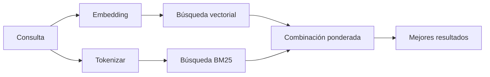

---
read_when:
    - Quiere comprender cómo funciona memory_search
    - Quiere elegir un proveedor de embeddings
    - Quieres ajustar la calidad de la búsqueda
summary: Cómo la búsqueda en la memoria encuentra notas relevantes mediante embeddings y recuperación híbrida
title: Búsqueda en memoria
x-i18n:
    generated_at: "2026-07-12T14:26:10Z"
    model: gpt-5.6
    postprocess_version: locale-links-v1
    prompt_version: 15
    provider: openai
    source_hash: 2ae0830843fba28c24159d85425240051fb8caf086cd0563d3091890045dcfad
    source_path: concepts/memory-search.md
    workflow: 16
---

`memory_search` encuentra notas relevantes en los archivos de memoria, incluso cuando la
redacción difiere del texto original. Divide la memoria en fragmentos pequeños y
los busca mediante embeddings, palabras clave o ambos métodos.

## Inicio rápido

OpenClaw utiliza embeddings de OpenAI de forma predeterminada. Para utilizar otro proveedor, configúrelo
explícitamente:

```json5
{
  agents: {
    defaults: {
      memorySearch: {
        provider: "openai", // o "gemini", "voyage", "mistral", "bedrock", "local", "ollama", "lmstudio", "github-copilot", "openai-compatible"
      },
    },
  },
}
```

`provider` también puede hacer referencia a una entrada personalizada `models.providers.<id>` (por
ejemplo, `ollama-5080`), siempre que esa entrada establezca `api` en `"ollama"` u
otro identificador de proveedor que disponga de un adaptador de embeddings para memoria.

Para usar embeddings locales sin clave de API, instale el plugin oficial del proveedor
llama.cpp y establezca `provider: "local"`:

```bash
openclaw plugins install @openclaw/llama-cpp-provider
```

Los repositorios de código fuente aún requieren aprobar la compilación nativa: `pnpm approve-builds` y, después,
`pnpm rebuild node-llama-cpp`.

Algunos endpoints de embeddings compatibles con OpenAI requieren etiquetas `input_type`
asimétricas, como `"query"` para las búsquedas y `"document"`/`"passage"` para los
fragmentos indexados. Configúrelas mediante `queryInputType` y `documentInputType`; consulte la
[referencia de configuración de memoria](/es/reference/memory-config#provider-specific-config).

## Proveedores compatibles

| Proveedor              | ID                  | Requiere clave de API | Notas                                    |
| ---------------------- | ------------------- | --------------------- | ---------------------------------------- |
| Bedrock                | `bedrock`           | No                    | Utiliza la cadena de credenciales de AWS |
| DeepInfra              | `deepinfra`         | Sí                    | Modelo predeterminado `BAAI/bge-m3`      |
| Gemini                 | `gemini`            | Sí                    | Admite la indexación de imágenes y audio |
| GitHub Copilot         | `github-copilot`    | No                    | Utiliza la suscripción a Copilot         |
| Local                  | `local`             | No                    | Modelo GGUF, descarga automática de ~0.6 GB |
| LM Studio              | `lmstudio`          | No                    | Servidor local/autohospedado             |
| Mistral                | `mistral`           | Sí                    |                                          |
| Ollama                 | `ollama`            | No                    | Servidor local/autohospedado             |
| OpenAI                 | `openai`            | Sí                    | Predeterminado                           |
| Compatible con OpenAI  | `openai-compatible` | Normalmente           | Endpoint genérico `/v1/embeddings`       |
| Voyage                 | `voyage`            | Sí                    |                                          |

## Cómo funciona la búsqueda

OpenClaw ejecuta dos rutas de recuperación en paralelo y combina los resultados:



- La **búsqueda vectorial** encuentra significados similares ("host del gateway" coincide con "la
  máquina que ejecuta OpenClaw").
- La **búsqueda de palabras clave BM25** encuentra términos exactos (identificadores, cadenas de error, claves de
  configuración).
- La **búsqueda por nombre de archivo** indexa las rutas por separado del contenido de las notas. Las rutas completas
  exactas, los nombres base y las raíces de los nombres de archivo se clasifican por delante de las coincidencias parciales de rutas,
  mientras que los fragmentos y las puntuaciones de palabras clave del contenido siguen procediendo del contenido de las notas.

Si solo hay una ruta disponible, esta se ejecuta por sí sola.

**Modo solo FTS.** Establezca `provider: "none"` para desactivar intencionadamente los embeddings
y buscar únicamente mediante palabras clave. Si `provider` no está configurado o está establecido en `"auto"`,
también se recurre únicamente a la clasificación por palabras clave si no hay configurada ninguna autenticación para embeddings,
sin generar errores; lo mismo ocurre con `provider: "local"` (el proveedor
GGUF/llama.cpp) cuando falla.

**Proveedor explícito no disponible.** Si especifica explícitamente cualquier otro proveedor
(por ejemplo, `openai`, `ollama` o `gemini`) y deja de estar disponible en el
momento de la solicitud (autenticación incorrecta o fallo de red), `memory_search` informa que la memoria no está
disponible en lugar de degradarse silenciosamente a resultados solo FTS. Esto mantiene visible
un proveedor configurado que no funciona. Establezca `provider: "none"` para realizar deliberadamente
una recuperación solo FTS, o corrija la configuración del proveedor o de la autenticación para restaurar la clasificación
semántica.

## Mejora de la calidad de búsqueda

Dos funciones opcionales ayudan cuando existe un historial de notas extenso.

### Decaimiento temporal

Las notas antiguas pierden gradualmente peso en la clasificación para que la información reciente aparezca primero.
Con la semivida predeterminada de 30 días, una nota del mes pasado obtiene el 50 % de su
peso original. `MEMORY.md` y otros archivos sin fecha ubicados en `memory/` son
permanentes y nunca sufren decaimiento; solo lo hacen los archivos con fecha `memory/YYYY-MM-DD.md`.

<Tip>
Habilite esta opción si el agente tiene meses de notas diarias y la información obsoleta
continúa clasificándose por encima del contexto reciente.
</Tip>

### MMR (diversidad)

Reduce los resultados redundantes. Si cinco notas mencionan la misma configuración del router,
MMR garantiza que los resultados principales abarquen temas distintos en lugar de repetirse.

<Tip>
Habilite esta opción si `memory_search` continúa devolviendo fragmentos casi duplicados de
diferentes notas diarias.
</Tip>

### Habilitar ambas funciones

```json5
{
  agents: {
    defaults: {
      memorySearch: {
        query: {
          hybrid: {
            mmr: { enabled: true },
            temporalDecay: { enabled: true },
          },
        },
      },
    },
  },
}
```

## Memoria multimodal

Con `gemini-embedding-2-preview`, se pueden indexar imágenes y audio junto con
Markdown. Esto solo se aplica a los archivos incluidos en `memorySearch.extraPaths`; las raíces de
memoria predeterminadas (`MEMORY.md`, `memory/*.md`) siguen admitiendo únicamente Markdown. Las consultas de búsqueda
siguen siendo de texto, pero se comparan con contenido visual y de audio. Consulte la
[referencia de configuración de memoria](/es/reference/memory-config#multimodal-memory-gemini)
para obtener instrucciones de configuración.

## Búsqueda en la memoria de sesiones

Para recuperar texto completo exacto de las transcripciones de sesiones, utilice [`sessions_search`](/es/concepts/session-search)
y, a continuación, abra un resultado con `sessions_history`. La búsqueda en la memoria de sesiones sigue siendo el complemento semántico
experimental.

Opcionalmente, indexe las transcripciones de sesiones para que `memory_search` pueda recuperar conversaciones
anteriores. Esta función es opcional: establezca `experimental.sessionMemory: true` y añada
`"sessions"` a `sources` (el valor predeterminado de `sources` es `["memory"]`).

Los resultados de sesiones respetan `tools.sessions.visibility`: el valor predeterminado `"tree"` solo
expone la sesión actual y las sesiones que esta inició. Para recuperar una sesión no relacionada
del mismo agente desde otra sesión (por ejemplo, una sesión enviada por el gateway
desde un mensaje directo), amplíe la visibilidad a `"agent"`.

Al utilizar el backend QMD, establezca también `memory.qmd.sessions.enabled: true` para que
las transcripciones se exporten a la colección QMD; `experimental.sessionMemory`
y `sources` por sí solos no exportan las transcripciones a QMD. Consulte la
[referencia de configuración](/es/reference/memory-config#session-memory-search-experimental).

## Solución de problemas

**¿No hay resultados?** Ejecute `openclaw memory status` para comprobar el índice. Si está vacío, ejecute
`openclaw memory index --force`.

**¿Solo hay coincidencias de palabras clave?** Es posible que el proveedor de embeddings no esté configurado. Compruébelo con
`openclaw memory status --deep`.

**¿Se agota el tiempo de espera de los embeddings locales?** `ollama`, `lmstudio` y `local` utilizan de forma predeterminada un tiempo de espera
más largo para los lotes en línea. Si el host simplemente es lento, configure
`agents.defaults.memorySearch.sync.embeddingBatchTimeoutSeconds` y vuelva a ejecutar
`openclaw memory index --force`.

**¿No se encuentra texto CJK?** Vuelva a crear el índice FTS mediante
`openclaw memory index --force`.

## Contenido relacionado

- [Descripción general de la memoria](/es/concepts/memory)
- [Active Memory](/es/concepts/active-memory)
- [Motor de memoria integrado](/es/concepts/memory-builtin)
- [Referencia de configuración de memoria](/es/reference/memory-config)
