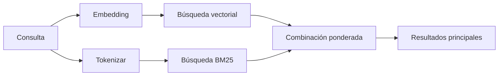

---
read_when:
    - Quiere entender cómo funciona memory_search
    - Se desea elegir un proveedor de embeddings
    - Quieres ajustar la calidad de la búsqueda
summary: Cómo la búsqueda en memoria encuentra notas relevantes mediante embeddings y recuperación híbrida
title: Búsqueda en memoria
x-i18n:
    generated_at: "2026-07-19T01:56:03Z"
    model: gpt-5.6
    postprocess_version: locale-links-v1
    prompt_version: 32
    provider: openai
    source_hash: e7be013665593c82890d3e0586136385f9b17e8d76f18e85abeab7304f34264d
    source_path: concepts/memory-search.md
    workflow: 16
---

`memory_search` encuentra notas relevantes en los archivos de memoria, incluso cuando la
redacción difiere del texto original. Divide la memoria en fragmentos pequeños y
los busca mediante embeddings, palabras clave o ambos.

## Inicio rápido

OpenClaw utiliza embeddings de OpenAI de forma predeterminada. Para utilizar otro proveedor, establézcalo
explícitamente:

```json5
{
  agents: {
    defaults: {
      memorySearch: {
        provider: "openai", // o "gemini", "voyage", "mistral", "bedrock", "local", "ollama", "lmstudio", "github-copilot", "openai-compatible"
      },
    },
  },
}
```

`provider` también puede hacer referencia a una entrada `models.providers.<id>` personalizada (por
ejemplo, `ollama-5080`), siempre que esa entrada establezca `api` en `"ollama"` u
otro id de proveedor con un adaptador de embeddings de memoria.

Para utilizar embeddings locales sin clave de API, instale el Plugin oficial del proveedor llama.cpp
y establezca `provider: "local"`:

```bash
openclaw plugins install @openclaw/llama-cpp-provider
```

Los checkouts del código fuente aún requieren la aprobación de la compilación nativa: `pnpm approve-builds` y, después,
`pnpm rebuild node-llama-cpp`.

Algunos endpoints de embeddings compatibles con OpenAI requieren etiquetas `input_type`
asimétricas, como `"query"` para las búsquedas y `"document"`/`"passage"` para los fragmentos
indexados. Establézcalas mediante `queryInputType` y `documentInputType`; consulte la
[referencia de configuración de memoria](/es/reference/memory-config#provider-specific-config).

## Proveedores compatibles

| Proveedor         | ID                  | Requiere clave de API | Notas                                      |
| ----------------- | ------------------- | --------------------- | ------------------------------------------ |
| Bedrock           | `bedrock`           | No                    | Utiliza la cadena de credenciales de AWS   |
| DeepInfra         | `deepinfra`         | Sí                    | Modelo predeterminado `BAAI/bge-m3`         |
| Gemini            | `gemini`            | Sí                    | Admite la indexación de imágenes y audio   |
| GitHub Copilot    | `github-copilot`    | No                    | Utiliza su suscripción a Copilot           |
| Local             | `local`             | No                    | Modelo GGUF, descarga automática de ~0.6 GB |
| LM Studio         | `lmstudio`          | No                    | Servidor local/alojado por el usuario      |
| Mistral           | `mistral`           | Sí                    |                                            |
| Ollama            | `ollama`            | No                    | Servidor local/alojado por el usuario      |
| OpenAI            | `openai`            | Sí                    | Predeterminado                             |
| Compatible con OpenAI | `openai-compatible` | Normalmente            | Endpoint `/v1/embeddings` genérico       |
| Voyage            | `voyage`            | Sí                    |                                            |

## Cómo funciona la búsqueda

OpenClaw ejecuta dos rutas de recuperación en paralelo y combina los resultados:



- **La búsqueda vectorial** encuentra significados similares ("host del Gateway" coincide con "la
  máquina que ejecuta OpenClaw").
- **La búsqueda de palabras clave BM25** encuentra términos exactos (identificadores, cadenas de error y claves de
  configuración).
- **La búsqueda por nombre de archivo** indexa las rutas por separado del contenido de las notas. Las rutas
  completas exactas, los nombres base y las raíces de los nombres de archivo se clasifican por encima de las coincidencias parciales de rutas,
  mientras que los fragmentos y las puntuaciones de palabras clave del contenido siguen procediendo del contenido de las notas.

Si solo hay una ruta disponible, esta se ejecuta por sí sola.

**Modo solo FTS.** Establezca `provider: "none"` para desactivar intencionadamente los embeddings
y buscar únicamente con palabras clave. Si `provider` no está establecido o se establece en `"auto"`,
también se recurre a una clasificación basada solo en palabras clave si no se ha configurado la autenticación de embeddings,
sin generar errores; lo mismo ocurre con `provider: "local"` (el proveedor
GGUF/llama.cpp) cuando falla.

**Proveedor explícito no disponible.** Si especifica explícitamente cualquier otro proveedor
(por ejemplo, `openai`, `ollama`, `gemini`) y deja de estar disponible al
procesar la solicitud (autenticación incorrecta o fallo de red), `memory_search` informa de que la memoria
no está disponible, en lugar de degradarse silenciosamente a resultados basados solo en FTS. Esto permite que
un proveedor configurado que no funciona siga siendo visible. Establezca `provider: "none"` para una
recuperación deliberada basada solo en FTS, o corrija la configuración del proveedor o de autenticación para restaurar la clasificación
semántica.

## Mejora de la calidad de búsqueda

Dos funciones opcionales ayudan cuando existe un historial extenso de notas.

### Decaimiento temporal

Las notas antiguas pierden gradualmente peso en la clasificación para que la información reciente aparezca primero.
Con la semivida predeterminada de 30 días, una nota del mes pasado obtiene un 50 % de su
peso original. `MEMORY.md` y otros archivos sin fecha dentro de `memory/` son
permanentes y nunca se les aplica decaimiento; solo se aplica a los archivos `memory/YYYY-MM-DD.md` con fecha.

<Tip>
Active esta opción si el agente tiene meses de notas diarias y la información obsoleta
sigue clasificándose por encima del contexto reciente.
</Tip>

### MMR (diversidad)

Reduce los resultados redundantes. Si cinco notas mencionan la misma configuración del enrutador,
MMR garantiza que los resultados principales abarquen temas diferentes en lugar de repetirse.

<Tip>
Active esta opción si `memory_search` sigue devolviendo fragmentos casi duplicados de
distintas notas diarias.
</Tip>

### Activar ambas

```json5
{
  agents: {
    defaults: {
      memorySearch: {
        query: {
          hybrid: {
            mmr: { enabled: true },
            temporalDecay: { enabled: true },
          },
        },
      },
    },
  },
}
```

## Memoria multimodal

Con `gemini-embedding-2-preview`, se pueden indexar imágenes y audio junto con
Markdown. Esto solo se aplica a los archivos dentro de `memorySearch.extraPaths`; las raíces de memoria
predeterminadas (`MEMORY.md`, `memory/*.md`) siguen admitiendo únicamente Markdown. Las consultas de búsqueda
siguen siendo texto, pero encuentran coincidencias con el contenido visual y de audio. Consulte la
[referencia de configuración de memoria](/es/reference/memory-config#multimodal-memory-gemini)
para configurarlo.

## Búsqueda en la memoria de sesiones

Para recuperar texto completo exacto de las transcripciones de sesiones, utilice [`sessions_search`](/es/concepts/session-search)
y, después, abra un resultado con `sessions_history`. La búsqueda en la memoria de sesiones sigue siendo el complemento semántico
experimental.

Opcionalmente, indexe las transcripciones de sesiones para que `memory_search` pueda recuperar conversaciones
anteriores. Esta función es opcional: establezca `experimental.sessionMemory: true` y añada
`"sessions"` a `sources` (el valor predeterminado de `sources` es `["memory"]`).

Los resultados de sesiones respetan `tools.sessions.visibility`: el valor predeterminado `"tree"` expone la
sesión actual, las sesiones que esta inició y las sesiones de grupo del mismo agente observadas
mediante la conciencia ambiental de los grupos. Con `session.dmScope: "main"`, una configuración de mensajes directos
multiusuario comparte esa sesión principal, por lo que los usuarios dirigidos a ella pueden recuperar contenido
de sus grupos observados. Utilice un `dmScope` por interlocutor para aislar los mensajes directos, o establezca
la visibilidad en `"self"` para excluir las lecturas ambientales de sesiones observadas. Las demás
sesiones no relacionadas del mismo agente siguen requiriendo la visibilidad `"agent"`.

Al utilizar el backend QMD, establezca también `memory.qmd.sessions.enabled: true` para que
las transcripciones se exporten a la colección QMD; `experimental.sessionMemory`
y `sources` por sí solos no exportan las transcripciones a QMD. Consulte la
[referencia de configuración](/es/reference/memory-config#session-memory-search-experimental).

## Solución de problemas

**¿No hay resultados?** Ejecute `openclaw memory status` para comprobar el índice. Si está vacío, ejecute
`openclaw memory index --force`.

**¿Solo aparecen coincidencias de palabras clave?** Es posible que el proveedor de embeddings no esté configurado. Compruebe
`openclaw memory status --deep`.

**¿Se agota el tiempo de espera de los embeddings locales?** `ollama`, `lmstudio` y `local` utilizan de forma predeterminada un
tiempo de espera más largo para lotes en línea. Si el host simplemente es lento, establezca
`agents.defaults.memorySearch.sync.embeddingBatchTimeoutSeconds` y vuelva a ejecutar
`openclaw memory index --force`.

**¿No se encuentra texto CJK?** Vuelva a crear el índice FTS con
`openclaw memory index --force`.

## Contenido relacionado

- [Descripción general de la memoria](/es/concepts/memory)
- [Active Memory](/es/concepts/active-memory)
- [Motor de memoria integrado](/es/concepts/memory-builtin)
- [Referencia de configuración de memoria](/es/reference/memory-config)
