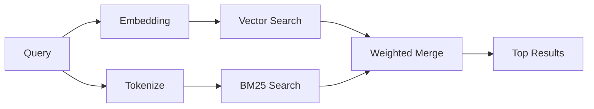

---
read_when:
    - Quieres entender cómo funciona memory_search
    - Desea elegir un proveedor de incrustaciones
    - Quieres ajustar la calidad de la búsqueda
summary: Cómo la búsqueda de memoria encuentra notas relevantes mediante incrustaciones y recuperación híbrida
title: Búsqueda de memoria
x-i18n:
    generated_at: "2026-04-30T05:37:26Z"
    model: gpt-5.5
    provider: openai
    source_hash: 3e6c44d90f49a797bda01b9a575928c128a334f89ae14fc3620e65562a866aa9
    source_path: concepts/memory-search.md
    workflow: 16
---

`memory_search` encuentra notas relevantes de tus archivos de memoria, incluso cuando la
redacción difiere del texto original. Funciona indexando la memoria en pequeños
fragmentos y buscándolos mediante incrustaciones, palabras clave o ambas.

## Inicio rápido

Si tienes una suscripción a GitHub Copilot, o una clave de API de OpenAI,
Gemini, Voyage o Mistral configurada, la búsqueda de memoria funciona
automáticamente. Para establecer un proveedor explícitamente:

```json5
{
  agents: {
    defaults: {
      memorySearch: {
        provider: "openai", // or "gemini", "local", "ollama", etc.
      },
    },
  },
}
```

Para configuraciones con varios endpoints, `provider` también puede ser una
entrada personalizada `models.providers.<id>`, como `ollama-5080`, cuando ese
proveedor establece `api: "ollama"` u otro propietario de adaptador de
incrustaciones.

Para incrustaciones locales sin clave de API, instala el paquete opcional de
runtime `node-llama-cpp` junto a OpenClaw y usa `provider: "local"`.

Algunos endpoints de incrustaciones compatibles con OpenAI requieren etiquetas
asimétricas como `input_type: "query"` para búsquedas y
`input_type: "document"` o `"passage"` para fragmentos indexados. Configúralas
con `memorySearch.queryInputType` y `memorySearch.documentInputType`; consulta
la [referencia de configuración de memoria](/es/reference/memory-config#provider-specific-config).

## Proveedores compatibles

| Proveedor      | ID               | Requiere clave de API | Notas                                                     |
| -------------- | ---------------- | --------------------- | --------------------------------------------------------- |
| Bedrock        | `bedrock`        | No                    | Se detecta automáticamente cuando se resuelve la cadena de credenciales de AWS |
| Gemini         | `gemini`         | Sí                    | Admite indexación de imágenes/audio                       |
| GitHub Copilot | `github-copilot` | No                    | Se detecta automáticamente, usa la suscripción de Copilot |
| Local          | `local`          | No                    | Modelo GGUF, descarga de ~0,6 GB                          |
| Mistral        | `mistral`        | Sí                    | Se detecta automáticamente                                |
| Ollama         | `ollama`         | No                    | Local, debe establecerse explícitamente                   |
| OpenAI         | `openai`         | Sí                    | Se detecta automáticamente, rápido                        |
| Voyage         | `voyage`         | Sí                    | Se detecta automáticamente                                |

## Cómo funciona la búsqueda

OpenClaw ejecuta dos rutas de recuperación en paralelo y fusiona los resultados:



- **Búsqueda vectorial** encuentra notas con significado similar ("gateway host" coincide con
  "the machine running OpenClaw").
- **Búsqueda por palabras clave BM25** encuentra coincidencias exactas (IDs, cadenas de error, claves de
  configuración).

Si solo una ruta está disponible (sin incrustaciones o sin FTS), la otra se
ejecuta sola.

Cuando las incrustaciones no están disponibles, OpenClaw sigue usando
clasificación léxica sobre los resultados de FTS en lugar de recurrir solo al
ordenamiento bruto de coincidencia exacta. Ese modo degradado potencia los
fragmentos con mayor cobertura de términos de consulta y rutas de archivo
relevantes, lo que mantiene una recuperación útil incluso sin `sqlite-vec` o un
proveedor de incrustaciones.

## Mejorar la calidad de búsqueda

Dos funciones opcionales ayudan cuando tienes un historial de notas grande:

### Decaimiento temporal

Las notas antiguas pierden peso de clasificación gradualmente para que la
información reciente aparezca primero. Con la semivida predeterminada de 30 días,
una nota del mes pasado puntúa al 50 % de su peso original. Los archivos
permanentes como `MEMORY.md` nunca decaen.

<Tip>
Activa el decaimiento temporal si tu agente tiene meses de notas diarias y la
información obsoleta sigue superando al contexto reciente.
</Tip>

### MMR (diversidad)

Reduce los resultados redundantes. Si cinco notas mencionan la misma configuración
del router, MMR garantiza que los resultados principales cubran temas distintos en
lugar de repetirse.

<Tip>
Activa MMR si `memory_search` sigue devolviendo fragmentos casi duplicados de
distintas notas diarias.
</Tip>

### Activar ambos

```json5
{
  agents: {
    defaults: {
      memorySearch: {
        query: {
          hybrid: {
            mmr: { enabled: true },
            temporalDecay: { enabled: true },
          },
        },
      },
    },
  },
}
```

## Memoria multimodal

Con Gemini Embedding 2, puedes indexar imágenes y archivos de audio junto con
Markdown. Las consultas de búsqueda siguen siendo texto, pero coinciden con
contenido visual y de audio. Consulta la [referencia de configuración de memoria](/es/reference/memory-config) para
la configuración.

## Búsqueda de memoria de sesión

Puedes indexar opcionalmente transcripciones de sesiones para que `memory_search`
pueda recordar conversaciones anteriores. Esto es opcional mediante
`memorySearch.experimental.sessionMemory`. Consulta la
[referencia de configuración](/es/reference/memory-config) para más detalles.

## Solución de problemas

**¿Sin resultados?** Ejecuta `openclaw memory status` para comprobar el índice. Si está vacío, ejecuta
`openclaw memory index --force`.

**¿Solo coincidencias de palabras clave?** Es posible que tu proveedor de
incrustaciones no esté configurado. Comprueba
`openclaw memory status --deep`.

**¿Las incrustaciones locales agotan el tiempo de espera?** `ollama`, `lmstudio` y `local` usan un tiempo de espera por lotes
inline más largo de forma predeterminada. Si el host simplemente es lento,
establece `agents.defaults.memorySearch.sync.embeddingBatchTimeoutSeconds` y vuelve a ejecutar
`openclaw memory index --force`.

**¿No se encuentra texto CJK?** Reconstruye el índice FTS con
`openclaw memory index --force`.

## Lecturas adicionales

- [Active Memory](/es/concepts/active-memory) -- memoria de subagente para sesiones de chat interactivas
- [Memoria](/es/concepts/memory) -- diseño de archivos, backends, herramientas
- [Referencia de configuración de memoria](/es/reference/memory-config) -- todos los ajustes de configuración

## Relacionado

- [Resumen de memoria](/es/concepts/memory)
- [Active Memory](/es/concepts/active-memory)
- [Motor de memoria incorporado](/es/concepts/memory-builtin)
