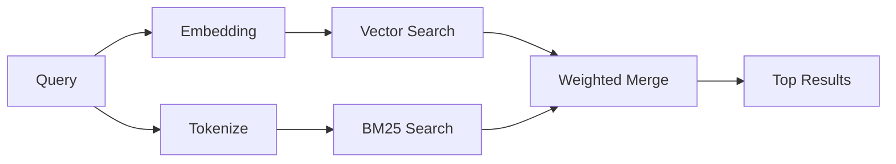

---
read_when:
    - Quieres entender cómo funciona memory_search
    - Quieres elegir un proveedor de embeddings
    - Desea ajustar la calidad de búsqueda
summary: Cómo la búsqueda de memoria encuentra notas relevantes mediante incrustaciones y recuperación híbrida
title: Búsqueda de memoria
x-i18n:
    generated_at: "2026-05-02T05:24:15Z"
    model: gpt-5.5
    provider: openai
    source_hash: 2a71fb0809d5c70689e8046f854e4b4b4e79f45769ac2964e40a762ebb4e91a8
    source_path: concepts/memory-search.md
    workflow: 16
---

`memory_search` encuentra notas relevantes de tus archivos de memoria, incluso cuando la
redacción difiere del texto original. Funciona indexando la memoria en pequeños
fragmentos y buscándolos mediante embeddings, palabras clave o ambos.

## Inicio rápido

Si tienes una suscripción a GitHub Copilot, o una clave de API de OpenAI, Gemini, Voyage o Mistral
configurada, la búsqueda en memoria funciona automáticamente. Para establecer un proveedor
explícitamente:

```json5
{
  agents: {
    defaults: {
      memorySearch: {
        provider: "openai", // or "gemini", "local", "ollama", etc.
      },
    },
  },
}
```

Para configuraciones con varios endpoints, `provider` también puede ser una entrada personalizada
`models.providers.<id>`, como `ollama-5080`, cuando ese proveedor establece
`api: "ollama"` u otro propietario de adaptador de embeddings.

Para embeddings locales sin clave de API, establece `provider: "local"`. Los checkouts de código fuente
aún pueden requerir aprobación de compilación nativa: `pnpm approve-builds` y luego
`pnpm rebuild node-llama-cpp`.

Algunos endpoints de embeddings compatibles con OpenAI requieren etiquetas asimétricas como
`input_type: "query"` para búsquedas y `input_type: "document"` o `"passage"`
para fragmentos indexados. Configúralas con `memorySearch.queryInputType` y
`memorySearch.documentInputType`; consulta la [referencia de configuración de memoria](/es/reference/memory-config#provider-specific-config).

## Proveedores compatibles

| Proveedor       | ID               | Requiere clave de API | Notas                                                |
| -------------- | ---------------- | ------------- | ---------------------------------------------------- |
| Bedrock        | `bedrock`        | No            | Se detecta automáticamente cuando se resuelve la cadena de credenciales de AWS |
| Gemini         | `gemini`         | Sí           | Admite indexación de imágenes/audio                        |
| GitHub Copilot | `github-copilot` | No            | Se detecta automáticamente, usa la suscripción a Copilot             |
| Local          | `local`          | No            | Modelo GGUF, descarga de ~0,6 GB                         |
| Mistral        | `mistral`        | Sí           | Se detecta automáticamente                                        |
| Ollama         | `ollama`         | No            | Local, debe establecerse explícitamente                           |
| OpenAI         | `openai`         | Sí           | Se detecta automáticamente, rápido                                  |
| Voyage         | `voyage`         | Sí           | Se detecta automáticamente                                        |

## Cómo funciona la búsqueda

OpenClaw ejecuta dos rutas de recuperación en paralelo y fusiona los resultados:



- **Búsqueda vectorial** encuentra notas con significado similar ("host de Gateway" coincide con
  "la máquina que ejecuta OpenClaw").
- **Búsqueda por palabras clave BM25** encuentra coincidencias exactas (ID, cadenas de error, claves de
  configuración).

Si solo hay una ruta disponible (sin embeddings o sin FTS), la otra se ejecuta sola.

Cuando los embeddings no están disponibles, OpenClaw sigue usando ordenación léxica sobre los resultados de FTS en lugar de recurrir únicamente al orden sin procesar de coincidencias exactas. Ese modo degradado potencia los fragmentos con mayor cobertura de términos de consulta y rutas de archivo relevantes, lo que mantiene útil la recuperación incluso sin `sqlite-vec` o un proveedor de embeddings.

## Mejorar la calidad de la búsqueda

Dos funciones opcionales ayudan cuando tienes un historial grande de notas:

### Decaimiento temporal

Las notas antiguas pierden gradualmente peso en la clasificación para que la información reciente aparezca primero.
Con la vida media predeterminada de 30 días, una nota del mes pasado puntúa al 50% de
su peso original. Los archivos permanentes como `MEMORY.md` nunca decaen.

<Tip>
Activa el decaimiento temporal si tu agente tiene meses de notas diarias y la
información obsoleta sigue superando al contexto reciente.
</Tip>

### MMR (diversidad)

Reduce los resultados redundantes. Si cinco notas mencionan la misma configuración de router, MMR
garantiza que los resultados principales cubran temas distintos en lugar de repetirse.

<Tip>
Activa MMR si `memory_search` sigue devolviendo fragmentos casi duplicados de
distintas notas diarias.
</Tip>

### Activar ambos

```json5
{
  agents: {
    defaults: {
      memorySearch: {
        query: {
          hybrid: {
            mmr: { enabled: true },
            temporalDecay: { enabled: true },
          },
        },
      },
    },
  },
}
```

## Memoria multimodal

Con Gemini Embedding 2, puedes indexar archivos de imagen y audio junto con
Markdown. Las consultas de búsqueda siguen siendo texto, pero coinciden con contenido visual y de audio.
Consulta la [referencia de configuración de memoria](/es/reference/memory-config) para la
configuración.

## Búsqueda en memoria de sesión

Opcionalmente, puedes indexar transcripciones de sesión para que `memory_search` pueda recordar
conversaciones anteriores. Esto es opcional mediante
`memorySearch.experimental.sessionMemory`. Consulta la
[referencia de configuración](/es/reference/memory-config) para más detalles.

## Solución de problemas

**¿Sin resultados?** Ejecuta `openclaw memory status` para comprobar el índice. Si está vacío, ejecuta
`openclaw memory index --force`.

**¿Solo coincidencias de palabras clave?** Es posible que tu proveedor de embeddings no esté configurado. Comprueba
`openclaw memory status --deep`.

**¿Los embeddings locales agotan el tiempo de espera?** `ollama`, `lmstudio` y `local` usan de forma predeterminada un tiempo de espera
de lote en línea más largo. Si el host simplemente es lento, establece
`agents.defaults.memorySearch.sync.embeddingBatchTimeoutSeconds` y vuelve a ejecutar
`openclaw memory index --force`.

**¿No se encuentra texto CJK?** Reconstruye el índice FTS con
`openclaw memory index --force`.

## Lecturas adicionales

- [Active Memory](/es/concepts/active-memory) -- memoria de subagente para sesiones de chat interactivas
- [Memoria](/es/concepts/memory) -- diseño de archivos, backends, herramientas
- [Referencia de configuración de memoria](/es/reference/memory-config) -- todas las opciones de configuración

## Relacionado

- [Resumen de memoria](/es/concepts/memory)
- [Active Memory](/es/concepts/active-memory)
- [Motor de memoria integrado](/es/concepts/memory-builtin)
