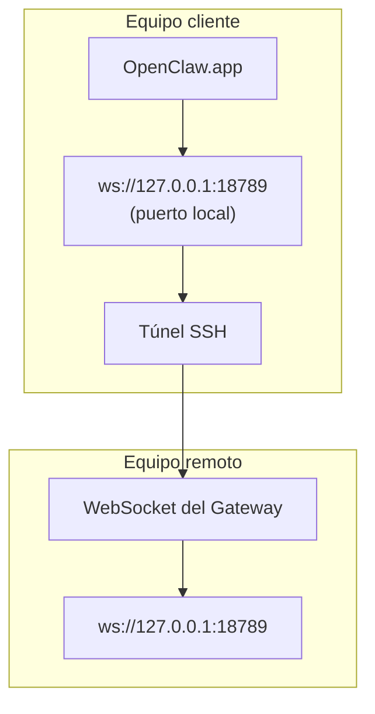

<Note>
Este contenido se encuentra ahora en [Acceso remoto](/es/gateway/remote#macos-persistent-ssh-tunnel-via-launchagent). Consulta esa página para ver la guía actual; esta página se mantiene como destino de redirección.
</Note>

# Ejecutar OpenClaw.app con un Gateway remoto

OpenClaw.app se conecta a un Gateway remoto mediante un túnel SSH: un `LocalForward` de SSH asigna un puerto local al puerto WebSocket del Gateway en el host remoto.

## Configuración

1. Añade una entrada de configuración de SSH con `LocalForward 18789 127.0.0.1:18789` (consulta [Acceso remoto](/es/gateway/remote#macos-persistent-ssh-tunnel-via-launchagent) para ver el bloque de configuración completo).
2. Copia tu clave SSH al host remoto con `ssh-copy-id`.
3. Establece `gateway.remote.token` (o `gateway.remote.password`) mediante `openclaw config set gateway.remote.token "<your-token>"`.
4. Inicia el túnel: `ssh -N remote-gateway &`.
5. Cierra y vuelve a abrir OpenClaw.app.

Para disponer de un túnel que sobreviva a los reinicios y se vuelva a conectar automáticamente, utiliza la configuración de LaunchAgent de la página [Acceso remoto](/es/gateway/remote#macos-persistent-ssh-tunnel-via-launchagent) en lugar de ejecutar manualmente `ssh -N`.

## Cómo funciona

| Componente                           | Función                                                                   |
| ------------------------------------ | ------------------------------------------------------------------------- |
| `LocalForward 18789 127.0.0.1:18789` | Reenvía el puerto local 18789 al puerto remoto 18789                      |
| `ssh -N`                             | Inicia SSH sin ejecutar comandos remotos (solo reenvío de puertos)        |
| `KeepAlive`                          | Reinicia automáticamente el túnel si deja de funcionar (LaunchAgent)      |
| `RunAtLoad`                          | Inicia el túnel cuando se carga el LaunchAgent (LaunchAgent)               |

OpenClaw.app se conecta a `ws://127.0.0.1:18789` en el cliente. El túnel reenvía esa conexión al puerto 18789 del host remoto que ejecuta el Gateway.

## Contenido relacionado

- [Acceso remoto](/es/gateway/remote)
- [Tailscale](/es/gateway/tailscale)
