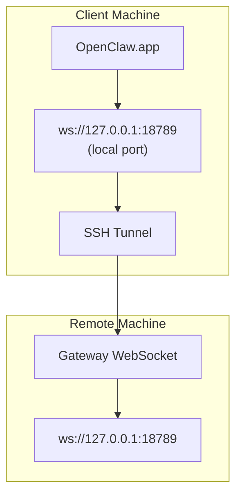

> Este contenido se ha fusionado en [Acceso remoto](/es/gateway/remote#macos-persistent-ssh-tunnel-via-launchagent). Consulta esa página para ver la guía actual.

# Ejecutar OpenClaw.app con un Gateway remoto

OpenClaw.app usa túneles SSH para conectarse a un Gateway remoto. Esta guía muestra cómo configurarlo.

## Descripción general



## Configuración rápida

### Paso 1: Agrega la configuración SSH

Edita `~/.ssh/config` y agrega:

```ssh
Host remote-gateway
    HostName <REMOTE_IP>          # e.g., 172.27.187.184
    User <REMOTE_USER>            # e.g., jefferson
    LocalForward 18789 127.0.0.1:18789
    IdentityFile ~/.ssh/id_rsa
```

Reemplaza `<REMOTE_IP>` y `<REMOTE_USER>` por tus valores.

### Paso 2: Copia la clave SSH

Copia tu clave pública a la máquina remota (ingresa la contraseña una vez):

```bash
ssh-copy-id -i ~/.ssh/id_rsa <REMOTE_USER>@<REMOTE_IP>
```

### Paso 3: Configura la autenticación del Gateway remoto

```bash
openclaw config set gateway.remote.token "<your-token>"
```

Usa `gateway.remote.password` en su lugar si tu Gateway remoto usa autenticación con contraseña.
`OPENCLAW_GATEWAY_TOKEN` sigue siendo válido como anulación a nivel de shell, pero la configuración
duradera del cliente remoto es `gateway.remote.token` / `gateway.remote.password`.

### Paso 4: Inicia el túnel SSH

```bash
ssh -N remote-gateway &
```

### Paso 5: Reinicia OpenClaw.app

```bash
# Quit OpenClaw.app (⌘Q), then reopen:
open /path/to/OpenClaw.app
```

La app ahora se conectará al Gateway remoto mediante el túnel SSH.

---

## Iniciar automáticamente el túnel al iniciar sesión

Para que el túnel SSH se inicie automáticamente cuando inicies sesión, crea un Launch Agent.

### Crea el archivo PLIST

Guarda esto como `~/Library/LaunchAgents/ai.openclaw.ssh-tunnel.plist`:

```xml
<?xml version="1.0" encoding="UTF-8"?>
<!DOCTYPE plist PUBLIC "-//Apple//DTD PLIST 1.0//EN" "http://www.apple.com/DTDs/PropertyList-1.0.dtd">
<plist version="1.0">
<dict>
    <key>Label</key>
    <string>ai.openclaw.ssh-tunnel</string>
    <key>ProgramArguments</key>
    <array>
        <string>/usr/bin/ssh</string>
        <string>-N</string>
        <string>remote-gateway</string>
    </array>
    <key>KeepAlive</key>
    <true/>
    <key>RunAtLoad</key>
    <true/>
</dict>
</plist>
```

### Carga el Launch Agent

```bash
launchctl bootstrap gui/$UID ~/Library/LaunchAgents/ai.openclaw.ssh-tunnel.plist
```

El túnel ahora:

- Se iniciará automáticamente cuando inicies sesión
- Se reiniciará si falla
- Seguirá ejecutándose en segundo plano

Nota heredada: elimina cualquier LaunchAgent `com.openclaw.ssh-tunnel` restante si existe.

---

## Solución de problemas

**Comprueba si el túnel está en ejecución:**

```bash
ps aux | grep "ssh -N remote-gateway" | grep -v grep
lsof -i :18789
```

**Reinicia el túnel:**

```bash
launchctl kickstart -k gui/$UID/ai.openclaw.ssh-tunnel
```

**Detén el túnel:**

```bash
launchctl bootout gui/$UID/ai.openclaw.ssh-tunnel
```

---

## Cómo funciona

| Componente                           | Qué hace                                                     |
| ------------------------------------ | ------------------------------------------------------------ |
| `LocalForward 18789 127.0.0.1:18789` | Reenvía el puerto local 18789 al puerto remoto 18789         |
| `ssh -N`                             | SSH sin ejecutar comandos remotos (solo reenvío de puertos)  |
| `KeepAlive`                          | Reinicia automáticamente el túnel si falla                   |
| `RunAtLoad`                          | Inicia el túnel cuando se carga el agente                    |

OpenClaw.app se conecta a `ws://127.0.0.1:18789` en tu máquina cliente. El túnel SSH reenvía esa conexión al puerto 18789 en la máquina remota donde se está ejecutando el Gateway.

## Relacionado

- [Acceso remoto](/es/gateway/remote)
- [Tailscale](/es/gateway/tailscale)
