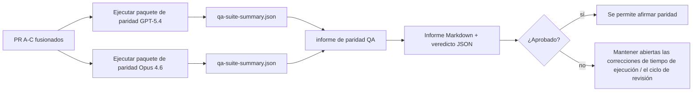

---
read_when:
    - Revisar la serie de PR de paridad GPT-5.4 / Codex
    - Mantener la arquitectura agéntica de seis contratos detrás del programa de paridad
summary: Cómo revisar el programa de paridad GPT-5.4 / Codex como cuatro unidades de fusión
title: Notas del responsable de mantenimiento de la paridad GPT-5.4 / Codex
x-i18n:
    generated_at: "2026-04-24T05:32:32Z"
    model: gpt-5.4
    provider: openai
    source_hash: 803b62bf5bb6b00125f424fa733e743ecdec7f8410dec0782096f9d1ddbed6c0
    source_path: help/gpt54-codex-agentic-parity-maintainers.md
    workflow: 15
---

Esta nota explica cómo revisar el programa de paridad GPT-5.4 / Codex como cuatro unidades de fusión sin perder la arquitectura original de seis contratos.

## Unidades de fusión

### PR A: ejecución estrictamente agéntica

Se encarga de:

- `executionContract`
- continuación en el mismo turno con prioridad GPT-5
- `update_plan` como seguimiento de progreso no terminal
- estados bloqueados explícitos en lugar de detenciones silenciosas solo de plan

No se encarga de:

- clasificación de fallos de autenticación/tiempo de ejecución
- veracidad de permisos
- rediseño de repetición/continuación
- evaluación comparativa de paridad

### PR B: veracidad del tiempo de ejecución

Se encarga de:

- corrección de alcances de OAuth de Codex
- clasificación tipada de fallos de proveedor/tiempo de ejecución
- disponibilidad veraz de `/elevated full` y motivos de bloqueo

No se encarga de:

- normalización del esquema de herramientas
- estado de repetición/vivacidad
- filtros de evaluación comparativa

### PR C: corrección de ejecución

Se encarga de:

- compatibilidad de herramientas OpenAI/Codex propiedad del proveedor
- manejo estricto de esquemas sin parámetros
- exposición de repetición no válida
- visibilidad del estado de tareas largas pausadas, bloqueadas y abandonadas

No se encarga de:

- continuación autoelegida
- comportamiento genérico del dialecto Codex fuera de los hooks del proveedor
- filtros de evaluación comparativa

### PR D: harness de paridad

Se encarga de:

- primer paquete de escenarios GPT-5.4 vs Opus 4.6
- documentación de paridad
- mecánica de informe de paridad y filtro de liberación

No se encarga de:

- cambios de comportamiento en tiempo de ejecución fuera de QA-lab
- simulación de autenticación/proxy/DNS dentro del harness

## Relación con los seis contratos originales

| Contrato original                        | Unidad de fusión |
| ---------------------------------------- | ---------------- |
| Corrección del transporte/autenticación del proveedor | PR B       |
| Compatibilidad de contrato/esquema de herramientas    | PR C       |
| Ejecución en el mismo turno              | PR A             |
| Veracidad de permisos                    | PR B             |
| Corrección de repetición/continuación/vivacidad | PR C       |
| Evaluación comparativa/filtro de liberación | PR D          |

## Orden de revisión

1. PR A
2. PR B
3. PR C
4. PR D

PR D es la capa de prueba. No debe ser la razón por la que se retrasen los PR de corrección del tiempo de ejecución.

## Qué buscar

### PR A

- las ejecuciones de GPT-5 actúan o fallan de forma segura en lugar de detenerse en comentarios
- `update_plan` ya no parece progreso por sí solo
- el comportamiento sigue teniendo prioridad GPT-5 y está limitado a Pi incrustado

### PR B

- los fallos de autenticación/proxy/tiempo de ejecución dejan de colapsar en un manejo genérico de “model failed”
- `/elevated full` solo se describe como disponible cuando realmente lo está
- los motivos de bloqueo son visibles tanto para el modelo como para el tiempo de ejecución orientado al usuario

### PR C

- el registro estricto de herramientas OpenAI/Codex se comporta de forma predecible
- las herramientas sin parámetros no fallan en las comprobaciones estrictas del esquema
- los resultados de repetición y Compaction conservan un estado de vivacidad veraz

### PR D

- el paquete de escenarios es comprensible y reproducible
- el paquete incluye una vía de seguridad de repetición con mutación, no solo flujos de solo lectura
- los informes son legibles por humanos y por automatización
- las afirmaciones de paridad están respaldadas por evidencias, no por anécdotas

Artefactos esperados de PR D:

- `qa-suite-report.md` / `qa-suite-summary.json` para cada ejecución de modelo
- `qa-agentic-parity-report.md` con comparación agregada y por escenario
- `qa-agentic-parity-summary.json` con un veredicto legible por máquina

## Filtro de liberación

No afirmes paridad ni superioridad de GPT-5.4 sobre Opus 4.6 hasta que:

- PR A, PR B y PR C estén fusionados
- PR D ejecute limpiamente el primer paquete de paridad
- los paquetes de regresión de veracidad del tiempo de ejecución sigan en verde
- el informe de paridad no muestre casos de falso éxito ni regresión en el comportamiento de parada

El harness de paridad no es la única fuente de evidencia. Mantén explícita esta división en la revisión:

- PR D se encarga de la comparación por escenarios GPT-5.4 vs Opus 4.6
- los paquetes deterministas de PR B siguen siendo responsables de la evidencia de autenticación/proxy/DNS y veracidad de acceso completo

## Mapa de objetivo a evidencia

| Elemento del filtro de finalización       | Responsable principal | Artefacto de revisión                                              |
| ---------------------------------------- | --------------------- | ------------------------------------------------------------------ |
| Sin bloqueos solo de plan                | PR A                  | pruebas de tiempo de ejecución estrictamente agéntico y `approval-turn-tool-followthrough` |
| Sin progreso falso ni finalización falsa de herramientas | PR A + PR D   | recuento de falso éxito de paridad más detalles del informe por escenario |
| Sin orientación falsa de `/elevated full` | PR B                 | paquetes deterministas de veracidad del tiempo de ejecución        |
| Los fallos de repetición/vivacidad siguen siendo explícitos | PR C + PR D | paquetes de ciclo de vida/repetición más `compaction-retry-mutating-tool` |
| GPT-5.4 iguala o supera a Opus 4.6       | PR D                  | `qa-agentic-parity-report.md` y `qa-agentic-parity-summary.json`   |

## Abreviatura para revisores: antes vs después

| Problema visible para el usuario antes                       | Señal de revisión después                                                                |
| ----------------------------------------------------------- | ---------------------------------------------------------------------------------------- |
| GPT-5.4 se detenía después de planificar                    | PR A muestra comportamiento de actuar o bloquearse en lugar de finalización solo con comentarios |
| El uso de herramientas parecía frágil con esquemas estrictos OpenAI/Codex | PR C mantiene predecibles el registro de herramientas y la invocación sin parámetros |
| Las pistas de `/elevated full` a veces eran engañosas       | PR B vincula la orientación a la capacidad real de tiempo de ejecución y a los motivos de bloqueo |
| Las tareas largas podían desaparecer en la ambigüedad de repetición/Compaction | PR C emite estados explícitos de pausa, bloqueo, abandono y repetición no válida |
| Las afirmaciones de paridad eran anecdóticas                | PR D produce un informe más un veredicto JSON con la misma cobertura de escenarios en ambos modelos |

## Relacionado

- [Paridad agéntica GPT-5.4 / Codex](/es/help/gpt54-codex-agentic-parity)
