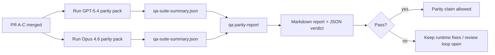

---
x-i18n:
    generated_at: "2026-04-11T15:15:45Z"
    model: gpt-5.4
    provider: openai
    source_hash: 910bcf7668becf182ef48185b43728bf2fa69629d6d50189d47d47b06f807a9e
    source_path: help/gpt54-codex-agentic-parity-maintainers.md
    workflow: 15
---

# Notas del mantenedor sobre la paridad GPT-5.4 / Codex

Esta nota explica cómo revisar el programa de paridad GPT-5.4 / Codex como cuatro unidades de fusión sin perder la arquitectura original de seis contratos.

## Unidades de fusión

### PR A: ejecución agéntica estricta

Abarca:

- `executionContract`
- seguimiento en el mismo turno con GPT-5 primero
- `update_plan` como seguimiento de progreso no terminal
- estados de bloqueo explícitos en lugar de detenciones silenciosas solo con plan

No abarca:

- clasificación de fallos de autenticación/tiempo de ejecución
- veracidad de permisos
- rediseño de reproducción/continuación
- evaluación comparativa de paridad

### PR B: veracidad en tiempo de ejecución

Abarca:

- corrección del alcance OAuth de Codex
- clasificación tipada de fallos del proveedor/tiempo de ejecución
- disponibilidad veraz de `/elevated full` y motivos de bloqueo

No abarca:

- normalización del esquema de herramientas
- estado de reproducción/vivacidad
- compuerta de evaluación comparativa

### PR C: corrección de la ejecución

Abarca:

- compatibilidad de herramientas OpenAI/Codex gestionada por el proveedor
- manejo estricto de esquemas sin parámetros
- visualización de repeticiones no válidas
- visibilidad del estado de tareas largas pausadas, bloqueadas y abandonadas

No abarca:

- continuación autoelegida
- comportamiento genérico del dialecto Codex fuera de los hooks del proveedor
- compuerta de evaluación comparativa

### PR D: arnés de paridad

Abarca:

- primer paquete de escenarios GPT-5.4 vs Opus 4.6
- documentación de paridad
- informe de paridad y mecánicas de compuerta de lanzamiento

No abarca:

- cambios de comportamiento en tiempo de ejecución fuera de QA-lab
- simulación de auth/proxy/DNS dentro del arnés

## Correspondencia con los seis contratos originales

| Contrato original                         | Unidad de fusión |
| ----------------------------------------- | ---------------- |
| Corrección del transporte/auth del proveedor | PR B          |
| Compatibilidad de contrato/esquema de herramientas | PR C   |
| Ejecución en el mismo turno               | PR A            |
| Veracidad de permisos                     | PR B            |
| Corrección de reproducción/continuación/vivacidad | PR C   |
| Evaluación comparativa/compuerta de lanzamiento | PR D     |

## Orden de revisión

1. PR A
2. PR B
3. PR C
4. PR D

PR D es la capa de prueba. No debe ser la razón por la que se retrasen las PR de corrección en tiempo de ejecución.

## Qué revisar

### PR A

- las ejecuciones de GPT-5 actúan o fallan de forma cerrada en lugar de quedarse en comentarios
- `update_plan` ya no parece progreso por sí solo
- el comportamiento sigue estando enfocado en GPT-5 y limitado a embedded-Pi

### PR B

- los fallos de auth/proxy/tiempo de ejecución dejan de colapsar en un manejo genérico de “model failed”
- `/elevated full` solo se describe como disponible cuando realmente lo está
- los motivos de bloqueo son visibles tanto para el modelo como para el tiempo de ejecución orientado al usuario

### PR C

- el registro estricto de herramientas OpenAI/Codex se comporta de forma predecible
- las herramientas sin parámetros no fallan las comprobaciones estrictas de esquema
- los resultados de reproducción y compactación preservan un estado de vivacidad veraz

### PR D

- el paquete de escenarios es comprensible y reproducible
- el paquete incluye una vía de seguridad de reproducción mutante, no solo flujos de solo lectura
- los informes son legibles por humanos y automatización
- las afirmaciones de paridad están respaldadas por evidencia, no por anécdotas

Artefactos esperados de PR D:

- `qa-suite-report.md` / `qa-suite-summary.json` para cada ejecución de modelo
- `qa-agentic-parity-report.md` con comparación agregada y a nivel de escenario
- `qa-agentic-parity-summary.json` con un veredicto legible por máquina

## Compuerta de lanzamiento

No afirmes paridad o superioridad de GPT-5.4 sobre Opus 4.6 hasta que:

- PR A, PR B y PR C estén fusionadas
- PR D ejecute limpiamente el primer paquete de paridad
- las suites de regresión de veracidad en tiempo de ejecución sigan en verde
- el informe de paridad no muestre casos de éxito falso ni regresión en el comportamiento de detención

El arnés de paridad no es la única fuente de evidencia. Mantén esta división explícita en la revisión:

- PR D es responsable de la comparación basada en escenarios entre GPT-5.4 y Opus 4.6
- las suites deterministas de PR B siguen siendo responsables de la evidencia sobre auth/proxy/DNS y la veracidad de acceso completo

## Mapa de objetivo a evidencia

| Elemento de la compuerta de finalización | Propietario principal | Artefacto de revisión                                                |
| ---------------------------------------- | --------------------- | -------------------------------------------------------------------- |
| Sin bloqueos solo de plan                | PR A                  | pruebas de tiempo de ejecución agéntico estricto y `approval-turn-tool-followthrough` |
| Sin progreso falso ni finalización falsa de herramientas | PR A + PR D | conteo de éxitos falsos de paridad más detalles del informe a nivel de escenario |
| Sin orientación falsa sobre `/elevated full` | PR B               | suites deterministas de veracidad en tiempo de ejecución             |
| Los fallos de reproducción/vivacidad siguen siendo explícitos | PR C + PR D | suites de ciclo de vida/reproducción más `compaction-retry-mutating-tool` |
| GPT-5.4 iguala o supera a Opus 4.6       | PR D                  | `qa-agentic-parity-report.md` y `qa-agentic-parity-summary.json`     |

## Taquigrafía para revisión: antes vs después

| Problema visible para el usuario antes                    | Señal de revisión después                                                                  |
| --------------------------------------------------------- | ------------------------------------------------------------------------------------------ |
| GPT-5.4 se detenía después de planificar                  | PR A muestra comportamiento de actuar o bloquearse en lugar de completarse solo con comentarios |
| El uso de herramientas parecía frágil con esquemas estrictos de OpenAI/Codex | PR C mantiene predecibles el registro de herramientas y la invocación sin parámetros |
| Las sugerencias de `/elevated full` a veces eran engañosas | PR B vincula la orientación con la capacidad real en tiempo de ejecución y los motivos de bloqueo |
| Las tareas largas podían perderse en la ambigüedad de reproducción/compactación | PR C emite estados explícitos de pausado, bloqueado, abandonado y repetición no válida |
| Las afirmaciones de paridad eran anecdóticas             | PR D produce un informe más un veredicto JSON con la misma cobertura de escenarios en ambos modelos |
