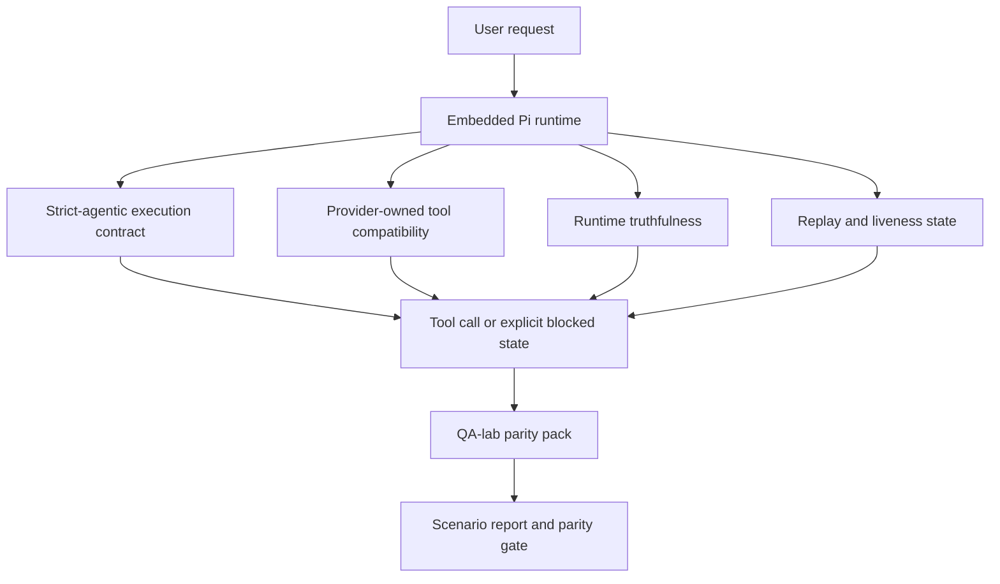
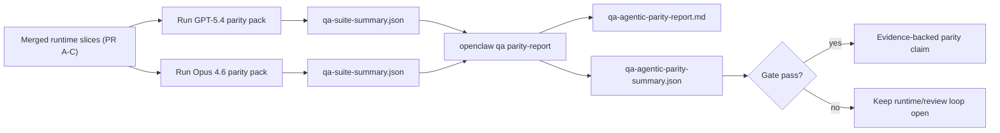

---
read_when:
    - Depurar el comportamiento del agente GPT-5.4 o Codex
    - Comparar el comportamiento agéntico de OpenClaw entre modelos de frontera
    - Revisar las correcciones de strict-agentic, esquema de herramientas, elevación y repetición
summary: Cómo OpenClaw cierra las brechas de ejecución agéntica para GPT-5.4 y modelos de estilo Codex
title: Paridad agéntica de GPT-5.4 / Codex
x-i18n:
    generated_at: "2026-04-24T05:32:35Z"
    model: gpt-5.4
    provider: openai
    source_hash: 9f8c7dcf21583e6dbac80da9ddd75f2dc9af9b80801072ade8fa14b04258d4dc
    source_path: help/gpt54-codex-agentic-parity.md
    workflow: 15
---

# Paridad agéntica de GPT-5.4 / Codex en OpenClaw

OpenClaw ya funcionaba bien con modelos de frontera que usan herramientas, pero GPT-5.4 y los modelos de estilo Codex seguían rindiendo por debajo de lo esperado en algunos aspectos prácticos:

- podían detenerse después de planificar en lugar de hacer el trabajo
- podían usar incorrectamente esquemas estrictos de herramientas OpenAI/Codex
- podían pedir `/elevated full` incluso cuando el acceso total era imposible
- podían perder el estado de tareas de larga duración durante repetición o Compaction
- las afirmaciones de paridad frente a Claude Opus 4.6 se basaban en anécdotas en lugar de escenarios repetibles

Este programa de paridad corrige esas brechas en cuatro partes revisables.

## Qué cambió

### PR A: ejecución strict-agentic

Esta parte agrega un contrato de ejecución `strict-agentic` opcional para ejecuciones GPT-5 de Pi integrado.

Cuando está habilitado, OpenClaw deja de aceptar turnos de solo plan como una finalización “suficientemente buena”. Si el modelo solo dice lo que pretende hacer y no usa realmente herramientas ni hace progreso, OpenClaw reintenta con una instrucción de actuar ahora y luego falla en modo cerrado con un estado bloqueado explícito en lugar de terminar la tarea silenciosamente.

Esto mejora la experiencia de GPT-5.4 especialmente en:

- seguimientos cortos de “ok hazlo”
- tareas de código en las que el primer paso es evidente
- flujos donde `update_plan` debería ser seguimiento de progreso y no texto de relleno

### PR B: veracidad del tiempo de ejecución

Esta parte hace que OpenClaw diga la verdad sobre dos cosas:

- por qué falló la llamada del proveedor/tiempo de ejecución
- si `/elevated full` está realmente disponible

Eso significa que GPT-5.4 obtiene mejores señales de tiempo de ejecución para ámbito faltante, fallos de actualización de autenticación, fallos de autenticación HTML 403, problemas de proxy, fallos de DNS o de tiempo de espera y modos bloqueados de acceso total. Es menos probable que el modelo alucine la corrección equivocada o siga pidiendo un modo de permisos que el tiempo de ejecución no puede proporcionar.

### PR C: corrección de la ejecución

Esta parte mejora dos tipos de corrección:

- compatibilidad de esquemas de herramientas OpenAI/Codex propiedad del proveedor
- repetición y visibilidad de tareas de larga duración

El trabajo de compatibilidad de herramientas reduce la fricción de esquema para el registro estricto de herramientas OpenAI/Codex, especialmente en torno a herramientas sin parámetros y expectativas estrictas de raíz de objeto. El trabajo de repetición/visibilidad hace que las tareas de larga duración sean más observables, de modo que los estados en pausa, bloqueado y abandonado sean visibles en lugar de desaparecer en texto genérico de fallo.

### PR D: arnés de paridad

Esta parte agrega el primer paquete de paridad de QA-lab para que GPT-5.4 y Opus 4.6 puedan ejercitarse en los mismos escenarios y compararse usando evidencia compartida.

El paquete de paridad es la capa de prueba. Por sí solo no cambia el comportamiento del tiempo de ejecución.

Después de tener dos artefactos `qa-suite-summary.json`, genera la comparación de la puerta de versión con:

```bash
pnpm openclaw qa parity-report \
  --repo-root . \
  --candidate-summary .artifacts/qa-e2e/gpt54/qa-suite-summary.json \
  --baseline-summary .artifacts/qa-e2e/opus46/qa-suite-summary.json \
  --output-dir .artifacts/qa-e2e/parity
```

Ese comando escribe:

- un informe Markdown legible por humanos
- un veredicto JSON legible por máquina
- un resultado explícito de puerta `pass` / `fail`

## Por qué esto mejora GPT-5.4 en la práctica

Antes de este trabajo, GPT-5.4 en OpenClaw podía sentirse menos agéntico que Opus en sesiones reales de programación porque el tiempo de ejecución toleraba comportamientos especialmente perjudiciales para los modelos tipo GPT-5:

- turnos solo de comentarios
- fricción de esquema alrededor de herramientas
- retroalimentación vaga sobre permisos
- roturas silenciosas por repetición o Compaction

El objetivo no es hacer que GPT-5.4 imite a Opus. El objetivo es darle a GPT-5.4 un contrato de tiempo de ejecución que recompense el progreso real, proporcione semánticas más limpias de herramientas y permisos, y convierta los modos de fallo en estados explícitos legibles por máquina y por humanos.

Eso cambia la experiencia del usuario de:

- “el modelo tenía un buen plan pero se detuvo”

a:

- “el modelo actuó, o OpenClaw mostró la razón exacta por la que no pudo hacerlo”

## Antes vs después para usuarios de GPT-5.4

| Antes de este programa | Después de PR A-D |
| ---------------------------------------------------------------------------------------------- | ---------------------------------------------------------------------------------------- |
| GPT-5.4 podía detenerse tras un plan razonable sin dar el siguiente paso con herramientas | PR A convierte “solo plan” en “actúa ahora o muestra un estado bloqueado” |
| Los esquemas estrictos de herramientas podían rechazar herramientas sin parámetros o con forma OpenAI/Codex de manera confusa | PR C hace más predecibles el registro y la invocación de herramientas propiedad del proveedor |
| La guía de `/elevated full` podía ser vaga o errónea en tiempos de ejecución bloqueados | PR B da a GPT-5.4 y al usuario indicaciones veraces de tiempo de ejecución y permisos |
| Los fallos de repetición o Compaction podían dar la sensación de que la tarea desaparecía silenciosamente | PR C muestra explícitamente resultados en pausa, bloqueados, abandonados e inválidos por repetición |
| “GPT-5.4 se siente peor que Opus” era sobre todo anecdótico | PR D lo convierte en el mismo paquete de escenarios, las mismas métricas y una puerta estricta de pass/fail |

## Arquitectura



## Flujo de versión



## Paquete de escenarios

El primer paquete de paridad cubre actualmente cinco escenarios:

### `approval-turn-tool-followthrough`

Comprueba que el modelo no se detenga en “haré eso” después de una aprobación breve. Debe realizar la primera acción concreta en el mismo turno.

### `model-switch-tool-continuity`

Comprueba que el trabajo que usa herramientas siga siendo coherente a través de límites de cambio de modelo/tiempo de ejecución en lugar de reiniciarse en comentarios o perder el contexto de ejecución.

### `source-docs-discovery-report`

Comprueba que el modelo pueda leer código fuente y documentación, sintetizar hallazgos y continuar la tarea de forma agéntica en lugar de producir un resumen superficial y detenerse pronto.

### `image-understanding-attachment`

Comprueba que las tareas de modo mixto que implican adjuntos sigan siendo accionables y no se reduzcan a una narración vaga.

### `compaction-retry-mutating-tool`

Comprueba que una tarea con una escritura mutante real mantenga explícita la inseguridad de repetición en lugar de parecer silenciosamente segura para repetición si la ejecución entra en Compaction, reintenta o pierde estado de respuesta bajo presión.

## Matriz de escenarios

| Escenario | Qué prueba | Buen comportamiento de GPT-5.4 | Señal de fallo |
| ---------------------------------- | --------------------------------------- | ------------------------------------------------------------------------------ | ------------------------------------------------------------------------------ |
| `approval-turn-tool-followthrough` | Turnos cortos de aprobación después de un plan | Inicia inmediatamente la primera acción concreta con herramienta en lugar de reformular la intención | seguimiento solo de plan, sin actividad de herramientas o turno bloqueado sin un bloqueador real |
| `model-switch-tool-continuity` | Cambio de tiempo de ejecución/modelo bajo uso de herramientas | Conserva el contexto de la tarea y sigue actuando de forma coherente | se reinicia en comentarios, pierde el contexto de herramientas o se detiene tras el cambio |
| `source-docs-discovery-report` | Lectura de código fuente + síntesis + acción | Encuentra fuentes, usa herramientas y produce un informe útil sin atascarse | resumen superficial, falta de trabajo con herramientas o detención prematura de turno incompleto |
| `image-understanding-attachment` | Trabajo agéntico guiado por adjuntos | Interpreta el adjunto, lo conecta con herramientas y continúa la tarea | narración vaga, adjunto ignorado o sin una siguiente acción concreta |
| `compaction-retry-mutating-tool` | Trabajo mutante bajo presión de Compaction | Realiza una escritura real y mantiene explícita la inseguridad de repetición después del efecto secundario | ocurre la escritura mutante pero la seguridad de repetición queda implícita, ausente o contradictoria |

## Puerta de versión

GPT-5.4 solo puede considerarse en paridad o mejor cuando el tiempo de ejecución fusionado supera el paquete de paridad y las regresiones de veracidad del tiempo de ejecución al mismo tiempo.

Resultados requeridos:

- sin bloqueo por solo planificación cuando la siguiente acción con herramienta es clara
- sin finalización falsa sin ejecución real
- sin guía incorrecta de `/elevated full`
- sin abandono silencioso por repetición o Compaction
- métricas del paquete de paridad al menos tan fuertes como la línea base acordada de Opus 4.6

Para el primer arnés, la puerta compara:

- tasa de finalización
- tasa de detención no intencionada
- tasa de llamadas válidas a herramientas
- conteo de éxitos falsos

La evidencia de paridad se divide intencionalmente en dos capas:

- PR D demuestra el comportamiento de GPT-5.4 frente a Opus 4.6 en los mismos escenarios con QA-lab
- Los conjuntos deterministas de PR B demuestran veracidad de autenticación, proxy, DNS y `/elevated full` fuera del arnés

## Matriz de objetivo a evidencia

| Elemento de la puerta de finalización | PR responsable | Fuente de evidencia | Señal de aprobación |
| -------------------------------------------------------- | ----------- | ------------------------------------------------------------------ | ---------------------------------------------------------------------------------------- |
| GPT-5.4 ya no se bloquea después de planificar | PR A | `approval-turn-tool-followthrough` más los conjuntos de tiempo de ejecución de PR A | los turnos de aprobación activan trabajo real o un estado bloqueado explícito |
| GPT-5.4 ya no finge progreso ni finalización falsa de herramientas | PR A + PR D | resultados de escenarios del informe de paridad y conteo de éxitos falsos | sin resultados de aprobación sospechosos y sin finalización solo con comentarios |
| GPT-5.4 ya no da una guía falsa de `/elevated full` | PR B | conjuntos deterministas de veracidad | las razones de bloqueo y las pistas de acceso total siguen siendo precisas para el tiempo de ejecución |
| Los fallos de repetición/visibilidad siguen siendo explícitos | PR C + PR D | conjuntos de ciclo de vida/repetición de PR C más `compaction-retry-mutating-tool` | el trabajo mutante mantiene explícita la inseguridad de repetición en lugar de desaparecer silenciosamente |
| GPT-5.4 iguala o supera a Opus 4.6 en las métricas acordadas | PR D | `qa-agentic-parity-report.md` y `qa-agentic-parity-summary.json` | misma cobertura de escenarios y sin regresión en finalización, comportamiento de detención o uso válido de herramientas |

## Cómo leer el veredicto de paridad

Usa el veredicto en `qa-agentic-parity-summary.json` como la decisión final legible por máquina para el primer paquete de paridad.

- `pass` significa que GPT-5.4 cubrió los mismos escenarios que Opus 4.6 y no retrocedió en las métricas agregadas acordadas.
- `fail` significa que se activó al menos una puerta estricta: finalización más débil, peores detenciones no intencionadas, uso válido de herramientas más débil, cualquier caso de éxito falso o cobertura de escenarios no coincidente.
- “shared/base CI issue” no es por sí mismo un resultado de paridad. Si el ruido de CI fuera de PR D bloquea una ejecución, el veredicto debe esperar a una ejecución limpia del tiempo de ejecución fusionado en lugar de inferirse a partir de registros de la época de la rama.
- La veracidad de autenticación, proxy, DNS y `/elevated full` sigue viniendo de los conjuntos deterministas de PR B, por lo que la afirmación final de versión necesita ambas cosas: un veredicto de paridad PR D aprobado y una cobertura de veracidad PR B en verde.

## Quién debería habilitar `strict-agentic`

Usa `strict-agentic` cuando:

- se espera que el agente actúe de inmediato cuando el siguiente paso es evidente
- GPT-5.4 o los modelos de la familia Codex son el tiempo de ejecución principal
- prefieres estados bloqueados explícitos en lugar de respuestas “útiles” solo de recapitulación

Mantén el contrato predeterminado cuando:

- quieras el comportamiento actual más flexible
- no estés usando modelos de la familia GPT-5
- estés probando prompts en lugar de aplicar comportamiento en tiempo de ejecución

## Relacionado

- [Notas de mantenimiento de paridad GPT-5.4 / Codex](/es/help/gpt54-codex-agentic-parity-maintainers)
