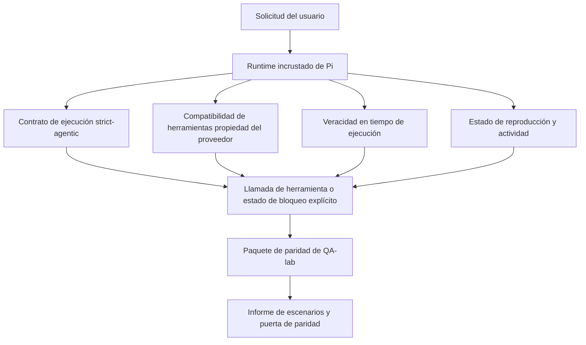
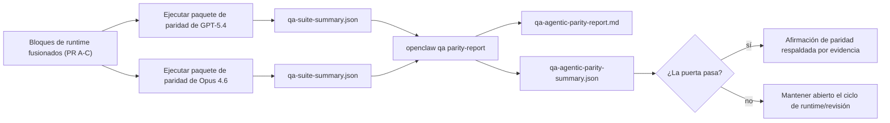

---
x-i18n:
    generated_at: "2026-04-11T15:15:45Z"
    model: gpt-5.4
    provider: openai
    source_hash: 7ee6b925b8a0f8843693cea9d50b40544657b5fb8a9e0860e2ff5badb273acb6
    source_path: help/gpt54-codex-agentic-parity.md
    workflow: 15
---

# Paridad agéntica de GPT-5.4 / Codex en OpenClaw

OpenClaw ya funcionaba bien con modelos de frontera que usan herramientas, pero los modelos de estilo GPT-5.4 y Codex seguían rindiendo por debajo de lo esperado en algunos aspectos prácticos:

- podían detenerse después de planificar en lugar de hacer el trabajo
- podían usar incorrectamente los esquemas estrictos de herramientas de OpenAI/Codex
- podían pedir `/elevated full` incluso cuando el acceso completo era imposible
- podían perder el estado de tareas de larga duración durante la reproducción o la compactación
- las afirmaciones de paridad frente a Claude Opus 4.6 se basaban en anécdotas en lugar de escenarios repetibles

Este programa de paridad corrige esas carencias en cuatro bloques revisables.

## Qué cambió

### PR A: ejecución strict-agentic

Este bloque agrega un contrato de ejecución `strict-agentic` opcional para ejecuciones incrustadas de GPT-5 en Pi.

Cuando está habilitado, OpenClaw deja de aceptar turnos de solo planificación como una finalización “suficientemente buena”. Si el modelo solo dice lo que pretende hacer y no usa realmente herramientas ni avanza, OpenClaw reintenta con una instrucción de actuar ahora y luego falla de forma segura con un estado de bloqueo explícito en lugar de finalizar silenciosamente la tarea.

Esto mejora la experiencia con GPT-5.4 sobre todo en:

- seguimientos cortos de “ok hazlo”
- tareas de código donde el primer paso es obvio
- flujos donde `update_plan` debería servir para seguir el progreso en lugar de ser texto de relleno

### PR B: veracidad en tiempo de ejecución

Este bloque hace que OpenClaw diga la verdad sobre dos cosas:

- por qué falló la llamada al proveedor/runtime
- si `/elevated full` está realmente disponible

Eso significa que GPT-5.4 recibe mejores señales de runtime para alcance faltante, fallos al renovar la autenticación, fallos de autenticación HTML 403, problemas de proxy, fallos de DNS o timeout, y modos de acceso completo bloqueados. Es menos probable que el modelo alucine una remediación incorrecta o siga pidiendo un modo de permisos que el runtime no puede ofrecer.

### PR C: corrección de ejecución

Este bloque mejora dos tipos de corrección:

- compatibilidad de esquemas de herramientas OpenAI/Codex propiedad del proveedor
- visibilidad de la reproducción y la actividad de tareas largas

El trabajo de compatibilidad de herramientas reduce la fricción de esquemas para el registro estricto de herramientas de OpenAI/Codex, especialmente en torno a herramientas sin parámetros y expectativas estrictas de objeto en la raíz. El trabajo de reproducción/actividad hace que las tareas de larga duración sean más observables, de modo que los estados pausado, bloqueado y abandonado sean visibles en lugar de perderse en un texto de fallo genérico.

### PR D: arnés de paridad

Este bloque agrega el primer paquete de paridad de QA-lab para que GPT-5.4 y Opus 4.6 puedan ejercitarse con los mismos escenarios y compararse usando evidencia compartida.

El paquete de paridad es la capa de prueba. No cambia por sí mismo el comportamiento en runtime.

Después de tener dos artefactos `qa-suite-summary.json`, genera la comparación de la puerta de liberación con:

```bash
pnpm openclaw qa parity-report \
  --repo-root . \
  --candidate-summary .artifacts/qa-e2e/gpt54/qa-suite-summary.json \
  --baseline-summary .artifacts/qa-e2e/opus46/qa-suite-summary.json \
  --output-dir .artifacts/qa-e2e/parity
```

Ese comando escribe:

- un informe Markdown legible para humanos
- un veredicto JSON legible por máquina
- un resultado explícito de puerta `pass` / `fail`

## Por qué esto mejora GPT-5.4 en la práctica

Antes de este trabajo, GPT-5.4 en OpenClaw podía sentirse menos agéntico que Opus en sesiones reales de programación porque el runtime toleraba comportamientos especialmente perjudiciales para los modelos de estilo GPT-5:

- turnos de solo comentarios
- fricción de esquemas en torno a herramientas
- retroalimentación de permisos vaga
- fallos silenciosos de reproducción o compactación

El objetivo no es hacer que GPT-5.4 imite a Opus. El objetivo es darle a GPT-5.4 un contrato de runtime que premie el progreso real, proporcione una semántica más clara de herramientas y permisos, y convierta los modos de fallo en estados explícitos legibles por máquina y por humanos.

Eso cambia la experiencia del usuario de:

- “el modelo tenía un buen plan pero se detuvo”

a:

- “el modelo actuó, o OpenClaw mostró la razón exacta por la que no pudo hacerlo”

## Antes vs. después para usuarios de GPT-5.4

| Antes de este programa                                                                         | Después de PR A-D                                                                        |
| ---------------------------------------------------------------------------------------------- | ---------------------------------------------------------------------------------------- |
| GPT-5.4 podía detenerse tras un plan razonable sin dar el siguiente paso con herramientas      | PR A convierte “solo plan” en “actúa ahora o muestra un estado de bloqueo”              |
| Los esquemas estrictos de herramientas podían rechazar herramientas sin parámetros o con forma OpenAI/Codex de maneras confusas | PR C hace que el registro y la invocación de herramientas propiedad del proveedor sean más predecibles |
| La orientación sobre `/elevated full` podía ser vaga o incorrecta en runtimes bloqueados       | PR B ofrece a GPT-5.4 y al usuario pistas veraces sobre runtime y permisos              |
| Los fallos de reproducción o compactación podían sentirse como si la tarea hubiera desaparecido silenciosamente | PR C muestra explícitamente resultados pausados, bloqueados, abandonados y de reproducción inválida |
| “GPT-5.4 se siente peor que Opus” era mayormente anecdótico                                    | PR D lo convierte en el mismo paquete de escenarios, las mismas métricas y una puerta estricta de pass/fail |

## Arquitectura



## Flujo de liberación



## Paquete de escenarios

El paquete de paridad de primera ola actualmente cubre cinco escenarios:

### `approval-turn-tool-followthrough`

Comprueba que el modelo no se detenga en “haré eso” después de una aprobación breve. Debe realizar la primera acción concreta en el mismo turno.

### `model-switch-tool-continuity`

Comprueba que el trabajo con herramientas siga siendo coherente a través de los límites de cambio de modelo/runtime en lugar de reiniciarse en comentarios o perder el contexto de ejecución.

### `source-docs-discovery-report`

Comprueba que el modelo pueda leer código fuente y documentación, sintetizar hallazgos y continuar la tarea de manera agéntica en lugar de producir un resumen superficial y detenerse antes de tiempo.

### `image-understanding-attachment`

Comprueba que las tareas de modo mixto con adjuntos sigan siendo accionables y no colapsen en una narración vaga.

### `compaction-retry-mutating-tool`

Comprueba que una tarea con una escritura mutante real mantenga explícita la inseguridad de reproducción en lugar de parecer silenciosamente segura para reproducir si la ejecución se compacta, reintenta o pierde el estado de respuesta bajo presión.

## Matriz de escenarios

| Escenario                          | Qué prueba                              | Buen comportamiento de GPT-5.4                                                  | Señal de fallo                                                                  |
| ---------------------------------- | --------------------------------------- | ------------------------------------------------------------------------------- | ------------------------------------------------------------------------------- |
| `approval-turn-tool-followthrough` | Aprobaciones breves después de un plan  | Inicia de inmediato la primera acción concreta con herramienta en lugar de reiterar la intención | seguimiento de solo plan, sin actividad de herramientas, o turno bloqueado sin un bloqueador real |
| `model-switch-tool-continuity`     | Cambio de runtime/modelo durante uso de herramientas | Conserva el contexto de la tarea y sigue actuando de manera coherente           | se reinicia en comentarios, pierde el contexto de herramientas o se detiene tras el cambio |
| `source-docs-discovery-report`     | Lectura de código fuente + síntesis + acción | Encuentra fuentes, usa herramientas y produce un informe útil sin estancarse    | resumen superficial, trabajo de herramientas ausente o detención con turno incompleto |
| `image-understanding-attachment`   | Trabajo agéntico guiado por adjuntos    | Interpreta el adjunto, lo conecta con herramientas y continúa la tarea          | narración vaga, adjunto ignorado o ninguna acción concreta siguiente            |
| `compaction-retry-mutating-tool`   | Trabajo mutante bajo presión de compactación | Realiza una escritura real y mantiene explícita la inseguridad de reproducción después del efecto secundario | ocurre una escritura mutante pero la seguridad de reproducción se insinúa, falta o es contradictoria |

## Puerta de liberación

GPT-5.4 solo puede considerarse en paridad o mejor cuando el runtime fusionado supera al mismo tiempo el paquete de paridad y las regresiones de veracidad en runtime.

Resultados obligatorios:

- ningún bloqueo por solo planificación cuando la siguiente acción con herramienta está clara
- ninguna finalización falsa sin ejecución real
- ninguna orientación incorrecta sobre `/elevated full`
- ningún abandono silencioso por reproducción o compactación
- métricas del paquete de paridad al menos tan sólidas como la línea base acordada de Opus 4.6

Para el arnés de primera ola, la puerta compara:

- tasa de finalización
- tasa de detenciones no deseadas
- tasa de llamadas de herramienta válidas
- recuento de éxitos falsos

La evidencia de paridad está dividida intencionalmente en dos capas:

- PR D demuestra el comportamiento de GPT-5.4 vs Opus 4.6 en los mismos escenarios con QA-lab
- las suites deterministas de PR B demuestran veracidad de auth, proxy, DNS y `/elevated full` fuera del arnés

## Matriz de objetivo a evidencia

| Elemento de la puerta de finalización                 | PR responsable | Fuente de evidencia                                                | Señal de aprobación                                                                      |
| ----------------------------------------------------- | -------------- | ------------------------------------------------------------------ | ---------------------------------------------------------------------------------------- |
| GPT-5.4 ya no se bloquea después de planificar        | PR A           | `approval-turn-tool-followthrough` más suites de runtime de PR A   | los turnos de aprobación disparan trabajo real o un estado de bloqueo explícito         |
| GPT-5.4 ya no finge progreso ni finalización falsa de herramientas | PR A + PR D    | resultados de escenarios del informe de paridad y recuento de éxitos falsos | no hay resultados de aprobación sospechosos ni finalización de solo comentarios          |
| GPT-5.4 ya no da orientación falsa sobre `/elevated full` | PR B           | suites deterministas de veracidad                                  | los motivos de bloqueo y las pistas de acceso completo se mantienen precisos respecto al runtime |
| Los fallos de reproducción/actividad siguen siendo explícitos | PR C + PR D    | suites de ciclo de vida/reproducción de PR C más `compaction-retry-mutating-tool` | el trabajo mutante mantiene explícita la inseguridad de reproducción en lugar de desaparecer silenciosamente |
| GPT-5.4 iguala o supera a Opus 4.6 en las métricas acordadas | PR D           | `qa-agentic-parity-report.md` y `qa-agentic-parity-summary.json`   | misma cobertura de escenarios y ninguna regresión en finalización, comportamiento de detención o uso válido de herramientas |

## Cómo leer el veredicto de paridad

Usa el veredicto en `qa-agentic-parity-summary.json` como la decisión final legible por máquina para el paquete de paridad de primera ola.

- `pass` significa que GPT-5.4 cubrió los mismos escenarios que Opus 4.6 y no retrocedió en las métricas agregadas acordadas.
- `fail` significa que se activó al menos una puerta estricta: finalización más débil, peores detenciones no deseadas, uso válido de herramientas más débil, cualquier caso de éxito falso o cobertura de escenarios no coincidente.
- “problema de CI compartido/base” no es por sí mismo un resultado de paridad. Si ruido de CI fuera de PR D bloquea una ejecución, el veredicto debe esperar una ejecución limpia del runtime fusionado en lugar de inferirse a partir de logs de la rama.
- La veracidad de auth, proxy, DNS y `/elevated full` sigue viniendo de las suites deterministas de PR B, por lo que la afirmación final de liberación necesita ambas cosas: un veredicto de paridad aprobado de PR D y cobertura de veracidad de PR B en verde.

## Quién debería habilitar `strict-agentic`

Usa `strict-agentic` cuando:

- se espera que el agente actúe de inmediato cuando el siguiente paso sea obvio
- GPT-5.4 o modelos de la familia Codex sean el runtime principal
- prefieras estados de bloqueo explícitos en lugar de respuestas de solo recapitulación “útiles”

Mantén el contrato predeterminado cuando:

- quieras el comportamiento actual más flexible
- no estés usando modelos de la familia GPT-5
- estés probando prompts en lugar de la aplicación de reglas en runtime
