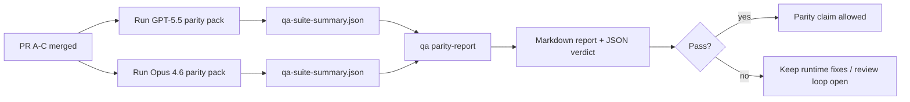

---
read_when:
    - Revisión de la serie de PR de paridad entre GPT-5.5 y Codex
    - Mantenimiento de la arquitectura agéntica de seis contratos que sustenta el programa de paridad
summary: Cómo revisar el programa de paridad de GPT-5.5 / Codex como cuatro unidades de integración
title: Notas para mantenedores sobre la paridad de GPT-5.5 / Codex
x-i18n:
    generated_at: "2026-05-06T05:37:12Z"
    model: gpt-5.5
    provider: openai
    source_hash: 5752b4610f8b0d70b80d880ea10df75478b5f85ca431cdb73d3b61d745b23356
    source_path: help/gpt55-codex-agentic-parity-maintainers.md
    workflow: 16
---

Esta nota explica cómo revisar el programa de paridad GPT-5.5 / Codex como cuatro unidades de fusión sin perder la arquitectura original de seis contratos.

## Unidades de fusión

### PR A: ejecución agéntica estricta

Se encarga de:

- `executionContract`
- seguimiento en el mismo turno, con GPT-5 primero
- `update_plan` como seguimiento de progreso no terminal
- estados bloqueados explícitos en lugar de detenciones silenciosas solo con plan

No se encarga de:

- clasificación de fallos de autenticación/tiempo de ejecución
- veracidad de permisos
- rediseño de replay/continuación
- evaluación comparativa de paridad

### PR B: veracidad del tiempo de ejecución

Se encarga de:

- corrección del alcance de OAuth de Codex
- clasificación tipada de fallos de proveedor/tiempo de ejecución
- disponibilidad veraz de `/elevated full` y motivos de bloqueo

No se encarga de:

- normalización del esquema de herramientas
- estado de replay/vitalidad
- compuertas de evaluación comparativa

### PR C: corrección de ejecución

Se encarga de:

- compatibilidad de herramientas OpenAI/Codex propiedad del proveedor
- manejo de esquemas estrictos sin parámetros
- exposición de replay inválido
- visibilidad del estado de tareas largas pausadas, bloqueadas y abandonadas

No se encarga de:

- continuación autoelegida
- comportamiento genérico del dialecto Codex fuera de los hooks del proveedor
- compuertas de evaluación comparativa

### PR D: arnés de paridad

Se encarga de:

- paquete de escenarios de primera ola GPT-5.5 frente a Opus 4.6
- documentación de paridad
- informe de paridad y mecánica de compuerta de lanzamiento

No se encarga de:

- cambios de comportamiento de tiempo de ejecución fuera de QA-lab
- simulación de auth/proxy/DNS dentro del arnés

## Mapeo a los seis contratos originales

| Contrato original                         | Unidad de fusión |
| ----------------------------------------- | ---------------- |
| Corrección de transporte/autenticación del proveedor | PR B             |
| Compatibilidad de contrato/esquema de herramientas | PR C             |
| Ejecución en el mismo turno               | PR A             |
| Veracidad de permisos                     | PR B             |
| Corrección de replay/continuación/vitalidad | PR C           |
| Compuerta de evaluación comparativa/lanzamiento | PR D       |

## Orden de revisión

1. PR A
2. PR B
3. PR C
4. PR D

PR D es la capa de prueba. No debería ser la razón por la que se retrasen los PR de corrección del tiempo de ejecución.

## Qué revisar

### PR A

- Las ejecuciones de GPT-5 actúan o fallan de forma cerrada en lugar de detenerse en comentarios
- `update_plan` ya no parece progreso por sí solo
- el comportamiento sigue siendo con GPT-5 primero y limitado al Pi integrado

### PR B

- los fallos de auth/proxy/tiempo de ejecución dejan de colapsar en un manejo genérico de "model failed"
- `/elevated full` solo se describe como disponible cuando realmente lo está
- los motivos de bloqueo son visibles tanto para el modelo como para el tiempo de ejecución orientado al usuario

### PR C

- el registro estricto de herramientas OpenAI/Codex se comporta de forma predecible
- las herramientas sin parámetros no fallan las comprobaciones de esquema estricto
- los resultados de replay y Compaction preservan un estado de vitalidad veraz

### PR D

- el paquete de escenarios es comprensible y reproducible
- el paquete incluye una pista de seguridad de replay con mutación, no solo flujos de solo lectura
- los informes son legibles por humanos y automatización
- las afirmaciones de paridad están respaldadas por evidencia, no por anécdotas

Artefactos esperados de PR D:

- `qa-suite-report.md` / `qa-suite-summary.json` para cada ejecución de modelo
- `qa-agentic-parity-report.md` con comparación agregada y por escenario
- `qa-agentic-parity-summary.json` con un veredicto legible por máquina

## Compuerta de lanzamiento

No afirmes paridad ni superioridad de GPT-5.5 sobre Opus 4.6 hasta que:

- PR A, PR B y PR C estén fusionados
- PR D ejecute limpiamente el paquete de paridad de primera ola
- los conjuntos de regresión de veracidad del tiempo de ejecución sigan en verde
- el informe de paridad no muestre casos de éxito falso ni regresiones en el comportamiento de detención

El arnés de paridad no es la única fuente de evidencia. Mantén esta división explícita en la revisión:

- PR D se encarga de la comparación basada en escenarios GPT-5.5 frente a Opus 4.6
- los conjuntos deterministas de PR B siguen encargándose de la evidencia de veracidad de auth/proxy/DNS y acceso completo

## Flujo rápido de fusión para mantenedores

Usa esto cuando estés listo para integrar un PR de paridad y quieras una secuencia repetible y de bajo riesgo.

1. Confirma que se cumple la barra de evidencia antes de fusionar:
   - síntoma reproducible o prueba fallida
   - causa raíz verificada en el código modificado
   - corrección en la ruta implicada
   - prueba de regresión o nota explícita de verificación manual
2. Clasifica/etiqueta antes de fusionar:
   - aplica cualquier etiqueta de autocierre `r:*` cuando el PR no deba integrarse
   - mantén los candidatos a fusión libres de hilos bloqueadores sin resolver
3. Valida localmente en la superficie modificada:
   - `pnpm check:changed`
   - `pnpm test:changed` cuando cambien las pruebas o la confianza en la corrección del error dependa de la cobertura de pruebas
4. Integra con el flujo estándar de mantenedor (proceso `/landpr`) y luego verifica:
   - comportamiento de autocierre de issues vinculados
   - CI y estado posterior a la fusión en `main`
5. Después de integrar, ejecuta una búsqueda de duplicados para PR/issues abiertos relacionados y cierra solo con una referencia canónica.

Si falta cualquiera de los elementos de la barra de evidencia, solicita cambios en lugar de fusionar.

## Mapa de objetivo a evidencia

| Elemento de compuerta de finalización     | Propietario principal | Artefacto de revisión                                             |
| ----------------------------------------- | --------------------- | ----------------------------------------------------------------- |
| Sin bloqueos solo con plan                | PR A                  | pruebas de tiempo de ejecución agéntico estricto y `approval-turn-tool-followthrough` |
| Sin progreso falso ni finalización falsa de herramientas | PR A + PR D | recuento de éxito falso de paridad más detalles de informe por escenario |
| Sin guía falsa de `/elevated full`        | PR B                  | conjuntos deterministas de veracidad del tiempo de ejecución      |
| Los fallos de replay/vitalidad siguen siendo explícitos | PR C + PR D | conjuntos de ciclo de vida/replay más `compaction-retry-mutating-tool` |
| GPT-5.5 iguala o supera a Opus 4.6        | PR D                  | `qa-agentic-parity-report.md` y `qa-agentic-parity-summary.json`  |

## Atajo para revisores: antes y después

| Problema visible para el usuario antes                    | Señal de revisión después                                                          |
| --------------------------------------------------------- | ---------------------------------------------------------------------------------- |
| GPT-5.5 se detenía después de planificar                  | PR A muestra comportamiento de actuar o bloquear en lugar de finalización solo con comentarios |
| El uso de herramientas se sentía frágil con esquemas estrictos OpenAI/Codex | PR C mantiene predecibles el registro de herramientas y la invocación sin parámetros |
| Las pistas de `/elevated full` a veces eran engañosas     | PR B vincula la guía a la capacidad real del tiempo de ejecución y a los motivos de bloqueo |
| Las tareas largas podían desaparecer en ambigüedad de replay/Compaction | PR C emite estados explícitos de pausado, bloqueado, abandonado y replay inválido |
| Las afirmaciones de paridad eran anecdóticas              | PR D produce un informe más un veredicto JSON con la misma cobertura de escenarios en ambos modelos |

## Relacionado

- [Paridad agéntica GPT-5.5 / Codex](/es/help/gpt55-codex-agentic-parity)
