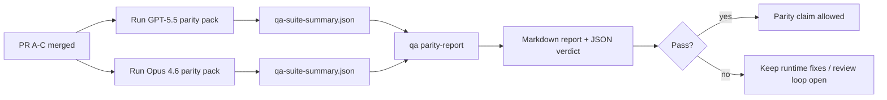

---
read_when:
    - Revisión de la serie de PR de paridad de GPT-5.5 / Codex
    - Mantenimiento de la arquitectura agéntica de seis contratos detrás del programa de paridad
summary: Cómo revisar el programa de paridad de GPT-5.5 / Codex como cuatro unidades de fusión
title: Notas del mantenedor sobre la paridad de GPT-5.5 / Codex
x-i18n:
    generated_at: "2026-04-25T18:18:47Z"
    model: gpt-5.4
    provider: openai
    source_hash: 8de69081f5985954b88583880c36388dc47116c3351c15d135b8ab3a660058e3
    source_path: help/gpt55-codex-agentic-parity-maintainers.md
    workflow: 15
---

Esta nota explica cómo revisar el programa de paridad de GPT-5.5 / Codex como cuatro unidades de fusión sin perder la arquitectura original de seis contratos.

## Unidades de fusión

### PR A: ejecución estrictamente agéntica

Es responsable de:

- `executionContract`
- continuidad en el mismo turno con GPT-5 como prioridad
- `update_plan` como seguimiento de progreso no terminal
- estados bloqueados explícitos en lugar de detenciones silenciosas basadas solo en el plan

No es responsable de:

- clasificación de fallos de autenticación/tiempo de ejecución
- veracidad de permisos
- rediseño de repetición/continuación
- evaluación comparativa de paridad

### PR B: veracidad del tiempo de ejecución

Es responsable de:

- corrección de los alcances OAuth de Codex
- clasificación tipada de fallos de proveedor/tiempo de ejecución
- disponibilidad veraz de `/elevated full` y motivos de bloqueo

No es responsable de:

- normalización del esquema de herramientas
- estado de repetición/actividad
- puertas de evaluación comparativa

### PR C: corrección de la ejecución

Es responsable de:

- compatibilidad de herramientas OpenAI/Codex gestionada por el proveedor
- manejo estricto de esquemas sin parámetros
- exposición de repetición no válida
- visibilidad del estado de tareas largas pausadas, bloqueadas y abandonadas

No es responsable de:

- continuación autoelegida
- comportamiento genérico del dialecto Codex fuera de los hooks del proveedor
- puertas de evaluación comparativa

### PR D: arnés de paridad

Es responsable de:

- primer paquete de escenarios GPT-5.5 vs Opus 4.6
- documentación de paridad
- informe de paridad y mecanismos de puerta de lanzamiento

No es responsable de:

- cambios de comportamiento en tiempo de ejecución fuera de qa-lab
- simulación de autenticación/proxy/DNS dentro del arnés

## Correspondencia con los seis contratos originales

| Contrato original                         | Unidad de fusión |
| ----------------------------------------- | ---------------- |
| Corrección de transporte/autenticación del proveedor | PR B             |
| Compatibilidad de contrato/esquema de herramientas   | PR C             |
| Ejecución en el mismo turno               | PR A             |
| Veracidad de permisos                     | PR B             |
| Corrección de repetición/continuación/actividad | PR C        |
| Evaluación comparativa/puerta de lanzamiento | PR D          |

## Orden de revisión

1. PR A
2. PR B
3. PR C
4. PR D

PR D es la capa de prueba. No debe ser el motivo por el que se retrasen los PR de corrección del tiempo de ejecución.

## Qué revisar

### PR A

- las ejecuciones de GPT-5 actúan o fallan de forma cerrada en lugar de detenerse en comentarios
- `update_plan` ya no parece progreso por sí solo
- el comportamiento sigue priorizando GPT-5 y limitado a Pi integrado

### PR B

- los fallos de autenticación/proxy/tiempo de ejecución dejan de colapsar en un manejo genérico de “el modelo falló”
- `/elevated full` solo se describe como disponible cuando realmente está disponible
- los motivos de bloqueo son visibles tanto para el modelo como para el tiempo de ejecución orientado al usuario

### PR C

- el registro estricto de herramientas OpenAI/Codex se comporta de forma predecible
- las herramientas sin parámetros no fallan las comprobaciones estrictas de esquema
- los resultados de repetición y Compaction conservan un estado de actividad veraz

### PR D

- el paquete de escenarios es comprensible y reproducible
- el paquete incluye una vía mutante de seguridad de repetición, no solo flujos de solo lectura
- los informes son legibles para humanos y automatización
- las afirmaciones de paridad están respaldadas por evidencia, no por anécdotas

Artefactos esperados de PR D:

- `qa-suite-report.md` / `qa-suite-summary.json` para cada ejecución de modelo
- `qa-agentic-parity-report.md` con comparación agregada y por escenario
- `qa-agentic-parity-summary.json` con un veredicto legible por máquina

## Puerta de lanzamiento

No afirmes paridad ni superioridad de GPT-5.5 sobre Opus 4.6 hasta que:

- PR A, PR B y PR C estén fusionados
- PR D ejecute limpiamente el primer paquete de paridad
- las suites de regresión de veracidad del tiempo de ejecución sigan en verde
- el informe de paridad no muestre casos de éxito falso ni regresión en el comportamiento de detención

El arnés de paridad no es la única fuente de evidencia. Mantén esta división explícita en la revisión:

- PR D es responsable de la comparación basada en escenarios entre GPT-5.5 y Opus 4.6
- las suites deterministas de PR B siguen siendo responsables de la evidencia sobre autenticación/proxy/DNS y veracidad de acceso completo

## Flujo rápido de fusión para mantenedores

Úsalo cuando estés listo para integrar un PR de paridad y quieras una secuencia repetible y de bajo riesgo.

1. Confirma que se cumple el umbral de evidencia antes de fusionar:
   - síntoma reproducible o prueba fallida
   - causa raíz verificada en el código afectado
   - corrección en la ruta implicada
   - prueba de regresión o nota explícita de verificación manual
2. Haz triaje/aplica etiquetas antes de fusionar:
   - aplica cualquier etiqueta `r:*` de cierre automático cuando el PR no deba integrarse
   - mantén los candidatos a fusión sin hilos de bloqueo sin resolver
3. Valida localmente la superficie afectada:
   - `pnpm check:changed`
   - `pnpm test:changed` cuando hayan cambiado pruebas o la confianza en la corrección del error dependa de la cobertura de pruebas
4. Integra con el flujo estándar de mantenedor (proceso `/landpr`) y luego verifica:
   - comportamiento de cierre automático de issues enlazados
   - CI y estado posterior a la fusión en `main`
5. Después de integrar, busca PR/issues abiertos relacionados duplicados y ciérralos solo con una referencia canónica.

Si falta cualquiera de los elementos del umbral de evidencia, solicita cambios en lugar de fusionar.

## Correspondencia entre objetivo y evidencia

| Elemento de la puerta de finalización     | Responsable principal | Artefacto de revisión                                               |
| ----------------------------------------- | --------------------- | ------------------------------------------------------------------- |
| Sin bloqueos por plan solamente           | PR A                  | pruebas de tiempo de ejecución estrictamente agénticas y `approval-turn-tool-followthrough` |
| Sin progreso falso ni finalización falsa de herramientas | PR A + PR D | recuento de éxitos falsos de paridad más detalles del informe por escenario |
| Sin guía falsa de `/elevated full`        | PR B                  | suites deterministas de veracidad del tiempo de ejecución           |
| Los fallos de repetición/actividad siguen siendo explícitos | PR C + PR D | suites de ciclo de vida/repetición más `compaction-retry-mutating-tool` |
| GPT-5.5 iguala o supera a Opus 4.6        | PR D                  | `qa-agentic-parity-report.md` y `qa-agentic-parity-summary.json`    |

## Taquigrafía para revisores: antes vs después

| Problema visible para el usuario antes                     | Señal de revisión después                                                               |
| ---------------------------------------------------------- | --------------------------------------------------------------------------------------- |
| GPT-5.5 se detenía después de planificar                   | PR A muestra comportamiento de actuar o bloquearse en lugar de finalización solo con comentarios |
| El uso de herramientas se sentía frágil con esquemas estrictos OpenAI/Codex | PR C mantiene predecibles el registro de herramientas y la invocación sin parámetros |
| Las sugerencias de `/elevated full` a veces eran engañosas | PR B vincula la guía a la capacidad real del tiempo de ejecución y a los motivos de bloqueo |
| Las tareas largas podían perderse en la ambigüedad de repetición/Compaction | PR C emite estado explícito de pausado, bloqueado, abandonado y repetición no válida |
| Las afirmaciones de paridad eran anecdóticas               | PR D produce un informe más un veredicto JSON con la misma cobertura de escenarios en ambos modelos |

## Relacionado

- [Paridad agéntica de GPT-5.5 / Codex](/es/help/gpt55-codex-agentic-parity)
