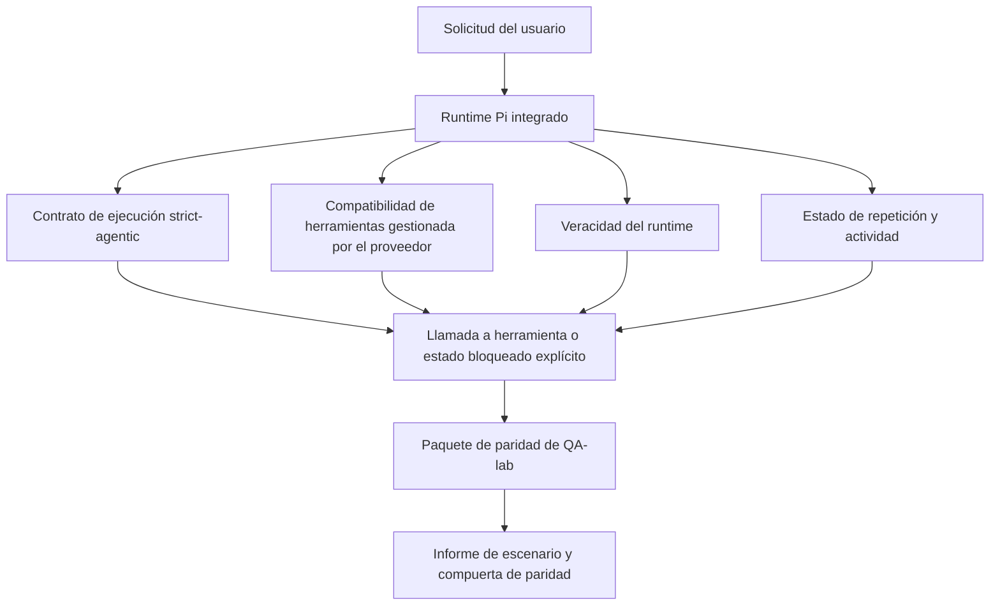
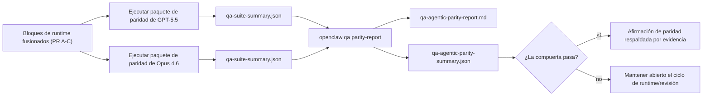

---
read_when:
    - Depuración del comportamiento agéntico de GPT-5.5 o Codex
    - Comparación del comportamiento agéntico de OpenClaw entre modelos de frontera
    - Revisión de las correcciones de strict-agentic, esquema de herramientas, elevación y repetición
summary: Cómo OpenClaw cierra las brechas de ejecución agéntica para GPT-5.5 y modelos de estilo Codex
title: Paridad agéntica de GPT-5.5 / Codex
x-i18n:
    generated_at: "2026-04-25T18:19:02Z"
    model: gpt-5.4
    provider: openai
    source_hash: 8a3b9375cd9e9d95855c4a1135953e00fd7a939e52fb7b75342da3bde2d83fe1
    source_path: help/gpt55-codex-agentic-parity.md
    workflow: 15
---

# Paridad agéntica de GPT-5.5 / Codex en OpenClaw

OpenClaw ya funcionaba bien con modelos de frontera que usan herramientas, pero GPT-5.5 y los modelos de estilo Codex seguían rindiendo por debajo de lo esperado en algunos aspectos prácticos:

- podían detenerse después de planificar en lugar de hacer el trabajo
- podían usar incorrectamente esquemas de herramientas estrictos de OpenAI/Codex
- podían pedir `/elevated full` incluso cuando el acceso completo era imposible
- podían perder el estado de tareas de larga duración durante la repetición o la Compaction
- las afirmaciones de paridad frente a Claude Opus 4.6 se basaban en anécdotas en lugar de escenarios repetibles

Este programa de paridad corrige esas brechas en cuatro bloques revisables.

## Qué cambió

### PR A: ejecución strict-agentic

Este bloque añade un contrato de ejecución `strict-agentic` opcional para ejecuciones Pi GPT-5 integradas.

Cuando está habilitado, OpenClaw deja de aceptar turnos de solo planificación como una finalización “suficientemente buena”. Si el modelo solo dice lo que pretende hacer y no usa herramientas ni avanza realmente, OpenClaw reintenta con una instrucción para actuar de inmediato y luego falla de forma cerrada con un estado bloqueado explícito en lugar de finalizar la tarea en silencio.

Esto mejora la experiencia con GPT-5.5 sobre todo en:

- seguimientos cortos de “ok hazlo”
- tareas de código donde el primer paso es evidente
- flujos en los que `update_plan` debería ser seguimiento del progreso y no texto de relleno

### PR B: veracidad del runtime

Este bloque hace que OpenClaw diga la verdad sobre dos cosas:

- por qué falló la llamada al proveedor/runtime
- si `/elevated full` está realmente disponible

Eso significa que GPT-5.5 recibe mejores señales del runtime para alcance faltante, errores de renovación de autenticación, errores de autenticación HTML 403, problemas de proxy, errores de DNS o timeout y modos de acceso completo bloqueados. Es menos probable que el modelo alucine una corrección equivocada o siga pidiendo un modo de permisos que el runtime no puede ofrecer.

### PR C: corrección de ejecución

Este bloque mejora dos tipos de corrección:

- compatibilidad del esquema de herramientas OpenAI/Codex gestionada por el proveedor
- visibilidad de repetición y actividad en tareas largas

El trabajo de compatibilidad de herramientas reduce la fricción de esquemas para el registro estricto de herramientas OpenAI/Codex, especialmente en torno a herramientas sin parámetros y expectativas estrictas de objeto raíz. El trabajo de repetición/actividad hace que las tareas de larga duración sean más observables, de modo que los estados pausado, bloqueado y abandonado sean visibles en lugar de perderse en texto genérico de error.

### PR D: harness de paridad

Este bloque añade el primer paquete de paridad de QA-lab para que GPT-5.5 y Opus 4.6 puedan ejecutarse en los mismos escenarios y compararse usando evidencia compartida.

El paquete de paridad es la capa de prueba. No cambia por sí mismo el comportamiento del runtime.

Después de tener dos artefactos `qa-suite-summary.json`, genera la comparación de compuerta de lanzamiento con:

```bash
pnpm openclaw qa parity-report \
  --repo-root . \
  --candidate-summary .artifacts/qa-e2e/gpt55/qa-suite-summary.json \
  --baseline-summary .artifacts/qa-e2e/opus46/qa-suite-summary.json \
  --output-dir .artifacts/qa-e2e/parity
```

Ese comando escribe:

- un informe Markdown legible por humanos
- un veredicto JSON legible por máquina
- un resultado de compuerta explícito `pass` / `fail`

## Por qué esto mejora GPT-5.5 en la práctica

Antes de este trabajo, GPT-5.5 en OpenClaw podía sentirse menos agéntico que Opus en sesiones reales de programación porque el runtime toleraba comportamientos especialmente perjudiciales para modelos de estilo GPT-5:

- turnos de solo comentarios
- fricción de esquema en torno a las herramientas
- comentarios vagos sobre permisos
- fallos silenciosos de repetición o Compaction

El objetivo no es hacer que GPT-5.5 imite a Opus. El objetivo es dar a GPT-5.5 un contrato de runtime que premie el progreso real, proporcione semánticas más limpias para herramientas y permisos, y convierta los modos de fallo en estados explícitos legibles por máquinas y humanos.

Eso cambia la experiencia de usuario de:

- “el modelo tenía un buen plan pero se detuvo”

a:

- “el modelo actuó, o OpenClaw mostró la razón exacta por la que no pudo hacerlo”

## Antes vs. después para usuarios de GPT-5.5

| Antes de este programa                                                                      | Después de PR A-D                                                                      |
| ------------------------------------------------------------------------------------------- | -------------------------------------------------------------------------------------- |
| GPT-5.5 podía detenerse tras un plan razonable sin dar el siguiente paso con herramientas  | PR A convierte “solo plan” en “actúa ahora o muestra un estado bloqueado”             |
| Los esquemas de herramientas estrictos podían rechazar herramientas sin parámetros o con forma OpenAI/Codex de manera confusa | PR C hace más predecibles el registro y la invocación de herramientas gestionados por el proveedor |
| La guía de `/elevated full` podía ser vaga o incorrecta en runtimes bloqueados             | PR B da a GPT-5.5 y al usuario señales veraces del runtime y de permisos              |
| Los fallos de repetición o Compaction podían sentirse como si la tarea hubiera desaparecido en silencio | PR C muestra explícitamente resultados pausados, bloqueados, abandonados e inválidos por repetición |
| “GPT-5.5 se siente peor que Opus” era en gran medida anecdótico                            | PR D lo convierte en el mismo paquete de escenarios, las mismas métricas y una compuerta estricta de pass/fail |

## Arquitectura



## Flujo de lanzamiento



## Paquete de escenarios

El primer paquete de paridad cubre actualmente cinco escenarios:

### `approval-turn-tool-followthrough`

Comprueba que el modelo no se detenga en “haré eso” después de una aprobación breve. Debería realizar la primera acción concreta en el mismo turno.

### `model-switch-tool-continuity`

Comprueba que el trabajo con herramientas siga siendo coherente al cruzar límites de cambio de modelo/runtime en lugar de reiniciarse en comentarios o perder el contexto de ejecución.

### `source-docs-discovery-report`

Comprueba que el modelo pueda leer el código fuente y la documentación, sintetizar hallazgos y continuar la tarea de forma agéntica en lugar de producir un resumen superficial y detenerse pronto.

### `image-understanding-attachment`

Comprueba que las tareas de modo mixto con adjuntos sigan siendo accionables y no colapsen en una narración vaga.

### `compaction-retry-mutating-tool`

Comprueba que una tarea con una escritura mutante real mantenga explícita la falta de seguridad de repetición en lugar de parecer silenciosamente segura para repetición si la ejecución hace compacts, reintenta o pierde el estado de respuesta bajo presión.

## Matriz de escenarios

| Escenario                          | Qué prueba                               | Buen comportamiento de GPT-5.5                                                  | Señal de fallo                                                                  |
| ---------------------------------- | ---------------------------------------- | -------------------------------------------------------------------------------- | -------------------------------------------------------------------------------- |
| `approval-turn-tool-followthrough` | Turnos breves de aprobación tras un plan | Inicia inmediatamente la primera acción concreta con herramientas en lugar de reformular la intención | seguimiento de solo plan, sin actividad de herramientas, o turno bloqueado sin un bloqueo real |
| `model-switch-tool-continuity`     | Cambio de runtime/modelo durante uso de herramientas | Conserva el contexto de la tarea y sigue actuando de forma coherente             | se reinicia en comentarios, pierde el contexto de herramientas o se detiene tras el cambio |
| `source-docs-discovery-report`     | Lectura de código fuente + síntesis + acción | Encuentra las fuentes, usa herramientas y produce un informe útil sin atascarse | resumen superficial, trabajo con herramientas ausente o detención con turno incompleto |
| `image-understanding-attachment`   | Trabajo agéntico impulsado por adjuntos  | Interpreta el adjunto, lo conecta con herramientas y continúa la tarea          | narración vaga, adjunto ignorado o ausencia de una siguiente acción concreta    |
| `compaction-retry-mutating-tool`   | Trabajo mutante bajo presión de Compaction | Realiza una escritura real y mantiene explícita la falta de seguridad de repetición tras el efecto secundario | la escritura mutante ocurre pero la seguridad de repetición se sugiere, falta o es contradictoria |

## Compuerta de lanzamiento

GPT-5.5 solo puede considerarse en paridad o mejor cuando el runtime fusionado supera el paquete de paridad y las regresiones de veracidad del runtime al mismo tiempo.

Resultados requeridos:

- ninguna detención de solo plan cuando la siguiente acción con herramientas es clara
- ninguna finalización falsa sin ejecución real
- ninguna guía incorrecta de `/elevated full`
- ningún abandono silencioso de repetición o Compaction
- métricas del paquete de paridad al menos tan sólidas como la línea base acordada de Opus 4.6

Para el primer harness, la compuerta compara:

- tasa de finalización
- tasa de detención no intencionada
- tasa de llamadas válidas a herramientas
- recuento de éxitos falsos

La evidencia de paridad está intencionalmente dividida en dos capas:

- PR D demuestra el comportamiento de GPT-5.5 frente a Opus 4.6 en los mismos escenarios con QA-lab
- los paquetes deterministas de PR B demuestran veracidad de autenticación, proxy, DNS y `/elevated full` fuera del harness

## Matriz de objetivo a evidencia

| Elemento de la compuerta de finalización                | PR responsable | Fuente de evidencia                                                | Señal de aprobación                                                                    |
| ------------------------------------------------------- | -------------- | ------------------------------------------------------------------ | -------------------------------------------------------------------------------------- |
| GPT-5.5 ya no se detiene después de planificar          | PR A           | `approval-turn-tool-followthrough` más paquetes de runtime de PR A | los turnos de aprobación desencadenan trabajo real o un estado bloqueado explícito    |
| GPT-5.5 ya no simula progreso ni finalización falsa de herramientas | PR A + PR D    | resultados de escenarios del informe de paridad y recuento de éxitos falsos | no hay resultados sospechosos de aprobación ni finalización de solo comentarios        |
| GPT-5.5 ya no ofrece una guía falsa de `/elevated full` | PR B           | paquetes deterministas de veracidad                                | las razones de bloqueo y las pistas de acceso completo siguen siendo precisas respecto al runtime |
| Los fallos de repetición/actividad siguen siendo explícitos | PR C + PR D    | paquetes de ciclo de vida/repetición de PR C más `compaction-retry-mutating-tool` | el trabajo mutante mantiene explícita la falta de seguridad de repetición en lugar de desaparecer en silencio |
| GPT-5.5 iguala o supera a Opus 4.6 en las métricas acordadas | PR D           | `qa-agentic-parity-report.md` y `qa-agentic-parity-summary.json`   | misma cobertura de escenarios y sin regresión en finalización, comportamiento de detención o uso válido de herramientas |

## Cómo leer el veredicto de paridad

Usa el veredicto en `qa-agentic-parity-summary.json` como la decisión final legible por máquina para el primer paquete de paridad.

- `pass` significa que GPT-5.5 cubrió los mismos escenarios que Opus 4.6 y no tuvo regresiones en las métricas agregadas acordadas.
- `fail` significa que se activó al menos una compuerta estricta: finalización más débil, peores detenciones no intencionadas, uso válido de herramientas más débil, cualquier caso de éxito falso o cobertura de escenarios no coincidente.
- “shared/base CI issue” no es por sí mismo un resultado de paridad. Si el ruido de CI fuera de PR D bloquea una ejecución, el veredicto debe esperar a una ejecución limpia del runtime fusionado en lugar de inferirse a partir de logs de la rama.
- La veracidad de autenticación, proxy, DNS y `/elevated full` sigue viniendo de los paquetes deterministas de PR B, así que la afirmación final de lanzamiento necesita ambas cosas: un veredicto de paridad aprobado de PR D y cobertura de veracidad de PR B en verde.

## Quién debería habilitar `strict-agentic`

Usa `strict-agentic` cuando:

- se espera que el agente actúe de inmediato cuando el siguiente paso es obvio
- GPT-5.5 o modelos de la familia Codex son el runtime principal
- prefieres estados bloqueados explícitos en lugar de respuestas “útiles” de solo recapitulación

Mantén el contrato predeterminado cuando:

- quieres el comportamiento actual más flexible
- no estás usando modelos de la familia GPT-5
- estás probando prompts en lugar del cumplimiento del runtime

## Relacionado

- [Notas del mantenedor sobre la paridad GPT-5.5 / Codex](/es/help/gpt55-codex-agentic-parity-maintainers)
