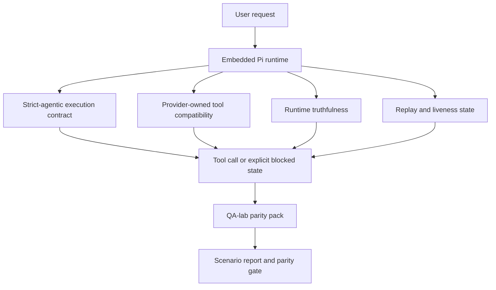
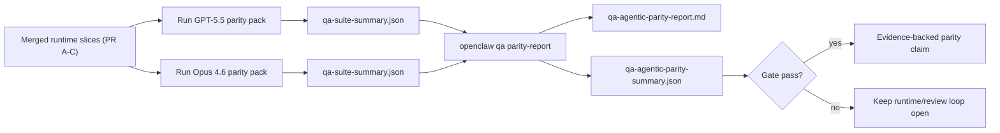

---
read_when:
    - Depuración del comportamiento de agentes GPT-5.5 o Codex
    - Comparación del comportamiento agéntico de OpenClaw en distintos modelos de frontera
    - Revisando las correcciones de modo agéntico estricto, esquema de herramientas, elevación y reproducción
summary: Cómo OpenClaw cierra las brechas de ejecución agéntica para GPT-5.5 y modelos al estilo Codex
title: Paridad agéntica de GPT-5.5 / Codex
x-i18n:
    generated_at: "2026-05-06T05:37:24Z"
    model: gpt-5.5
    provider: openai
    source_hash: bbc32f418dfffe2786093fa6b42b19f92a2d382c9408dfc55dd0154d67959390
    source_path: help/gpt55-codex-agentic-parity.md
    workflow: 16
---

OpenClaw ya funcionaba bien con modelos frontera que usan herramientas, pero GPT-5.5 y los modelos de estilo Codex todavía rendían por debajo de lo esperado en algunos aspectos prácticos:

- podían detenerse después de planificar en lugar de hacer el trabajo
- podían usar incorrectamente los esquemas de herramientas estrictos de OpenAI/Codex
- podían pedir `/elevated full` incluso cuando el acceso completo era imposible
- podían perder el estado de tareas de larga duración durante la reproducción o la Compaction
- las afirmaciones de paridad frente a Claude Opus 4.6 se basaban en anécdotas en lugar de escenarios repetibles

Este programa de paridad corrige esas brechas en cuatro partes revisables.

## Qué cambió

### PR A: ejecución agentic estricta

Esta parte agrega un contrato de ejecución `strict-agentic` opcional para ejecuciones GPT-5 de Pi integrado.

Cuando está habilitado, OpenClaw deja de aceptar turnos solo de planificación como una finalización "suficientemente buena". Si el modelo solo dice lo que pretende hacer y no usa realmente herramientas ni avanza, OpenClaw reintenta con una orientación para actuar ahora y luego falla cerrado con un estado bloqueado explícito en lugar de terminar la tarea silenciosamente.

Esto mejora más la experiencia de GPT-5.5 en:

- seguimientos breves de "ok, hazlo"
- tareas de código donde el primer paso es obvio
- flujos donde `update_plan` debería ser seguimiento de progreso en lugar de texto de relleno

### PR B: veracidad del runtime

Esta parte hace que OpenClaw diga la verdad sobre dos cosas:

- por qué falló la llamada al proveedor/runtime
- si `/elevated full` está realmente disponible

Eso significa que GPT-5.5 recibe mejores señales de runtime para faltas de alcance, errores de actualización de autenticación, errores de autenticación HTML 403, problemas de proxy, errores de DNS o de tiempo de espera, y modos de acceso completo bloqueados. Es menos probable que el modelo invente una remediación incorrecta o siga pidiendo un modo de permiso que el runtime no puede proporcionar.

### PR C: corrección de ejecución

Esta parte mejora dos tipos de corrección:

- compatibilidad de esquemas de herramientas OpenAI/Codex propiedad del proveedor
- visibilidad de reproducción y vitalidad en tareas largas

El trabajo de compatibilidad de herramientas reduce la fricción de esquemas para el registro estricto de herramientas OpenAI/Codex, especialmente en torno a herramientas sin parámetros y expectativas estrictas de raíz de objeto. El trabajo de reproducción/vitalidad hace que las tareas de larga duración sean más observables, para que los estados pausados, bloqueados y abandonados sean visibles en lugar de desaparecer en texto de fallo genérico.

### PR D: arnés de paridad

Esta parte agrega el paquete de paridad QA-lab de primera ola para que GPT-5.5 y Opus 4.6 puedan ejercitarse mediante los mismos escenarios y compararse usando evidencia compartida.

El paquete de paridad es la capa de prueba. No cambia por sí mismo el comportamiento del runtime.

Después de tener dos artefactos `qa-suite-summary.json`, genera la comparación de compuerta de lanzamiento con:

```bash
pnpm openclaw qa parity-report \
  --repo-root . \
  --candidate-summary .artifacts/qa-e2e/gpt55/qa-suite-summary.json \
  --baseline-summary .artifacts/qa-e2e/opus46/qa-suite-summary.json \
  --output-dir .artifacts/qa-e2e/parity
```

Ese comando escribe:

- un informe Markdown legible por humanos
- un veredicto JSON legible por máquina
- un resultado de compuerta explícito `pass` / `fail`

## Por qué esto mejora GPT-5.5 en la práctica

Antes de este trabajo, GPT-5.5 en OpenClaw podía sentirse menos agentic que Opus en sesiones reales de programación porque el runtime toleraba comportamientos que son especialmente perjudiciales para modelos de estilo GPT-5:

- turnos solo de comentario
- fricción de esquemas alrededor de herramientas
- retroalimentación vaga sobre permisos
- roturas silenciosas de reproducción o Compaction

El objetivo no es hacer que GPT-5.5 imite a Opus. El objetivo es darle a GPT-5.5 un contrato de runtime que premie el progreso real, suministre semánticas más limpias de herramientas y permisos, y convierta los modos de fallo en estados explícitos legibles por máquinas y humanos.

Eso cambia la experiencia de usuario de:

- "el modelo tenía un buen plan, pero se detuvo"

a:

- "el modelo actuó, o OpenClaw mostró la razón exacta por la que no pudo hacerlo"

## Antes y después para usuarios de GPT-5.5

| Antes de este programa                                                                          | Después de PR A-D                                                                        |
| ---------------------------------------------------------------------------------------------- | ---------------------------------------------------------------------------------------- |
| GPT-5.5 podía detenerse después de un plan razonable sin dar el siguiente paso con herramientas | PR A convierte "solo plan" en "actúa ahora o muestra un estado bloqueado"                |
| Los esquemas de herramientas estrictos podían rechazar herramientas sin parámetros o con forma OpenAI/Codex de maneras confusas | PR C hace más predecible el registro y la invocación de herramientas propiedad del proveedor |
| La orientación de `/elevated full` podía ser vaga o incorrecta en runtimes bloqueados           | PR B da a GPT-5.5 y al usuario pistas veraces de runtime y permisos                      |
| Los fallos de reproducción o Compaction podían parecer como si la tarea hubiera desaparecido silenciosamente | PR C muestra explícitamente resultados pausados, bloqueados, abandonados e inválidos para reproducción |
| "GPT-5.5 se siente peor que Opus" era mayormente anecdótico                                    | PR D convierte eso en el mismo paquete de escenarios, las mismas métricas y una compuerta estricta de aprobado/fallo |

## Arquitectura



## Flujo de lanzamiento



## Paquete de escenarios

El paquete de paridad de primera ola cubre actualmente cinco escenarios:

### `approval-turn-tool-followthrough`

Comprueba que el modelo no se detenga en "haré eso" después de una aprobación breve. Debería realizar la primera acción concreta en el mismo turno.

### `model-switch-tool-continuity`

Comprueba que el trabajo con herramientas siga siendo coherente a través de límites de cambio de modelo/runtime en lugar de reiniciarse en comentario o perder el contexto de ejecución.

### `source-docs-discovery-report`

Comprueba que el modelo pueda leer código fuente y documentación, sintetizar hallazgos y continuar la tarea de forma agentic en lugar de producir un resumen superficial y detenerse temprano.

### `image-understanding-attachment`

Comprueba que las tareas de modo mixto que involucran adjuntos sigan siendo accionables y no colapsen en una narración vaga.

### `compaction-retry-mutating-tool`

Comprueba que una tarea con una escritura mutante real mantenga explícita la falta de seguridad de reproducción en lugar de verse silenciosamente segura para reproducción si la ejecución se compacta, reintenta o pierde el estado de respuesta bajo presión.

## Matriz de escenarios

| Escenario                          | Qué prueba                               | Buen comportamiento de GPT-5.5                                                  | Señal de fallo                                                                 |
| ---------------------------------- | ---------------------------------------- | ------------------------------------------------------------------------------- | ------------------------------------------------------------------------------ |
| `approval-turn-tool-followthrough` | Turnos breves de aprobación después de un plan | Inicia inmediatamente la primera acción concreta de herramienta en lugar de repetir la intención | seguimiento solo de plan, sin actividad de herramientas, o turno bloqueado sin un bloqueador real |
| `model-switch-tool-continuity`     | Cambio de runtime/modelo durante uso de herramientas | Conserva el contexto de la tarea y continúa actuando de forma coherente         | vuelve a comentario, pierde contexto de herramientas o se detiene tras el cambio |
| `source-docs-discovery-report`     | Lectura de fuentes + síntesis + acción    | Encuentra fuentes, usa herramientas y produce un informe útil sin atascarse     | resumen superficial, falta de trabajo con herramientas o parada de turno incompleto |
| `image-understanding-attachment`   | Trabajo agentic impulsado por adjuntos    | Interpreta el adjunto, lo conecta con herramientas y continúa la tarea          | narración vaga, adjunto ignorado o ninguna siguiente acción concreta           |
| `compaction-retry-mutating-tool`   | Trabajo mutante bajo presión de Compaction | Realiza una escritura real y mantiene explícita la falta de seguridad de reproducción después del efecto secundario | ocurre una escritura mutante pero la seguridad de reproducción queda implícita, faltante o contradictoria |

## Compuerta de lanzamiento

GPT-5.5 solo puede considerarse en paridad o mejor cuando el runtime integrado pasa el paquete de paridad y las regresiones de veracidad del runtime al mismo tiempo.

Resultados requeridos:

- ningún atasco solo de plan cuando la siguiente acción de herramienta está clara
- ninguna finalización falsa sin ejecución real
- ninguna orientación incorrecta de `/elevated full`
- ningún abandono silencioso de reproducción o Compaction
- métricas del paquete de paridad que sean al menos tan sólidas como la línea base acordada de Opus 4.6

Para el arnés de primera ola, la compuerta compara:

- tasa de finalización
- tasa de detenciones no previstas
- tasa de llamadas válidas a herramientas
- conteo de éxitos falsos

La evidencia de paridad se divide intencionalmente en dos capas:

- PR D prueba el comportamiento de GPT-5.5 frente a Opus 4.6 en los mismos escenarios con QA-lab
- las suites deterministas de PR B prueban la veracidad de autenticación, proxy, DNS y `/elevated full` fuera del arnés

## Matriz de objetivo a evidencia

| Elemento de la compuerta de finalización                         | PR responsable | Fuente de evidencia                                                | Señal de aprobación                                                                      |
| ---------------------------------------------------------------- | -------------- | ------------------------------------------------------------------ | ---------------------------------------------------------------------------------------- |
| GPT-5.5 ya no se atasca después de planificar                    | PR A           | `approval-turn-tool-followthrough` más suites de runtime de PR A   | los turnos de aprobación disparan trabajo real o un estado bloqueado explícito           |
| GPT-5.5 ya no simula progreso ni finalización falsa de herramientas | PR A + PR D    | resultados de escenarios del informe de paridad y conteo de éxitos falsos | sin resultados de aprobación sospechosos y sin finalización solo de comentario           |
| GPT-5.5 ya no da orientación falsa de `/elevated full`           | PR B           | suites deterministas de veracidad                                  | las razones de bloqueo y las pistas de acceso completo se mantienen precisas al runtime  |
| Los fallos de reproducción/vitalidad permanecen explícitos       | PR C + PR D    | suites de ciclo de vida/reproducción de PR C más `compaction-retry-mutating-tool` | el trabajo mutante mantiene explícita la falta de seguridad de reproducción en lugar de desaparecer silenciosamente |
| GPT-5.5 iguala o supera a Opus 4.6 en las métricas acordadas     | PR D           | `qa-agentic-parity-report.md` y `qa-agentic-parity-summary.json`   | misma cobertura de escenarios y ninguna regresión en finalización, comportamiento de detención o uso válido de herramientas |

## Cómo leer el veredicto de paridad

Usa el veredicto en `qa-agentic-parity-summary.json` como la decisión final legible por máquina para el paquete de paridad de primera ola.

- `pass` significa que GPT-5.5 cubrió los mismos escenarios que Opus 4.6 y no tuvo regresiones en las métricas agregadas acordadas.
- `fail` significa que se activó al menos una puerta obligatoria: finalización más débil, más detenciones no previstas, uso válido de herramientas más débil, cualquier caso de éxito falso o cobertura de escenarios no coincidente.
- "problema compartido/base de CI" no es en sí mismo un resultado de paridad. Si ruido de CI fuera de PR D bloquea una ejecución, el veredicto debe esperar una ejecución limpia del entorno de ejecución fusionado en lugar de inferirse de registros de la época de la rama.
- La veracidad de autenticación, proxy, DNS y `/elevated full` sigue viniendo de las suites deterministas de PR B, así que la afirmación final de la versión necesita ambas cosas: un veredicto de paridad aprobado de PR D y cobertura de veracidad verde de PR B.

## Quién debe habilitar `strict-agentic`

Usa `strict-agentic` cuando:

- se espera que el agente actúe de inmediato cuando un siguiente paso sea obvio
- GPT-5.5 o modelos de la familia Codex son el entorno de ejecución principal
- prefieres estados bloqueados explícitos en lugar de respuestas "útiles" solo de recapitulación

Mantén el contrato predeterminado cuando:

- quieres el comportamiento más flexible existente
- no estás usando modelos de la familia GPT-5
- estás probando prompts en lugar de aplicación en el entorno de ejecución

## Relacionado

- [Notas para mantenedores sobre paridad GPT-5.5 / Codex](/es/help/gpt55-codex-agentic-parity-maintainers)
