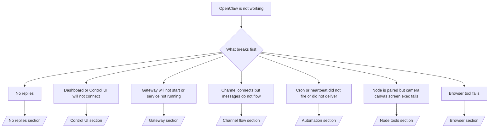

---
read_when:
    - OpenClaw no funciona y necesitas la vía más rápida para solucionarlo
    - Quieres un flujo de triaje antes de entrar en runbooks detallados
summary: Centro de solución de problemas de OpenClaw orientado a síntomas
title: Solución general de problemas
x-i18n:
    generated_at: "2026-04-24T05:33:13Z"
    model: gpt-5.4
    provider: openai
    source_hash: ce06ddce9de9e5824b4c5e8c182df07b29ce3ff113eb8e29c62aef9a4682e8e9
    source_path: help/troubleshooting.md
    workflow: 15
---

# Solución de problemas

Si solo tienes 2 minutos, usa esta página como punto de entrada de triaje.

## Primeros 60 segundos

Ejecuta esta secuencia exacta en este orden:

```bash
openclaw status
openclaw status --all
openclaw gateway probe
openclaw gateway status
openclaw doctor
openclaw channels status --probe
openclaw logs --follow
```

Buen resultado en una línea:

- `openclaw status` → muestra los canales configurados y ningún error evidente de autenticación.
- `openclaw status --all` → el informe completo está presente y se puede compartir.
- `openclaw gateway probe` → el objetivo esperado del gateway es accesible (`Reachable: yes`). `Capability: ...` indica qué nivel de autenticación pudo demostrar la sonda, y `Read probe: limited - missing scope: operator.read` significa diagnósticos degradados, no un fallo de conexión.
- `openclaw gateway status` → `Runtime: running`, `Connectivity probe: ok` y una línea plausible de `Capability: ...`. Usa `--require-rpc` si también necesitas prueba RPC con ámbito de lectura.
- `openclaw doctor` → no hay errores bloqueantes de configuración/servicio.
- `openclaw channels status --probe` → si el gateway es accesible, devuelve el estado activo del transporte por cuenta más resultados de sonda/auditoría como `works` o `audit ok`; si el gateway no es accesible, el comando recurre a resúmenes basados solo en configuración.
- `openclaw logs --follow` → actividad estable, sin errores fatales repetidos.

## Anthropic long context 429

Si ves:
`HTTP 429: rate_limit_error: Extra usage is required for long context requests`,
ve a [/gateway/troubleshooting#anthropic-429-extra-usage-required-for-long-context](/es/gateway/troubleshooting#anthropic-429-extra-usage-required-for-long-context).

## Un backend local compatible con OpenAI funciona directamente pero falla en OpenClaw

Si tu backend local o autohospedado `/v1` responde a pequeñas sondas directas de
`/v1/chat/completions` pero falla en `openclaw infer model run` o en turnos normales
del agente:

1. Si el error menciona que `messages[].content` espera una cadena, establece
   `models.providers.<provider>.models[].compat.requiresStringContent: true`.
2. Si el backend sigue fallando solo en turnos del agente de OpenClaw, establece
   `models.providers.<provider>.models[].compat.supportsTools: false` y vuelve a intentarlo.
3. Si las llamadas directas pequeñas siguen funcionando pero los prompts más grandes de OpenClaw bloquean el
   backend, trata el problema restante como una limitación del modelo/servidor de origen y
   continúa en el runbook detallado:
   [/gateway/troubleshooting#local-openai-compatible-backend-passes-direct-probes-but-agent-runs-fail](/es/gateway/troubleshooting#local-openai-compatible-backend-passes-direct-probes-but-agent-runs-fail)

## La instalación del Plugin falla con extensiones openclaw ausentes

Si la instalación falla con `package.json missing openclaw.extensions`, el paquete del Plugin
está usando una estructura antigua que OpenClaw ya no acepta.

Solución en el paquete del Plugin:

1. Añade `openclaw.extensions` a `package.json`.
2. Haz que las entradas apunten a archivos de runtime compilados (normalmente `./dist/index.js`).
3. Vuelve a publicar el Plugin y ejecuta `openclaw plugins install <package>` de nuevo.

Ejemplo:

```json
{
  "name": "@openclaw/my-plugin",
  "version": "1.2.3",
  "openclaw": {
    "extensions": ["./dist/index.js"]
  }
}
```

Referencia: [Arquitectura de Plugins](/es/plugins/architecture)

## Árbol de decisión



<AccordionGroup>
  <Accordion title="Sin respuestas">
    ```bash
    openclaw status
    openclaw gateway status
    openclaw channels status --probe
    openclaw pairing list --channel <channel> [--account <id>]
    openclaw logs --follow
    ```

    Un buen resultado es:

    - `Runtime: running`
    - `Connectivity probe: ok`
    - `Capability: read-only`, `write-capable` o `admin-capable`
    - Tu canal muestra el transporte conectado y, cuando es compatible, `works` o `audit ok` en `channels status --probe`
    - El remitente aparece aprobado (o la política de mensajes directos está abierta/en lista de permitidos)

    Firmas comunes en los registros:

    - `drop guild message (mention required` → el control por mención bloqueó el mensaje en Discord.
    - `pairing request` → el remitente no está aprobado y está esperando la aprobación de vinculación para mensajes directos.
    - `blocked` / `allowlist` en los registros del canal → el remitente, la sala o el grupo está filtrado.

    Páginas detalladas:

    - [/gateway/troubleshooting#no-replies](/es/gateway/troubleshooting#no-replies)
    - [/channels/troubleshooting](/es/channels/troubleshooting)
    - [/channels/pairing](/es/channels/pairing)

  </Accordion>

  <Accordion title="El dashboard o la UI de control no se conectan">
    ```bash
    openclaw status
    openclaw gateway status
    openclaw logs --follow
    openclaw doctor
    openclaw channels status --probe
    ```

    Un buen resultado es:

    - `Dashboard: http://...` aparece en `openclaw gateway status`
    - `Connectivity probe: ok`
    - `Capability: read-only`, `write-capable` o `admin-capable`
    - No hay bucle de autenticación en los registros

    Firmas comunes en los registros:

    - `device identity required` → un contexto HTTP/no seguro no puede completar la autenticación del dispositivo.
    - `origin not allowed` → el `Origin` del navegador no está permitido para el objetivo
      del gateway de la UI de control.
    - `AUTH_TOKEN_MISMATCH` con pistas de reintento (`canRetryWithDeviceToken=true`) → puede producirse automáticamente un reintento confiable con token de dispositivo.
    - Ese reintento con token en caché reutiliza el conjunto de ámbitos almacenado con el token
      del dispositivo vinculado. Los llamadores con `deviceToken` explícito / `scopes` explícitos mantienen
      su conjunto de ámbitos solicitado.
    - En la ruta asíncrona de Tailscale Serve Control UI, los intentos fallidos para el mismo
      `{scope, ip}` se serializan antes de que el limitador registre el fallo, por lo que un
      segundo reintento incorrecto concurrente ya puede mostrar `retry later`.
    - `too many failed authentication attempts (retry later)` desde un origen de navegador
      localhost → los fallos repetidos desde ese mismo `Origin` quedan bloqueados temporalmente;
      otro origen localhost usa un bucket distinto.
    - `unauthorized` repetido después de ese reintento → token/contraseña incorrectos, incompatibilidad de modo de autenticación o token obsoleto de dispositivo vinculado.
    - `gateway connect failed:` → la UI apunta a una URL/puerto incorrectos o a un gateway inaccesible.

    Páginas detalladas:

    - [/gateway/troubleshooting#dashboard-control-ui-connectivity](/es/gateway/troubleshooting#dashboard-control-ui-connectivity)
    - [/web/control-ui](/es/web/control-ui)
    - [/gateway/authentication](/es/gateway/authentication)

  </Accordion>

  <Accordion title="El Gateway no arranca o el servicio está instalado pero no se ejecuta">
    ```bash
    openclaw status
    openclaw gateway status
    openclaw logs --follow
    openclaw doctor
    openclaw channels status --probe
    ```

    Un buen resultado es:

    - `Service: ... (loaded)`
    - `Runtime: running`
    - `Connectivity probe: ok`
    - `Capability: read-only`, `write-capable` o `admin-capable`

    Firmas comunes en los registros:

    - `Gateway start blocked: set gateway.mode=local` o `existing config is missing gateway.mode` → el modo gateway es remoto, o el archivo de configuración carece del sello de modo local y debe repararse.
    - `refusing to bind gateway ... without auth` → bind no loopback sin una ruta válida de autenticación del gateway (token/contraseña, o trusted-proxy cuando esté configurado).
    - `another gateway instance is already listening` o `EADDRINUSE` → el puerto ya está ocupado.

    Páginas detalladas:

    - [/gateway/troubleshooting#gateway-service-not-running](/es/gateway/troubleshooting#gateway-service-not-running)
    - [/gateway/background-process](/es/gateway/background-process)
    - [/gateway/configuration](/es/gateway/configuration)

  </Accordion>

  <Accordion title="El canal se conecta pero los mensajes no fluyen">
    ```bash
    openclaw status
    openclaw gateway status
    openclaw logs --follow
    openclaw doctor
    openclaw channels status --probe
    ```

    Un buen resultado es:

    - El transporte del canal está conectado.
    - Las comprobaciones de vinculación/lista de permitidos se superan.
    - Las menciones se detectan donde son necesarias.

    Firmas comunes en los registros:

    - `mention required` → el control por mención en grupo bloqueó el procesamiento.
    - `pairing` / `pending` → el remitente del mensaje directo todavía no está aprobado.
    - `not_in_channel`, `missing_scope`, `Forbidden`, `401/403` → problema de permisos o token del canal.

    Páginas detalladas:

    - [/gateway/troubleshooting#channel-connected-messages-not-flowing](/es/gateway/troubleshooting#channel-connected-messages-not-flowing)
    - [/channels/troubleshooting](/es/channels/troubleshooting)

  </Accordion>

  <Accordion title="Cron o Heartbeat no se ejecutó o no entregó nada">
    ```bash
    openclaw status
    openclaw gateway status
    openclaw cron status
    openclaw cron list
    openclaw cron runs --id <jobId> --limit 20
    openclaw logs --follow
    ```

    Un buen resultado es:

    - `cron.status` muestra que está habilitado con una siguiente activación.
    - `cron runs` muestra entradas recientes `ok`.
    - Heartbeat está habilitado y no está fuera del horario activo.

    Firmas comunes en los registros:

    - `cron: scheduler disabled; jobs will not run automatically` → Cron está deshabilitado.
    - `heartbeat skipped` con `reason=quiet-hours` → fuera de las horas activas configuradas.
    - `heartbeat skipped` con `reason=empty-heartbeat-file` → `HEARTBEAT.md` existe pero solo contiene andamiaje en blanco o solo encabezados.
    - `heartbeat skipped` con `reason=no-tasks-due` → el modo de tareas de `HEARTBEAT.md` está activo, pero ninguno de los intervalos de tareas vence todavía.
    - `heartbeat skipped` con `reason=alerts-disabled` → toda la visibilidad de Heartbeat está deshabilitada (`showOk`, `showAlerts` y `useIndicator` están todos desactivados).
    - `requests-in-flight` → el carril principal está ocupado; la activación de Heartbeat fue aplazada.
    - `unknown accountId` → la cuenta de destino de entrega de Heartbeat no existe.

    Páginas detalladas:

    - [/gateway/troubleshooting#cron-and-heartbeat-delivery](/es/gateway/troubleshooting#cron-and-heartbeat-delivery)
    - [/automation/cron-jobs#troubleshooting](/es/automation/cron-jobs#troubleshooting)
    - [/gateway/heartbeat](/es/gateway/heartbeat)

  </Accordion>

  <Accordion title="El nodo está vinculado pero falla la herramienta de cámara, canvas, pantalla o exec">
    ```bash
    openclaw status
    openclaw gateway status
    openclaw nodes status
    openclaw nodes describe --node <idOrNameOrIp>
    openclaw logs --follow
    ```

    Un buen resultado es:

    - El nodo figura como conectado y vinculado para el rol `node`.
    - Existe la capacidad para el comando que estás invocando.
    - El estado del permiso está concedido para la herramienta.

    Firmas comunes en los registros:

    - `NODE_BACKGROUND_UNAVAILABLE` → lleva la app del nodo a primer plano.
    - `*_PERMISSION_REQUIRED` → falta un permiso del sistema operativo o fue denegado.
    - `SYSTEM_RUN_DENIED: approval required` → la aprobación de exec está pendiente.
    - `SYSTEM_RUN_DENIED: allowlist miss` → el comando no está en la lista de permitidos de exec.

    Páginas detalladas:

    - [/gateway/troubleshooting#node-paired-tool-fails](/es/gateway/troubleshooting#node-paired-tool-fails)
    - [/nodes/troubleshooting](/es/nodes/troubleshooting)
    - [/tools/exec-approvals](/es/tools/exec-approvals)

  </Accordion>

  <Accordion title="Exec de repente pide aprobación">
    ```bash
    openclaw config get tools.exec.host
    openclaw config get tools.exec.security
    openclaw config get tools.exec.ask
    openclaw gateway restart
    ```

    Qué cambió:

    - Si `tools.exec.host` no está establecido, el valor predeterminado es `auto`.
    - `host=auto` se resuelve como `sandbox` cuando hay un runtime de sandbox activo, y como `gateway` en caso contrario.
    - `host=auto` afecta solo al enrutamiento; el comportamiento YOLO sin solicitudes proviene de `security=full` más `ask=off` en gateway/node.
    - En `gateway` y `node`, si `tools.exec.security` no está establecido, el valor predeterminado es `full`.
    - Si `tools.exec.ask` no está establecido, el valor predeterminado es `off`.
    - Resultado: si estás viendo aprobaciones, alguna política local del host o por sesión ha endurecido exec con respecto a los valores predeterminados actuales.

    Restaurar el comportamiento actual predeterminado sin aprobación:

    ```bash
    openclaw config set tools.exec.host gateway
    openclaw config set tools.exec.security full
    openclaw config set tools.exec.ask off
    openclaw gateway restart
    ```

    Alternativas más seguras:

    - Establece solo `tools.exec.host=gateway` si solo quieres un enrutamiento estable del host.
    - Usa `security=allowlist` con `ask=on-miss` si quieres exec en el host pero también quieres revisión cuando falle la lista de permitidos.
    - Habilita el modo sandbox si quieres que `host=auto` vuelva a resolverse como `sandbox`.

    Firmas comunes en los registros:

    - `Approval required.` → el comando está esperando a `/approve ...`.
    - `SYSTEM_RUN_DENIED: approval required` → la aprobación de exec del host del nodo está pendiente.
    - `exec host=sandbox requires a sandbox runtime for this session` → selección implícita/explícita de sandbox, pero el modo sandbox está desactivado.

    Páginas detalladas:

    - [/tools/exec](/es/tools/exec)
    - [/tools/exec-approvals](/es/tools/exec-approvals)
    - [/gateway/security#what-the-audit-checks-high-level](/es/gateway/security#what-the-audit-checks-high-level)

  </Accordion>

  <Accordion title="Falla la herramienta de navegador">
    ```bash
    openclaw status
    openclaw gateway status
    openclaw browser status
    openclaw logs --follow
    openclaw doctor
    ```

    Un buen resultado es:

    - El estado del navegador muestra `running: true` y un navegador/perfil seleccionado.
    - `openclaw` se inicia, o `user` puede ver pestañas locales de Chrome.

    Firmas comunes en los registros:

    - `unknown command "browser"` o `unknown command 'browser'` → `plugins.allow` está establecido y no incluye `browser`.
    - `Failed to start Chrome CDP on port` → falló el inicio del navegador local.
    - `browser.executablePath not found` → la ruta configurada del binario es incorrecta.
    - `browser.cdpUrl must be http(s) or ws(s)` → la URL CDP configurada usa un esquema no compatible.
    - `browser.cdpUrl has invalid port` → la URL CDP configurada tiene un puerto incorrecto o fuera de rango.
    - `No Chrome tabs found for profile="user"` → el perfil de conexión Chrome MCP no tiene pestañas locales de Chrome abiertas.
    - `Remote CDP for profile "<name>" is not reachable` → el endpoint CDP remoto configurado no es accesible desde este host.
    - `Browser attachOnly is enabled ... not reachable` o `Browser attachOnly is enabled and CDP websocket ... is not reachable` → el perfil attach-only no tiene un objetivo CDP activo.
    - anulaciones obsoletas de viewport / modo oscuro / idioma / offline en perfiles attach-only o CDP remotos → ejecuta `openclaw browser stop --browser-profile <name>` para cerrar la sesión de control activa y liberar el estado de emulación sin reiniciar el gateway.

    Páginas detalladas:

    - [/gateway/troubleshooting#browser-tool-fails](/es/gateway/troubleshooting#browser-tool-fails)
    - [/tools/browser#missing-browser-command-or-tool](/es/tools/browser#missing-browser-command-or-tool)
    - [/tools/browser-linux-troubleshooting](/es/tools/browser-linux-troubleshooting)
    - [/tools/browser-wsl2-windows-remote-cdp-troubleshooting](/es/tools/browser-wsl2-windows-remote-cdp-troubleshooting)

  </Accordion>

</AccordionGroup>

## Relacionado

- [Preguntas frecuentes](/es/help/faq) — preguntas frecuentes
- [Solución de problemas del Gateway](/es/gateway/troubleshooting) — problemas específicos del gateway
- [Doctor](/es/gateway/doctor) — comprobaciones automáticas de estado y reparaciones
- [Solución de problemas de canales](/es/channels/troubleshooting) — problemas de conectividad de canales
- [Solución de problemas de automatización](/es/automation/cron-jobs#troubleshooting) — problemas de Cron y Heartbeat
