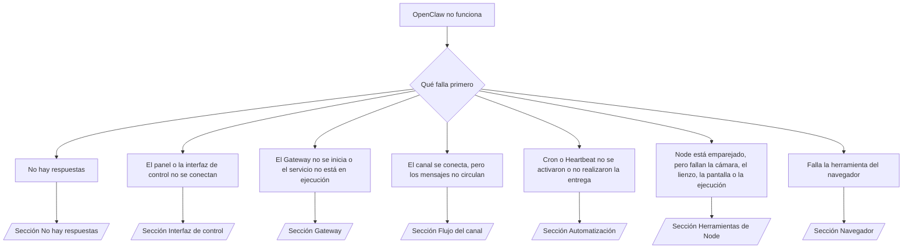

---
read_when:
    - OpenClaw no funciona y necesitas la forma más rápida de solucionarlo
    - Quieres un flujo de triaje antes de adentrarte en manuales operativos detallados
summary: Centro de solución de problemas de OpenClaw basado en los síntomas
title: Solución general de problemas
x-i18n:
    generated_at: "2026-07-11T23:11:38Z"
    model: gpt-5.6
    postprocess_version: locale-links-v1
    provider: openai
    source_hash: db50e0cdf4d11f3aa6196be445358d904a2b9c40c89243f1b124c77167f6dd85
    source_path: help/troubleshooting.md
    workflow: 16
---

Puerta de entrada para el triaje. 2 minutos para obtener un diagnóstico y, después, ve directamente a la página detallada.

## Primeros 60 segundos

Ejecuta esta secuencia en orden:

```bash
openclaw status
openclaw status --all
openclaw gateway probe
openclaw gateway status
openclaw doctor
openclaw channels status --probe
openclaw logs --follow
```

Una salida correcta, una línea para cada comando:

- `openclaw status` muestra los canales configurados, sin errores de autenticación.
- `openclaw status --all` genera un informe completo que se puede compartir.
- `openclaw gateway probe` muestra `Reachable: yes`. `Capability: ...` es el
  nivel de autenticación que verificó la prueba; `Read probe: limited - missing scope:
operator.read` indica un diagnóstico degradado, no un fallo de conexión.
- `openclaw gateway status` muestra `Runtime: running`, `Connectivity probe:
ok` y un valor plausible de `Capability: ...`. Añade `--require-rpc` para exigir también
  una prueba RPC con ámbito de lectura.
- `openclaw doctor` no informa de errores de configuración o servicio que impidan el funcionamiento.
- `openclaw channels status --probe` devuelve el estado en tiempo real del transporte de cada cuenta
  (`works` / `audit ok`) cuando el Gateway es accesible; si no lo es, recurre a
  resúmenes basados únicamente en la configuración.
- `openclaw logs --follow` muestra actividad estable, sin errores fatales recurrentes.

## El asistente parece limitado o no dispone de herramientas

Comprueba el perfil de herramientas efectivo:

```bash
openclaw status
openclaw status --all
openclaw doctor
```

Causas habituales:

- `tools.profile: "minimal"` solo permite `session_status`.
- `tools.profile: "messaging"` es limitado y está destinado a agentes que solo usan chat.
- `tools.profile: "coding"` es el valor predeterminado de las nuevas configuraciones locales (trabajo con repositorios, archivos,
  shell y entorno de ejecución).
- `tools.profile: "full"` elimina las restricciones del perfil; limítalo a agentes de confianza
  controlados por el operador.
- `agents.list[].tools` de cada agente restringe o amplía el perfil raíz
  para ese agente.

Cambia el perfil, reinicia o recarga el Gateway y vuelve a comprobarlo con
`openclaw status --all`. Tabla completa de perfiles y grupos: [Perfiles de herramientas](/es/gateway/config-tools#tool-profiles).

## Error 429 de contexto largo de Anthropic

`HTTP 429: rate_limit_error: Extra usage is required for long context requests`
→ [Anthropic exige uso adicional para el contexto largo debido a un error 429](/es/gateway/troubleshooting#anthropic-429-extra-usage-required-for-long-context).

## El backend local compatible con OpenAI funciona directamente, pero falla en OpenClaw

Tu backend `/v1` local o autoalojado responde a las pruebas directas de `/v1/chat/completions`,
pero falla al ejecutar `openclaw infer model run` o durante los turnos normales del agente:

1. Si el error indica que `messages[].content` espera una cadena, establece
   `models.providers.<provider>.models[].compat.requiresStringContent: true`.
2. Si sigue fallando únicamente durante los turnos del agente de OpenClaw, establece
   `models.providers.<provider>.models[].compat.supportsTools: false` y vuelve a intentarlo.
3. Si las llamadas directas pequeñas funcionan, pero los prompts más grandes de OpenClaw bloquean el backend,
   se trata de una limitación del modelo o servidor de origen, no de un error de OpenClaw. Continúa en
   [El backend local compatible con OpenAI supera las pruebas directas, pero las ejecuciones del agente fallan](/es/gateway/troubleshooting#local-openai-compatible-backend-passes-direct-probes-but-agent-runs-fail).

## La instalación del Plugin falla porque faltan las extensiones de OpenClaw

`package.json missing openclaw.extensions` significa que el paquete del Plugin usa una
estructura que OpenClaw ya no acepta.

Corrígelo en el paquete del Plugin:

1. Añade `openclaw.extensions` a `package.json` y haz que apunte a los archivos compilados
   del entorno de ejecución (normalmente `./dist/index.js`).
2. Vuelve a publicar el paquete y ejecuta de nuevo `openclaw plugins install <package>`.

```json
{
  "name": "@openclaw/my-plugin",
  "version": "1.2.3",
  "openclaw": {
    "extensions": ["./dist/index.js"]
  }
}
```

Referencia: [Arquitectura de Plugins](/es/plugins/architecture)

## La política de instalación bloquea las instalaciones o actualizaciones de Plugins

La actualización termina, pero los Plugins están obsoletos, deshabilitados o muestran `blocked by install
policy`, `install policy failed closed` o `Disabled "<plugin>" after plugin
update failure`: comprueba `security.installPolicy`.

La política de instalación se ejecuta durante las instalaciones y actualizaciones de Plugins. Las versiones de los Plugins
`@openclaw/*` normalmente avanzan junto con la versión de OpenClaw, por lo que una actualización de OpenClaw puede
requerir una actualización correspondiente de los Plugins durante la sincronización posterior.

Evita estas formas de política, salvo que también mantengas la regla de actualización correspondiente:

- Fijar los Plugins propiedad de OpenClaw en una única versión antigua exacta (por ejemplo, solo
  `@openclaw/*@2026.5.3`).
- Bloquear únicamente por el tipo de origen (todas las solicitudes npm, de red o con `request.mode:
"update"`).
- Tratar el comando de la política como opcional: cuando `security.installPolicy` está
  habilitada, si el ejecutable de la política no existe, es lento, no se puede leer o está bloqueado por permisos,
  se produce un fallo cerrado.
- Aprobar versiones sin comparar el valor `openclawVersion` de la solicitud con
  los metadatos del Plugin candidato.

Da preferencia a reglas que permitan actualizaciones de confianza de `@openclaw/*` compatibles con el
host actual, en lugar de fijar una versión para siempre. Si bloqueas npm de forma
predeterminada, añade una excepción específica para los identificadores de Plugin que utilizas y aplica la misma
regla de confianza a `request.mode: "update"` que a las instalaciones.

Recuperación:

```bash
openclaw doctor --deep
openclaw plugins update --all
openclaw status --all
```

Si la política es estricta intencionadamente, relájala durante el periodo de actualización
de confianza, vuelve a ejecutar `openclaw plugins update --all` y, después, restaura la regla más estricta.
Si el fallo de actualización deshabilitó un Plugin, inspecciónalo antes de volver a habilitarlo:

```bash
openclaw plugins inspect <plugin-id> --runtime --json
openclaw plugins enable <plugin-id>
```

Referencia: [Política de instalación del operador](/es/tools/skills-config#operator-install-policy-securityinstallpolicy)

## El Plugin está presente, pero se bloquea por una propiedad sospechosa

`openclaw doctor`, la configuración o las advertencias de inicio muestran:

```text
blocked plugin candidate: suspicious ownership (... uid=1000, expected uid=0 or root)
plugin present but blocked
```

Los archivos del Plugin pertenecen a un usuario de Unix distinto del proceso que los carga.
No elimines la configuración del Plugin; corrige la propiedad de los archivos o ejecuta
OpenClaw como el usuario propietario del directorio de estado.

Las instalaciones de Docker se ejecutan como `node` (uid `1000`). Repara los montajes enlazados del host:

```bash
sudo chown -R 1000:1000 /path/to/openclaw-config /path/to/openclaw-workspace
openclaw doctor --fix
```

Si ejecutas OpenClaw como root intencionadamente, repara en su lugar la raíz administrada del Plugin:

```bash
sudo chown -R root:root /path/to/openclaw-config/npm
openclaw doctor --fix
```

Documentación detallada: [Propiedad bloqueada de la ruta del Plugin](/es/tools/plugin#blocked-plugin-path-ownership), [Docker: permisos y EACCES](/es/install/docker#shell-helpers-optional)

## Árbol de decisiones



<AccordionGroup>
  <Accordion title="Sin respuestas">
    ```bash
    openclaw status
    openclaw gateway status
    openclaw channels status --probe
    openclaw pairing list --channel <channel> [--account <id>]
    openclaw logs --follow
    ```

    Salida correcta:

    - `Runtime: running`
    - `Connectivity probe: ok`
    - `Capability: read-only`, `write-capable` o `admin-capable`
    - El canal muestra que el transporte está conectado y, cuando es compatible, `works` o
      `audit ok` en `channels status --probe`
    - El remitente está aprobado (o la política de mensajes directos está abierta o usa una lista de permitidos)

    Patrones de registro:

    - `drop guild message (mention required` → el requisito de mención de Discord bloqueó el mensaje.
    - `pairing request` → remitente no aprobado, a la espera de la aprobación del emparejamiento por mensaje directo.
    - `blocked` / `allowlist` en los registros del canal → se filtró el remitente, la sala o el grupo.

    Páginas detalladas: [Sin respuestas](/es/gateway/troubleshooting#no-replies), [Solución de problemas de canales](/es/channels/troubleshooting), [Emparejamiento](/es/channels/pairing)

  </Accordion>

  <Accordion title="El panel o la interfaz de control no se conectan">
    ```bash
    openclaw status
    openclaw gateway status
    openclaw logs --follow
    openclaw doctor
    openclaw channels status --probe
    ```

    Salida correcta:

    - `Dashboard: http://...` aparece en `openclaw gateway status`
    - `Connectivity probe: ok`
    - `Capability: read-only`, `write-capable` o `admin-capable`
    - No hay ningún bucle de autenticación en los registros

    Patrones de registro:

    - `device identity required` → el contexto HTTP/no seguro no puede completar la autenticación del dispositivo.
    - `origin not allowed` → el `Origin` del navegador no está permitido para el destino del Gateway de la interfaz de control.
    - `AUTH_TOKEN_MISMATCH` con `canRetryWithDeviceToken=true` → puede realizarse automáticamente un reintento con el token de un dispositivo de confianza, reutilizando los ámbitos almacenados en caché del token emparejado.
    - `unauthorized` repetido después de ese reintento → token o contraseña incorrectos, modo de autenticación incompatible o token de dispositivo emparejado obsoleto.
    - `too many failed authentication attempts (retry later)` → los fallos repetidos procedentes de ese `Origin` del navegador se bloquean temporalmente; otros orígenes de localhost usan grupos independientes. Consulta [Conectividad del panel y la interfaz de control](/es/gateway/troubleshooting#dashboard-control-ui-connectivity) para conocer el matiz de los reintentos simultáneos de Tailscale Serve.
    - `gateway connect failed:` → la interfaz apunta a una URL o puerto incorrectos, o no se puede acceder al Gateway.

    Páginas detalladas: [Conectividad del panel y la interfaz de control](/es/gateway/troubleshooting#dashboard-control-ui-connectivity), [Interfaz de control](/es/web/control-ui), [Autenticación](/es/gateway/authentication)

  </Accordion>

  <Accordion title="El Gateway no se inicia o el servicio está instalado, pero no está en ejecución">
    ```bash
    openclaw status
    openclaw gateway status
    openclaw logs --follow
    openclaw doctor
    openclaw channels status --probe
    ```

    Salida correcta:

    - `Service: ... (loaded)`
    - `Runtime: running`
    - `Connectivity probe: ok`
    - `Capability: read-only`, `write-capable` o `admin-capable`

    Patrones de registro:

    - `Gateway start blocked: set gateway.mode=local` o `existing config is missing gateway.mode` → el modo del Gateway es remoto o a la configuración le falta la marca del modo local y necesita reparación.
    - `refusing to bind gateway ... without auth` → enlace a una interfaz distinta de local loopback sin una vía de autenticación válida (token/contraseña o proxy de confianza, si está configurado).
    - `another gateway instance is already listening` o `EADDRINUSE` → el puerto ya está ocupado.

    Páginas detalladas: [El servicio Gateway no está en ejecución](/es/gateway/troubleshooting#gateway-service-not-running), [Proceso en segundo plano](/es/gateway/background-process), [Configuración](/es/gateway/configuration)

  </Accordion>

  <Accordion title="El canal se conecta, pero los mensajes no circulan">
    ```bash
    openclaw status
    openclaw gateway status
    openclaw logs --follow
    openclaw doctor
    openclaw channels status --probe
    ```

    Salida correcta:

    - El transporte del canal está conectado.
    - Las comprobaciones de emparejamiento o lista de permitidos se superan.
    - Las menciones se detectan cuando son obligatorias.

    Patrones de registro:

    - `mention required` → el requisito de mención del grupo bloqueó el procesamiento.
    - `pairing` / `pending` → el remitente del mensaje directo todavía no está aprobado.
    - `not_in_channel`, `missing_scope`, `Forbidden`, `401/403` → problema con los permisos o el token del canal.

    Páginas detalladas: [Canal conectado, pero los mensajes no circulan](/es/gateway/troubleshooting#channel-connected-messages-not-flowing), [Solución de problemas de canales](/es/channels/troubleshooting)

  </Accordion>

  <Accordion title="Cron o Heartbeat no se activaron o no realizaron la entrega">
    ```bash
    openclaw status
    openclaw gateway status
    openclaw cron status
    openclaw cron list
    openclaw cron runs --id <jobId> --limit 20
    openclaw logs --follow
    ```

    Salida correcta:

    - `cron status` muestra el planificador habilitado con una próxima activación.
    - `cron runs` muestra entradas `ok` recientes.
    - Heartbeat está habilitado y se encuentra dentro del horario activo.

    Patrones de registro:

    - `cron: scheduler disabled; jobs will not run automatically` → Cron está deshabilitado.
    - `heartbeat skipped` con motivo `quiet-hours` → fuera del horario activo configurado.
    - `heartbeat skipped` con motivo `empty-heartbeat-file` → `HEARTBEAT.md` existe, pero solo contiene líneas en blanco, comentarios, encabezados, delimitadores de bloques de código o una estructura de lista de comprobación vacía.
    - `heartbeat skipped` con motivo `no-tasks-due` → el modo de tareas está activo, pero aún no corresponde ejecutar ningún intervalo de tarea.
    - `heartbeat skipped` con motivo `alerts-disabled` → `showOk`, `showAlerts` y `useIndicator` están desactivados.
    - `requests-in-flight` → la vía principal está ocupada; la activación de Heartbeat se aplaza.
    - `unknown accountId` → la cuenta de destino para la entrega de Heartbeat no existe.

    Páginas detalladas: [Entrega de Cron y Heartbeat](/es/gateway/troubleshooting#cron-and-heartbeat-delivery), [Tareas programadas: Solución de problemas](/es/automation/cron-jobs#troubleshooting), [Heartbeat](/es/gateway/heartbeat)

  </Accordion>

  <Accordion title="El Node está emparejado, pero la herramienta de cámara, lienzo, pantalla o ejecución falla">
    ```bash
    openclaw status
    openclaw gateway status
    openclaw nodes status
    openclaw nodes describe --node <idOrNameOrIp>
    openclaw logs --follow
    ```

    Resultado correcto:

    - El Node aparece como conectado y emparejado con el rol `node`.
    - Existe la capacidad correspondiente al comando que está invocando.
    - El estado del permiso de la herramienta figura como concedido.

    Firmas de registro:

    - `NODE_BACKGROUND_UNAVAILABLE` → lleve la aplicación del Node a primer plano.
    - `*_PERMISSION_REQUIRED` → falta el permiso del sistema operativo o se ha denegado.
    - `SYSTEM_RUN_DENIED: approval required` → la aprobación de ejecución está pendiente.
    - `SYSTEM_RUN_DENIED: allowlist miss` → el comando no está en la lista de permitidos para la ejecución.

    Páginas detalladas: [Node emparejado, la herramienta falla](/es/gateway/troubleshooting#node-paired-tool-fails), [Solución de problemas de Node](/es/nodes/troubleshooting), [Aprobaciones de ejecución](/es/tools/exec-approvals)

  </Accordion>

  <Accordion title="La ejecución solicita aprobación de repente">
    ```bash
    openclaw config get tools.exec.host
    openclaw config get tools.exec.security
    openclaw config get tools.exec.ask
    openclaw gateway restart
    ```

    Qué ha cambiado:

    - Si `tools.exec.host` no está definido, su valor predeterminado es `auto`, que se resuelve como `sandbox`
      cuando hay un entorno de ejecución aislado activo y como `gateway` en caso contrario.
    - `host=auto` solo determina el enrutamiento; el comportamiento sin avisos proviene de
      `security=full` junto con `ask=off` en el Gateway o el Node.
    - Si `tools.exec.security` no está definido, su valor predeterminado es `full` en `gateway`/`node`.
    - Si `tools.exec.ask` no está definido, su valor predeterminado es `off`.
    - Si aparecen solicitudes de aprobación, alguna política local del host o específica de la sesión
      ha restringido la ejecución con respecto a estos valores predeterminados.

    Restaure los valores predeterminados actuales sin aprobación:

    ```bash
    openclaw config set tools.exec.host gateway
    openclaw config set tools.exec.security full
    openclaw config set tools.exec.ask off
    openclaw gateway restart
    ```

    Alternativas más seguras:

    - Configure únicamente `tools.exec.host=gateway` para obtener un enrutamiento estable al host.
    - Use `security=allowlist` con `ask=on-miss` para ejecutar en el host con revisión cuando
      el comando no esté en la lista de permitidos.
    - Habilite el modo aislado para que `host=auto` vuelva a resolverse como `sandbox`.

    Firmas de registro:

    - `Approval required.` → el comando está esperando `/approve ...`.
    - `SYSTEM_RUN_DENIED: approval required` → la aprobación de ejecución en el host del Node está pendiente.
    - `exec host=sandbox requires a sandbox runtime for this session` → se ha seleccionado el entorno aislado de forma implícita o explícita, pero el modo aislado está desactivado.

    Páginas detalladas: [Ejecución](/es/tools/exec), [Aprobaciones de ejecución](/es/tools/exec-approvals), [Seguridad: Qué comprueba la auditoría](/es/gateway/security#what-the-audit-checks-high-level)

  </Accordion>

  <Accordion title="La herramienta del navegador falla">
    ```bash
    openclaw status
    openclaw gateway status
    openclaw browser status
    openclaw logs --follow
    openclaw doctor
    ```

    Resultado correcto:

    - El estado del navegador muestra `running: true` y un navegador/perfil seleccionado.
    - El perfil `openclaw` se inicia, o el perfil `user` detecta las pestañas locales de Chrome.

    Firmas de registro:

    - `unknown command "browser"` → `plugins.allow` está configurado y excluye `browser`.
    - `Failed to start Chrome CDP on port` → no se pudo iniciar el navegador local.
    - `browser.executablePath not found` → la ruta configurada del ejecutable es incorrecta.
    - `browser.cdpUrl must be http(s) or ws(s)` → la URL de CDP configurada utiliza un esquema no compatible.
    - `browser.cdpUrl has invalid port` → la URL de CDP configurada tiene un puerto incorrecto o fuera del intervalo válido.
    - `No Chrome tabs found for profile="user"` → el perfil de conexión MCP de Chrome no tiene pestañas locales de Chrome abiertas.
    - `Remote CDP for profile "<name>" is not reachable` → no se puede acceder al punto de conexión CDP remoto configurado desde este host.
    - `Browser attachOnly is enabled ... not reachable` → el perfil de solo conexión no tiene ningún destino CDP activo.
    - Sustituciones obsoletas de área de visualización, modo oscuro, configuración regional o modo sin conexión en perfiles CDP remotos o de solo conexión → ejecute `openclaw browser stop --browser-profile <name>` para cerrar la sesión de control y liberar el estado de emulación sin reiniciar el Gateway.

    Páginas detalladas: [La herramienta del navegador falla](/es/gateway/troubleshooting#browser-tool-fails), [Falta el comando o la herramienta del navegador](/es/tools/browser#missing-browser-command-or-tool), [Navegador: Solución de problemas en Linux](/es/tools/browser-linux-troubleshooting), [Navegador: Solución de problemas de CDP remoto en WSL2/Windows](/es/tools/browser-wsl2-windows-remote-cdp-troubleshooting)

  </Accordion>

</AccordionGroup>

## Relacionado

- [Preguntas frecuentes](/es/help/faq) — preguntas frecuentes
- [Solución de problemas del Gateway](/es/gateway/troubleshooting) — problemas específicos del Gateway
- [Doctor](/es/gateway/doctor) — comprobaciones y reparaciones automáticas del estado
- [Solución de problemas de canales](/es/channels/troubleshooting) — problemas de conectividad de los canales
- [Tareas programadas: Solución de problemas](/es/automation/cron-jobs#troubleshooting) — problemas de Cron y Heartbeat
