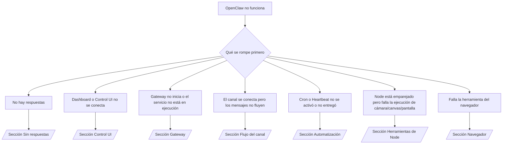

---
read_when:
    - OpenClaw no funciona y necesitas la ruta más rápida hacia una solución
    - Quieres un flujo de triaje antes de entrar en runbooks detallados
summary: Centro de solución de problemas de OpenClaw orientado por síntomas
title: Solución general de problemas
x-i18n:
    generated_at: "2026-04-24T08:58:28Z"
    model: gpt-5.4
    provider: openai
    source_hash: c832c3f7609c56a5461515ed0f693d2255310bf2d3958f69f57c482bcbef97f0
    source_path: help/troubleshooting.md
    workflow: 15
---

Si solo tienes 2 minutos, usa esta página como punto de entrada para el triaje.

## Primeros 60 segundos

Ejecuta esta secuencia exacta en orden:

```bash
openclaw status
openclaw status --all
openclaw gateway probe
openclaw gateway status
openclaw doctor
openclaw channels status --probe
openclaw logs --follow
```

Buen resultado en una línea:

- `openclaw status` → muestra los canales configurados y ningún error de autenticación evidente.
- `openclaw status --all` → el informe completo está presente y se puede compartir.
- `openclaw gateway probe` → el destino esperado de Gateway es accesible (`Reachable: yes`). `Capability: ...` indica qué nivel de autenticación pudo demostrar la sonda, y `Read probe: limited - missing scope: operator.read` son diagnósticos degradados, no un fallo de conexión.
- `openclaw gateway status` → `Runtime: running`, `Connectivity probe: ok` y una línea plausible de `Capability: ...`. Usa `--require-rpc` si también necesitas prueba de RPC con alcance de lectura.
- `openclaw doctor` → no hay errores bloqueantes de configuración/servicio.
- `openclaw channels status --probe` → si el gateway es accesible, devuelve el estado de transporte en vivo por cuenta más resultados de sonda/auditoría como `works` o `audit ok`; si el gateway no es accesible, el comando vuelve a resúmenes solo de configuración.
- `openclaw logs --follow` → actividad estable, sin errores fatales repetidos.

## 429 de Anthropic con contexto largo

Si ves:
`HTTP 429: rate_limit_error: Extra usage is required for long context requests`,
ve a [/gateway/troubleshooting#anthropic-429-extra-usage-required-for-long-context](/es/gateway/troubleshooting#anthropic-429-extra-usage-required-for-long-context).

## Un backend local compatible con OpenAI funciona directamente pero falla en OpenClaw

Si tu backend local o autoalojado de `/v1` responde a sondas directas pequeñas de
`/v1/chat/completions` pero falla en `openclaw infer model run` o en turnos
normales del agente:

1. Si el error menciona que `messages[].content` espera una cadena, configura
   `models.providers.<provider>.models[].compat.requiresStringContent: true`.
2. Si el backend sigue fallando solo en los turnos de agente de OpenClaw, configura
   `models.providers.<provider>.models[].compat.supportsTools: false` y reintenta.
3. Si las llamadas directas diminutas siguen funcionando pero los prompts más grandes de OpenClaw hacen fallar el
   backend, trata el problema restante como una limitación del modelo/servidor ascendente y
   continúa en el runbook detallado:
   [/gateway/troubleshooting#local-openai-compatible-backend-passes-direct-probes-but-agent-runs-fail](/es/gateway/troubleshooting#local-openai-compatible-backend-passes-direct-probes-but-agent-runs-fail)

## La instalación del Plugin falla con extensiones de openclaw ausentes

Si la instalación falla con `package.json missing openclaw.extensions`, el paquete del Plugin
está usando una forma antigua que OpenClaw ya no acepta.

Corrige el paquete del Plugin:

1. Agrega `openclaw.extensions` a `package.json`.
2. Haz que las entradas apunten a archivos de runtime compilados (normalmente `./dist/index.js`).
3. Vuelve a publicar el Plugin y ejecuta `openclaw plugins install <package>` otra vez.

Ejemplo:

```json
{
  "name": "@openclaw/my-plugin",
  "version": "1.2.3",
  "openclaw": {
    "extensions": ["./dist/index.js"]
  }
}
```

Referencia: [Arquitectura de Plugin](/es/plugins/architecture)

## Árbol de decisiones



<AccordionGroup>
  <Accordion title="Sin respuestas">
    ```bash
    openclaw status
    openclaw gateway status
    openclaw channels status --probe
    openclaw pairing list --channel <channel> [--account <id>]
    openclaw logs --follow
    ```

    Un buen resultado se ve así:

    - `Runtime: running`
    - `Connectivity probe: ok`
    - `Capability: read-only`, `write-capable` o `admin-capable`
    - Tu canal muestra el transporte conectado y, donde sea compatible, `works` o `audit ok` en `channels status --probe`
    - El remitente aparece como aprobado (o la política de MD está abierta/en lista permitida)

    Firmas comunes en los logs:

    - `drop guild message (mention required` → la compuerta de mención bloqueó el mensaje en Discord.
    - `pairing request` → el remitente no está aprobado y está esperando aprobación de emparejamiento por MD.
    - `blocked` / `allowlist` en los logs del canal → el remitente, la sala o el grupo está filtrado.

    Páginas detalladas:

    - [/gateway/troubleshooting#no-replies](/es/gateway/troubleshooting#no-replies)
    - [/channels/troubleshooting](/es/channels/troubleshooting)
    - [/channels/pairing](/es/channels/pairing)

  </Accordion>

  <Accordion title="Dashboard o Control UI no se conecta">
    ```bash
    openclaw status
    openclaw gateway status
    openclaw logs --follow
    openclaw doctor
    openclaw channels status --probe
    ```

    Un buen resultado se ve así:

    - `Dashboard: http://...` se muestra en `openclaw gateway status`
    - `Connectivity probe: ok`
    - `Capability: read-only`, `write-capable` o `admin-capable`
    - No hay bucle de autenticación en los logs

    Firmas comunes en los logs:

    - `device identity required` → el contexto HTTP/no seguro no puede completar la autenticación del dispositivo.
    - `origin not allowed` → el `Origin` del navegador no está permitido para el destino de Gateway de Control UI.
    - `AUTH_TOKEN_MISMATCH` con sugerencias de reintento (`canRetryWithDeviceToken=true`) → puede ocurrir automáticamente un reintento confiable con token de dispositivo.
    - Ese reintento con token en caché reutiliza el conjunto de alcances en caché almacenado con el token de dispositivo emparejado. Las llamadas con `deviceToken` explícito / `scopes` explícitos conservan en cambio el conjunto de alcances solicitado.
    - En la ruta asíncrona de Control UI de Tailscale Serve, los intentos fallidos para el mismo `{scope, ip}` se serializan antes de que el limitador registre el fallo, por lo que un segundo reintento incorrecto concurrente ya puede mostrar `retry later`.
    - `too many failed authentication attempts (retry later)` desde un origen de navegador localhost → los fallos repetidos desde ese mismo `Origin` quedan bloqueados temporalmente; otro origen localhost usa un bucket separado.
    - `unauthorized` repetido después de ese reintento → token/contraseña incorrectos, modo de autenticación no coincidente o token de dispositivo emparejado obsoleto.
    - `gateway connect failed:` → la interfaz apunta a la URL/puerto incorrectos o a un gateway inaccesible.

    Páginas detalladas:

    - [/gateway/troubleshooting#dashboard-control-ui-connectivity](/es/gateway/troubleshooting#dashboard-control-ui-connectivity)
    - [/web/control-ui](/es/web/control-ui)
    - [/gateway/authentication](/es/gateway/authentication)

  </Accordion>

  <Accordion title="Gateway no inicia o el servicio está instalado pero no se ejecuta">
    ```bash
    openclaw status
    openclaw gateway status
    openclaw logs --follow
    openclaw doctor
    openclaw channels status --probe
    ```

    Un buen resultado se ve así:

    - `Service: ... (loaded)`
    - `Runtime: running`
    - `Connectivity probe: ok`
    - `Capability: read-only`, `write-capable` o `admin-capable`

    Firmas comunes en los logs:

    - `Gateway start blocked: set gateway.mode=local` o `existing config is missing gateway.mode` → el modo del gateway es remoto, o al archivo de configuración le falta la marca de modo local y debe repararse.
    - `refusing to bind gateway ... without auth` → enlace fuera de loopback sin una ruta de autenticación válida de gateway (token/contraseña, o proxy confiable donde esté configurado).
    - `another gateway instance is already listening` o `EADDRINUSE` → el puerto ya está ocupado.

    Páginas detalladas:

    - [/gateway/troubleshooting#gateway-service-not-running](/es/gateway/troubleshooting#gateway-service-not-running)
    - [/gateway/background-process](/es/gateway/background-process)
    - [/gateway/configuration](/es/gateway/configuration)

  </Accordion>

  <Accordion title="El canal se conecta pero los mensajes no fluyen">
    ```bash
    openclaw status
    openclaw gateway status
    openclaw logs --follow
    openclaw doctor
    openclaw channels status --probe
    ```

    Un buen resultado se ve así:

    - El transporte del canal está conectado.
    - Las comprobaciones de emparejamiento/lista permitida se aprueban.
    - Las menciones se detectan donde son obligatorias.

    Firmas comunes en los logs:

    - `mention required` → la compuerta de mención de grupo bloqueó el procesamiento.
    - `pairing` / `pending` → el remitente de MD aún no está aprobado.
    - `not_in_channel`, `missing_scope`, `Forbidden`, `401/403` → problema de token de permisos del canal.

    Páginas detalladas:

    - [/gateway/troubleshooting#channel-connected-messages-not-flowing](/es/gateway/troubleshooting#channel-connected-messages-not-flowing)
    - [/channels/troubleshooting](/es/channels/troubleshooting)

  </Accordion>

  <Accordion title="Cron o Heartbeat no se activó o no entregó">
    ```bash
    openclaw status
    openclaw gateway status
    openclaw cron status
    openclaw cron list
    openclaw cron runs --id <jobId> --limit 20
    openclaw logs --follow
    ```

    Un buen resultado se ve así:

    - `cron.status` aparece como habilitado con una próxima activación.
    - `cron runs` muestra entradas recientes `ok`.
    - Heartbeat está habilitado y no está fuera de las horas activas.

    Firmas comunes en los logs:

    - `cron: scheduler disabled; jobs will not run automatically` → Cron está deshabilitado.
    - `heartbeat skipped` con `reason=quiet-hours` → fuera de las horas activas configuradas.
    - `heartbeat skipped` con `reason=empty-heartbeat-file` → `HEARTBEAT.md` existe pero solo contiene estructura vacía o solo encabezados.
    - `heartbeat skipped` con `reason=no-tasks-due` → el modo de tareas de `HEARTBEAT.md` está activo, pero ninguno de los intervalos de tareas vence todavía.
    - `heartbeat skipped` con `reason=alerts-disabled` → toda la visibilidad de Heartbeat está deshabilitada (`showOk`, `showAlerts` y `useIndicator` están todos desactivados).
    - `requests-in-flight` → el carril principal está ocupado; la activación de Heartbeat fue aplazada.
    - `unknown accountId` → la cuenta de destino para la entrega de Heartbeat no existe.

    Páginas detalladas:

    - [/gateway/troubleshooting#cron-and-heartbeat-delivery](/es/gateway/troubleshooting#cron-and-heartbeat-delivery)
    - [/automation/cron-jobs#troubleshooting](/es/automation/cron-jobs#troubleshooting)
    - [/gateway/heartbeat](/es/gateway/heartbeat)

  </Accordion>

  <Accordion title="Node está emparejado pero falla la herramienta de cámara/canvas/pantalla/exec">
    ```bash
    openclaw status
    openclaw gateway status
    openclaw nodes status
    openclaw nodes describe --node <idOrNameOrIp>
    openclaw logs --follow
    ```

    Un buen resultado se ve así:

    - Node aparece como conectado y emparejado para el rol `node`.
    - Existe la capacidad para el comando que estás invocando.
    - El estado de permisos está concedido para la herramienta.

    Firmas comunes en los logs:

    - `NODE_BACKGROUND_UNAVAILABLE` → lleva la app de node al primer plano.
    - `*_PERMISSION_REQUIRED` → se denegó o falta un permiso del SO.
    - `SYSTEM_RUN_DENIED: approval required` → la aprobación de exec está pendiente.
    - `SYSTEM_RUN_DENIED: allowlist miss` → el comando no está en la lista permitida de exec.

    Páginas detalladas:

    - [/gateway/troubleshooting#node-paired-tool-fails](/es/gateway/troubleshooting#node-paired-tool-fails)
    - [/nodes/troubleshooting](/es/nodes/troubleshooting)
    - [/tools/exec-approvals](/es/tools/exec-approvals)

  </Accordion>

  <Accordion title="Exec de repente pide aprobación">
    ```bash
    openclaw config get tools.exec.host
    openclaw config get tools.exec.security
    openclaw config get tools.exec.ask
    openclaw gateway restart
    ```

    Qué cambió:

    - Si `tools.exec.host` no está configurado, el valor predeterminado es `auto`.
    - `host=auto` se resuelve como `sandbox` cuando hay un runtime de sandbox activo y como `gateway` en caso contrario.
    - `host=auto` solo afecta al enrutamiento; el comportamiento “YOLO” sin confirmación proviene de `security=full` junto con `ask=off` en gateway/node.
    - En `gateway` y `node`, si `tools.exec.security` no está configurado, el valor predeterminado es `full`.
    - Si `tools.exec.ask` no está configurado, el valor predeterminado es `off`.
    - Resultado: si estás viendo aprobaciones, alguna política local del host o por sesión endureció exec respecto de los valores predeterminados actuales.

    Restaura el comportamiento actual predeterminado sin aprobación:

    ```bash
    openclaw config set tools.exec.host gateway
    openclaw config set tools.exec.security full
    openclaw config set tools.exec.ask off
    openclaw gateway restart
    ```

    Alternativas más seguras:

    - Configura solo `tools.exec.host=gateway` si solo quieres un enrutamiento de host estable.
    - Usa `security=allowlist` con `ask=on-miss` si quieres exec en el host pero aún quieres revisión en fallos de allowlist.
    - Habilita el modo sandbox si quieres que `host=auto` vuelva a resolverse como `sandbox`.

    Firmas comunes en los logs:

    - `Approval required.` → el comando está esperando `/approve ...`.
    - `SYSTEM_RUN_DENIED: approval required` → la aprobación de exec en el host node está pendiente.
    - `exec host=sandbox requires a sandbox runtime for this session` → selección implícita/explícita de sandbox, pero el modo sandbox está desactivado.

    Páginas detalladas:

    - [/tools/exec](/es/tools/exec)
    - [/tools/exec-approvals](/es/tools/exec-approvals)
    - [/gateway/security#what-the-audit-checks-high-level](/es/gateway/security#what-the-audit-checks-high-level)

  </Accordion>

  <Accordion title="Falla la herramienta del navegador">
    ```bash
    openclaw status
    openclaw gateway status
    openclaw browser status
    openclaw logs --follow
    openclaw doctor
    ```

    Un buen resultado se ve así:

    - El estado del navegador muestra `running: true` y un navegador/perfil seleccionado.
    - `openclaw` inicia, o `user` puede ver pestañas locales de Chrome.

    Firmas comunes en los logs:

    - `unknown command "browser"` o `unknown command 'browser'` → `plugins.allow` está configurado y no incluye `browser`.
    - `Failed to start Chrome CDP on port` → falló el inicio local del navegador.
    - `browser.executablePath not found` → la ruta binaria configurada es incorrecta.
    - `browser.cdpUrl must be http(s) or ws(s)` → la URL CDP configurada usa un esquema no compatible.
    - `browser.cdpUrl has invalid port` → la URL CDP configurada tiene un puerto incorrecto o fuera de rango.
    - `No Chrome tabs found for profile="user"` → el perfil de adjuntar Chrome MCP no tiene pestañas locales de Chrome abiertas.
    - `Remote CDP for profile "<name>" is not reachable` → el endpoint CDP remoto configurado no es accesible desde este host.
    - `Browser attachOnly is enabled ... not reachable` o `Browser attachOnly is enabled and CDP websocket ... is not reachable` → el perfil solo de adjuntar no tiene un destino CDP activo.
    - anulaciones obsoletas de viewport / modo oscuro / configuración regional / sin conexión en perfiles solo de adjuntar o CDP remotos → ejecuta `openclaw browser stop --browser-profile <name>` para cerrar la sesión de control activa y liberar el estado de emulación sin reiniciar el gateway.

    Páginas detalladas:

    - [/gateway/troubleshooting#browser-tool-fails](/es/gateway/troubleshooting#browser-tool-fails)
    - [/tools/browser#missing-browser-command-or-tool](/es/tools/browser#missing-browser-command-or-tool)
    - [/tools/browser-linux-troubleshooting](/es/tools/browser-linux-troubleshooting)
    - [/tools/browser-wsl2-windows-remote-cdp-troubleshooting](/es/tools/browser-wsl2-windows-remote-cdp-troubleshooting)

  </Accordion>

</AccordionGroup>

## Relacionado

- [Preguntas frecuentes](/es/help/faq) — preguntas frecuentes
- [Solución de problemas de Gateway](/es/gateway/troubleshooting) — problemas específicos de Gateway
- [Doctor](/es/gateway/doctor) — comprobaciones de estado y reparaciones automatizadas
- [Solución de problemas de canales](/es/channels/troubleshooting) — problemas de conectividad de canales
- [Solución de problemas de automatización](/es/automation/cron-jobs#troubleshooting) — problemas de Cron y Heartbeat
