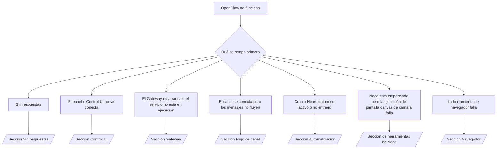

---
read_when:
    - OpenClaw no funciona y necesitas la vía más rápida para solucionarlo
    - Quieres un flujo de triaje antes de profundizar en runbooks detallados
summary: Centro de solución de problemas basado en síntomas para OpenClaw
title: Solución general de problemas
x-i18n:
    generated_at: "2026-07-05T11:26:39Z"
    model: gpt-5.5
    postprocess_version: locale-links-v1
    provider: openai
    source_hash: db50e0cdf4d11f3aa6196be445358d904a2b9c40c89243f1b124c77167f6dd85
    source_path: help/troubleshooting.md
    workflow: 16
---

Puerta de entrada de triaje. 2 minutos hasta un diagnóstico, luego salta a la página profunda.

## Primeros 60 segundos

Ejecuta esta escalera en orden:

```bash
openclaw status
openclaw status --all
openclaw gateway probe
openclaw gateway status
openclaw doctor
openclaw channels status --probe
openclaw logs --follow
```

Salida correcta, una línea cada una:

- `openclaw status` muestra los canales configurados, sin errores de autenticación.
- `openclaw status --all` genera un informe completo y compartible.
- `openclaw gateway probe` muestra `Reachable: yes`. `Capability: ...` es el
  nivel de autenticación que la sonda comprobó; `Read probe: limited - missing scope:
operator.read` indica diagnósticos degradados, no un fallo de conexión.
- `openclaw gateway status` muestra `Runtime: running`, `Connectivity probe:
ok` y un `Capability: ...` plausible. Añade `--require-rpc` para exigir también
  prueba RPC con alcance de lectura.
- `openclaw doctor` no informa errores bloqueantes de configuración/servicio.
- `openclaw channels status --probe` devuelve el estado de transporte por cuenta
  en vivo (`works` / `audit ok`) cuando el Gateway es accesible; recurre a
  resúmenes solo de configuración cuando no lo es.
- `openclaw logs --follow` muestra actividad constante, sin errores fatales repetidos.

## El asistente se siente limitado o le faltan herramientas

Comprueba el perfil de herramientas efectivo:

```bash
openclaw status
openclaw status --all
openclaw doctor
```

Causas comunes:

- `tools.profile: "minimal"` permite solo `session_status`.
- `tools.profile: "messaging"` es limitado, para agentes solo de chat.
- `tools.profile: "coding"` es el valor predeterminado para nuevas configuraciones locales (trabajo con repositorio, archivos,
  shell y entorno de ejecución).
- `tools.profile: "full"` elimina las restricciones de perfil; limítalo a agentes de confianza
  controlados por el operador.
- Las anulaciones por agente `agents.list[].tools` reducen o amplían el perfil raíz
  para un agente.

Cambia el perfil, reinicia o recarga el Gateway y vuelve a comprobar con
`openclaw status --all`. Tabla completa de perfiles/grupos: [Perfiles de herramientas](/es/gateway/config-tools#tool-profiles).

## Contexto largo de Anthropic 429

`HTTP 429: rate_limit_error: Extra usage is required for long context requests`
→ [Uso extra requerido para contexto largo de Anthropic 429](/es/gateway/troubleshooting#anthropic-429-extra-usage-required-for-long-context).

## El backend local compatible con OpenAI funciona directamente pero falla en OpenClaw

Tu backend `/v1` local/autohospedado responde a sondas directas de `/v1/chat/completions`
pero falla en `openclaw infer model run` o en turnos normales de agente:

1. El error menciona que `messages[].content` espera una cadena: establece
   `models.providers.<provider>.models[].compat.requiresStringContent: true`.
2. Si sigue fallando solo en turnos de agente de OpenClaw: establece
   `models.providers.<provider>.models[].compat.supportsTools: false` y reintenta.
3. Las llamadas directas pequeñas funcionan pero los prompts más grandes de OpenClaw bloquean el backend: eso
   es un límite del modelo/servidor upstream, no un error de OpenClaw. Continúa en
   [El backend local compatible con OpenAI supera las sondas directas pero las ejecuciones de agente fallan](/es/gateway/troubleshooting#local-openai-compatible-backend-passes-direct-probes-but-agent-runs-fail).

## La instalación del Plugin falla porque faltan extensiones de openclaw

`package.json missing openclaw.extensions` significa que el paquete del plugin usa una
forma que OpenClaw ya no acepta.

Corrige en el paquete del plugin:

1. Añade `openclaw.extensions` a `package.json`, apuntando a archivos de entorno de ejecución
   compilados (normalmente `./dist/index.js`).
2. Vuelve a publicar y luego ejecuta `openclaw plugins install <package>` otra vez.

```json
{
  "name": "@openclaw/my-plugin",
  "version": "1.2.3",
  "openclaw": {
    "extensions": ["./dist/index.js"]
  }
}
```

Referencia: [Arquitectura de Plugin](/es/plugins/architecture)

## La política de instalación bloquea instalaciones o actualizaciones de plugins

La actualización finaliza pero los plugins están obsoletos, deshabilitados o muestran `blocked by install
policy`, `install policy failed closed` o `Disabled "<plugin>" after plugin
update failure`: comprueba `security.installPolicy`.

La política de instalación se ejecuta en instalaciones y actualizaciones de plugins. Las versiones de plugins `@openclaw/*`
normalmente avanzan con la versión de OpenClaw, por lo que una actualización de OpenClaw puede
necesitar una actualización de plugin coincidente durante la sincronización posterior a la actualización.

Evita estas formas de política a menos que también mantengas la regla de actualización coincidente:

- Congelar plugins propiedad de OpenClaw en una versión antigua exacta (por ejemplo, solo
  `@openclaw/*@2026.5.3`).
- Bloquear solo por tipo de origen (toda solicitud npm, de red o `request.mode:
"update"`).
- Tratar el comando de política como opcional: cuando `security.installPolicy` está
  habilitado, un ejecutable de política ausente, lento, ilegible o bloqueado por permisos
  falla de forma cerrada.
- Aprobar versiones sin comprobar el `openclawVersion` de la solicitud contra
  los metadatos del candidato de plugin.

Prefiere reglas que permitan actualizaciones de `@openclaw/*` de confianza compatibles con el
host actual, en lugar de fijar una versión para siempre. Si bloqueas npm de forma
predeterminada, añade una excepción limitada para los ids de plugin que uses y aplica la misma
regla de confianza a `request.mode: "update"` que a las instalaciones.

Recuperación:

```bash
openclaw doctor --deep
openclaw plugins update --all
openclaw status --all
```

Si la política es intencionalmente estricta, relájala durante la ventana de actualización
de confianza, vuelve a ejecutar `openclaw plugins update --all` y luego restaura la regla más estricta.
Si un fallo de actualización deshabilitó un plugin, inspecciónalo antes de volver a habilitarlo:

```bash
openclaw plugins inspect <plugin-id> --runtime --json
openclaw plugins enable <plugin-id>
```

Referencia: [Política de instalación del operador](/es/tools/skills-config#operator-install-policy-securityinstallpolicy)

## Plugin presente pero bloqueado por propiedad sospechosa

`openclaw doctor`, la configuración o las advertencias de arranque muestran:

```text
blocked plugin candidate: suspicious ownership (... uid=1000, expected uid=0 or root)
plugin present but blocked
```

Los archivos del plugin pertenecen a un usuario Unix distinto del proceso que los carga.
No elimines la configuración del plugin; corrige la propiedad de los archivos o ejecuta
OpenClaw como el usuario propietario del directorio de estado.

Las instalaciones de Docker se ejecutan como `node` (uid `1000`). Repara los montajes vinculados del host:

```bash
sudo chown -R 1000:1000 /path/to/openclaw-config /path/to/openclaw-workspace
openclaw doctor --fix
```

Si ejecutas OpenClaw intencionalmente como root, repara la raíz de plugins administrados
en su lugar:

```bash
sudo chown -R root:root /path/to/openclaw-config/npm
openclaw doctor --fix
```

Documentación más profunda: [Propiedad de ruta de plugin bloqueada](/es/tools/plugin#blocked-plugin-path-ownership), [Docker: Permisos y EACCES](/es/install/docker#shell-helpers-optional)

## Árbol de decisiones



<AccordionGroup>
  <Accordion title="Sin respuestas">
    ```bash
    openclaw status
    openclaw gateway status
    openclaw channels status --probe
    openclaw pairing list --channel <channel> [--account <id>]
    openclaw logs --follow
    ```

    Salida correcta:

    - `Runtime: running`
    - `Connectivity probe: ok`
    - `Capability: read-only`, `write-capable` o `admin-capable`
    - El canal muestra transporte conectado y, donde se admite, `works` o
      `audit ok` en `channels status --probe`
    - El remitente está aprobado (o la política de DM está abierta/lista de permitidos)

    Firmas de registro:

    - `drop guild message (mention required` → el bloqueo por mención de Discord bloqueó el mensaje.
    - `pairing request` → remitente no aprobado, esperando aprobación de emparejamiento por DM.
    - `blocked` / `allowlist` en registros de canal → remitente, sala o grupo filtrado.

    Páginas profundas: [Sin respuestas](/es/gateway/troubleshooting#no-replies), [Solución de problemas de canales](/es/channels/troubleshooting), [Emparejamiento](/es/channels/pairing)

  </Accordion>

  <Accordion title="El panel o Control UI no se conecta">
    ```bash
    openclaw status
    openclaw gateway status
    openclaw logs --follow
    openclaw doctor
    openclaw channels status --probe
    ```

    Salida correcta:

    - `Dashboard: http://...` mostrado en `openclaw gateway status`
    - `Connectivity probe: ok`
    - `Capability: read-only`, `write-capable` o `admin-capable`
    - Sin bucle de autenticación en los registros

    Firmas de registro:

    - `device identity required` → el contexto HTTP/no seguro no puede completar la autenticación del dispositivo.
    - `origin not allowed` → el `Origin` del navegador no está permitido para el destino del Gateway de Control UI.
    - `AUTH_TOKEN_MISMATCH` con `canRetryWithDeviceToken=true` → puede ocurrir automáticamente un reintento con token de dispositivo de confianza, reutilizando los alcances en caché del token emparejado.
    - `unauthorized` repetido después de ese reintento → token/contraseña incorrectos, modo de autenticación no coincidente o token de dispositivo emparejado obsoleto.
    - `too many failed authentication attempts (retry later)` → los fallos repetidos desde ese `Origin` del navegador están bloqueados temporalmente; otros orígenes localhost usan depósitos separados. Consulta [Conectividad del panel/Control UI](/es/gateway/troubleshooting#dashboard-control-ui-connectivity) para el matiz de reintentos concurrentes de Tailscale Serve.
    - `gateway connect failed:` → la UI apunta a la URL/puerto incorrectos, o el Gateway no es accesible.

    Páginas profundas: [Conectividad del panel/Control UI](/es/gateway/troubleshooting#dashboard-control-ui-connectivity), [Control UI](/es/web/control-ui), [Autenticación](/es/gateway/authentication)

  </Accordion>

  <Accordion title="El Gateway no arranca o el servicio está instalado pero no en ejecución">
    ```bash
    openclaw status
    openclaw gateway status
    openclaw logs --follow
    openclaw doctor
    openclaw channels status --probe
    ```

    Salida correcta:

    - `Service: ... (loaded)`
    - `Runtime: running`
    - `Connectivity probe: ok`
    - `Capability: read-only`, `write-capable` o `admin-capable`

    Firmas de registro:

    - `Gateway start blocked: set gateway.mode=local` o `existing config is missing gateway.mode` → el modo de Gateway es remoto, o a la configuración le falta la marca de modo local y necesita reparación.
    - `refusing to bind gateway ... without auth` → enlace no local loopback sin una ruta de autenticación válida (token/contraseña o proxy de confianza donde esté configurado).
    - `another gateway instance is already listening` o `EADDRINUSE` → el puerto ya está ocupado.

    Páginas profundas: [El servicio Gateway no está en ejecución](/es/gateway/troubleshooting#gateway-service-not-running), [Proceso en segundo plano](/es/gateway/background-process), [Configuración](/es/gateway/configuration)

  </Accordion>

  <Accordion title="El canal se conecta pero los mensajes no fluyen">
    ```bash
    openclaw status
    openclaw gateway status
    openclaw logs --follow
    openclaw doctor
    openclaw channels status --probe
    ```

    Salida correcta:

    - Transporte de canal conectado.
    - Las comprobaciones de emparejamiento/lista de permitidos pasan.
    - Menciones detectadas donde se requieren.

    Firmas de registro:

    - `mention required` → el bloqueo por mención de grupo bloqueó el procesamiento.
    - `pairing` / `pending` → el remitente de DM aún no está aprobado.
    - `not_in_channel`, `missing_scope`, `Forbidden`, `401/403` → problema de token de permiso del canal.

    Páginas profundas: [Canal conectado, mensajes sin fluir](/es/gateway/troubleshooting#channel-connected-messages-not-flowing), [Solución de problemas de canales](/es/channels/troubleshooting)

  </Accordion>

  <Accordion title="Cron o Heartbeat no se activó o no entregó">
    ```bash
    openclaw status
    openclaw gateway status
    openclaw cron status
    openclaw cron list
    openclaw cron runs --id <jobId> --limit 20
    openclaw logs --follow
    ```

    Salida correcta:

    - `cron status` muestra el planificador habilitado con una próxima activación.
    - `cron runs` muestra entradas recientes `ok`.
    - Heartbeat está habilitado y dentro del horario activo.

    Firmas de registro:

    - `cron: scheduler disabled; jobs will not run automatically` → Cron está deshabilitado.
    - `heartbeat skipped` motivo `quiet-hours` → fuera de las horas activas configuradas.
    - `heartbeat skipped` motivo `empty-heartbeat-file` → `HEARTBEAT.md` existe, pero solo contiene andamiaje en blanco, comentarios, encabezados, bloques cercados o listas de verificación vacías.
    - `heartbeat skipped` motivo `no-tasks-due` → el modo de tarea está activo, pero todavía no vence ningún intervalo de tarea.
    - `heartbeat skipped` motivo `alerts-disabled` → `showOk`, `showAlerts` y `useIndicator` están todos desactivados.
    - `requests-in-flight` → carril principal ocupado; activación de heartbeat diferida.
    - `unknown accountId` → la cuenta de destino para la entrega de heartbeat no existe.

    Páginas detalladas: [Entrega de Cron y heartbeat](/es/gateway/troubleshooting#cron-and-heartbeat-delivery), [Tareas programadas: solución de problemas](/es/automation/cron-jobs#troubleshooting), [Heartbeat](/es/gateway/heartbeat)

  </Accordion>

  <Accordion title="Node está emparejado, pero la herramienta falla en camera canvas screen exec">
    ```bash
    openclaw status
    openclaw gateway status
    openclaw nodes status
    openclaw nodes describe --node <idOrNameOrIp>
    openclaw logs --follow
    ```

    Salida correcta:

    - Node aparece como conectado y emparejado para el rol `node`.
    - Existe la capacidad para el comando que estás invocando.
    - Estado de permiso concedido para la herramienta.

    Firmas de registro:

    - `NODE_BACKGROUND_UNAVAILABLE` → lleva la app del nodo al primer plano.
    - `*_PERMISSION_REQUIRED` → permiso del SO denegado o ausente.
    - `SYSTEM_RUN_DENIED: approval required` → la aprobación de exec está pendiente.
    - `SYSTEM_RUN_DENIED: allowlist miss` → el comando no está en la lista de permitidos de exec.

    Páginas detalladas: [Node emparejado, la herramienta falla](/es/gateway/troubleshooting#node-paired-tool-fails), [Solución de problemas de Node](/es/nodes/troubleshooting), [Aprobaciones de exec](/es/tools/exec-approvals)

  </Accordion>

  <Accordion title="Exec de pronto pide aprobación">
    ```bash
    openclaw config get tools.exec.host
    openclaw config get tools.exec.security
    openclaw config get tools.exec.ask
    openclaw gateway restart
    ```

    Qué cambió:

    - `tools.exec.host` sin definir usa `auto` de forma predeterminada, que se resuelve como `sandbox`
      cuando un runtime de sandbox está activo; de lo contrario, como `gateway`.
    - `host=auto` solo enruta; el comportamiento sin solicitud viene de
      `security=full` más `ask=off` en gateway/node.
    - `tools.exec.security` sin definir usa `full` de forma predeterminada en `gateway`/`node`.
    - `tools.exec.ask` sin definir usa `off` de forma predeterminada.
    - Si estás viendo aprobaciones, alguna política local del host o por sesión
      hizo que exec sea más estricto que estos valores predeterminados.

    Restaura los valores predeterminados actuales sin aprobación:

    ```bash
    openclaw config set tools.exec.host gateway
    openclaw config set tools.exec.security full
    openclaw config set tools.exec.ask off
    openclaw gateway restart
    ```

    Alternativas más seguras:

    - Configura solo `tools.exec.host=gateway` para un enrutamiento estable del host.
    - Usa `security=allowlist` con `ask=on-miss` para exec en el host con revisión cuando
      falte la lista de permitidos.
    - Habilita el modo sandbox para que `host=auto` vuelva a resolverse como `sandbox`.

    Firmas de registro:

    - `Approval required.` → el comando está esperando `/approve ...`.
    - `SYSTEM_RUN_DENIED: approval required` → la aprobación de exec en el host del nodo está pendiente.
    - `exec host=sandbox requires a sandbox runtime for this session` → selección implícita/explícita de sandbox, pero el modo sandbox está desactivado.

    Páginas detalladas: [Exec](/es/tools/exec), [Aprobaciones de exec](/es/tools/exec-approvals), [Seguridad: qué comprueba la auditoría](/es/gateway/security#what-the-audit-checks-high-level)

  </Accordion>

  <Accordion title="La herramienta Browser falla">
    ```bash
    openclaw status
    openclaw gateway status
    openclaw browser status
    openclaw logs --follow
    openclaw doctor
    ```

    Salida correcta:

    - El estado de Browser muestra `running: true` y un navegador/perfil elegido.
    - El perfil `openclaw` se inicia, o el perfil `user` ve pestañas locales de Chrome.

    Firmas de registro:

    - `unknown command "browser"` → `plugins.allow` está configurado y excluye `browser`.
    - `Failed to start Chrome CDP on port` → falló el inicio del navegador local.
    - `browser.executablePath not found` → la ruta configurada del binario es incorrecta.
    - `browser.cdpUrl must be http(s) or ws(s)` → la URL de CDP configurada usa un esquema no compatible.
    - `browser.cdpUrl has invalid port` → la URL de CDP configurada tiene un puerto incorrecto o fuera de rango.
    - `No Chrome tabs found for profile="user"` → el perfil de conexión Chrome MCP no tiene pestañas locales de Chrome abiertas.
    - `Remote CDP for profile "<name>" is not reachable` → no se puede acceder al endpoint de CDP remoto configurado desde este host.
    - `Browser attachOnly is enabled ... not reachable` → el perfil de solo conexión no tiene ningún destino CDP activo.
    - Sustituciones obsoletas de viewport/modo oscuro/configuración regional/sin conexión en perfiles de solo conexión o CDP remoto → ejecuta `openclaw browser stop --browser-profile <name>` para cerrar la sesión de control y liberar el estado de emulación sin reiniciar el gateway.

    Páginas detalladas: [La herramienta Browser falla](/es/gateway/troubleshooting#browser-tool-fails), [Falta el comando o la herramienta Browser](/es/tools/browser#missing-browser-command-or-tool), [Browser: solución de problemas en Linux](/es/tools/browser-linux-troubleshooting), [Browser: solución de problemas de CDP remoto en WSL2/Windows](/es/tools/browser-wsl2-windows-remote-cdp-troubleshooting)

  </Accordion>

</AccordionGroup>

## Relacionado

- [Preguntas frecuentes](/es/help/faq) — preguntas frecuentes
- [Solución de problemas de Gateway](/es/gateway/troubleshooting) — problemas específicos de gateway
- [Doctor](/es/gateway/doctor) — comprobaciones y reparaciones automatizadas de estado
- [Solución de problemas de canales](/es/channels/troubleshooting) — problemas de conectividad de canales
- [Tareas programadas: solución de problemas](/es/automation/cron-jobs#troubleshooting) — problemas de Cron y heartbeat
