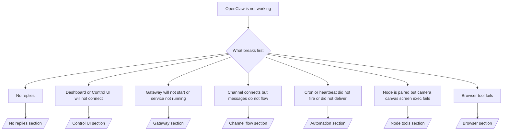

---
read_when:
    - OpenClaw no funciona y necesitas la vía más rápida para solucionarlo
    - Necesitas un flujo de triaje antes de profundizar en guías operativas detalladas
summary: Centro de solución de problemas basado en síntomas para OpenClaw
title: Solución de problemas generales
x-i18n:
    generated_at: "2026-05-06T05:37:54Z"
    model: gpt-5.5
    provider: openai
    source_hash: 624fa34cda3b440fa9cc636beb3fe6e3608a77a332933fa593097ebc556ac745
    source_path: help/troubleshooting.md
    workflow: 16
---

Si solo tienes 2 minutos, usa esta página como puerta de entrada para el triaje.

## Primeros 60 segundos

Ejecuta esta secuencia exacta en orden:

```bash
openclaw status
openclaw status --all
openclaw gateway probe
openclaw gateway status
openclaw doctor
openclaw channels status --probe
openclaw logs --follow
```

Salida correcta en una línea:

- `openclaw status` → muestra los canales configurados y ningún error de autenticación evidente.
- `openclaw status --all` → el informe completo está presente y se puede compartir.
- `openclaw gateway probe` → el destino de gateway esperado es accesible (`Reachable: yes`). `Capability: ...` indica qué nivel de autenticación pudo probar el sondeo, y `Read probe: limited - missing scope: operator.read` significa diagnósticos degradados, no un fallo de conexión.
- `openclaw gateway status` → `Runtime: running`, `Connectivity probe: ok` y una línea `Capability: ...` plausible. Usa `--require-rpc` si también necesitas prueba RPC con ámbito de lectura.
- `openclaw doctor` → no hay errores bloqueantes de configuración/servicio.
- `openclaw channels status --probe` → un Gateway accesible devuelve estado de transporte
  por cuenta en vivo más resultados de sondeo/auditoría como `works` o `audit ok`; si el
  Gateway no es accesible, el comando recurre a resúmenes solo de configuración.
- `openclaw logs --follow` → actividad estable, sin errores fatales repetidos.

## Anthropic long context 429

Si ves:
`HTTP 429: rate_limit_error: Extra usage is required for long context requests`,
ve a [/gateway/troubleshooting#anthropic-429-extra-usage-required-for-long-context](/es/gateway/troubleshooting#anthropic-429-extra-usage-required-for-long-context).

## El backend local compatible con OpenAI funciona directamente pero falla en OpenClaw

Si tu backend local o autoalojado `/v1` responde sondeos directos pequeños de
`/v1/chat/completions`, pero falla en `openclaw infer model run` o en turnos
normales del agente:

1. Si el error menciona que `messages[].content` espera una cadena, configura
   `models.providers.<provider>.models[].compat.requiresStringContent: true`.
2. Si el backend aún falla solo en turnos de agente de OpenClaw, configura
   `models.providers.<provider>.models[].compat.supportsTools: false` y vuelve a intentarlo.
3. Si las llamadas directas pequeñas aún funcionan pero los prompts más grandes de OpenClaw bloquean el
   backend, trata el problema restante como una limitación del modelo/servidor ascendente y
   continúa en el runbook detallado:
   [/gateway/troubleshooting#local-openai-compatible-backend-passes-direct-probes-but-agent-runs-fail](/es/gateway/troubleshooting#local-openai-compatible-backend-passes-direct-probes-but-agent-runs-fail)

## La instalación de Plugin falla porque faltan extensiones openclaw

Si la instalación falla con `package.json missing openclaw.extensions`, el paquete del plugin
usa una forma antigua que OpenClaw ya no acepta.

Corrige en el paquete del plugin:

1. Agrega `openclaw.extensions` a `package.json`.
2. Apunta las entradas a archivos de runtime compilados (normalmente `./dist/index.js`).
3. Vuelve a publicar el plugin y ejecuta `openclaw plugins install <package>` otra vez.

Ejemplo:

```json
{
  "name": "@openclaw/my-plugin",
  "version": "1.2.3",
  "openclaw": {
    "extensions": ["./dist/index.js"]
  }
}
```

Referencia: [Arquitectura de Plugin](/es/plugins/architecture)

## Plugin presente pero bloqueado por propiedad sospechosa

Si `openclaw doctor`, la configuración o las advertencias de inicio muestran:

```text
blocked plugin candidate: suspicious ownership (... uid=1000, expected uid=0 or root)
plugin present but blocked
```

los archivos del plugin pertenecen a un usuario Unix diferente del proceso que los carga.
No elimines la configuración del plugin. Corrige la propiedad de los archivos o ejecuta OpenClaw como
el mismo usuario propietario del directorio de estado.

Las instalaciones con Docker normalmente se ejecutan como `node` (uid `1000`). Para la configuración
predeterminada de Docker, repara los montajes enlazados del host:

```bash
sudo chown -R 1000:1000 /path/to/openclaw-config /path/to/openclaw-workspace
openclaw doctor --fix
```

Si ejecutas OpenClaw intencionadamente como root, repara la raíz gestionada del plugin para que
pertenezca a root en su lugar:

```bash
sudo chown -R root:root /path/to/openclaw-config/npm
openclaw doctor --fix
```

Documentación más detallada:

- [Propiedad de ruta de Plugin](/es/tools/plugin#blocked-plugin-path-ownership)
- [Permisos de Docker](/es/install/docker#permissions-and-eacces)

## Árbol de decisiones



<AccordionGroup>
  <Accordion title="Sin respuestas">
    ```bash
    openclaw status
    openclaw gateway status
    openclaw channels status --probe
    openclaw pairing list --channel <channel> [--account <id>]
    openclaw logs --follow
    ```

    La salida correcta se ve así:

    - `Runtime: running`
    - `Connectivity probe: ok`
    - `Capability: read-only`, `write-capable` o `admin-capable`
    - Tu canal muestra el transporte conectado y, donde sea compatible, `works` o `audit ok` en `channels status --probe`
    - El remitente aparece aprobado (o la política de DM está abierta/lista de permitidos)

    Firmas comunes en los registros:

    - `drop guild message (mention required` → la compuerta por mención bloqueó el mensaje en Discord.
    - `pairing request` → el remitente no está aprobado y espera la aprobación de emparejamiento por DM.
    - `blocked` / `allowlist` en los registros del canal → el remitente, la sala o el grupo está filtrado.

    Páginas detalladas:

    - [/gateway/troubleshooting#no-replies](/es/gateway/troubleshooting#no-replies)
    - [/channels/troubleshooting](/es/channels/troubleshooting)
    - [/channels/pairing](/es/channels/pairing)

  </Accordion>

  <Accordion title="El panel o la interfaz de control no se conecta">
    ```bash
    openclaw status
    openclaw gateway status
    openclaw logs --follow
    openclaw doctor
    openclaw channels status --probe
    ```

    La salida correcta se ve así:

    - `Dashboard: http://...` se muestra en `openclaw gateway status`
    - `Connectivity probe: ok`
    - `Capability: read-only`, `write-capable` o `admin-capable`
    - Sin bucle de autenticación en los registros

    Firmas comunes en los registros:

    - `device identity required` → el contexto HTTP/no seguro no puede completar la autenticación del dispositivo.
    - `origin not allowed` → el `Origin` del navegador no está permitido para el destino de Gateway de la interfaz de control.
    - `AUTH_TOKEN_MISMATCH` con sugerencias de reintento (`canRetryWithDeviceToken=true`) → puede ocurrir automáticamente un reintento con token de dispositivo de confianza.
    - Ese reintento con token en caché reutiliza el conjunto de ámbitos en caché almacenado con el token de dispositivo
      emparejado. Los llamadores con `deviceToken` explícito / `scopes` explícitos conservan
      su conjunto de ámbitos solicitado en su lugar.
    - En la ruta asíncrona de la interfaz de control Tailscale Serve, los intentos fallidos para el mismo
      `{scope, ip}` se serializan antes de que el limitador registre el fallo, así que un
      segundo reintento incorrecto concurrente ya puede mostrar `retry later`.
    - `too many failed authentication attempts (retry later)` desde un origen de navegador localhost
      → los fallos repetidos desde ese mismo `Origin` se bloquean temporalmente; otro origen localhost usa un depósito separado.
    - `unauthorized` repetido después de ese reintento → token/contraseña incorrectos, discrepancia de modo de autenticación o token de dispositivo emparejado obsoleto.
    - `gateway connect failed:` → la interfaz apunta a la URL/puerto incorrectos o a un Gateway no accesible.

    Páginas detalladas:

    - [/gateway/troubleshooting#dashboard-control-ui-connectivity](/es/gateway/troubleshooting#dashboard-control-ui-connectivity)
    - [/web/control-ui](/es/web/control-ui)
    - [/gateway/authentication](/es/gateway/authentication)

  </Accordion>

  <Accordion title="Gateway no inicia o el servicio está instalado pero no se está ejecutando">
    ```bash
    openclaw status
    openclaw gateway status
    openclaw logs --follow
    openclaw doctor
    openclaw channels status --probe
    ```

    La salida correcta se ve así:

    - `Service: ... (loaded)`
    - `Runtime: running`
    - `Connectivity probe: ok`
    - `Capability: read-only`, `write-capable` o `admin-capable`

    Firmas comunes en los registros:

    - `Gateway start blocked: set gateway.mode=local` o `existing config is missing gateway.mode` → el modo de Gateway es remoto, o al archivo de configuración le falta el sello de modo local y debe repararse.
    - `refusing to bind gateway ... without auth` → enlace no local loopback sin una ruta válida de autenticación de Gateway (token/contraseña, o proxy de confianza cuando esté configurado).
    - `another gateway instance is already listening` o `EADDRINUSE` → el puerto ya está ocupado.

    Páginas detalladas:

    - [/gateway/troubleshooting#gateway-service-not-running](/es/gateway/troubleshooting#gateway-service-not-running)
    - [/gateway/background-process](/es/gateway/background-process)
    - [/gateway/configuration](/es/gateway/configuration)

  </Accordion>

  <Accordion title="El canal se conecta pero los mensajes no fluyen">
    ```bash
    openclaw status
    openclaw gateway status
    openclaw logs --follow
    openclaw doctor
    openclaw channels status --probe
    ```

    La salida correcta se ve así:

    - El transporte del canal está conectado.
    - Las comprobaciones de emparejamiento/lista de permitidos pasan.
    - Las menciones se detectan donde son necesarias.

    Firmas comunes en los registros:

    - `mention required` → la compuerta por mención de grupo bloqueó el procesamiento.
    - `pairing` / `pending` → el remitente por DM aún no está aprobado.
    - `not_in_channel`, `missing_scope`, `Forbidden`, `401/403` → problema de token de permiso del canal.

    Páginas detalladas:

    - [/gateway/troubleshooting#channel-connected-messages-not-flowing](/es/gateway/troubleshooting#channel-connected-messages-not-flowing)
    - [/channels/troubleshooting](/es/channels/troubleshooting)

  </Accordion>

  <Accordion title="Cron o Heartbeat no se activó o no entregó">
    ```bash
    openclaw status
    openclaw gateway status
    openclaw cron status
    openclaw cron list
    openclaw cron runs --id <jobId> --limit 20
    openclaw logs --follow
    ```

    La salida correcta se ve así:

    - `cron.status` se muestra habilitado con un próximo despertar.
    - `cron runs` muestra entradas `ok` recientes.
    - Heartbeat está habilitado y no está fuera del horario activo.

    Firmas comunes en los registros:

    - `cron: scheduler disabled; jobs will not run automatically` → Cron está deshabilitado.
    - `heartbeat skipped` con `reason=quiet-hours` → fuera del horario activo configurado.
    - `heartbeat skipped` con `reason=empty-heartbeat-file` → `HEARTBEAT.md` existe pero solo contiene andamiaje en blanco o solo de encabezados.
    - `heartbeat skipped` con `reason=no-tasks-due` → el modo de tareas de `HEARTBEAT.md` está activo pero aún no vence ninguno de los intervalos de tareas.
    - `heartbeat skipped` con `reason=alerts-disabled` → toda la visibilidad de Heartbeat está deshabilitada (`showOk`, `showAlerts` y `useIndicator` están desactivados).
    - `requests-in-flight` → carril principal ocupado; el despertar de Heartbeat se aplazó.
    - `unknown accountId` → la cuenta de destino de entrega de Heartbeat no existe.

    Páginas detalladas:

    - [/gateway/troubleshooting#cron-and-heartbeat-delivery](/es/gateway/troubleshooting#cron-and-heartbeat-delivery)
    - [/automation/cron-jobs#troubleshooting](/es/automation/cron-jobs#troubleshooting)
    - [/gateway/heartbeat](/es/gateway/heartbeat)

  </Accordion>

  <Accordion title="Node está emparejado pero falla la herramienta de cámara, canvas, pantalla o exec">
    ```bash
    openclaw status
    openclaw gateway status
    openclaw nodes status
    openclaw nodes describe --node <idOrNameOrIp>
    openclaw logs --follow
    ```

    La salida correcta se ve así:

    - Node aparece como conectado y emparejado para el rol `node`.
    - Existe capacidad para el comando que estás invocando.
    - El estado de permiso está concedido para la herramienta.

    Firmas comunes en los registros:

    - `NODE_BACKGROUND_UNAVAILABLE` → lleva la app Node al primer plano.
    - `*_PERMISSION_REQUIRED` → el permiso del SO fue denegado o falta.
    - `SYSTEM_RUN_DENIED: approval required` → la aprobación de ejecución está pendiente.
    - `SYSTEM_RUN_DENIED: allowlist miss` → el comando no está en la lista de permitidos de ejecución.

    Páginas detalladas:

    - [/gateway/troubleshooting#node-paired-tool-fails](/es/gateway/troubleshooting#node-paired-tool-fails)
    - [/nodes/troubleshooting](/es/nodes/troubleshooting)
    - [/tools/exec-approvals](/es/tools/exec-approvals)

  </Accordion>

  <Accordion title="Exec solicita aprobación repentinamente">
    ```bash
    openclaw config get tools.exec.host
    openclaw config get tools.exec.security
    openclaw config get tools.exec.ask
    openclaw gateway restart
    ```

    Qué cambió:

    - Si `tools.exec.host` no está definido, el valor predeterminado es `auto`.
    - `host=auto` se resuelve como `sandbox` cuando un entorno de ejecución sandbox está activo; de lo contrario, como `gateway`.
    - `host=auto` solo es enrutamiento; el comportamiento "YOLO" sin solicitudes proviene de `security=full` más `ask=off` en gateway/node.
    - En `gateway` y `node`, si `tools.exec.security` no está definido, el valor predeterminado es `full`.
    - Si `tools.exec.ask` no está definido, el valor predeterminado es `off`.
    - Resultado: si ves aprobaciones, alguna política local del host o por sesión restringió exec por encima de los valores predeterminados actuales.

    Restaurar el comportamiento predeterminado actual sin aprobación:

    ```bash
    openclaw config set tools.exec.host gateway
    openclaw config set tools.exec.security full
    openclaw config set tools.exec.ask off
    openclaw gateway restart
    ```

    Alternativas más seguras:

    - Define solo `tools.exec.host=gateway` si solo quieres un enrutamiento de host estable.
    - Usa `security=allowlist` con `ask=on-miss` si quieres exec de host pero aún quieres revisión cuando falten entradas en la lista de permitidos.
    - Activa el modo sandbox si quieres que `host=auto` vuelva a resolverse como `sandbox`.

    Firmas de registro comunes:

    - `Approval required.` → el comando está esperando `/approve ...`.
    - `SYSTEM_RUN_DENIED: approval required` → la aprobación de exec en el host del nodo está pendiente.
    - `exec host=sandbox requires a sandbox runtime for this session` → selección implícita o explícita de sandbox, pero el modo sandbox está desactivado.

    Páginas detalladas:

    - [/tools/exec](/es/tools/exec)
    - [/tools/exec-approvals](/es/tools/exec-approvals)
    - [/gateway/security#what-the-audit-checks-high-level](/es/gateway/security#what-the-audit-checks-high-level)

  </Accordion>

  <Accordion title="La herramienta de navegador falla">
    ```bash
    openclaw status
    openclaw gateway status
    openclaw browser status
    openclaw logs --follow
    openclaw doctor
    ```

    Una salida correcta se ve así:

    - El estado del navegador muestra `running: true` y un navegador/perfil elegido.
    - `openclaw` se inicia, o `user` puede ver pestañas locales de Chrome.

    Firmas de registro comunes:

    - `unknown command "browser"` o `unknown command 'browser'` → `plugins.allow` está definido y no incluye `browser`.
    - `Failed to start Chrome CDP on port` → falló el inicio del navegador local.
    - `browser.executablePath not found` → la ruta configurada del binario es incorrecta.
    - `browser.cdpUrl must be http(s) or ws(s)` → la URL CDP configurada usa un esquema no compatible.
    - `browser.cdpUrl has invalid port` → la URL CDP configurada tiene un puerto incorrecto o fuera de rango.
    - `No Chrome tabs found for profile="user"` → el perfil de conexión Chrome MCP no tiene pestañas locales de Chrome abiertas.
    - `Remote CDP for profile "<name>" is not reachable` → no se puede acceder al endpoint CDP remoto configurado desde este host.
    - `Browser attachOnly is enabled ... not reachable` o `Browser attachOnly is enabled and CDP websocket ... is not reachable` → el perfil de solo conexión no tiene un destino CDP activo.
    - sobrescrituras obsoletas de viewport / modo oscuro / configuración regional / sin conexión en perfiles de solo conexión o CDP remoto → ejecuta `openclaw browser stop --browser-profile <name>` para cerrar la sesión de control activa y liberar el estado de emulación sin reiniciar el gateway.

    Páginas detalladas:

    - [/gateway/troubleshooting#browser-tool-fails](/es/gateway/troubleshooting#browser-tool-fails)
    - [/tools/browser#missing-browser-command-or-tool](/es/tools/browser#missing-browser-command-or-tool)
    - [/tools/browser-linux-troubleshooting](/es/tools/browser-linux-troubleshooting)
    - [/tools/browser-wsl2-windows-remote-cdp-troubleshooting](/es/tools/browser-wsl2-windows-remote-cdp-troubleshooting)

  </Accordion>

</AccordionGroup>

## Relacionado

- [FAQ](/es/help/faq) — preguntas frecuentes
- [Solución de problemas de Gateway](/es/gateway/troubleshooting) — problemas específicos de Gateway
- [Doctor](/es/gateway/doctor) — comprobaciones de estado y reparaciones automatizadas
- [Solución de problemas de canales](/es/channels/troubleshooting) — problemas de conectividad de canales
- [Solución de problemas de automatización](/es/automation/cron-jobs#troubleshooting) — problemas de cron y Heartbeat
