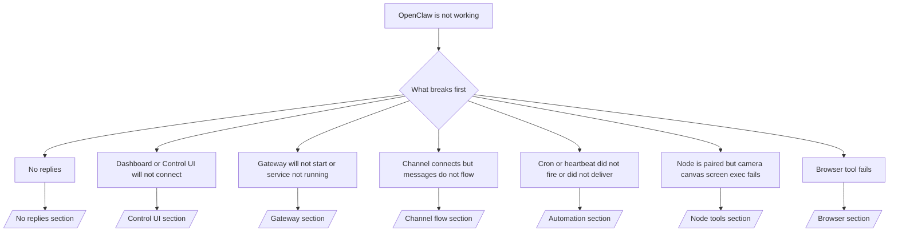

---
read_when:
    - OpenClaw no funciona y necesitas la vía más rápida para solucionarlo
    - Quieres un flujo de triaje antes de profundizar en runbooks detallados
summary: Centro de resolución de problemas de OpenClaw basado en síntomas
title: Solución de problemas general
x-i18n:
    generated_at: "2026-06-27T11:44:57Z"
    model: gpt-5.5
    postprocess_version: locale-links-v1
    provider: openai
    source_hash: ae1236c73e3a5c9237bd81d603e8dca18c595a8bcbb71f5931bfbf2389b342cd
    source_path: help/troubleshooting.md
    workflow: 16
---

Si solo tienes 2 minutos, usa esta página como puerta de entrada de triaje.

## Primeros 60 segundos

Ejecuta esta secuencia exacta en orden:

```bash
openclaw status
openclaw status --all
openclaw gateway probe
openclaw gateway status
openclaw doctor
openclaw channels status --probe
openclaw logs --follow
```

Salida correcta en una línea:

- `openclaw status` → muestra los canales configurados y ningún error evidente de autenticación.
- `openclaw status --all` → el informe completo está presente y se puede compartir.
- `openclaw gateway probe` → el destino esperado del gateway es alcanzable (`Reachable: yes`). `Capability: ...` indica qué nivel de autenticación pudo demostrar la prueba, y `Read probe: limited - missing scope: operator.read` es diagnóstico degradado, no un fallo de conexión.
- `openclaw gateway status` → `Runtime: running`, `Connectivity probe: ok` y una línea `Capability: ...` plausible. Usa `--require-rpc` si también necesitas prueba RPC con alcance de lectura.
- `openclaw doctor` → no hay errores bloqueantes de configuración/servicio.
- `openclaw channels status --probe` → un gateway alcanzable devuelve estado de transporte
  en vivo por cuenta, además de resultados de prueba/auditoría como `works` o `audit ok`; si el
  gateway no es alcanzable, el comando recurre a resúmenes solo de configuración.
- `openclaw logs --follow` → actividad estable, sin errores fatales repetidos.

## El asistente se siente limitado o sin herramientas

Si el asistente no puede inspeccionar archivos, ejecutar comandos, usar automatización del navegador o
ver las herramientas esperadas, revisa primero el perfil efectivo de herramientas:

```bash
openclaw status
openclaw status --all
openclaw doctor
```

Causas comunes:

- `tools.profile: "messaging"` es intencionalmente estrecho para agentes solo de chat.
- `tools.profile: "coding"` es el perfil habitual para flujos de trabajo de repositorio, archivos, shell
  y runtime.
- `tools.profile: "full"` expone el conjunto de herramientas más amplio y debe limitarse
  a agentes de confianza controlados por el operador.
- Las anulaciones por agente `agents.list[].tools` pueden estrechar o ampliar el perfil
  raíz para un agente.

Cambia el perfil de herramientas raíz o por agente, luego reinicia o recarga el Gateway
y ejecuta `openclaw status --all` de nuevo. Consulta [Herramientas](/es/tools) para ver el modelo
de perfiles y las anulaciones de permitir/denegar.

## Contexto largo de Anthropic 429

Si ves:
`HTTP 429: rate_limit_error: Extra usage is required for long context requests`,
ve a [/gateway/troubleshooting#anthropic-429-extra-usage-required-for-long-context](/es/gateway/troubleshooting#anthropic-429-extra-usage-required-for-long-context).

## El backend local compatible con OpenAI funciona directamente pero falla en OpenClaw

Si tu backend local o autohospedado `/v1` responde a pruebas directas pequeñas de
`/v1/chat/completions` pero falla en `openclaw infer model run` o en turnos normales
del agente:

1. Si el error menciona que `messages[].content` espera una cadena, establece
   `models.providers.<provider>.models[].compat.requiresStringContent: true`.
2. Si el backend sigue fallando solo en turnos de agente de OpenClaw, establece
   `models.providers.<provider>.models[].compat.supportsTools: false` y vuelve a intentarlo.
3. Si las llamadas directas diminutas aún funcionan pero prompts más grandes de OpenClaw bloquean el
   backend, trata el problema restante como una limitación ascendente del modelo/servidor y
   continúa en el runbook profundo:
   [/gateway/troubleshooting#local-openai-compatible-backend-passes-direct-probes-but-agent-runs-fail](/es/gateway/troubleshooting#local-openai-compatible-backend-passes-direct-probes-but-agent-runs-fail)

## La instalación del Plugin falla porque faltan extensiones de openclaw

Si la instalación falla con `package.json missing openclaw.extensions`, el paquete del plugin
usa una forma antigua que OpenClaw ya no acepta.

Corrige en el paquete del plugin:

1. Añade `openclaw.extensions` a `package.json`.
2. Apunta las entradas a archivos de runtime compilados (normalmente `./dist/index.js`).
3. Vuelve a publicar el plugin y ejecuta `openclaw plugins install <package>` otra vez.

Ejemplo:

```json
{
  "name": "@openclaw/my-plugin",
  "version": "1.2.3",
  "openclaw": {
    "extensions": ["./dist/index.js"]
  }
}
```

Referencia: [Arquitectura de Plugin](/es/plugins/architecture)

## La política de instalación bloquea instalaciones o actualizaciones de plugins

Si una actualización termina pero los plugins están obsoletos, deshabilitados o muestran mensajes como
`blocked by install policy`, `install policy failed closed` o
`Disabled "<plugin>" after plugin update failure`, revisa
`security.installPolicy`.

La política de instalación se ejecuta en instalaciones y actualizaciones de plugins. Las versiones de plugins
propiedad de OpenClaw normalmente avanzan con la versión de OpenClaw, por lo que una actualización de OpenClaw
también puede necesitar actualizaciones coincidentes de plugins `@openclaw/*` durante la sincronización posterior a la actualización.

Evita estas formas amplias de política salvo que también mantengas la regla de actualización
correspondiente:

- Congelar plugins propiedad de OpenClaw en una versión antigua exacta, por ejemplo permitir
  solo `@openclaw/*@2026.5.3`.
- Bloquear solo por tipo de origen, como toda solicitud de plugin npm, de red o
  `request.mode: "update"`.
- Tratar el comando de política como opcional. Cuando `security.installPolicy` está
  habilitado, un ejecutable de política faltante, lento, ilegible o bloqueado por permisos
  falla cerrado.
- Aprobar versiones de plugins sin considerar el `openclawVersion` de la solicitud de política
  y los metadatos del candidato de plugin.

Las reglas de política más seguras permiten actualizaciones de plugins de confianza propiedad de OpenClaw cuando el
candidato es compatible con el host actual de OpenClaw, en lugar de fijar una
sola versión para siempre. Si bloqueas npm de forma predeterminada, crea una excepción estrecha
para los paquetes de plugin `@openclaw/*` de confianza o los id de plugin que usas. Si
diferencias solicitudes de instalación y actualización, aplica la misma regla de confianza a
`request.mode: "update"`.

Recuperación:

```bash
openclaw doctor --deep
openclaw plugins update --all
openclaw status --all
```

Si la política es intencionalmente estricta, relájala para la ventana de actualización de confianza
de OpenClaw, vuelve a ejecutar `openclaw plugins update --all` y luego restaura la regla más estricta.
Si un plugin fue deshabilitado tras un fallo de actualización, inspecciónalo y vuelve a habilitarlo solo
después de que la actualización tenga éxito:

```bash
openclaw plugins inspect <plugin-id> --runtime --json
openclaw plugins enable <plugin-id>
```

Referencia: [Política de instalación del operador](/es/tools/skills-config#operator-install-policy-securityinstallpolicy)

## Plugin presente pero bloqueado por propiedad sospechosa

Si `openclaw doctor`, la configuración o las advertencias de inicio muestran:

```text
blocked plugin candidate: suspicious ownership (... uid=1000, expected uid=0 or root)
plugin present but blocked
```

los archivos del plugin pertenecen a un usuario Unix diferente al del proceso que los carga.
No elimines la configuración del plugin. Corrige la propiedad de los archivos o ejecuta OpenClaw como
el mismo usuario propietario del directorio de estado.

Las instalaciones Docker normalmente se ejecutan como `node` (uid `1000`). Para la configuración Docker
predeterminada, repara los montajes bind del host:

```bash
sudo chown -R 1000:1000 /path/to/openclaw-config /path/to/openclaw-workspace
openclaw doctor --fix
```

Si ejecutas OpenClaw intencionalmente como root, repara la raíz de plugins gestionada para que
pertenezca a root en su lugar:

```bash
sudo chown -R root:root /path/to/openclaw-config/npm
openclaw doctor --fix
```

Documentación más profunda:

- [Propiedad de rutas de Plugin](/es/tools/plugin#blocked-plugin-path-ownership)
- [Permisos de Docker](/es/install/docker#permissions-and-eacces)

## Árbol de decisiones



<AccordionGroup>
  <Accordion title="No replies">
    ```bash
    openclaw status
    openclaw gateway status
    openclaw channels status --probe
    openclaw pairing list --channel <channel> [--account <id>]
    openclaw logs --follow
    ```

    La salida correcta se ve así:

    - `Runtime: running`
    - `Connectivity probe: ok`
    - `Capability: read-only`, `write-capable` o `admin-capable`
    - Tu canal muestra el transporte conectado y, donde sea compatible, `works` o `audit ok` en `channels status --probe`
    - El remitente aparece aprobado (o la política de DM está abierta/en lista de permitidos)

    Firmas comunes en los logs:

    - `drop guild message (mention required` → el bloqueo por mención bloqueó el mensaje en Discord.
    - `pairing request` → el remitente no está aprobado y espera aprobación de emparejamiento por DM.
    - `blocked` / `allowlist` en los logs del canal → el remitente, la sala o el grupo están filtrados.

    Páginas profundas:

    - [/gateway/troubleshooting#no-replies](/es/gateway/troubleshooting#no-replies)
    - [/channels/troubleshooting](/es/channels/troubleshooting)
    - [/channels/pairing](/es/channels/pairing)

  </Accordion>

  <Accordion title="Dashboard or Control UI will not connect">
    ```bash
    openclaw status
    openclaw gateway status
    openclaw logs --follow
    openclaw doctor
    openclaw channels status --probe
    ```

    La salida correcta se ve así:

    - `Dashboard: http://...` se muestra en `openclaw gateway status`
    - `Connectivity probe: ok`
    - `Capability: read-only`, `write-capable` o `admin-capable`
    - Sin bucle de autenticación en los logs

    Firmas comunes en los logs:

    - `device identity required` → el contexto HTTP/no seguro no puede completar la autenticación del dispositivo.
    - `origin not allowed` → el `Origin` del navegador no está permitido para el destino de gateway de la Control UI.
    - `AUTH_TOKEN_MISMATCH` con pistas de reintento (`canRetryWithDeviceToken=true`) → puede ocurrir automáticamente un reintento con token de dispositivo de confianza.
    - Ese reintento con token en caché reutiliza el conjunto de alcances en caché almacenado con el token de dispositivo
      emparejado. Los llamadores con `deviceToken` explícito / `scopes` explícitos mantienen
      su conjunto de alcances solicitado en su lugar.
    - En la ruta asíncrona de Control UI de Tailscale Serve, los intentos fallidos para el mismo
      `{scope, ip}` se serializan antes de que el limitador registre el fallo, por lo que un
      segundo reintento incorrecto concurrente ya puede mostrar `retry later`.
    - `too many failed authentication attempts (retry later)` desde un origen de navegador localhost
      → los fallos repetidos desde ese mismo `Origin` se bloquean temporalmente; otro origen localhost usa un bucket separado.
    - `unauthorized` repetido después de ese reintento → token/contraseña incorrectos, modo de autenticación incompatible o token de dispositivo emparejado obsoleto.
    - `gateway connect failed:` → la UI apunta a la URL/puerto incorrecto o a un gateway inalcanzable.

    Páginas profundas:

    - [/gateway/troubleshooting#dashboard-control-ui-connectivity](/es/gateway/troubleshooting#dashboard-control-ui-connectivity)
    - [/web/control-ui](/es/web/control-ui)
    - [/gateway/authentication](/es/gateway/authentication)

  </Accordion>

  <Accordion title="Gateway will not start or service installed but not running">
    ```bash
    openclaw status
    openclaw gateway status
    openclaw logs --follow
    openclaw doctor
    openclaw channels status --probe
    ```

    La salida correcta se ve así:

    - `Service: ... (loaded)`
    - `Runtime: running`
    - `Connectivity probe: ok`
    - `Capability: read-only`, `write-capable` o `admin-capable`

    Firmas comunes en los logs:

    - `Gateway start blocked: set gateway.mode=local` o `existing config is missing gateway.mode` → el modo de gateway es remoto, o al archivo de configuración le falta la marca de modo local y debe repararse.
    - `refusing to bind gateway ... without auth` → enlace no local loopback sin una ruta válida de autenticación de gateway (token/contraseña, o proxy de confianza donde esté configurado).
    - `another gateway instance is already listening` o `EADDRINUSE` → el puerto ya está ocupado.

    Páginas profundas:

    - [/gateway/troubleshooting#gateway-service-not-running](/es/gateway/troubleshooting#gateway-service-not-running)
    - [/gateway/background-process](/es/gateway/background-process)
    - [/gateway/configuration](/es/gateway/configuration)

  </Accordion>

  <Accordion title="El canal se conecta, pero los mensajes no fluyen">
    ```bash
    openclaw status
    openclaw gateway status
    openclaw logs --follow
    openclaw doctor
    openclaw channels status --probe
    ```

    Una salida correcta se ve así:

    - El transporte del canal está conectado.
    - Las comprobaciones de emparejamiento/lista de permitidos pasan.
    - Las menciones se detectan donde son obligatorias.

    Firmas de registro comunes:

    - `mention required` → el control de mención en grupo bloqueó el procesamiento.
    - `pairing` / `pending` → el remitente del DM aún no está aprobado.
    - `not_in_channel`, `missing_scope`, `Forbidden`, `401/403` → problema con el token de permisos del canal.

    Páginas detalladas:

    - [/gateway/troubleshooting#channel-connected-messages-not-flowing](/es/gateway/troubleshooting#channel-connected-messages-not-flowing)
    - [/channels/troubleshooting](/es/channels/troubleshooting)

  </Accordion>

  <Accordion title="Cron o Heartbeat no se activó o no entregó">
    ```bash
    openclaw status
    openclaw gateway status
    openclaw cron status
    openclaw cron list
    openclaw cron runs --id <jobId> --limit 20
    openclaw logs --follow
    ```

    Una salida correcta se ve así:

    - `cron.status` aparece habilitado con un próximo despertar.
    - `cron runs` muestra entradas `ok` recientes.
    - Heartbeat está habilitado y no está fuera del horario activo.

    Firmas de registro comunes:

    - `cron: scheduler disabled; jobs will not run automatically` → cron está deshabilitado.
    - `heartbeat skipped` con `reason=quiet-hours` → fuera del horario activo configurado.
    - `heartbeat skipped` con `reason=empty-heartbeat-file` → `HEARTBEAT.md` existe, pero solo contiene estructuras vacías de espacios en blanco, comentarios, encabezados, cercas o listas de verificación vacías.
    - `heartbeat skipped` con `reason=no-tasks-due` → el modo de tareas de `HEARTBEAT.md` está activo, pero ninguno de los intervalos de tarea vence todavía.
    - `heartbeat skipped` con `reason=alerts-disabled` → toda la visibilidad de Heartbeat está deshabilitada (`showOk`, `showAlerts` y `useIndicator` están desactivados).
    - `requests-in-flight` → el carril principal está ocupado; el despertar de Heartbeat se pospuso.
    - `unknown accountId` → la cuenta de destino de entrega de Heartbeat no existe.

    Páginas detalladas:

    - [/gateway/troubleshooting#cron-and-heartbeat-delivery](/es/gateway/troubleshooting#cron-and-heartbeat-delivery)
    - [/automation/cron-jobs#troubleshooting](/es/automation/cron-jobs#troubleshooting)
    - [/gateway/heartbeat](/es/gateway/heartbeat)

  </Accordion>

  <Accordion title="Node está emparejado, pero la herramienta falla con cámara, lienzo, pantalla o exec">
    ```bash
    openclaw status
    openclaw gateway status
    openclaw nodes status
    openclaw nodes describe --node <idOrNameOrIp>
    openclaw logs --follow
    ```

    Una salida correcta se ve así:

    - Node aparece como conectado y emparejado para el rol `node`.
    - Existe la capacidad para el comando que estás invocando.
    - El estado del permiso está concedido para la herramienta.

    Firmas de registro comunes:

    - `NODE_BACKGROUND_UNAVAILABLE` → trae la aplicación de Node al primer plano.
    - `*_PERMISSION_REQUIRED` → el permiso del sistema operativo fue denegado o falta.
    - `SYSTEM_RUN_DENIED: approval required` → la aprobación de exec está pendiente.
    - `SYSTEM_RUN_DENIED: allowlist miss` → el comando no está en la lista de permitidos de exec.

    Páginas detalladas:

    - [/gateway/troubleshooting#node-paired-tool-fails](/es/gateway/troubleshooting#node-paired-tool-fails)
    - [/nodes/troubleshooting](/es/nodes/troubleshooting)
    - [/tools/exec-approvals](/es/tools/exec-approvals)

  </Accordion>

  <Accordion title="Exec de repente pide aprobación">
    ```bash
    openclaw config get tools.exec.host
    openclaw config get tools.exec.security
    openclaw config get tools.exec.ask
    openclaw gateway restart
    ```

    Qué cambió:

    - Si `tools.exec.host` no está definido, el valor predeterminado es `auto`.
    - `host=auto` se resuelve como `sandbox` cuando un runtime de sandbox está activo; de lo contrario, como `gateway`.
    - `host=auto` solo enruta; el comportamiento "YOLO" sin avisos proviene de `security=full` más `ask=off` en gateway/node.
    - En `gateway` y `node`, `tools.exec.security` sin definir usa `full` como valor predeterminado.
    - `tools.exec.ask` sin definir usa `off` como valor predeterminado.
    - Resultado: si ves aprobaciones, alguna política local del host o por sesión endureció exec respecto de los valores predeterminados actuales.

    Restaurar el comportamiento predeterminado actual sin aprobación:

    ```bash
    openclaw config set tools.exec.host gateway
    openclaw config set tools.exec.security full
    openclaw config set tools.exec.ask off
    openclaw gateway restart
    ```

    Alternativas más seguras:

    - Configura solo `tools.exec.host=gateway` si solo quieres un enrutamiento de host estable.
    - Usa `security=allowlist` con `ask=on-miss` si quieres exec en el host, pero aun así quieres revisión cuando haya omisiones en la lista de permitidos.
    - Habilita el modo sandbox si quieres que `host=auto` vuelva a resolverse como `sandbox`.

    Firmas de registro comunes:

    - `Approval required.` → el comando está esperando `/approve ...`.
    - `SYSTEM_RUN_DENIED: approval required` → la aprobación de exec alojado en Node está pendiente.
    - `exec host=sandbox requires a sandbox runtime for this session` → selección implícita/explícita de sandbox, pero el modo sandbox está desactivado.

    Páginas detalladas:

    - [/tools/exec](/es/tools/exec)
    - [/tools/exec-approvals](/es/tools/exec-approvals)
    - [/gateway/security#what-the-audit-checks-high-level](/es/gateway/security#what-the-audit-checks-high-level)

  </Accordion>

  <Accordion title="La herramienta de navegador falla">
    ```bash
    openclaw status
    openclaw gateway status
    openclaw browser status
    openclaw logs --follow
    openclaw doctor
    ```

    Una salida correcta se ve así:

    - El estado del navegador muestra `running: true` y un navegador/perfil elegido.
    - `openclaw` se inicia, o `user` puede ver pestañas locales de Chrome.

    Firmas de registro comunes:

    - `unknown command "browser"` o `unknown command 'browser'` → `plugins.allow` está configurado y no incluye `browser`.
    - `Failed to start Chrome CDP on port` → falló el inicio del navegador local.
    - `browser.executablePath not found` → la ruta binaria configurada es incorrecta.
    - `browser.cdpUrl must be http(s) or ws(s)` → la URL CDP configurada usa un esquema no compatible.
    - `browser.cdpUrl has invalid port` → la URL CDP configurada tiene un puerto incorrecto o fuera de rango.
    - `No Chrome tabs found for profile="user"` → el perfil de adjuntar Chrome MCP no tiene pestañas locales de Chrome abiertas.
    - `Remote CDP for profile "<name>" is not reachable` → no se puede acceder al endpoint CDP remoto configurado desde este host.
    - `Browser attachOnly is enabled ... not reachable` o `Browser attachOnly is enabled and CDP websocket ... is not reachable` → el perfil de solo adjuntar no tiene un destino CDP activo.
    - anulaciones obsoletas de viewport / modo oscuro / locale / sin conexión en perfiles de solo adjuntar o CDP remoto → ejecuta `openclaw browser stop --browser-profile <name>` para cerrar la sesión de control activa y liberar el estado de emulación sin reiniciar el Gateway.

    Páginas detalladas:

    - [/gateway/troubleshooting#browser-tool-fails](/es/gateway/troubleshooting#browser-tool-fails)
    - [/tools/browser#missing-browser-command-or-tool](/es/tools/browser#missing-browser-command-or-tool)
    - [/tools/browser-linux-troubleshooting](/es/tools/browser-linux-troubleshooting)
    - [/tools/browser-wsl2-windows-remote-cdp-troubleshooting](/es/tools/browser-wsl2-windows-remote-cdp-troubleshooting)

  </Accordion>

</AccordionGroup>

## Relacionado

- [Preguntas frecuentes](/es/help/faq) — preguntas frecuentes
- [Solución de problemas de Gateway](/es/gateway/troubleshooting) — problemas específicos de Gateway
- [Doctor](/es/gateway/doctor) — comprobaciones de estado y reparaciones automatizadas
- [Solución de problemas de canales](/es/channels/troubleshooting) — problemas de conectividad de canales
- [Solución de problemas de automatización](/es/automation/cron-jobs#troubleshooting) — problemas de cron y Heartbeat
