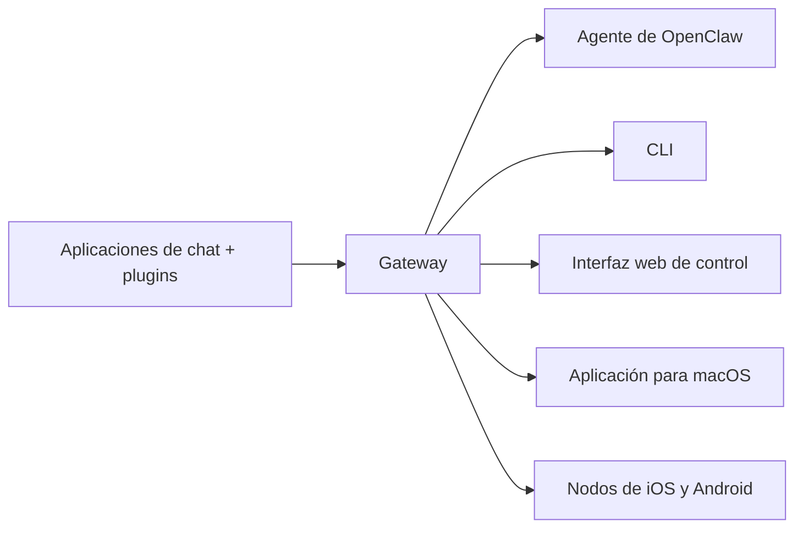

---
read_when:
    - Presentación de OpenClaw para principiantes
summary: OpenClaw es un gateway multicanal para agentes de IA que funciona en cualquier sistema operativo.
title: OpenClaw
x-i18n:
    generated_at: "2026-07-22T13:19:16Z"
    model: gpt-5.6
    postprocess_version: locale-links-v1
    prompt_version: 32
    provider: openai
    source_hash: 0ce948d12d4b4fcbde2597f9b33f50b99c4f677b69e0f5d72677b2f6683291f3
    source_path: index.md
    workflow: 16
---

# OpenClaw 🦞

<p align="center">
    
    
</p>

> _"¡EXFOLIAR! ¡EXFOLIAR!"_ — Una langosta espacial, probablemente

<p align="center">
  <strong>Gateway para cualquier sistema operativo que conecta agentes de IA mediante Discord, Google Chat, iMessage, Matrix, Microsoft Teams, Signal, Slack, Telegram, WhatsApp, Zalo y más.</strong><br />
  Envíe un mensaje y reciba la respuesta de un agente desde su bolsillo. Ejecute un solo Gateway para los plugins de canales, WebChat y los nodos móviles.<br />
  Desarrollado de forma abierta por la <a href="https://openclaw.org">Fundación OpenClaw</a>, una organización sin fines de lucro.
</p>

<Columns>
  <Card title="Primeros pasos" href="/es/start/getting-started" icon="rocket">
    Instale OpenClaw e inicie el Gateway en cuestión de minutos.
  </Card>
  <Card title="Ejecutar la incorporación" href="/es/start/wizard" icon="list-checks">
    Configuración guiada con `openclaw onboard` y flujos de emparejamiento.
  </Card>
  <Card title="Conectar un canal" href="/es/channels" icon="message-circle">
    Vincule Discord, Signal, Telegram, WhatsApp y otros servicios para chatear desde cualquier lugar.
  </Card>
  <Card title="Abrir la interfaz de control" href="/es/web/control-ui" icon="layout-dashboard">
    Abra el panel del navegador para gestionar el chat, la configuración y las sesiones.
  </Card>
</Columns>

## Explorar la documentación

Los navegadores móviles pueden mostrar el menú de secciones sin la barra completa de pestañas de la versión de escritorio. Utilice
estos enlaces centrales para acceder desde el cuerpo de la página a las mismas áreas principales de la documentación.

<Columns>
  <Card title="Primeros pasos" href="/es" icon="rocket">
    Descripción general, demostración, primeros pasos y guías de configuración.
  </Card>
  <Card title="Instalación" href="/es/install" icon="download">
    Métodos de instalación, actualizaciones, contenedores, alojamiento y configuración avanzada.
  </Card>
  <Card title="Canales" href="/es/channels" icon="messages-square">
    Canales de mensajería, emparejamiento, enrutamiento, grupos de acceso y control de calidad de canales.
  </Card>
  <Card title="Agentes" href="/es/concepts/architecture" icon="bot">
    Arquitectura, sesiones, contexto, memoria y enrutamiento multiagente.
  </Card>
  <Card title="Capacidades" href="/es/tools" icon="wand-sparkles">
    Herramientas, Skills, cron, webhooks y capacidades de automatización.
  </Card>
  <Card title="ClawHub" href="/es/clawhub" icon="store">
    Mercado de plugins, publicación, selección y orientación sobre confianza.
  </Card>
  <Card title="Modelos" href="/es/providers" icon="brain">
    Proveedores, configuración de modelos, conmutación por error y servicios de modelos locales.
  </Card>
  <Card title="Plataformas" href="/es/platforms" icon="monitor-smartphone">
    macOS, Windows, iOS, Android, nodos e interfaces web.
  </Card>
  <Card title="Gateway y operaciones" href="/es/gateway" icon="server">
    Configuración, seguridad, diagnóstico y operaciones del Gateway.
  </Card>
  <Card title="Referencia" href="/es/cli" icon="terminal">
    Referencia de la CLI, esquemas, RPC, notas de la versión y plantillas.
  </Card>
  <Card title="Ayuda" href="/es/help" icon="life-buoy">
    Solución de problemas, preguntas frecuentes, pruebas, diagnóstico y comprobaciones del entorno.
  </Card>
</Columns>

## ¿Qué es OpenClaw?

OpenClaw es un **Gateway autoalojado** que conecta sus aplicaciones de chat favoritas —Discord, Google Chat, iMessage, Matrix, Microsoft Teams, Signal, Slack, Telegram, WhatsApp, Zalo y otras mediante plugins de canales— con agentes de IA para programación. Se ejecuta un único proceso de Gateway en un equipo propio (o en un servidor), que actúa como puente entre las aplicaciones de mensajería y un asistente de IA siempre disponible.

**¿A quién está dirigido?** A desarrolladores y usuarios avanzados que desean un asistente de IA personal al que puedan enviar mensajes desde cualquier lugar, sin renunciar al control de sus datos ni depender de un servicio alojado.

**¿Qué lo diferencia?**

- **Autoalojado**: se ejecuta en su hardware y conforme a sus reglas
- **Multicanal**: un solo Gateway atiende simultáneamente todos los plugins de canales configurados
- **Nativo para agentes**: diseñado para agentes de programación con uso de herramientas, sesiones, memoria y enrutamiento multiagente
- **Código abierto**: con licencia MIT e impulsado por la comunidad

**¿Qué se necesita?** Node 24.15+ (recomendado), Node 22 LTS (`22.22.3+`) para mantener la compatibilidad, o Node 25.9+, una clave de API del proveedor elegido y 5 minutos. Para obtener la máxima calidad y seguridad, utilice el modelo de última generación más potente disponible.

## Cómo funciona



El Gateway es la única fuente de información fidedigna para las sesiones, el enrutamiento y las conexiones de canales.

## Capacidades principales

<Columns>
  <Card title="Gateway multicanal" icon="network" href="/es/channels">
    Discord, iMessage, Signal, Slack, Telegram, WhatsApp, WebChat y más con un único proceso de Gateway.
  </Card>
  <Card title="Canales mediante plugins" icon="plug" href="/es/tools/plugin">
    Los plugins de canales incorporan Matrix, Nostr, Twitch, Zalo y otros servicios; los plugins oficiales se instalan bajo demanda.
  </Card>
  <Card title="Enrutamiento multiagente" icon="route" href="/es/concepts/multi-agent">
    Sesiones aisladas por agente, espacio de trabajo o remitente.
  </Card>
  <Card title="Compatibilidad multimedia" icon="image" href="/es/nodes/images">
    Envíe y reciba imágenes, audio y documentos.
  </Card>
  <Card title="Interfaz web de control" icon="monitor" href="/es/web/control-ui">
    Panel del navegador para el chat, la configuración, las sesiones y los nodos.
  </Card>
  <Card title="Nodos móviles" icon="smartphone" href="/es/nodes">
    Empareje nodos de iOS y Android para flujos de trabajo con Canvas, cámara y voz.
  </Card>
</Columns>

## Inicio rápido

<Steps>
  <Step title="Instalar OpenClaw">
    ```bash
    npm install -g openclaw@latest
    ```
  </Step>
  <Step title="Completar la incorporación e instalar el servicio">
    ```bash
    openclaw onboard --install-daemon
    ```
  </Step>
  <Step title="Chatear">
    Abra la interfaz de control en el navegador y envíe un mensaje:

    ```bash
    openclaw dashboard
    ```

    También puede conectar un canal ([Telegram](/es/channels/telegram) es el más rápido) y chatear desde el teléfono.

  </Step>
</Steps>

¿Necesita la configuración completa de instalación y desarrollo? Consulte [Primeros pasos](/es/start/getting-started).

## Panel

Abra la interfaz de control en el navegador después de iniciar el Gateway.

- Valor local predeterminado: [http://127.0.0.1:18789/](http://127.0.0.1:18789/)
- Acceso remoto: [Interfaces web](/es/web) y [Tailscale](/es/gateway/tailscale)

<p align="center">
  
</p>

## Configuración (opcional)

La configuración se encuentra en `~/.openclaw/openclaw.json`.

- Si **no se realiza ninguna acción**, OpenClaw utiliza el entorno de ejecución del agente de OpenClaw incluido; los mensajes directos comparten la sesión principal del agente y cada chat grupal obtiene su propia sesión.
- Para restringir el acceso, comience con `channels.whatsapp.allowFrom` y, en el caso de los grupos, con reglas de menciones.

Ejemplo:

```json5
{
  channels: {
    whatsapp: {
      allowFrom: ["+15555550123"],
      groups: { "*": { requireMention: true } },
    },
  },
  messages: { groupChat: { mentionPatterns: ["@openclaw"] } },
}
```

## Comenzar aquí

<Columns>
  <Card title="Centros de documentación" href="/es/start/hubs" icon="book-open">
    Toda la documentación y las guías, organizadas por caso de uso.
  </Card>
  <Card title="Configuración" href="/es/gateway/configuration" icon="settings">
    Ajustes principales del Gateway, tokens y configuración de proveedores.
  </Card>
  <Card title="Acceso remoto" href="/es/gateway/remote" icon="globe">
    Patrones de acceso mediante SSH y tailnet.
  </Card>
  <Card title="Canales" href="/es/channels/telegram" icon="message-square">
    Configuración específica de canales para Discord, Feishu, Microsoft Teams, Telegram, WhatsApp y otros servicios.
  </Card>
  <Card title="Nodos" href="/es/nodes" icon="smartphone">
    Nodos de iOS y Android con emparejamiento, Canvas, cámara y acciones del dispositivo.
  </Card>
  <Card title="Ayuda" href="/es/help" icon="life-buoy">
    Soluciones habituales y punto de entrada para la resolución de problemas.
  </Card>
</Columns>

## Más información

<Columns>
  <Card title="Lista completa de funciones" href="/es/concepts/features" icon="list">
    Capacidades completas de canales, enrutamiento y contenido multimedia.
  </Card>
  <Card title="Enrutamiento multiagente" href="/es/concepts/multi-agent" icon="route">
    Aislamiento de espacios de trabajo y sesiones por agente.
  </Card>
  <Card title="Seguridad" href="/es/gateway/security" icon="shield">
    Tokens, listas de permitidos y controles de seguridad.
  </Card>
  <Card title="Solución de problemas" href="/es/gateway/troubleshooting" icon="wrench">
    Diagnóstico del Gateway y errores habituales.
  </Card>
  <Card title="Información y créditos" href="/es/reference/credits" icon="info">
    Orígenes del proyecto, colaboradores y licencia.
  </Card>
</Columns>
