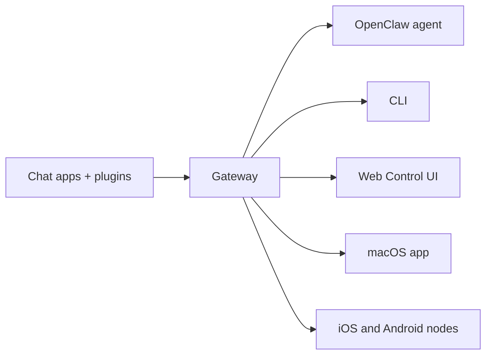

---
read_when:
    - Presentación de OpenClaw para principiantes
summary: OpenClaw es un Gateway multicanal para agentes de IA que se ejecuta en cualquier sistema operativo.
title: OpenClaw
x-i18n:
    generated_at: "2026-07-11T23:11:59Z"
    model: gpt-5.6
    postprocess_version: locale-links-v1
    provider: openai
    source_hash: 2b87c2a9ce06f110bda45709fb6055ed8000f73993793ea7386db2a47a782828
    source_path: index.md
    workflow: 16
---

# OpenClaw 🦞

<p align="center">
    
    
</p>

> _«¡EXFOLIA! ¡EXFOLIA!»_ — Probablemente, una langosta espacial

<p align="center">
  <strong>Gateway para cualquier sistema operativo que conecta agentes de IA con Discord, Google Chat, iMessage, Matrix, Microsoft Teams, Signal, Slack, Telegram, WhatsApp, Zalo y más.</strong><br />
  Envía un mensaje y recibe la respuesta de un agente desde tu bolsillo. Ejecuta un único Gateway para los complementos de canales, WebChat y los nodos móviles.
</p>

<Columns>
  <Card title="Get Started" href="/es/start/getting-started" icon="rocket">
    Instala OpenClaw y pon en marcha el Gateway en cuestión de minutos.
  </Card>
  <Card title="Run Onboarding" href="/es/start/wizard" icon="list-checks">
    Configuración guiada con `openclaw onboard` y flujos de emparejamiento.
  </Card>
  <Card title="Connect a Channel" href="/es/channels" icon="message-circle">
    Conecta Discord, Signal, Telegram, WhatsApp y más para chatear desde cualquier lugar.
  </Card>
  <Card title="Open the Control UI" href="/es/web/control-ui" icon="layout-dashboard">
    Abre el panel del navegador para gestionar el chat, la configuración y las sesiones.
  </Card>
</Columns>

## Explorar la documentación

Los navegadores móviles pueden mostrar el menú de secciones sin la barra de pestañas completa de la versión de escritorio. Usa
estos enlaces centrales para acceder desde el cuerpo de la página a las mismas áreas principales de la documentación.

<Columns>
  <Card title="Get started" href="/es" icon="rocket">
    Descripción general, demostraciones, primeros pasos y guías de configuración.
  </Card>
  <Card title="Install" href="/es/install" icon="download">
    Métodos de instalación, actualizaciones, contenedores, alojamiento y configuración avanzada.
  </Card>
  <Card title="Channels" href="/es/channels" icon="messages-square">
    Canales de mensajería, emparejamiento, enrutamiento, grupos de acceso y control de calidad de canales.
  </Card>
  <Card title="Agents" href="/es/concepts/architecture" icon="bot">
    Arquitectura, sesiones, contexto, memoria y enrutamiento multiagente.
  </Card>
  <Card title="Capabilities" href="/es/tools" icon="wand-sparkles">
    Herramientas, Skills, Cron, Webhooks y capacidades de automatización.
  </Card>
  <Card title="ClawHub" href="/es/clawhub" icon="store">
    Mercado de complementos, publicación, selección y recomendaciones de confianza.
  </Card>
  <Card title="Models" href="/es/providers" icon="brain">
    Proveedores, configuración de modelos, conmutación por error y servicios de modelos locales.
  </Card>
  <Card title="Platforms" href="/es/platforms" icon="monitor-smartphone">
    macOS, Windows, iOS, Android, nodos e interfaces web.
  </Card>
  <Card title="Gateway & Ops" href="/es/gateway" icon="server">
    Configuración, seguridad, diagnóstico y operaciones del Gateway.
  </Card>
  <Card title="Reference" href="/es/cli" icon="terminal">
    Referencia de la CLI, esquemas, RPC, notas de la versión y plantillas.
  </Card>
  <Card title="Help" href="/es/help" icon="life-buoy">
    Solución de problemas, preguntas frecuentes, pruebas, diagnósticos y comprobaciones del entorno.
  </Card>
</Columns>

## ¿Qué es OpenClaw?

OpenClaw es un **Gateway autoalojado** que conecta tus aplicaciones de chat favoritas —Discord, Google Chat, iMessage, Matrix, Microsoft Teams, Signal, Slack, Telegram, WhatsApp, Zalo y más mediante complementos de canales— con agentes de IA para programación. Ejecutas un único proceso de Gateway en tu propio equipo (o en un servidor), que se convierte en el puente entre tus aplicaciones de mensajería y un asistente de IA siempre disponible.

**¿Para quién está pensado?** Para desarrolladores y usuarios avanzados que quieren un asistente personal de IA al que puedan enviar mensajes desde cualquier lugar, sin renunciar al control de sus datos ni depender de un servicio alojado.

**¿Qué lo diferencia?**

- **Autoalojado**: se ejecuta en tu hardware y bajo tus reglas
- **Multicanal**: un solo Gateway atiende simultáneamente todos los complementos de canales configurados
- **Nativo para agentes**: diseñado para agentes de programación con uso de herramientas, sesiones, memoria y enrutamiento multiagente
- **Código abierto**: con licencia MIT e impulsado por la comunidad

**¿Qué necesitas?** Node 24 (recomendado), o Node 22 LTS (`22.19+`) por compatibilidad, una clave de API del proveedor que elijas y 5 minutos. Para obtener la mejor calidad y seguridad, utiliza el modelo de última generación más potente disponible.

## Cómo funciona



El Gateway es la única fuente de verdad para las sesiones, el enrutamiento y las conexiones de canales.

## Capacidades principales

<Columns>
  <Card title="Multi-channel gateway" icon="network" href="/es/channels">
    Discord, iMessage, Signal, Slack, Telegram, WhatsApp, WebChat y más con un único proceso de Gateway.
  </Card>
  <Card title="Plugin channels" icon="plug" href="/es/tools/plugin">
    Los complementos de canales añaden Matrix, Nostr, Twitch, Zalo y más; los complementos oficiales se instalan bajo demanda.
  </Card>
  <Card title="Multi-agent routing" icon="route" href="/es/concepts/multi-agent">
    Sesiones aisladas por agente, espacio de trabajo o remitente.
  </Card>
  <Card title="Media support" icon="image" href="/es/nodes/images">
    Envía y recibe imágenes, audio y documentos.
  </Card>
  <Card title="Web Control UI" icon="monitor" href="/es/web/control-ui">
    Panel del navegador para gestionar el chat, la configuración, las sesiones y los nodos.
  </Card>
  <Card title="Mobile nodes" icon="smartphone" href="/es/nodes">
    Empareja nodos iOS y Android para flujos de trabajo con Canvas, cámara y voz.
  </Card>
</Columns>

## Inicio rápido

<Steps>
  <Step title="Install OpenClaw">
    ```bash
    npm install -g openclaw@latest
    ```
  </Step>
  <Step title="Onboard and install the service">
    ```bash
    openclaw onboard --install-daemon
    ```
  </Step>
  <Step title="Chat">
    Abre la interfaz de control en el navegador y envía un mensaje:

    ```bash
    openclaw dashboard
    ```

    También puedes conectar un canal ([Telegram](/es/channels/telegram) es el más rápido) y chatear desde tu teléfono.

  </Step>
</Steps>

¿Necesitas la configuración completa de instalación y desarrollo? Consulta [Primeros pasos](/es/start/getting-started).

## Panel

Abre la interfaz de control en el navegador después de iniciar el Gateway.

- Valor local predeterminado: [http://127.0.0.1:18789/](http://127.0.0.1:18789/)
- Acceso remoto: [Interfaces web](/es/web) y [Tailscale](/es/gateway/tailscale)

<p align="center">
  
</p>

## Configuración (opcional)

La configuración se encuentra en `~/.openclaw/openclaw.json`.

- Si **no haces nada**, OpenClaw utiliza el entorno de ejecución incluido del agente de OpenClaw; los mensajes directos comparten la sesión principal del agente y cada chat grupal tiene su propia sesión.
- Si quieres restringir el acceso, empieza por `channels.whatsapp.allowFrom` y, para los grupos, por las reglas de menciones.

Ejemplo:

```json5
{
  channels: {
    whatsapp: {
      allowFrom: ["+15555550123"],
      groups: { "*": { requireMention: true } },
    },
  },
  messages: { groupChat: { mentionPatterns: ["@openclaw"] } },
}
```

## Empieza aquí

<Columns>
  <Card title="Docs hubs" href="/es/start/hubs" icon="book-open">
    Toda la documentación y las guías, organizadas por caso de uso.
  </Card>
  <Card title="Configuration" href="/es/gateway/configuration" icon="settings">
    Configuración principal del Gateway, tokens y configuración de proveedores.
  </Card>
  <Card title="Remote access" href="/es/gateway/remote" icon="globe">
    Patrones de acceso mediante SSH y tailnet.
  </Card>
  <Card title="Channels" href="/es/channels/telegram" icon="message-square">
    Configuración específica de canales para Discord, Feishu, Microsoft Teams, Telegram, WhatsApp y más.
  </Card>
  <Card title="Nodes" href="/es/nodes" icon="smartphone">
    Nodos iOS y Android con emparejamiento, Canvas, cámara y acciones del dispositivo.
  </Card>
  <Card title="Help" href="/es/help" icon="life-buoy">
    Soluciones habituales y punto de partida para resolver problemas.
  </Card>
</Columns>

## Más información

<Columns>
  <Card title="Full feature list" href="/es/concepts/features" icon="list">
    Capacidades completas de canales, enrutamiento y contenido multimedia.
  </Card>
  <Card title="Multi-agent routing" href="/es/concepts/multi-agent" icon="route">
    Aislamiento de espacios de trabajo y sesiones por agente.
  </Card>
  <Card title="Security" href="/es/gateway/security" icon="shield">
    Tokens, listas de permitidos y controles de seguridad.
  </Card>
  <Card title="Troubleshooting" href="/es/gateway/troubleshooting" icon="wrench">
    Diagnósticos del Gateway y errores habituales.
  </Card>
  <Card title="About and credits" href="/es/reference/credits" icon="info">
    Orígenes del proyecto, colaboradores y licencia.
  </Card>
</Columns>
